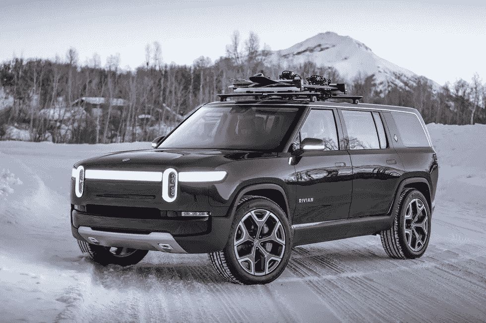

# 福特用 Rivian Investment 对冲自己

> 原文：<https://medium.com/geekculture/ford-is-hedging-against-itself-with-rivian-investment-b9e1e657beab?source=collection_archive---------5----------------------->

## 也许这不是一个坏主意

Photo via [Rivian](https://www.roadandtrack.com/new-cars/future-cars/a29551028/2021-rivian-r1s-r1t-electric-trucks-details-rumors-photos/)

Rivian 在 11 月份突然出现，这可能会对其与主要投资者福特的先前交易产生影响。

Rivian 在宣布将向亚马逊提供 10 万辆电动送货车后，首次被介绍给许多人。这是迄今为止最大的订单——