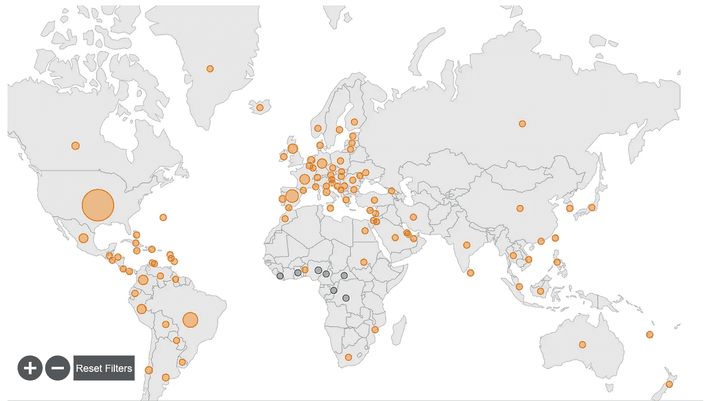

# 用 Prophet 预测猴痘病例

> 原文：<https://medium.com/geekculture/forecasting-monkeypox-cases-with-prophet-b4834dd4a10f?source=collection_archive---------6----------------------->

## Prophet 能预测多远的正确病例数？

Figure 1\. The 2022 [Monkeypox Outbreak Global Map](https://www.cdc.gov/poxvirus/monkeypox/response/2022/world-map.html) from CDC. Access on 2022.11.25\. Image by CDC.

我们的世界最近同时遭受了两种流行病的蹂躏——新冠肺炎和猴痘。与新冠肺炎相比，猴痘引起的恐慌较少。这种病毒于 1958 年被发现。而且它的传染性比新冠肺炎低。我们保持警惕吗？是的。但是恐慌？号码