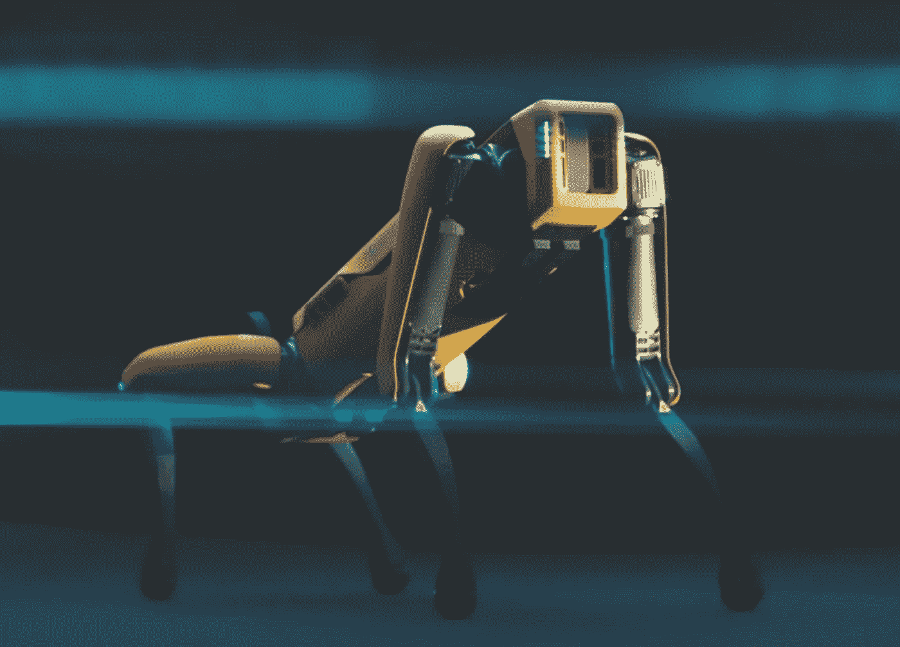

# 忘记机器狗吧——以下是人工智能如何帮助警察

> 原文：<https://medium.com/geekculture/forget-the-robot-dogs-heres-how-ai-can-help-police-1baf5b059dae?source=collection_archive---------66----------------------->

Robot Dogs are not the future of policing (Photo: Boston Dynamics)

Nicole Kobie 发现，人工智能可以帮助警察更好地工作，而不需要识别罪犯

A 经过一年的暴行和抗议，很明显，警务工作必须改变——但机器人警察、面部识别软件和人工智能等技术可能无法解决低预算、精通互联网的罪犯或人类种族主义等现存挑战。