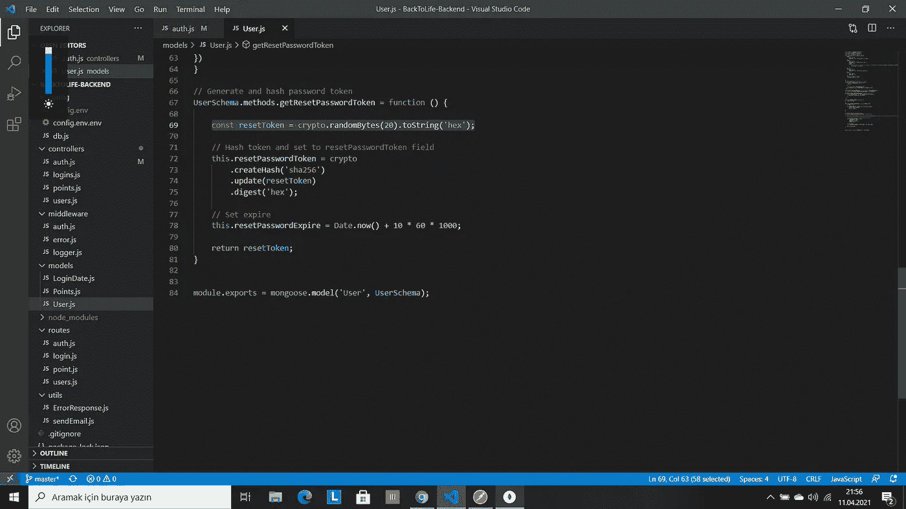
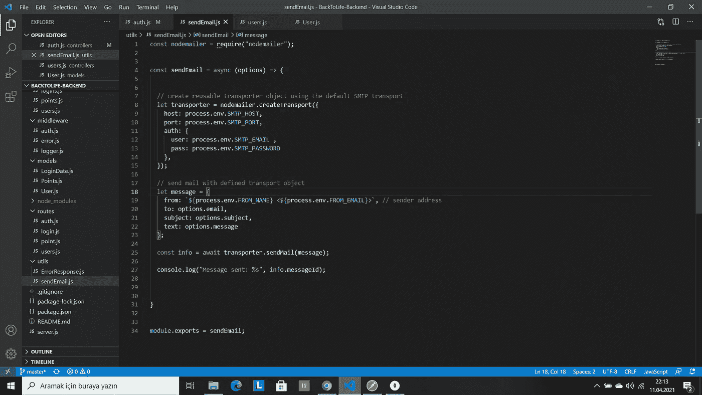
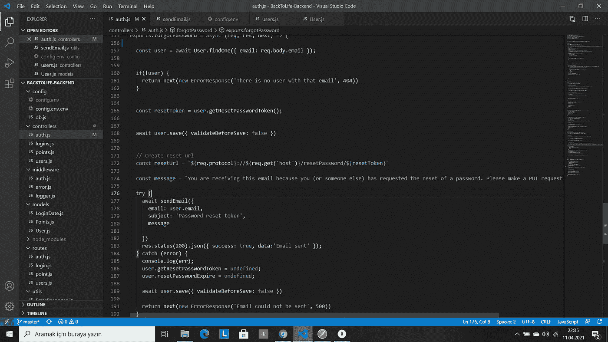
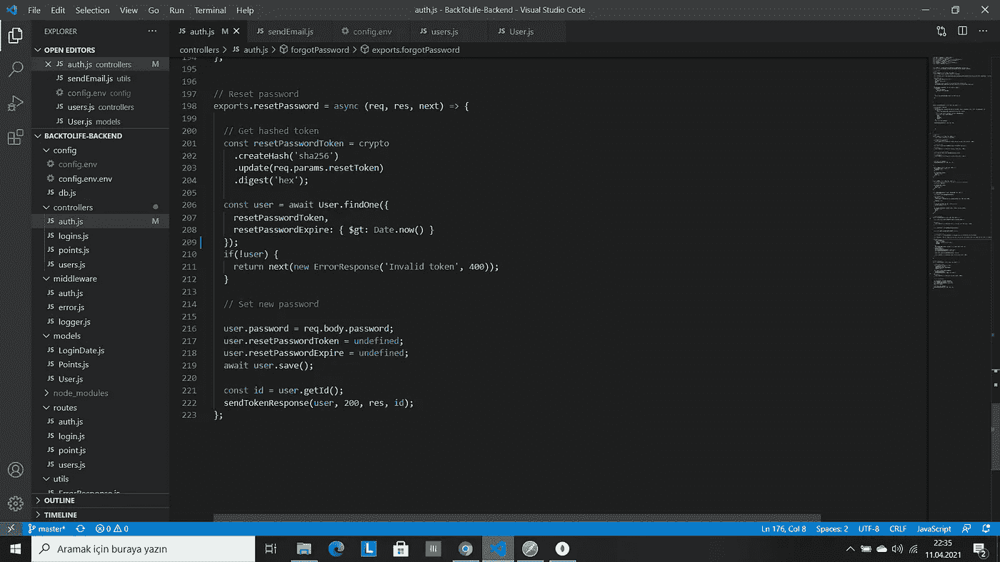

# 用 NodeJs 和 MongoDB 注册应用程序时忘记了密码(第 4 部分)

> 原文：<https://medium.com/geekculture/forgot-password-in-signup-application-with-nodejs-and-mongodb-part-4-51378dddd716?source=collection_archive---------0----------------------->


在本文中，我们将继续讨论注册应用程序。在这一部分，我将写忘记密码，用 nodemailer 发送电子邮件，以及重置密码。如果你准备好了，我们就开始吧！

首先，上一部分我用的是 mailgun，不是 nodemailer。但是当我搜索发送电子邮件的方法时，我看到了 nodemailer，我想用它来区别一下。

对于重置密码，我们在用户模型中需要一个字符串变量。我也创建了一个日期变量，但是我没有使用它，所以你可以传递它。字符串变量被命名为 resetPasswordToken。我们需要一个名为 crypto 的包，我们需要它在上面。

在用户模型中，我们将在这个变量中创建一个名为 getResetPasswordToken 的方法:

`const resetToken = crypto.randomBytes(20).toString('hex');`

现在，我们需要散列 token 并设置 resetPasswordToken 字段，设置 expire 并返回 resetToken。关于 getResetPasswordToken 的完整代码在这里:



getResetPasswordToken

为了捕捉邮件，我将使用 mailgun，创建一个帐户，并获得一些定义。

我们将创建一个名为 sendEmail 的中间件。在这种情况下，我们需要 nodemailer，因此我们将停止服务器并使用以下命令安装 nodemailer:

`npm install nodemailer`

我们需要它，在中间件之上。

在 nodemailer 网站上，我们将复制这些代码:



nodemailer

我可以随意改变一些部分。在 createTransport 中，您可以看到主机、端口和身份验证与网站不同。对于这些，我们会去。env 文件并创建 SMTP_HOST、SMTP_PORT、SMTP_EMAIL、SMTP_PASSWORD。在 mailgun，我们可以看到这些部分，我当然不分享它们。

现在，我们需要一个名为 forgotPassword 的方法。使用这种方法，我们将接收一封电子邮件并发送一个请求。

`const user = await User.findOne({ email: req.body.email });`

如果用户不存在，我们将创建一个错误。这些和我之前的文章差不多，就不解释了。

```
const resetToken = user.getResetPasswordToken();await user.save({ validateBeforeSave: false})
```

这样，我们在数据库中有了两个变量，当我们重置密码时，它们将被销毁。

我们将创建这样一条消息:

`您收到这封电子邮件是因为您(或其他人)请求重置密码。请向以下地址发出上传请求:\ n \ n $ { resetUrl }

因此，当电子邮件消失时，这将解释它为什么会消失。

现在，我们创建一个尝试捕捉。

```
try {await sendEmail({email: user.email,subject: 'Password reset token',message})res.status(200).json({ success: true, data:'Email sent' });} catch (error) {console.log(err);user.getResetPasswordToken = undefined;user.resetPasswordExpire = undefined;await user.save({ validateBeforeSave: false })return next(new ErrorResponse('Email could not be sent', 500))}
```

这个方法完成了，最后，我们将创建 resetPassword 函数。我们将通过以下方式获得散列令牌:

```
const resetPasswordToken = crypto.createHash('sha256').update(req.params.resetToken).digest('hex');
```

我们将创建一个用户，并使用 findOne 方法。在此:

```
const user = await User.findOne({resetPasswordToken,resetPasswordExpire: { $gt: Date.now() }});
```

如果用户不存在，我们将创建一个错误。现在，我们需要设置一个新密码，并销毁 resetPasswordToken 和 resetPasswordExpire，然后保存用户并发送 TokenResponse:

```
user.password = req.body.password;user.resetPasswordToken = undefined;user.resetPasswordExpire = undefined;await user.save();const id = user.getId();sendTokenResponse(user, 200, res, id);
```

forgotPassword 看起来像这样:



forgotPassword

resetPassword 看起来像这样:



resetPassword

在 routes/auth.js 中，我们将需要 forgotPassword 和 resetPassword 函数，并在 getMe 函数中使用它们:

```
router.post(‘/forgotPassword’, forgotPassword);
router.put(‘/resetPassword/:resetToken’, resetPassword);
```

最后，在 Postman 中，我们将创建一个 Post 请求，如下所示

`[http://localhost:5000/forgotPassword](http://localhost:5000/forgotPassword)`

发送电子邮件，然后查看邮箱，你可以看到一封电子邮件。然后我们回到邮递员那里，写下:

```
[http://localhost:5000/resetPassword](http://localhost:5000/resetPassword/3b966021af5e6a5146048787ac3aa5066988dcb4)/:resetToken
```

并发送 put 请求，您将看到用户数据、令牌和 id。

就是这样。感谢阅读。