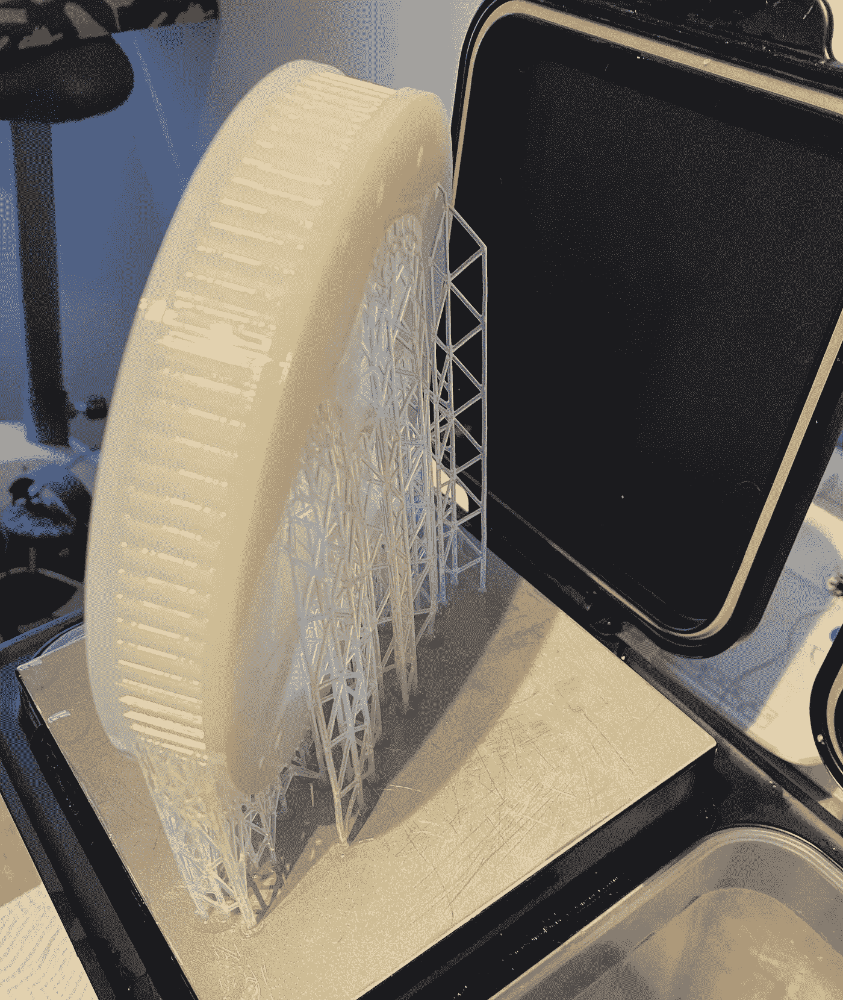
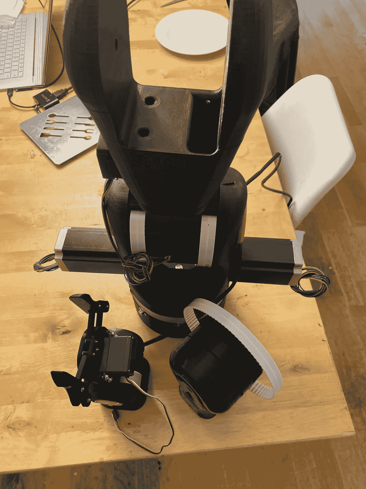
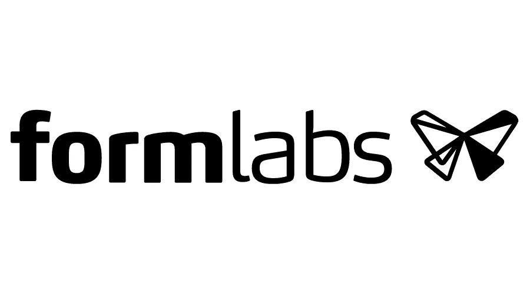
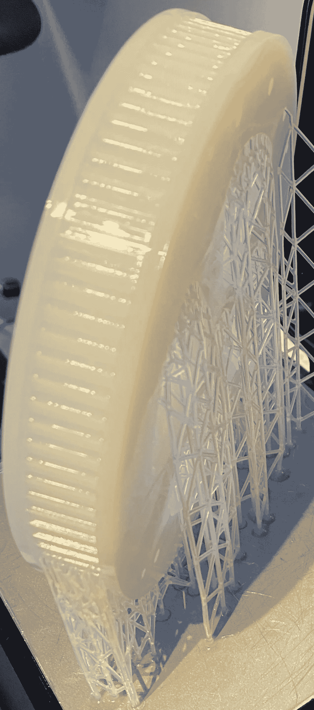
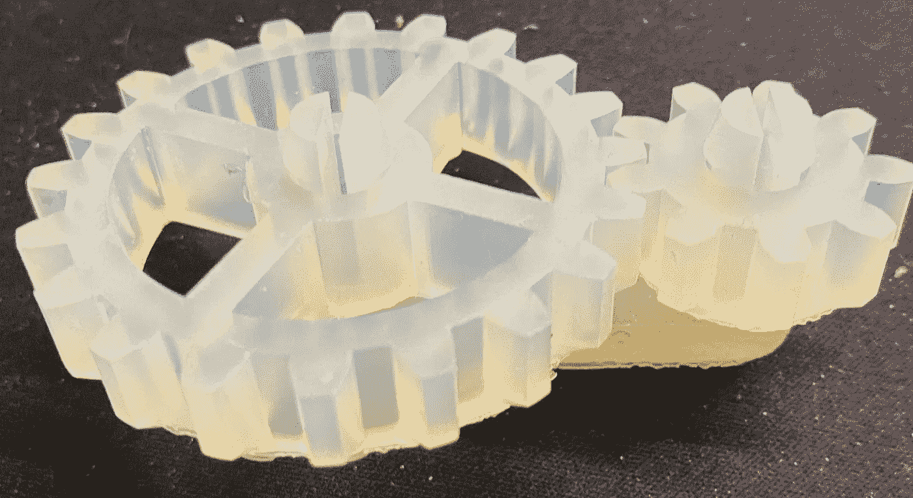
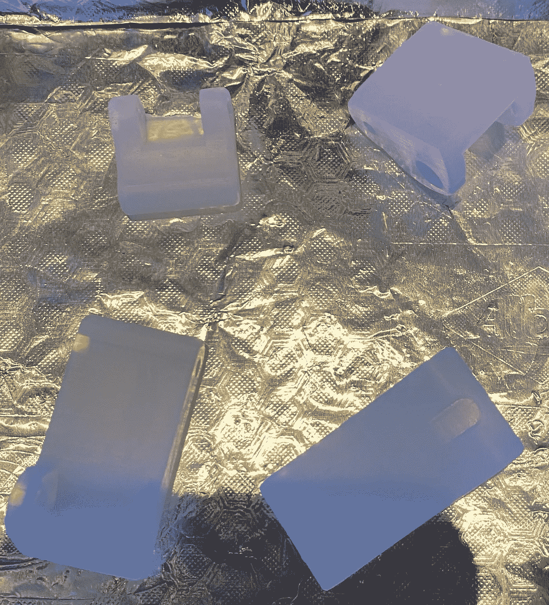
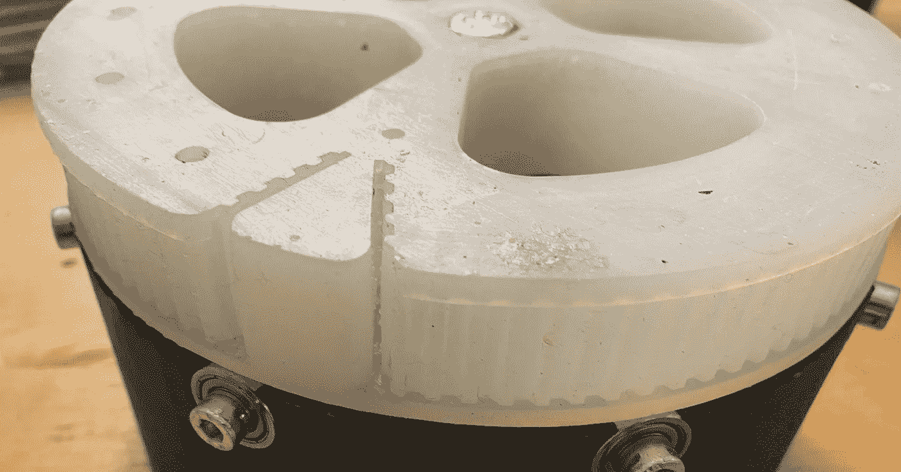
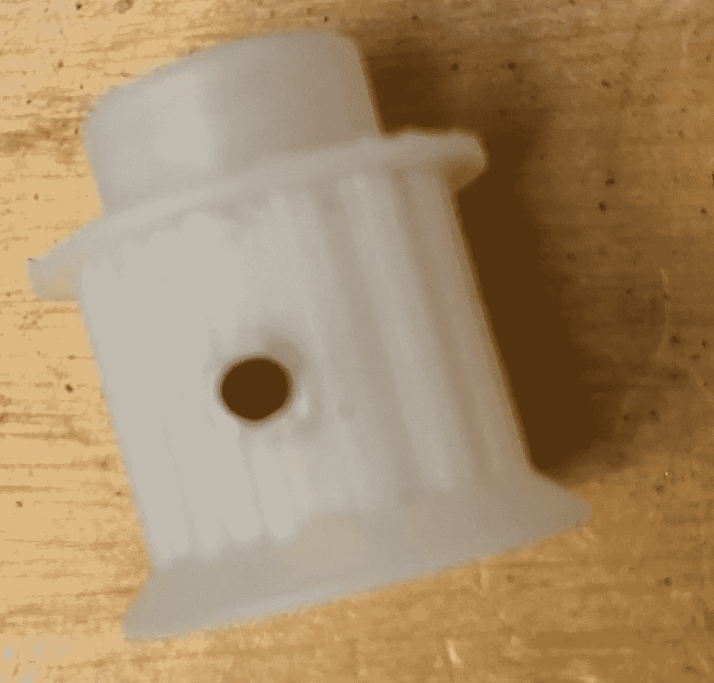
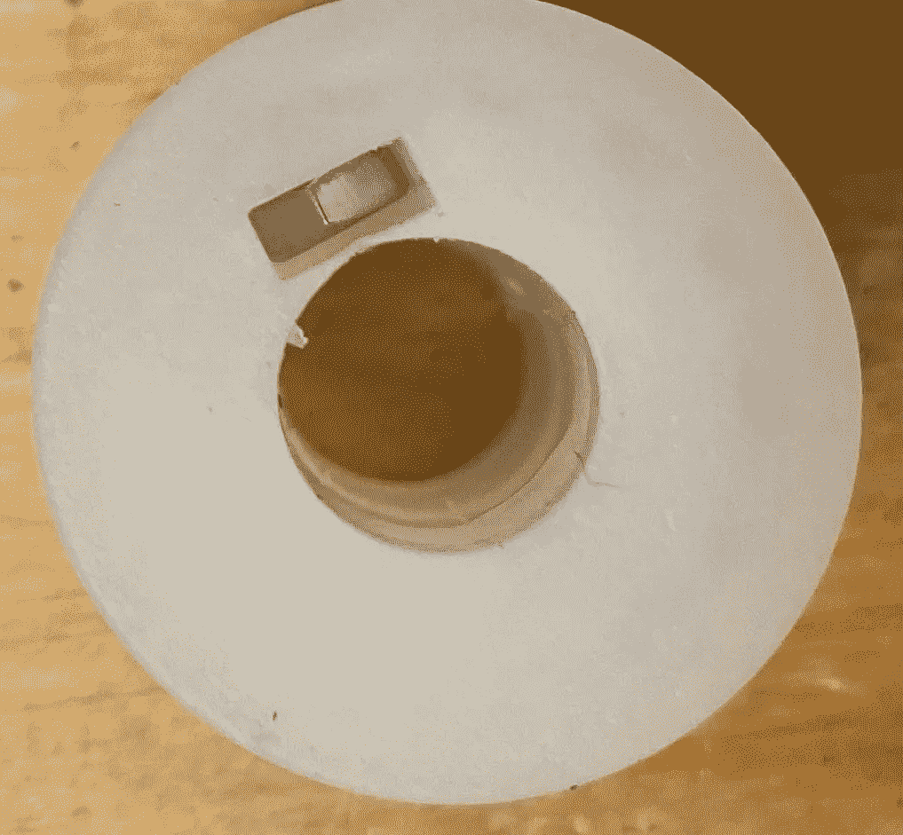
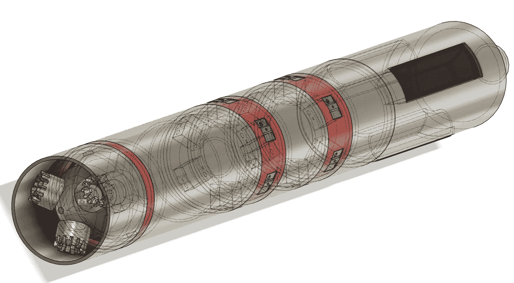

# Form Labs 耐用树脂

> 原文：<https://medium.com/geekculture/form-labs-durable-resin-c2faef093b7?source=collection_archive---------19----------------------->

Oh glorious gears!

互联网上有许多关于这种树脂的不同评论，我决定采取一种适度不同的方法。关注我的人现在应该知道，我不是工业用户。我在我的个人爱好上花了，有时看起来非常多的钱…比如 3D 打印。但是，我是一个家庭用户，我已经经历了多种不同水平的廉价，适度廉价，以及昂贵得令人难以置信的打印机及其配件。

所以，是的，我家里有一台 Form 2 打印机。我也买了洗稿机，但正如你从上面的图片中看到的，我倾向于使用打印机附带的水桶。

对于第一次阅读我作品的人来说。我和其他评论者不一样。我这样做是免费的，到目前为止，甚至没有人出于评论或贿赂的目的，主动提出免费给我任何东西。当我喜欢某样东西时，我会写下来。

# 我在做什么

Early picture of my Moveo

好吧，我的小女孩，她可能不再那么小了，因为她下个月就要成年了，她告诉我“爸爸，我想学机器人！”而且，作为一个头脑冷静、从不过度放纵的父亲，我认为她需要一个近乎工业化的机械臂来学习。

问题是，在挪威制造这样一个机器人所需的零件可能相当昂贵，有时几乎不可能。从打印巨大的零件到在设计中加入 NEMA 23 发动机，你必须尽可能地节约成本。

嗯，我决定，对于齿轮，我会联系形式实验室，问他们是否有任何材料，他们会推荐打印我需要的齿轮。这将为我节省至少 50 美元的零件费用，还可能节省 80 美元的运费和关税。于是，我冲到他们的网上聊天。

# 所有的商业都应该这样！！！

Credit: their website somewhere

好吧…我们开门见山吧。在我的一生中，我从未有过像与 Form Labs 这样如此富有成效的职业或个人对话。在聊天中跟我打招呼的那位先生很专业，很友好，英语写得很好，可能是有史以来对他们公司产品最了解的人之一。他仔细倾听我的需求，我想完成什么，然后他回答说:“这很不寻常，我不完全确定。我认为耐用树脂最适合你，但我认为你应该订购一些样品，并与 Form 的另一位专家交谈，我相信我们会做好的。”

嗯，我很确定我会花 600 美元在坚硬的 10K 树脂上…我很快会写一篇简短的评论。但是，我从网站上要了耐用和坚硬的 10K 树脂样品。我不是一个大的工业客户，我不想用我的爱好项目打扰他们…但是。

第二天，我接到了柏林 Form Labs 销售解决方案专家的电话。她太棒了。(我不会放弃名字，因为我还没有得到许可)。她再次听取了我的需求，她同意她的同事的意见，如果我想打印齿轮，我应该考虑耐用。细节不是最高的，也不是最坚硬的材料，但对于我希望打印的 5 毫米节距传动滑轮…这可能是我想要的。

她还寄给我一个硬 10K 的样品，而且…我正试图说服自己不要买一个 3L 表格(今年),扔掉我所有的其他打印机。我稍后会写这方面的内容。

# 我的英雄们进来了

还是那句话，我没有征得同意，所以我不会用名字。但是我在挪威奥斯陆当地的前实验室经销商在我与他们交谈时告诉我，令人惊讶的是，他们与我的关系非常好(他们可能比我妻子获得更多的薪水)

“一位客户刚刚退回了一包新的耐用树脂，因为在运输过程中的某个地方，它肯定受到了击打，并开始在袋子中泄漏。你想要吗？”

这就是印刷术开始的地方。我看了看包装，这是一个密封的耐用树脂包装，袋中有一些树脂泄漏。于是，我买了一个新鲜的托盘，跑回家(开车，我懒得跑)马上清理干净，塞进打印机……没错……我打印了。

# 他印了什么？

A true test of durable

我立即为机械臂打印了一个巨大的 T5 皮带齿轮。有人可能会建议“先在小东西上试试树脂”。以及“不要在那样的东西上浪费那么多昂贵的树脂”。或者“你不知道树脂和 SLA 对功能性零件很烂吗？”

我说忘了吧

It’s BIG, it’s WONDERFUL… it’s a gear!

我打印了一个巨大的皮带齿轮，它用了很多树脂。但是我很聪明！我把齿轮掏空，在上面扎了几个洞，然后让它裂开。

# 他得到了什么？

我得到了一个巨大的齿轮，这是一个噩梦洗。我是认真的。我正要去仓库拿洗好的表格，然后去 3D 打印机商店买 10l 的异丙醇，在挪威价格便宜到 150 美元(有奇怪的税)。

但是我洗了它，冲洗了它，然后我把它放在我自制的固化站里…它几乎是完美的，但是…它很粘。所以我拿出柑橘清洁剂，开始清洗…它很粘..还有那种“他应该洗得更好”的伤感。

# 包裹到了

Sample print from Form Labs of Durable Resin

嗯，我收到了包裹，我打开它，它很可爱。但我忍不住想“我做错了什么？”以及“我哪里失败了？”

看，Form Labs 打印出来的照片非常漂亮，我不明白为什么我的打印会这么差。

所以我冲到了 3D 打印机商店。并与他们交谈(同时也将我的设备插入他们的表单固化一段时间)。他们告诉我，他们对耐用树脂的体验远比我的照片更像样本。

# 在我们走得太远之前

听起来我对我的装备不满意。我爱我的装备。我对此非常满意。事实上，它就在机器人身上，重量不到 10 公斤，工作起来完美无缺。与 Form Labs 高温树脂相比，它更适合这一用途。

# 回到故事

他们告诉我，使用 Form 3(如示例所示)可能与此有关。但他们确信，更有可能是我没有正确清洗，由于零件是中空的，它没有像我希望的那样清除零件内部的所有树脂。

就我所见，Form 3 实际上是 Form 2 的一个很大的升级。我在这里和工作时只有一个 Form 2，但是当我去打印机商店时，我肯定看到 Form 2 做得更好。

# 洗涤几乎是一切

Can’t see it here, but almost as good as the sample

我打印了更多耐用重要的部分。上面的项目是一个间隔，我打印出来，以避免花费大量的金钱在金属间隔和航运。

我把零件扔进了一篮子酒精中，因为它变脏了，需要尽快更换。我用牙刷和手套擦洗了一遍又一遍，然后把它放在酒精中浸泡了两个小时。

然后 a 又擦洗了一会儿，把它放进一个干净的酒精缸里放了几个小时。

当它出来的时候，对我来说很清楚…不，真的，很清楚，几乎是透明的。这是一个巨大的进步。

与我通常使用的 FormLabs 高温树脂不同，它可以很容易地用酒精轻轻清洗，FormLabs Pro 树脂也是如此，耐用树脂非常耐用。它真的不想离开固化的树脂。这需要大量的工作。

# 避开超声波清洗机

我想很多人已经发现，当使用 DLP 或 LCD 打印机打印时，唯一合理的清洁方式是使用超声波清洁器。

好吧，我不走那条路。异丙醇是易燃的，更糟糕的是，它很容易雾化成某种易燃的蒸汽。在超声波清洗机中使用 IPA 是不安全的，每次我看他们这样做的视频，我都想跳过屏幕，揍那些这样做的人。这是不安全的，这是一个非常糟糕的主意。

还有其他非常好的清洁解决方案，我很想和一位同事谈谈，请他为我找到合适的解决方案。但是现在，我要么洗干净我的表格，把钱花在快速蒸发的 IPA 上，要么继续擦洗和等待。

# 结果持续了吗？

Close I think

我不能始终如一地在耐用树脂上重现结果，但我会继续努力。

# 解决

我正在使用 Form 新的“自适应图层高度”功能进行打印，我认为这很棒。但事实是，我认为耐用树脂真的需要全面处理。

我认为耐用树脂可能是从印在表格 3 上获益最多的树脂。与每次打印都非常完美并且清理得很好的高温相比，Form 2 和 Form 3 之间的层间更新导致层间变形较少。Form 3 使用了更灵活的构建平台，可以剥离各层之间的印花。表格 2 开始滑动到一边，然后拉动，我有一种非常奇怪的感觉，这导致微观气泡在打印中形成。我确实在显微镜下看了，但是我不能用光学放大超过 200 倍。所以我没看到。我认为比那要好得多。

但总的来说，我认为在具有自适应层的 Form 2 上打印，要么我的层太大，要么太小。我需要找到金发区。

# 不完美为什么还要继续用？

谁说不完美了？

好吧…不完美。我在寻找 PA12 SLS 的完美替代品。耐用树脂在这一点上肯定会获得金牌。但是不够死板，不合我的口味。我从实验室得到的样本比我的任何指纹都要硬，这让我想到了别的东西。

# 也许热量也有帮助

耐用树脂的推荐后处理固化程序是用 405 纳米紫外光照射 60 分钟，同时在 60 度下蒸煮印刷品。

我很确定烹饪对耐用性很重要。尽管我等了好几天才开始做，而且我没有足够地清洁大齿轮，但是当我使用 Form Cure 时，我看到了明显的改善。

烹饪时，这部分变得有些柔韧，硬度降低。这一直持续到它冷却下来。我认为加热有助于玻璃效果。

# 那么它可能是完美的吗？

这是相当惊人的东西。它很强壮。它漂亮地支撑着机器人。齿轮运转良好。这些螺丝在没有额外加固的情况下保持住了，尽管我明显地(故意地)过度拧紧了其中的一个。

The yucky is my fault.

我可以很容易地用聚碳酸酯在我现在借用的 Ultimaker S5 上打印出一个替代品。我不会。

我认为耐用的树脂可能是这种印刷品几乎完美的材料。一旦它被清洗和烹饪，最后聚集在一起，它真的是一个很棒的材料。

14-tooth T5 gear… with a grub screw in it

我打印了更小的功能性零件用于机器人。上图中的齿轮在连接到 4 纳米 NEMA 23 发动机时经过了全面测试，这种齿轮非常坚固，可以使用多年。

The nut in the middle

这种树脂实际上可以很好地打印薄壁。我真的没想到耐用树脂会这样。我预计它会与任何小于 1 毫米的物体斗争。相反，它像一个真正的冠军一样应付自如。

The Snake!

我现在正在打印一个机器人采矿钻孔原型的比例模型，我将参加下周的比赛。很快我就要用完一升耐用树脂了…我很高兴。

# 我还会再买吗？

我真的相信这可能是我见过的最好的实用树脂。虽然我喜欢印刷 FDM 聚碳酸酯，但随之而来的还有很多问题。我认为对于任何我需要一种真正…非常耐用的材料的应用。在任何我需要零件的地方，我都不会损坏，耐用是我的新选择。我相信我极有可能在接下来的一两周内买一包耐用的树脂，因为我认为这是我见过的最实用的树脂，它不太软，也不太硬。它可以打印高质量的零件，而不仅仅是原型。

我将不得不在一年后重新审视这一点，让你知道更多，但我相信这可能是我见过的制作齿轮、衬套、垫片、尼龙垫圈替代品等物品的最佳材料。我认为它在规模上打印得非常好，我对此表示怀疑。我认为耐用的树脂将取代我在生产机器时使用的聚碳酸酯…只要我能让它们适合我的小形体 2。一个例外是当我需要刚性组件时。在我关于 Form Labs 的下一篇文章中，您将了解为什么我可能会在未来一两年内破产。