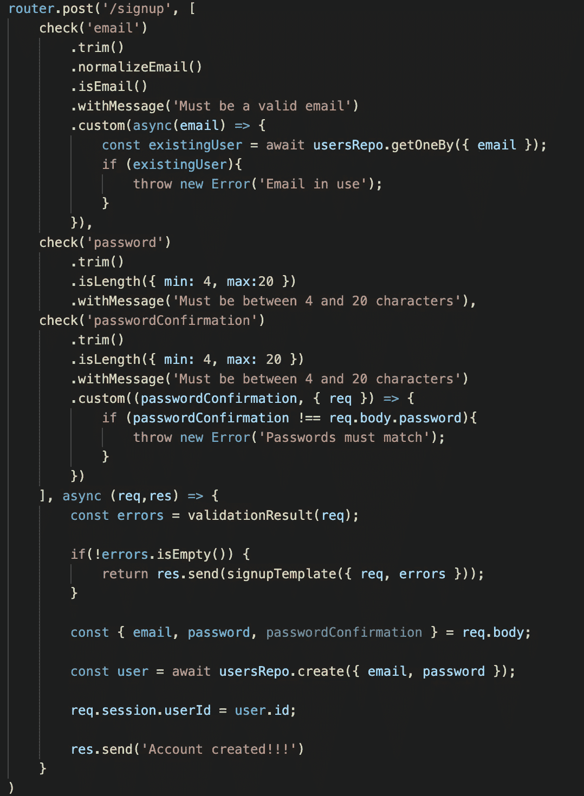

# 使用 ExpressJS 进行表单验证

> 原文：<https://medium.com/geekculture/form-validations-working-with-expressjs-df2754465cd4?source=collection_archive---------16----------------------->

对于我在参加 Flatiron 软件工程项目时创建的大多数项目，我都使用 Ruby/Ruby on Rails 作为后端，JavaScript 作为前端。从那以后，我一直在学习 Node JS 作为后端语言，并使用 Express，因为它是 Node JS 的一个流行框架。在这篇文章中，我将讨论如何在提交表单时验证发送的信息。

当我们在线使用表格时，通常会在表格中进行验证，以确保您正确填写表格并提供有效信息。许多网站和应用程序上流行的表单是注册或登录表单，带有用户名和密码(几乎每个应用程序都有)，然后根据应用程序提供关于你的各种其他信息。可以有许多与用户名和密码相关联的验证器。例如，确保用户名是唯一的，不会被盗用，密码有一定的长度，或者包含字母、数字和安全符号。其他项目也有验证器，如确保电子邮件是电子邮件或信用卡号是信用卡号。

我们可以使用一个中间件来帮助我们在代码中放置这些验证器，这个中间件就是“express-validator”(没什么好惊讶的)。下面是一个注册表单的例子，它要求输入电子邮件、密码和密码确认。


Photo by [inlytics | LinkedIn Analytics Tool](https://unsplash.com/@inlytics?utm_source=medium&utm_medium=referral) on [Unsplash](https://unsplash.com?utm_source=medium&utm_medium=referral)

我们必须从在项目中安装 express-validator 开始，这是通过运行以下命令来完成的:

```
npm install express-validator
```

在项目的主目录中。然后在 express-validator 库中，我们将使用的两个主要函数是 check 和 validationResult，因此我们可以在 express-validator 中使用表单 post 请求请求我们的文件，并解构这两个函数。

```
const { check, validationResult } = require('express-validator');
```

然后在我们的 post 请求中，我们希望使用的验证检查作为一个数组发送，作为 post 请求的第二个参数。因此，对于我在数组中提到的注册表单，我们将检查电子邮件、密码和密码确认，在每次检查中，我们将我们想要检查的方法放在该字段上。除了验证之外，我们还可以在杀毒器上添加一个例子，杀毒器在写入值之前或之后删除空格(这是 trim())。我为这三个字段使用的验证和杀毒程序是 trim()(上面提到过)，normalizedEmail 将电子邮件放在标准格式中，isEmail 检查它是否是电子邮件，自定义验证电子邮件是否已经在数据库中使用，withMessage 向我们提供一条消息，将错误对象与 validationResult 一起发送回来，isLength 接受一个具有 max 和/或 min 密钥的对象，另一个自定义验证检查密码和密码确认匹配。

正如我上面提到的，我们然后使用 validationResult，并给它一个请求作为参数，以获取任何不符合我们验证的错误。如果有错误，我们希望将它们发送回来，这样用户就可以看到它们，如果没有，我们可以为用户创建一个新帐户。下面是一个完整的例子，展示了如何在 post 请求中进行编码(为了缩短代码，使其更容易阅读，我们还可以将验证器移到一个单独的文件中)。



Udemy 课程[现代 Javascript Bootcamp 课程(2021)](https://www.udemy.com/course/javascript-beginners-complete-tutorial/) 通过创建全栈 Javascript，包括使用表单验证，如上所示。