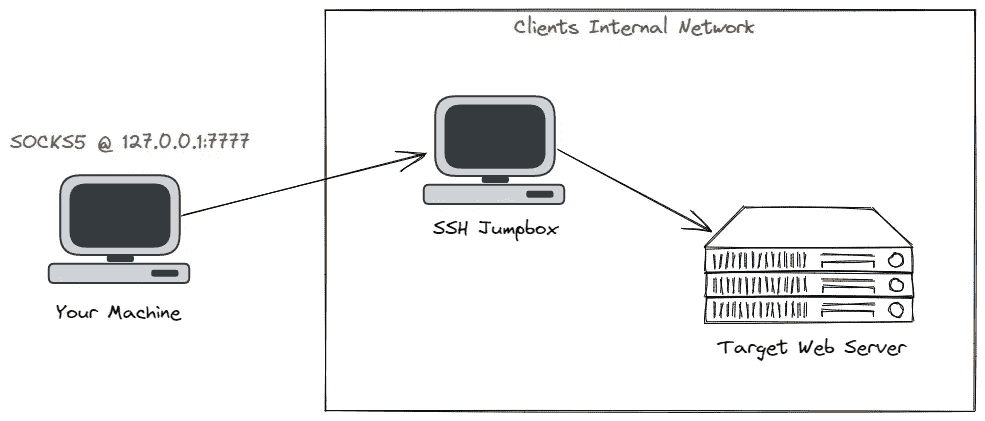

# 通过 SOCKS 代理转发 Burp 套件流量

> 原文：<https://medium.com/geekculture/forwarding-burp-suite-traffic-through-socks-proxy-bada1124341c?source=collection_archive---------1----------------------->

## 将 Burp 流量发送到客户的内部网络

H ello，🌎！在客户的内部测试中，你可能会负责测试内部网络应用。如果没有像 Burp Suite 这样的 web 代理工具来捕获 HTTP/WS 流量，就无法对 web 应用程序进行全面的测试。所以在这篇博客中，我将向你展示如何配置 Burp 来使用…