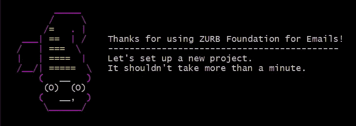
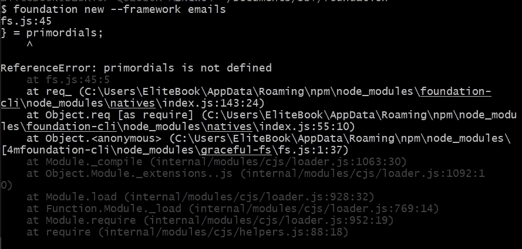
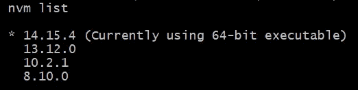
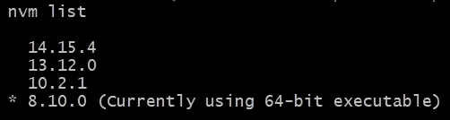
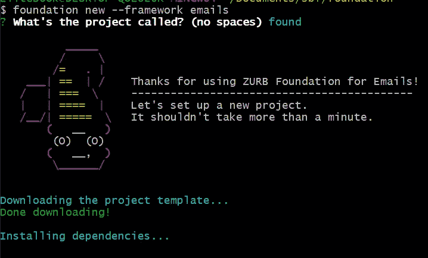

# 典型错误和我们如何解决它

> 原文：<https://medium.com/geekculture/foundation-zurb-typical-errors-and-how-to-solve-it-88f44bea85b1?source=collection_archive---------3----------------------->



我经常使用这个库来发送邮件，它是一个非常可靠的邮件框架，但是有时安装有点复杂，我们会看到这种错误以及如何解决它。

# 未定义第一个错误基准

如果我们想运行第一个命令来启动一个新的电子邮件项目

命令:基础新-框架电子邮件

但是我们有这些我们怎么解决呢？

```
foundation new --framework emailsfs.js:45} = primordials;^ReferenceError: primordials is not definedat fs.js:45:5at req_ (C:\Users\EliteBook\AppData\Roaming\npm\node_modules\foundation-cli\node_modules\natives\index.js:143:24)at Object.req [as require] (C:\Users\EliteBook\AppData\Roaming\npm\node_modules\foundation-cli\node_modules\natives\index.js:55:10)at Object.<anonymous> (C:\Users\EliteBook\AppData\Roaming\npm\node_modules\[4mfoundation-cli\node_modules\graceful-fs\fs.js:1:37)at Module._compile (internal/modules/cjs/loader.js:1063:30)at Object.Module._extensions..js (internal/modules/cjs/loader.js:1092:10)at Module.load (internal/modules/cjs/loader.js:928:32)at Function.Module._load (internal/modules/cjs/loader.js:769:14)at Module.require (internal/modules/cjs/loader.js:952:19)at require (internal/modules/cjs/helpers.js:88:18)
```



Example error Foundation ZURB primordials

容易改变你的 Node.js 版本到 8.10.0，你需要一个 NVM(节点版本管理器)版本，我有 14.15.4 Nodes.js '版本



Example Node.js versions

我换到了 8.10.0



Example changing Node.js versions

然后我们再次运行该命令，会发生什么情况呢？一切都是正确的！



Example Foundation ZURB creating new Project correactly

# 模棱两可的论点

```
npm ERR! git rev-list -n1 4.0: fatal: ambiguous argument '4.0': unknown revision or path not in the working tree.
npm ERR! git rev-list -n1 4.0: Use '--' to separate paths from revisions, like this:
npm ERR! git rev-list -n1 4.0: 'git [...] -- [...]'
npm ERR! git rev-list -n1 4.0:

There were some problems during the installation.✓ New project folder created.
✗ Node modules not installed. Try running npm install manually.
✓ Bower components installed.
```

这个错误并不难，你需要编辑 JSON 包，因为它有 github URL

```
“gulp”: “git+https://github.com/gulpjs/gulp.git#4.0"
```

它必须像下面一样，再次运行 npm 安装，错误就会消失

```
“gulp”: “⁴.0.0”
```

# 结论

这些错误在这个框架中是很常见的，如果你还有其他错误，你可以把它写下来，让这个框架保持一段时间的整洁，因为这个框架对于邮件来说很重要。

# 来源

[https://github.com/foundation/foundation-emails/issues/920](https://github.com/foundation/foundation-emails/issues/920)