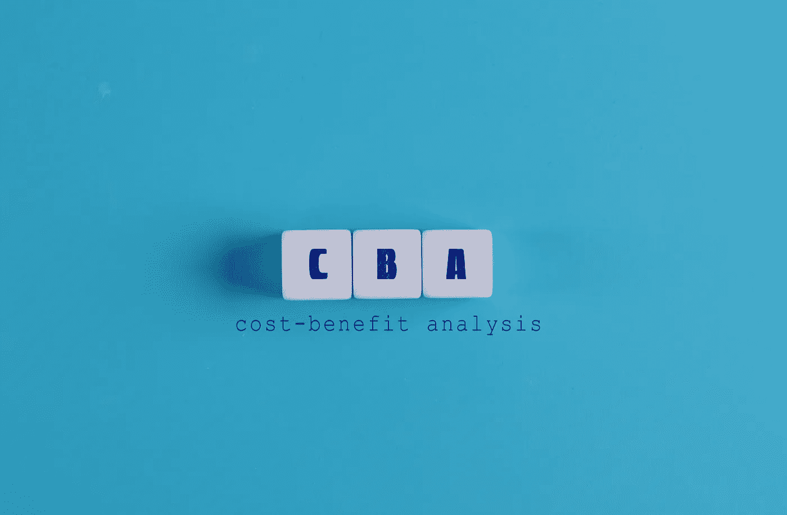

# 改善成本效益分析的四个步骤

> 原文：<https://medium.com/geekculture/four-steps-to-better-cost-benefit-analysis-bd62c9ea55e1?source=collection_archive---------8----------------------->

## 成本收益分析坏了。以下是如何通过四个简单的步骤来修复它。

作者:本特·弗吕布杰格和 D.W 贝斯特

本文是三篇系列文章中的第三篇。第一条是 [*这里是*](/geekculture/how-in-accurate-is-cost-benefit-analysis-b240bb4736c6) *，第二条是* [*这里是*](/geekculture/the-cost-benefit-fallacy-7241089d64d8) *。每篇文章都可以独立阅读，但按顺序阅读就形成了一个整体。*

Photo by [Jernej Furman](https://www.flickr.com/photos/91261194@N06/)