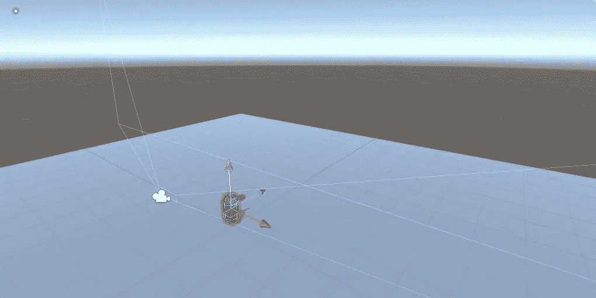
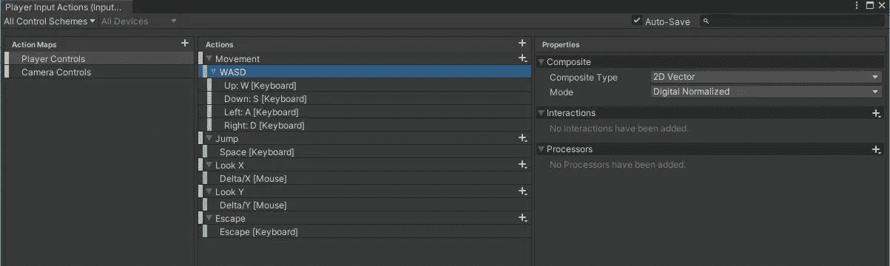
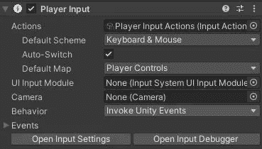
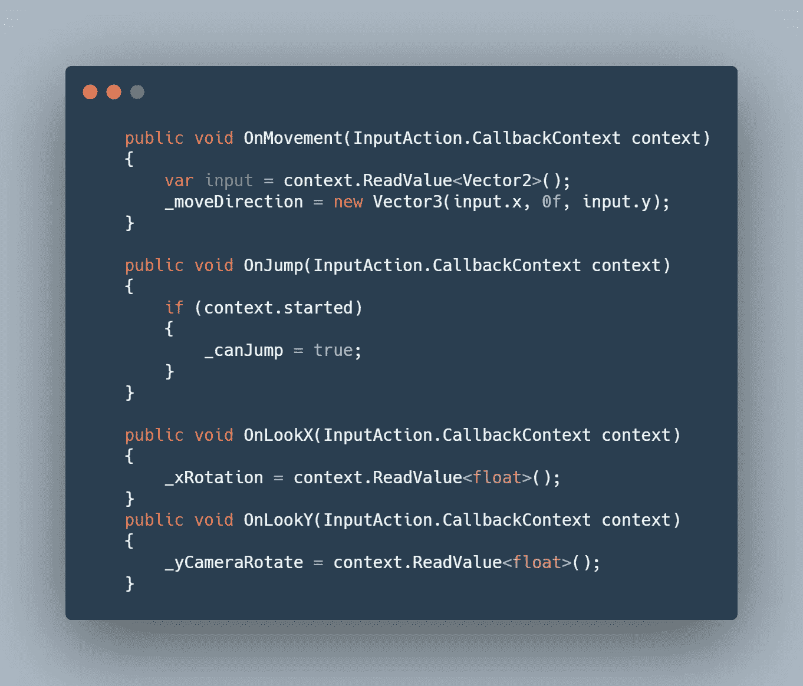
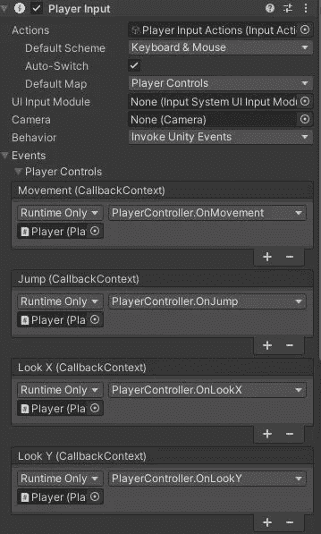
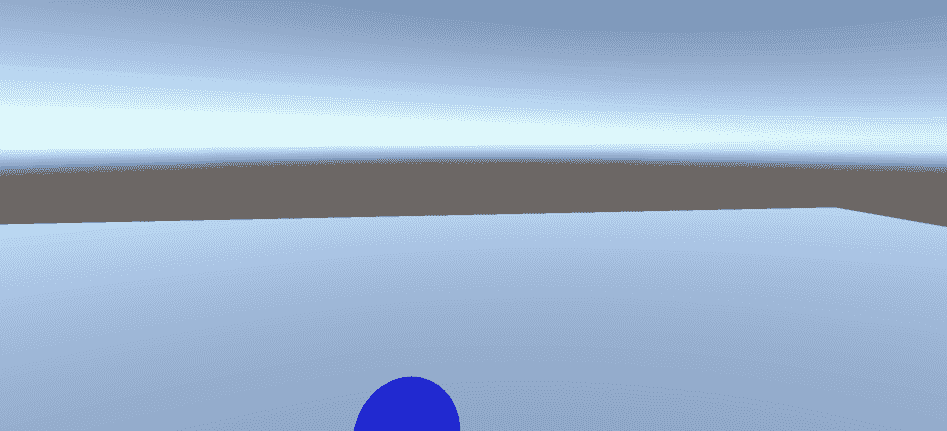

# FPS 进度报告:僵尸射手(新输入系统)Unity

> 原文：<https://medium.com/geekculture/fps-progression-report-zombie-shooter-new-input-system-unity-aba8866023c2?source=collection_archive---------35----------------------->

最后一个项目“[移动项目进度报告:演示完成 Unity](/nerd-for-tech/mobile-project-progression-report-demo-finished-unity-1063198236f1) ”昨天完成了，学到了很多知识。

今天我为 GameDevHQ 项目进行了一个 FPS 动作项目，玩家将射击一些僵尸。谁不喜欢拍无脑僵尸。

Progression Report

> 初始设置

在设置了一个简单的平面和一个代表播放器的圆柱体之后，我向播放器添加了一个角色控制器组件和一个“player Controller”C #脚本。玩家的移动将使用角色控制器来控制，几乎和以前的项目一样([日积月累:Unity](/codex/tip-of-the-day-character-controller-in-unity-4516644f695) 中的角色控制器)

Environment Setup

> 新输入系统

这一次，我将使用新的输入系统，而不是旧的。

在从包管理器安装了新的输入系统并在项目设置中创建了资产之后，我在资产文件夹中创建了玩家输入动作映射。

Player Input Action Map

上面的地图将允许玩家使用黄蜂移动，使用空间跳跃，并通过鼠标 Delta/X 和 Delta/Y 位置自由观察。

Player Input Component

接下来，添加了一个“玩家输入”组件，并将上面的地图添加到了动作中。我将使用“调用 Unity 事件”来可视化控件。

至于代码，每种方法都将注册的输入值赋给一个变量，控制玩家的移动、跳跃和相机/玩家的旋转(将在后面的文章中详细讨论)。

Events Callbacks

最后，我甚至在播放器输入组件中给每个方法分配了一个 unity，现在是测试的时候了。

FPS Controller