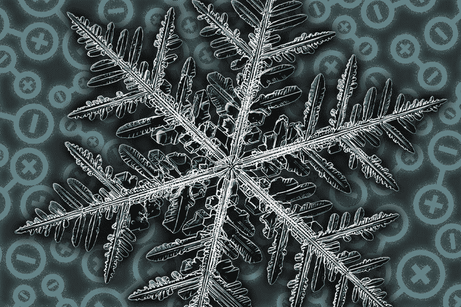

# 分形与交易-完整指南。

> 原文：<https://medium.com/geekculture/fractals-trading-the-full-guide-71f7d0df0721?source=collection_archive---------10----------------------->

## 在 Python 中创建和评估分形叠加指示器。

www.pxfuel.com

模式识别是搜索和识别具有近似相似结果的循环模式。这意味着当我们设法找到一个模式，我们有一个预期的结果，我们希望看到并通过我们的交易采取行动。例如，双顶/底形态是一个典型的…