# 用于可配置业务工作流自动化的框架

> 原文：<https://medium.com/geekculture/framework-for-user-configurable-business-workflow-automation-a17bf087416b?source=collection_archive---------0----------------------->

credits: [https://pixabay.com](https://pixabay.com/)

自动化是商业应用的一个重要方面。有两种类型的工作流自动化:

1.**规则引擎** —通常，它们包含事件触发器和动作的组合。他们本质上基本上是无国籍的。

2.**状态机**–它们使用状态、事件、转换和一个将它们结合在一起的有限状态机来定义。

在本文中，我介绍了一个使用规则引擎和状态机实现自动化的混合框架。

今天大多数可用的框架都提供离线工作流自动化。我所说的离线是指他们使用后端系统启用预配置的工作流定义。在这篇文章中，我提出了一个框架，使用户能够配置自动化。这在以自动化为核心功能的 SaaS 应用程序中是非常理想的。我提出了一个基于 JSON 的工作流定义，并以此为基础深入研究工作流自动化引擎架构。本文主要关注系统架构元素。

# **工作流自动化的基础架构**

## 工作流定义

工作流自动化定义的核心元素可以使用下面的结构简单地定义

Workflow Definition

## 工作流类型

基于事件的工作流(类型=事件)由事件处理程序触发。事件由应用层服务生成，并发布到消息传递系统。

您还可以基于由批处理触发的计划来配置规则。

## 工作流模块

这是自动化的一个核心方面。模块代表一个域，它包含系统中一组对象。它们代表了工作流配置的实体规范。模块允许用户配置工作流定义。对于支出管理系统，“支出管理”是一个模块，它可以有几个域对象，如“发票”、“采购订单”、“销售订单”、“费用”、“卡”、“客户”、“组织”。根据您希望在系统中启用自动化的内容，您可以轻松地将系统中相似的域对象映射到模块。

可以使用以下结构定义模块结构:

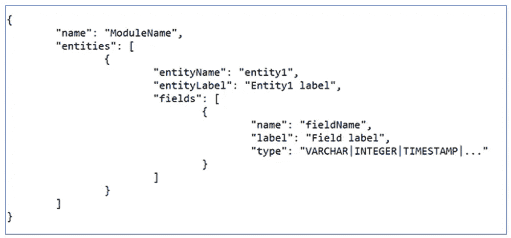

Module Definition

## 工作流触发器

基于工作流类型(基于事件或计划)

触发公共结构:

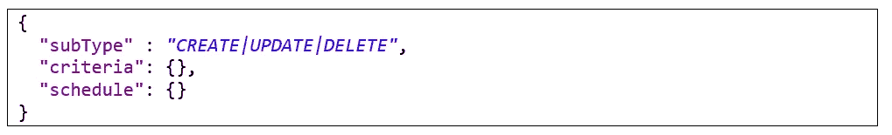

**子类型**是 CRUD 事件子类型。**标准**是**子类型**更新的触发条件，用于检查字段是否被更新

标准结构:

**updatedFields** 是应检查更新的实体字段名列表。 **isUpdatedAll** 表示如果所有字段或至少一个字段已更新，则标准为真。

时间表结构:

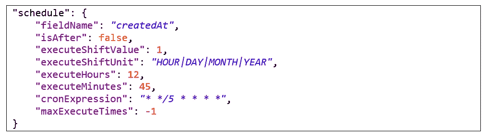

**字段名称**是日期类型的工作流实体字段，其值用于计算动作的首次执行日期。

**isAfter** 参数表示计算行动首次执行日期的方向。如果**为真**，*执行转移值*将被添加到来自实体字段的日期值中。

**executeShiftValue** 是 *executeShiftUnit* 的值，应该加上或减去工作流实体字段的日期值。

**执行小时**和**执行分钟**是定义第一次动作执行的时间

**cronExpression** 定义 cron 表达式，用于计算下一次执行时间

**maxExecuteTimes** 定义执行次数的限制。-1 表示没有限制。

基于事件的触发器示例:

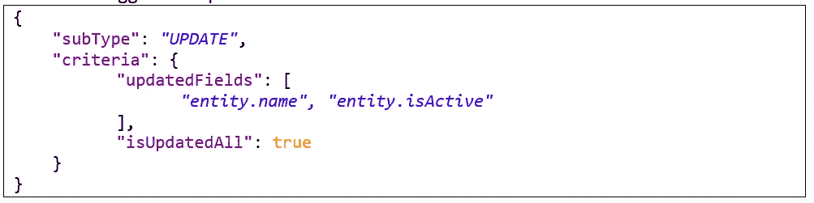

基于时间表的触发器示例:

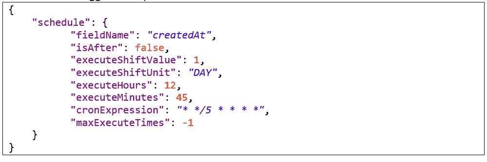

## 工作流程标准

条件捕获触发规则所需的一系列条件。标准是一个布尔表达式。在我们的框架中，我们建议使用 [MVEL](http://mvel.documentnode.com/#:~:text=Basic%20Syntax.%20MVEL%20is%20an%20expression%20language%20based,type%20qualification%20is%20not%20required%20in%20the%20source) 表达式语法。

使用 MVEL 表达式语法的条件:

**模式**对条件进行分组，以构建最终的逻辑表达式。

# 工作流操作

操作定义了触发规则后(满足标准后)工作流引擎要执行的工作单元。现实世界中的行动可以是发送电子邮件/短信通知/网络挂钩。或者，它可以自动更新一个实体。

通用工作流操作结构:

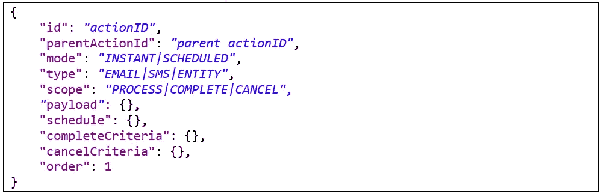

**id** 是动作的唯一 id。

**parentActionId** 是父动作的 Id。相关操作配置和处理需要该参数。

**模式**动作执行模式。在**瞬间**模式下动作执行一次，就对工作流进行处理。在**预定**模式下，动作可以根据**预定**配置参数执行多次。

**类型**捕获操作的类型——是基于通知的操作(“电子邮件|sms”)还是使用“实体”作为操作类型对系统中现有数据的更新

**范围**参数用于依赖动作处理。默认值为**流程**表示动作在父动作完成后执行。**完成**表示执行的动作，然后**过程**模式的所有相关动作完成。**取消**是定义当至少一个**流程**模式的动作被取消时将执行的依赖动作。**完成**或**取消**模式的动作必须有引用根动作的 **parentActionId** 参数。根操作没有 **parentActionId** 。

**有效载荷**捕获完成动作所需的有效载荷信息。参数的结构取决于动作**类型**。

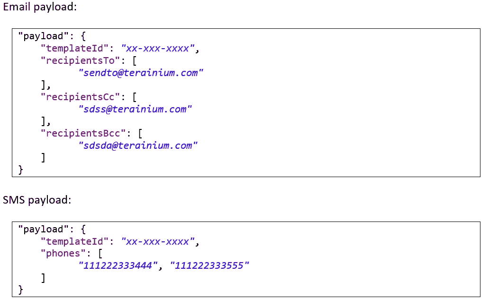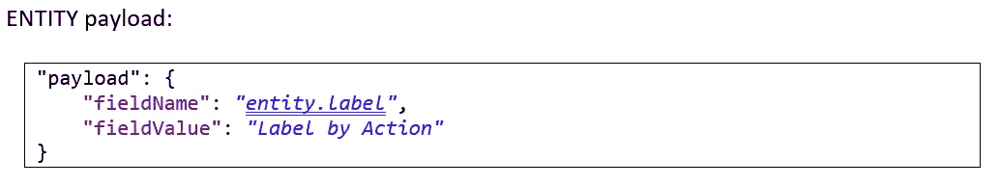

**调度**参数必须为**调度**模式下的动作进行配置。

时间表结构:

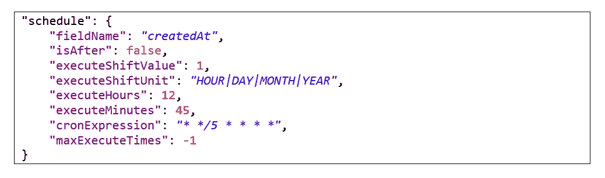

**字段名称**是日期类型的工作流实体字段，其值用于计算动作的首次执行日期。

**isAfter** 参数表示计算动作首次执行日期的方向。如果**为真**，则 *executeShiftValue* 将被添加到来自实体字段的日期值中。

**executeShiftValue** 是 *executeShiftUnit* 的值，应该加到或减去工作流实体字段的日期值。

**执行小时**和**执行分钟**是定义第一次动作执行的时间

**cronExpression** 定义 cron 表达式，用于计算下一次执行时间

**最大执行次数**定义了执行次数的限制。-1 表示没有限制。

**completeCriteria** 是可选参数，用于检测预定或相关动作是否完成

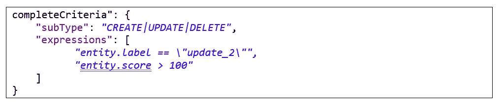

**子类型**是定义工作流事件子类型的可选参数。

**表达式**是验证工作流实体字段的表达式列表。

**cancelCriteria** 是可选参数，用于检测一个预定的或依赖的动作是否被取消。该参数的结构如 **completeCriteria** 所示。

# 数据库结构

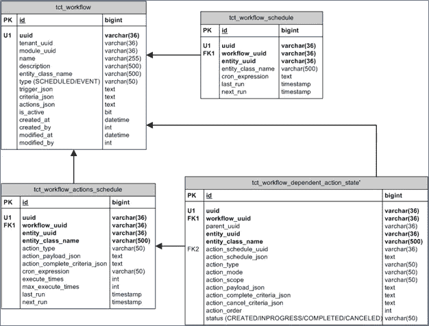

# 活动处理详细信息

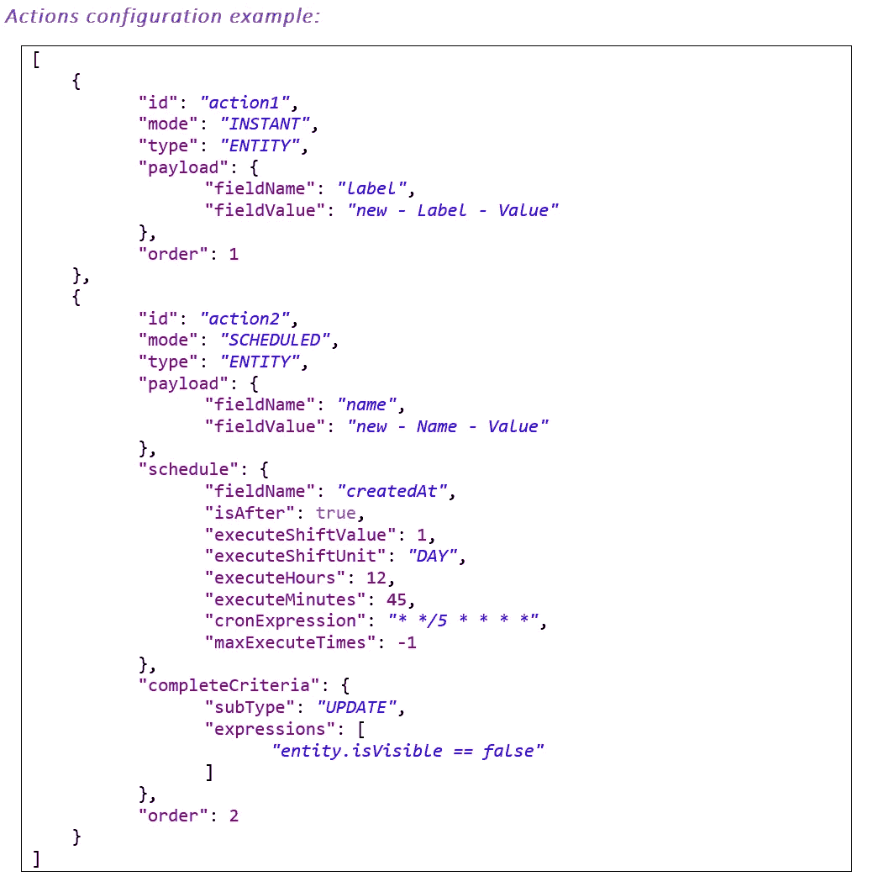

动作处理取决于动作模式和依赖动作的存在。

没有依赖的**即时**模式下的动作被立即执行。

没有依赖项的**调度**模式下的动作保存在“**TCT _ workflow _ action _ schedule**DB 表中，用“ **BatchActionService** 执行。

从属操作有一个根操作。根操作没有 **parentActionId** 参数。

具有依赖项的操作保存在“**TCT _ workflow _ dependent _ action _ state**”DB 表中。所有已保存的操作都具有“已保存”状态。根操作被执行，其状态被更改为正在进行中。然后，通过事件或计划的工作流处理，验证活动完成和取消标准。

如果操作符合**完成标准**，其状态将变为完成，相关操作将被执行，其状态为进行中。当所有相关动作完成时，执行具有完整范围的动作。所有相关操作都将从数据库中删除。

如果状态为“进行中”的操作符合**取消标准**，则从数据库中删除所有相关操作，并执行取消范围操作。

## 动作处理逻辑

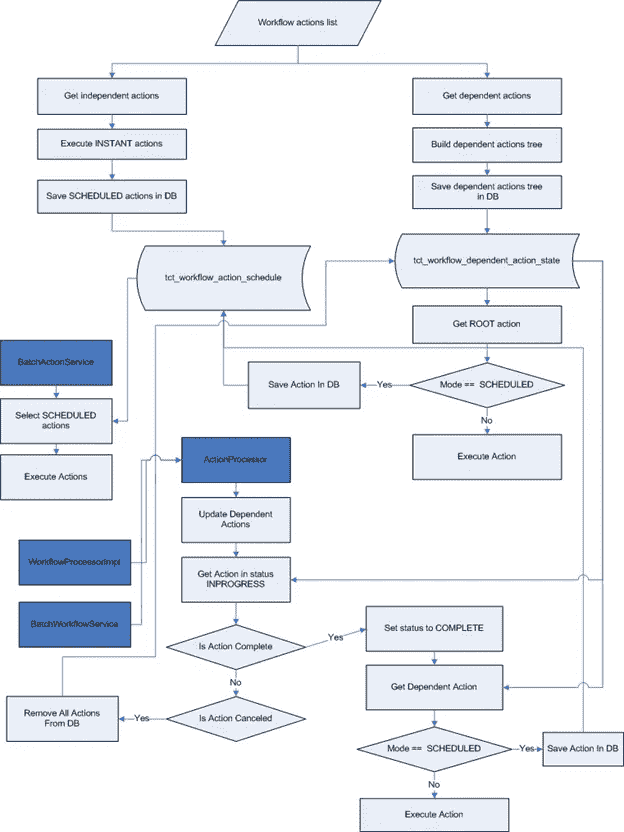

## **依赖动作配置示例**

**动作 1** 是根动作。**动作 12** 是完整的范围动作*。*这里有一个例子:

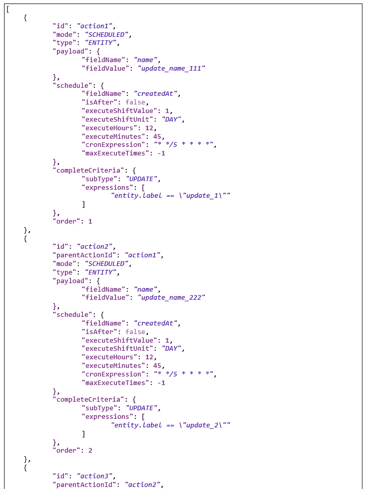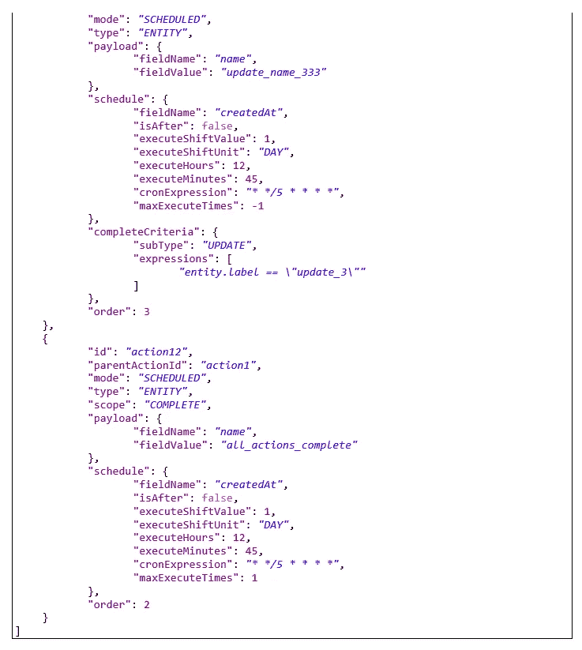

# 工作流引擎的高层设计

## 基于事件的工作流

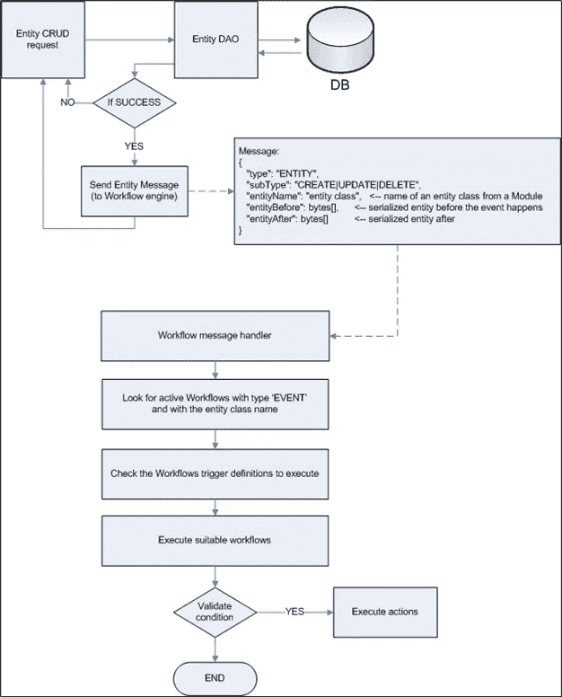

## 基于计划的工作流

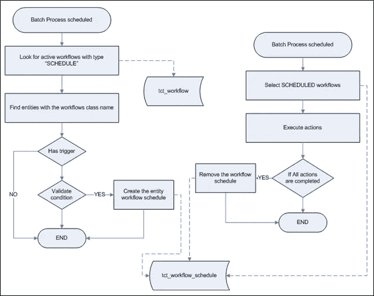

# 结论

使用本文介绍的框架，我们可以为任何业务应用程序构建工作流自动化。这是一个高度可扩展的框架，可以用来将自动化功能插入现有的应用程序以及构建新的应用程序。