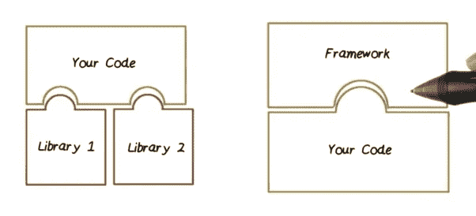

# 框架 vs 库

> 原文：<https://medium.com/geekculture/framework-vs-library-83931b6a168?source=collection_archive---------17----------------------->

侵入性与非侵入性

库和框架的区别是什么？

引用:

> *框架和库的第一个主要区别是谁控制着开发过程。*

> *有了代码库，开发者通常会在他们觉得合适的时候调用这个库。一个框架通常要求开发人员完全沉浸在它的工作流程中。*
> 
> *因此，人们经常感觉好像是框架在控制开发过程，而不是开发人员。这是控制反转！这通常被简化为下面的一些变体:*
> 
> **库:叫我们把工作做好。
> *框架:* ***你不叫我们，我们就叫你。***
> 
> 正是因为这种控制的反转，框架变得更加固执己见，这也是为什么它们能够为开发人员做这么多事情。
> 
> *固执己见对于那些好奇的人来说意味着框架在如何编写代码、文件的位置，甚至可能是所述文件的名称方面做出了很多决定。*
> 
> *做出这些假设允许使用约定优于配置的范例，这允许开发者跳过应用配置的过程，以换取遵循某些约定(例如将某些文件放在某些文件夹中，等等)。).*

[https://better programming . pub/libraries-vs-frameworks-what-the-difference-5f 28 c 53 dcffe](https://betterprogramming.pub/libraries-vs-frameworks-whats-the-difference-5f28c53dcffe)

框架进一步分为*侵入式*和*非侵入式*框架。非侵入式框架的主要吸引力在于它不妨碍您的设计和建模活动。在你需要它之前，它完全不碍事。例如，Spring 是非介入式框架。应用程序代码不需要直接依赖任何 Spring 对象。ORM 框架通常非常具有侵入性。

我个人的偏好是这样的:我更喜欢在项目中使用**1–2 非侵入式框架**，比如 Spring、Spring Boot、Python 中的 web.py 以及其他很多聚焦具体任务的**库**。这就是我不喜欢 Python 中流行的 Django 和 Flask 框架的原因。另一方面，我确实在 Java 中使用 EJB3，它工作得相当好。但是我以非典型的方式使用它——为了有效地使用它，我阅读了它的 300 页设计文档，这让我知道如何将它的使用定制到非常高(非典型)的程度。另一个例子是 JPA。