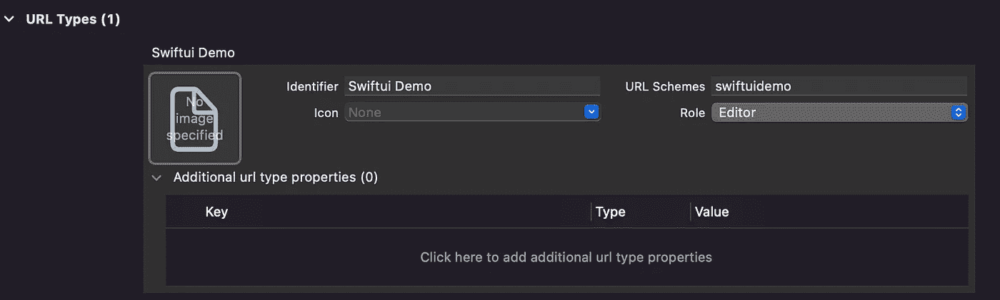

# 因为在使用 SwiftUI 时丢失了一小段代码而抓狂。onOpenUrl

> 原文：<https://medium.com/geekculture/freaked-out-for-missing-one-small-snippet-in-swiftui-while-using-onopenurl-1378084c9c3?source=collection_archive---------19----------------------->

Photo by [Nubelson Fernandes](https://unsplash.com/@nublson?utm_source=medium&utm_medium=referral) on [Unsplash](https://unsplash.com?utm_source=medium&utm_medium=referral)

我正在用 SwiftUI 开发一个跨平台的应用程序。此应用程序注册为一个 URL 类型的“所有者”。

> URL 类型的注册意味着在目标的信息部分添加 URL 方案。

因此，我的应用程序预计将打开上述方案组成的网址。SwiftUI 为我们提供了。打开 URL 的 onOpenURL 修饰符。这可以从任何视图添加。

该功能非常正常，并按预期工作。在给我的应用程序添加许多功能时，我弄乱了我的代码，这影响了 onOpenUrl 的功能。因此，在调试了一段时间后，我发现了自己的错误。

为了添加一个功能(接受共享 CloudKit 数据库的邀请)，我在代码中添加了一个自定义场景委托。在添加这个自定义场景委托之后，SwiftUI 希望这个委托负责 URL 处理。这正是破坏我的代码的原因。所以我通过添加如下所示的小片段来解决这个问题。

## 钥匙带走:

添加自定义场景委托时，将 onOpenURL 和 onContinueUserActivity 之类的请求路由到原始委托。

此外，我将张贴一篇关于使用。分享我在视图树中打开底部视图的方法。

感谢阅读:)