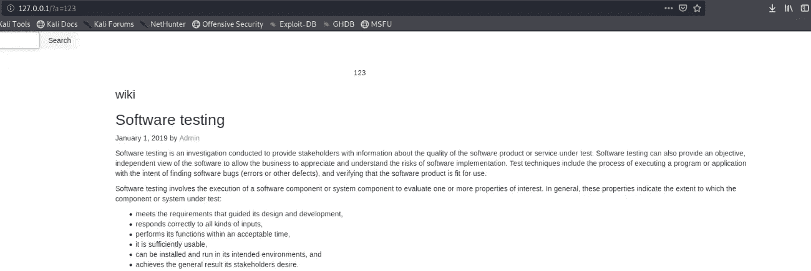
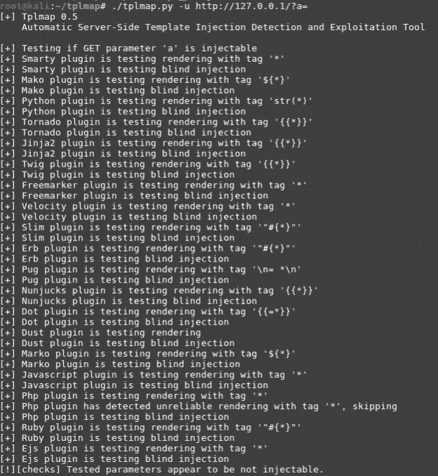
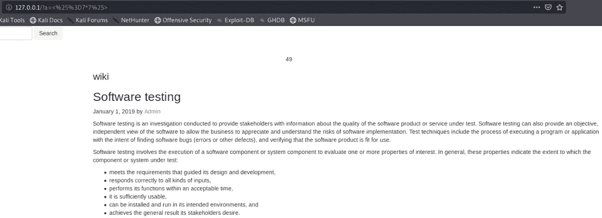
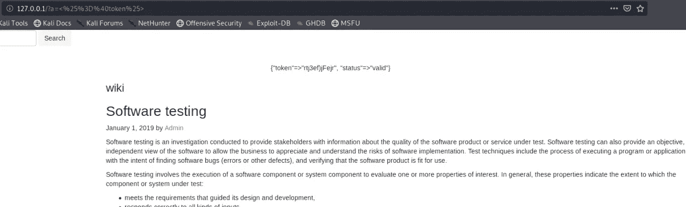
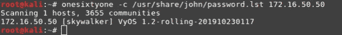
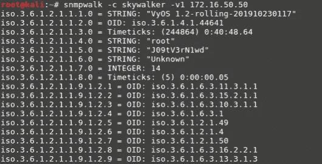
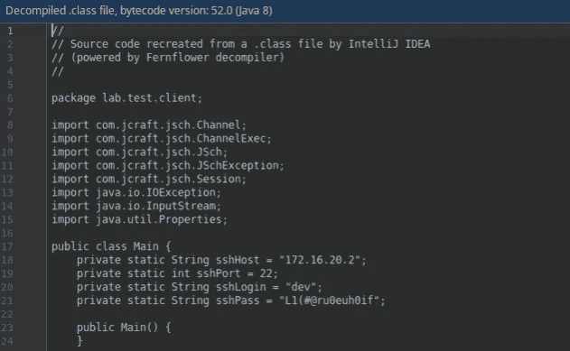
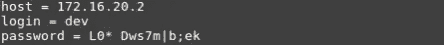
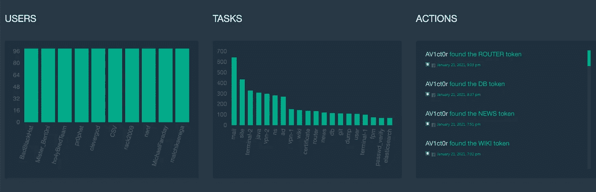

# 自由渗透测试实验室测试实验室 15 —谁是 n0v1ch0k？

> 原文：<https://medium.com/geekculture/free-penetration-testing-laboratory-test-lab-15-who-is-the-n0v1ch0k-c4b8ee4daf88?source=collection_archive---------2----------------------->


2021 年 3 月 15 日，Pentestit 推出了[测试实验室 15](https://lab.pentestit.ru/) ，it 专家可以在这里免费测试他们发现和利用企业网络和 web 应用程序漏洞的技能。

# 关于测试实验室

测试实验室是一个网络培训场所，参与者在这里获得分析信息系统安全性的经验。每个这样的实验室都有完整的基础设施、历史和许多必须被发现、本地化和利用的隐藏漏洞，因此，这是一个危及公司网络的成熟场景。测试实验室的一个重要特征是最大程度的真实。充当攻击者的参与者通过时，可以访问实验室的各个节点，每个节点都包含一个令牌。获胜者是首先收集所有令牌并完全控制虚拟公司网络的人。任何人都可以一试身手，检查自己现有的信息安全技能。实验室总是独一无二的，包含最相关的漏洞。

# 测试你的技能和能力需要什么:

1.  在 lab.pentestit.ru 网站上注册您的个人帐户，其中将提供连接到实验室的信息(登录名/密码)。
2.  通过 OpenVPN 连接到实验室。
3.  建立连接并访问测试公司网络所在的网关。
4.  开始发动攻击。

# 传递任务的本质是什么

实验室的主要目的是获取和巩固以手动模式和使用特殊工具搜索和利用漏洞的技能，这些工具包括:Nmap、Tplmap、Dirbuster、Wapiti、BurpSuite / OWASP Zap、Metasploit Framework、Patator / Hydra、Enum4linux、IDE 以及逆向工程、网络协议分析等工具。

通过接收令牌，您将能够更深入地渗透到测试企业网络中，在那里将有越来越多的服务器可供攻击。在工作过程中，您将熟悉流行的技术，这将使您能够从攻击者的角度来看待信息安全。值得记住的是你的主要工具——逻辑思维和足智多谋。

> **作为一个说明性的例子，我们建议分析过去实验室的几项任务。测试实验室 14 项任务的完整演练可在** [**链接**](https://pentestit.medium.com/how-to-c-ru-sh-or-how-the-test-lab-14-was-hacked-3cef4a5d3d31) **获得。**
> 
> **所有信息仅供参考，请勿违反法律。**

# 维基网

站点页面上有一个搜索栏，我们在这里输入文本并确保它显示在页面上:



假设使用了模板引擎，请输入数据进行定义:

`{{7*7}}`

输入的文本显示在页面上没有变化，因此，这不是神牙或树枝。为了节省时间，让我们使用 Tplmap 工具，它无法判断正在使用哪个插件:

`# ./tplmap.py -u [http://127.0.0.1/?a=](http://127.0.0.1/?a=)`



在 WhatWeb 的帮助下，我们发现这个网站是用 Ruby-on-Rails 写的:`# whatweb 127.0.0.1`

让我们尝试使用流行的 Ruby-on-Rails Haml 模板引擎的有效负载:`<%=7*7>`



页面显示 49，因此，插件被正确找到。然后我们编写一个请求，允许我们获得一个令牌:токен



# 路由器

以扫描 TCP 端口的形式执行侦察后，没有获得任何结果。正在尝试扫描 UDP。发现一个开放的 SNMP 端口(UDP 161)。使用 Onesixtyone 工具，我们有社区热线:

`# onesixtyone -c /usr/share/john/password.lst 172.16.50.50`



当我们有了必要的数据后，使用 Snmpwalk 工具，我们尝试获取有关服务器的信息:

`# snmpwalk -c skywalker -v1 172.16.50.50`



在分析了命令输出之后，我们注意到一个奇怪的系统名称，可能是一个令牌。

# Java 语言(一种计算机语言，尤用于创建网站)

将 jar 文件作为归档文件打开，可以看到它包含一个 Main 类。转到 IDE 中的 Main.class:



在检查了反编译的代码之后，我们找到了连接到 SSH 并显示命令结果的信息:

```
df -h | grep /dev/sda1
```

请注意，密码正在被更改。在该类中添加几行代码，显示建立连接所用的服务器 IP 地址、登录名和密码。

编辑课程:


编译修改后的类，并用它替换 jar 文件中的原始类。运行文件:



显示的密码是一个令牌。

# 测试实验室统计



来自世界各地的 33，000 多名用户已经在实验室网站上注册。同时，共有 664 名参与者完成了来自之前实验室的第一项任务。同时，他们中只有 69 人能够完全破坏虚拟公司的 IT 结构。

# 关于我们

除了创建独特的实验室之外，我们还是 [Nemesida WAF](https://nemesida-waf.com) 的开发人员，并且还为俄罗斯、美国、英国、捷克共和国、乌克兰、摩尔多瓦、阿塞拜疆、哈萨克斯坦、加拿大的最大公司提供企业网络和 web 应用程序存在缺陷(漏洞)的分析服务；我们在信息安全领域培训大公司的员工。如果你想更详细地了解它是如何工作的，我们提供零安全计划的培训:A(基础培训)或公司实验室(高级培训)。

# 结论

在测试实验室工作的过程中，参与者将研究漏洞的性质、主要的利用工具、对策以及攻击者的心理。通过了解如何构建真正的攻击媒介，您将学会如何有效地对抗它们。新[测试实验室 15](https://lab.pentestit.ru/) 见！