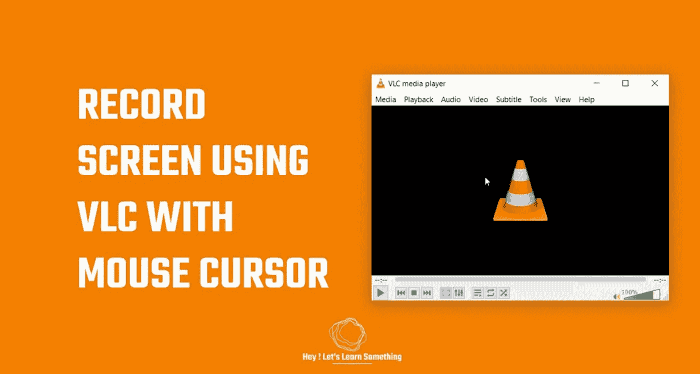

# 使用 VLC 媒体播放器进行免费屏幕录制

> 原文：<https://medium.com/geekculture/free-screen-recording-using-the-vlc-media-player-157a317418bd?source=collection_archive---------10----------------------->

如果屏幕录制没有鼠标光标，这是一个有用的技巧

寻找免费的屏幕录制软件？然后这篇文章将指导你如何使用一个免费而强大的应用程序 VLC 播放器来录制你的屏幕。有了 VLC 播放器，你可以免费录制你的屏幕，此外，VLC 还可以在你的电脑上播放各种视频格式。VLC 是绝对免费的，没有隐藏成本…