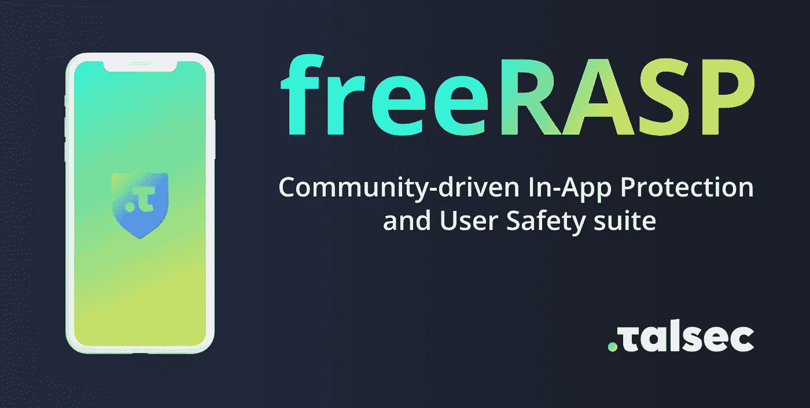
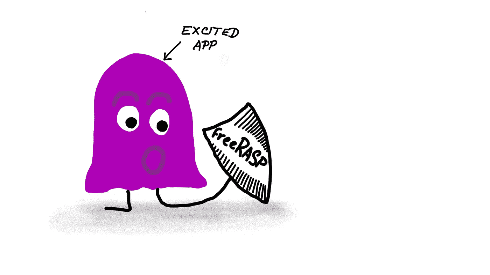
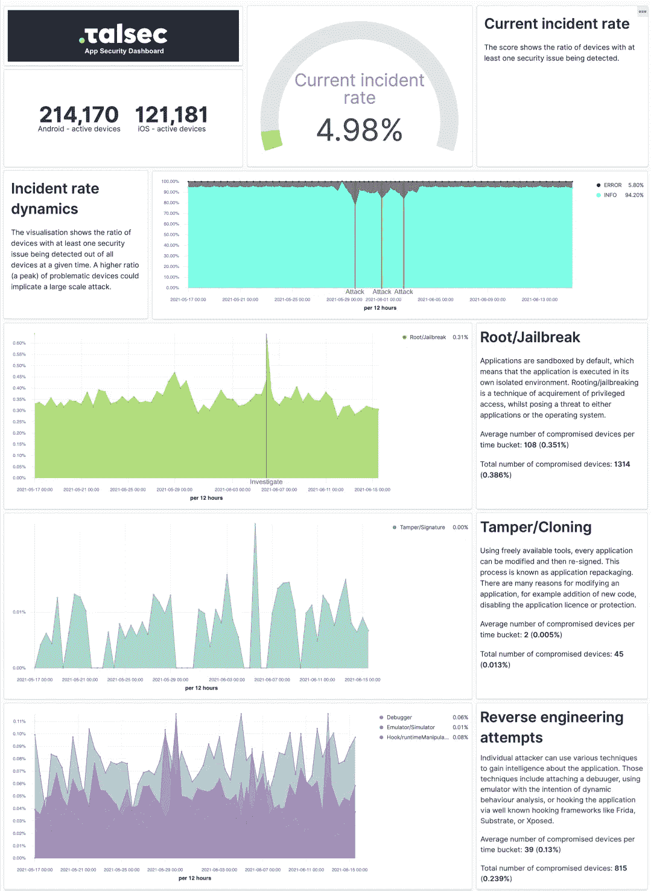
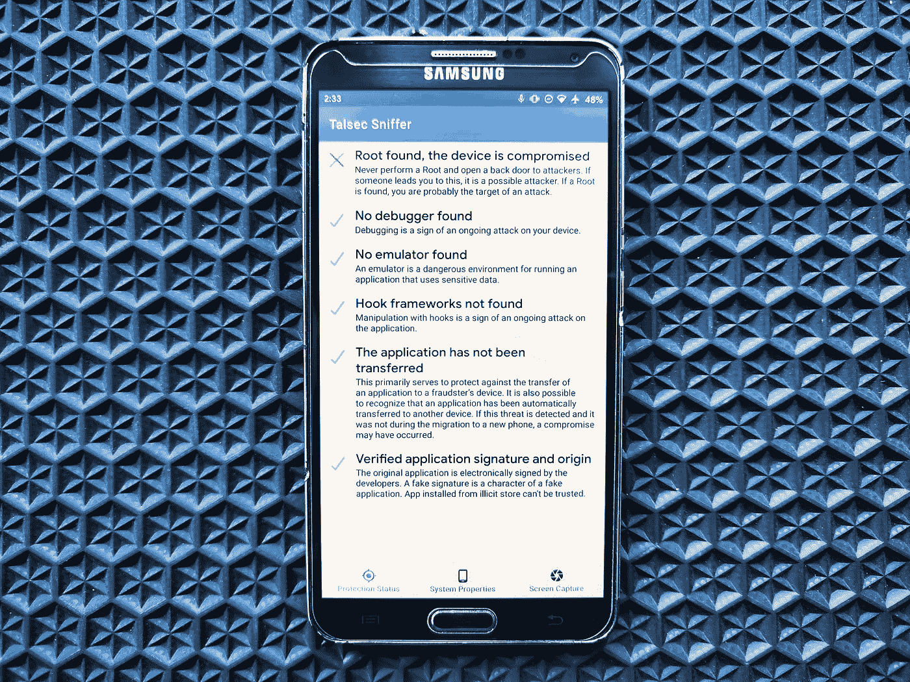

# freeRASP —应用内保护 SDK 和应用安全监控服务

> 原文：<https://medium.com/geekculture/freerasp-in-app-protection-sdk-and-app-security-monitoring-service-de12d8e49400?source=collection_archive---------25----------------------->

*TL；DR:*[*freeRASP*](https://github.com/talsec/Free-RASP-Community)*提高安全性，确保你的 app 安全。就像不速之客，但威胁。***[*安卓*](https://github.com/talsec/Free-RASP-Android) *和*[*iOS*](https://github.com/talsec/Free-RASP-iOS)*都支持。***

**更新 1:可以在 [**失踪的扑界英雄**](/@talsec/missing-hero-of-flutter-world-699bba780fd3?source=friends_link&sk=2dd7593be17d1c0cea90ad8f79e159bd) 中查看更多关于 freeRASP +扑的信息**

**更新 2:推荐阅读 [**移动 API 反滥用保护:AppiCrypt 是新的安全网和设备检查证明替代方案**](/@talsec/mobile-api-anti-abuse-protection-appicrypt-is-a-new-safetynet-and-devicecheck-alternative-20cf7a07dfb0?source=friends_link&sk=2b50a76d1a7d2b5b86856e037a19e30c)**

# **需要锉刀**

**除非您是安全专家或致力于安全事业的开发人员，否则应用程序保护是一项具有挑战性的任务。您可能听说过证书锁定和数据加密(已经被许多库解决了)，但是还有更多。年复一年，攻击者在你看不到的地方瞄准应用程序级的漏洞。你也意识到了一个事实，那就是一个小小的漏洞就能永远毁掉你的名声。**

**移动技术中对应用内保护需求的增加刺激了移动 RASP(运行时应用程序自我保护)解决方案的出现，这种解决方案以前特别是在网络应用中为人所知。流行的根检查库 RootBeer 可以追溯到 2015 年，其他商业级解决方案甚至更早。Android 和 iOS 有许多提供各种安全检查的库。遗憾的是，它们似乎都没有涵盖大多数攻击媒介。此外，没有一个颤振。所以我们决定改变它。freeRASP 的想法由此诞生。**

****

# **检测、保护和监控**

**最初，freeRASP 只包含 Talsec 的核心库，执行各种检查，以确保该应用程序受到适当保护，免受各种黑客攻击。如果检测到任何讨厌的东西，库会通知你的应用程序。然后你可以决定应该采取什么行动。例如，如果应用程序被篡改，你可以终止它。类似地，如果您希望用户在流行的 BlueStacks 模拟器上运行您的应用程序，您可以决定启用模拟器的使用。一旦我们完成了这个里程碑，我们仍然对结果不满意。我们意识到我们可以做得更多。**

**我们决定更进一步，为 freeRASP 配备定期的安全报告。只需每周免费检查一次您的邮箱，您就可以检测到任何篡改您的应用的人，并发现您的应用当前面临的威胁。适当的可视化有助于您轻松解释检测到的威胁，并在必要时采取措施。就像 Crashlytics，但为了安全洞察。**

****

# **freeRASP 如何保护你的应用？**

**freeRASP 包含以下保护功能:**

*   **篡改保护**
*   **重新打包/克隆保护**
*   **运行时分析保护**
*   **威胁警报&每周[安全报告](https://github.com/talsec/Free-RASP-Community#security-report)**

**这些保护符合 ISO25010 质量和风险管理特征的子集，也称为“CIA”原则:**

*   ****保密性:**防止黑客入侵。运行时分析保护有助于缓解一些攻击媒介。**
*   ****完整性:**防止以非预期方式挂钩和使用 app。**
*   ****真实性:**克隆保护。防止用户使用克隆的应用程序。**

# **谈一谈成熟度和 GDPR 合规性**

**freeRASP 不是凭空冒出来的。事实上，它是我们在 Talsec 开发的更强大的 RASP 解决方案的弟弟。因此，freeRASP 与它的哥哥分享了许多久经考验的功能。最终，Talsec 商业解决方案的成熟使我们能够专注于为每个移动应用程序提供免费的通用解决方案。我们相信每个开发人员都应该能够控制安全性。从简单的预订应用程序到广泛使用的比特币钱包，每个应用程序都可以受益于 freeRASP 的保护。**

**Talsec 负责处理法律事务。我们坚持 GDPR，尊重用户的隐私。freeRASP 不会监视你，出于应用内保护目的而处理的数据不涉及任何个人数据。您可以在此了解更多有关 GDPR 合规和处理数据[的信息。](https://github.com/talsec/Free-RASP-Community#processed-data-and-gdpr-compliancy)**

# **摘要**

**freeRASP 立即给你的应用程序提供急需的运行时保护。不，它不会解决你所有的问题:过时的签名算法、不安全的哈希算法、存储的令牌、字符串、混淆、证书锁定、安全存储、屏幕录制……这些领域仍然是你的责任，除非你决定使用 Talsec 的[商业计划](https://talsec.app/)。然而，您不必担心寻根、挂钩、重新打包、实例绑定、调试、仿真器使用和其他类型的篡改，因为 freeRASP 可以可靠地检测到这些。我提到过 freeRASP 也支持颤振吗？好的，现在就去[拿起你的副本](https://github.com/talsec/Free-RASP-Community)，试一试吧！**

## **链接**

*   **[主 Github 库，包含一般信息](https://github.com/talsec/Free-RASP-Community)**
*   **[颤振集成指南](https://github.com/talsec/Free-RASP-Flutter)**
*   **[安卓集成指南](https://github.com/talsec/Free-RASP-Android)**
*   **[iOS 集成指南](https://github.com/talsec/Free-RASP-iOS)**

***由 Talsec 的移动开发和安全顾问 Tomáso ukal 撰写***

# **安全报告示例**

****

# **根设备上的检查示例**

****

**Internal testing app for Android with freeRASP detects rooted device**