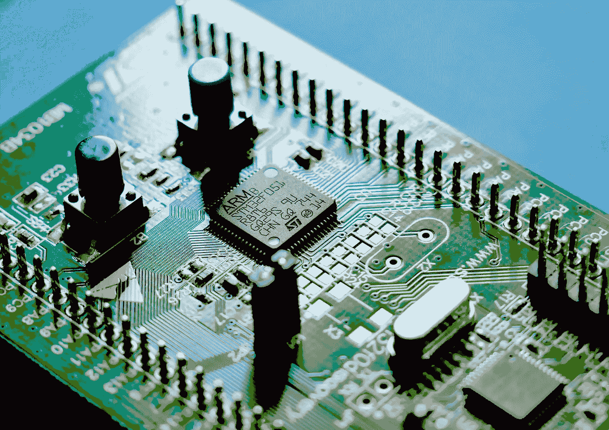

# 简而言之，自由人

> 原文：<https://medium.com/geekculture/freertos-in-a-nutshell-dd44ab147fa5?source=collection_archive---------1----------------------->

## 在 20 分钟内介绍事实上的标准 RTOS 的要点。

Photo by [Vishnu Mohanan](https://unsplash.com/@vishnumaiea?utm_source=unsplash&utm_medium=referral&utm_content=creditCopyText) on [Unsplash](https://unsplash.com/s/photos/embedded?utm_source=unsplash&utm_medium=referral&utm_content=creditCopyText)

## TL；博士；医生

如果你想在嵌入式系统上以确定的方式运行逻辑，通常没有办法绕过像 FreeRTOS 这样的“低端”实时操作系统(RTOS)。像嵌入式 Linux 发行版这样的“高端”RTOS 根本就不精确…