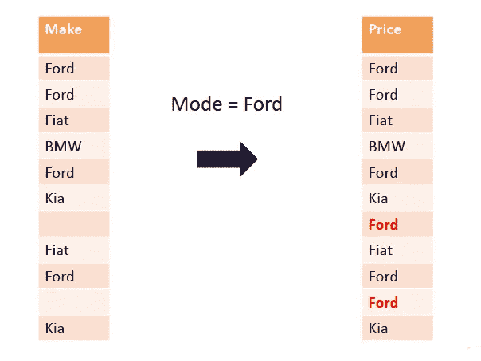
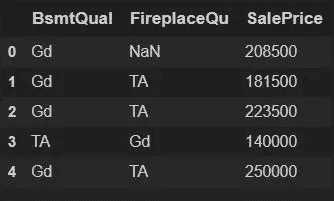
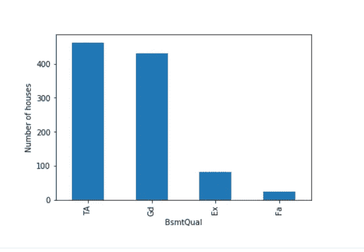
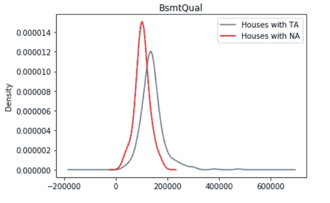
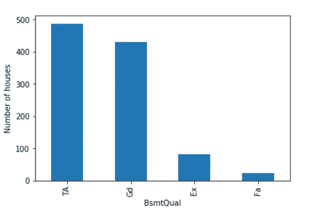
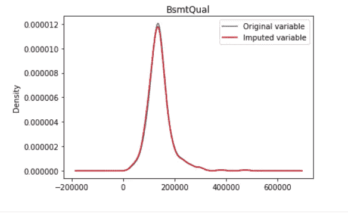
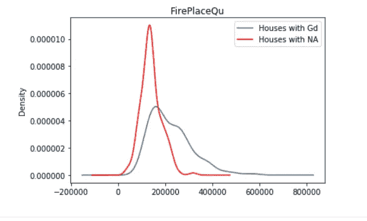
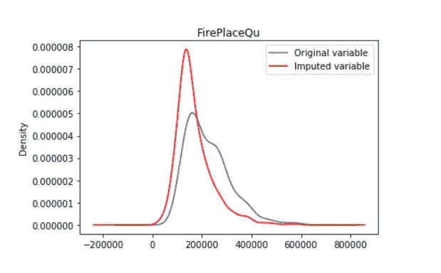

# 频繁类别插补(缺失数据插补技术)

> 原文：<https://medium.com/geekculture/frequent-category-imputation-missing-data-imputation-technique-4d7e2b33daf7?source=collection_archive---------10----------------------->

*插补是用缺失值的统计估计值替换缺失数据的行为。任何插补技术的目标都是产生可用于训练机器学习模型的* ***完整数据集*** *。*


Photo by [Kevin Ku](https://unsplash.com/@ikukevk?utm_source=medium&utm_medium=referral) on [Unsplash](https://unsplash.com?utm_source=medium&utm_medium=referral)

*模式插补包括用模式替换变量中所有出现的缺失值(NA)，换句话说，就是指* ***最频繁出现的值*** *或* ***最频繁出现的类别*** *。*

> **哪些变量可以用最频繁/模式插补进行插补？**

*虽然模式或最频繁值可以针对数字和分类变量进行计算，但实际上，我们只对分类变量使用这种技术。原因是对于数值型变量，均值或中位数往往更能代表总体的平均值。*

> **何时使用模式/最频繁类别插补？**

*数据完全随机缺失。不超过 5%的变量包含缺失数据。*

> **优点**

*容易实现。
这是获取完整数据集的最快方法。
它可以集成到生产中(在模型部署期间)。*

> **限制**

*它扭曲了最频繁标签与数据集中其他变量的关系。
如果有大量 NA，可能会导致最常用标签的过度显示。*

# **用 Mode 输入缺失值的演示。**



*我们将使用房价数据集来演示如何对分类变量进行模式插补。*

***下载数据集请参考:***[房价数据集](https://www.kaggle.com/c/house-prices-advanced-regression-techniques)

***导入所需库:***

```
import pandas as pd  
import numpy as npimport matplotlib.pyplot as plt # To split the datasets
from sklearn.model_selection import train_test_split
```

***定义要使用的列:***

*BsmtQual:评估地下室的高度。(分类变量)*

壁炉质量。(分类变量)

```
# Defining columns to use from the house price dataset
cols_to_use = ['BsmtQual', 'FireplaceQu', 'SalePrice']# Reading the dataset using pandas 
data = pd.read_csv('../houseprice.csv', usecols=cols_to_use)data.head()
```

***输出:***



First 5 records of Dataset

> 我们有缺失的数据吗？

```
# let's inspect the percentage of missing values in each variable
data.isnull().mean()BsmtQual       0.025342
FireplaceQu    0.472603
SalePrice      0.000000
dtype: float64
```

*变量 BsmtQual 仅包含少量 NA (2.5 %)的观察值，因此，用最频繁类别的值替换这些观察值是一个好方法。*

另一方面，变量 FireplaceQu 在几乎一半(47.26 %)的观测值中包含缺失数据。因此，用最频繁的类别替换那些最有可能会扭曲最频繁的类别与销售价格之间的关系。

> 一**计算重要:**

*插补应该在训练集上完成，然后传播到测试集。这意味着必须从训练集中选择最频繁的类别，并用于替换训练集和测试集中的 NA。*

> **拆分成训练和测试数据集:**

```
# let's separate into training and testing setX_train, X_test, y_train, y_test = train_test_split(
    data,
    data['SalePrice'], # target
    test_size=0.3, # percentage of observations in the test set
    random_state=0)
```

# *BsmtQual(地下室质量):*

> **让我们提醒自己缺失值的百分比。**

```
X_train['BsmtQual'].isnull().mean()0.023483365949119372 
```

> L **ets 检查 BsmtQual 中每个类别的观察值数量。**

```
# value_counts() counts the amount of houses that show each of the labels in the variable indicated belowX_train['BsmtQual'].value_counts().sort_values(ascending=False).plot.bar()
plt.xlabel('BsmtQual')
plt.ylabel('Number of houses')
```



> **我们来找一下 BsmtQual 出现频率最高的类别。**

```
X_train['BsmtQual'].mode() 0    TA
dtype: object
```

***观察:****BsmtQual 中出现频率最高的类别是 TA(* 平均/典型*)。*

> **绘制目标变量相对于 BsmtQual 的分布。**

```
fig = plt.figure()
ax = fig.add_subplot(111)
# select and plot houses with the most frequent label
X_train[X_train[‘BsmtQual’]==’TA’][‘SalePrice’].plot(kind=’kde’, ax=ax)# select and plot houses with missing data in the variable
X_train[X_train[‘BsmtQual’].isnull()][‘SalePrice’].plot(kind=’kde’, ax=ax, color=’red’)# add the legend
lines, labels = ax.get_legend_handles_labels()
labels = [‘Houses with TA’, ‘Houses with NA’]
ax.legend(lines, labels, loc=’best’)# add figure title
plt.title(‘BsmtQual’)
```



上图表明，缺少数据的房屋总体成本低于标有 ta 的房屋。因此，如果有大量 NA，用 TA 替换缺失值可能会影响总体分布。

> 让我们保留最频繁类别的 SalePrice 的原始分布供以后使用。

```
# the use of tmp is common to name temporal variablestmp = X_train[X_train['BsmtQual']=='TA']['SalePrice']
```

> **让我们用频繁类别在训练和测试中填写 NA。**

```
# inplace=True is used to replicate that in original dataframe
X_train['BsmtQual'].fillna('TA', inplace=True)
X_test['BsmtQual'].fillna('TA', inplace=True)
```

> **评估对类别分布的影响。**

```
X_train['BsmtQual'].value_counts().sort_values(ascending=False).plot.bar()
plt.xlabel('BsmtQual')
plt.ylabel('Number of houses')
```



从上面的图中，我们看到现在多了一些标签为 TA 的房屋，这些房屋是以前包含 NA 的房屋，但对分布的总体影响并不显著。该图看起来与插补前的图几乎相同。

> **最常见类别的销售价格分布是否发生了变化？**

```
fig = plt.figure()
ax = fig.add_subplot(111)# original distribution of salePrice for houses with most frequent label
# remember I captured this a few cells up in the notebook
tmp.plot(kind='kde', ax=ax)# distribution of the variable after imputation
X_train[X_train['BsmtQual'] == 'TA']['SalePrice'].plot(
    kind='kde', ax=ax, color='red')# add the legend
lines, labels = ax.get_legend_handles_labels()
labels = ['Original variable', 'Imputed variable']
ax.legend(lines, labels, loc='best')# add title
plt.title('BsmtQual')
```



原始变量和估算变量之间的房价分布非常相似，因为缺失数据的数量很少。因此，频繁类别填充是 BsmtQual 特征的良好选择。

# 火场质量:

> 让我们提醒自己缺失值的百分比。

```
X_train['FireplaceQu'].isnull().mean()0.46771037181996084
```

> **让我们找出 FirePlaceQu 出现频率最高的类别。**

```
X_train['FireplaceQu'].mode() 0    Gd
dtype: object
```

***观察:*** *在 FirePlaceQu 中出现频率最高的类别是 Gd(好)。*

> 让我们为显示最频繁类别的房屋和显示缺失数据的房屋绘制目标分布图。

```
fig = plt.figure()
ax = fig.add_subplot(111)# houses with the most frequent label for FirePlaceQu
X_train[X_train['FireplaceQu']=='Gd']['SalePrice'].plot(kind='kde', ax=ax)# houses with missing data in FirePlaceQu
X_train[X_train['FireplaceQu'].isnull()]['SalePrice'].plot(kind='kde', ax=ax, color='red')# add the legend
lines, labels = ax.get_legend_handles_labels()
labels = ['Houses with Gd', 'Houses with NA']
ax.legend(lines, labels, loc='best')plt.title('FirePlaceQu')
```



***观察:***

分布情况非常不同，有缺失数据的房屋总成本低于标有 Gd 的房屋。

> **让我们保留 SalePrice 的原始分布，因为它是最常见的类别，以备后用。**

```
tmp = X_train[X_train['FireplaceQu']=='Gd']['SalePrice']
```

> **让我们在培训和测试中填写 NA。**

```
X_train['FireplaceQu'].fillna('Gd', inplace=True)
X_test['FireplaceQu'].fillna('Gd', inplace=True)
```

> **让我们绘制原始变量
> 和估算变量的目标分布图。**

```
fig = plt.figure()
ax = fig.add_subplot(111)# original distribution of the variable
tmp.plot(kind='kde', ax=ax)# distribution of the variable after imputation
X_train[X_train['FireplaceQu'] == 'Gd']['SalePrice'].plot(
    kind='kde', ax=ax, color='red')# add the legend
lines, labels = ax.get_legend_handles_labels()
labels = ['Original variable', 'Imputed variable']
ax.legend(lines, labels, loc='best')plt.title('FirePlaceQu')
```



***观察:***

*在将北美重新归类为最常见的标签后，添加北美房价后，最常见类别的平均房价大幅下降。*

*在这种情况下，当缺失值的百分比如此之高(~50%)时，我们最好创建一个新的类别(缺失)来包含带有 NA 的观察值。*

> **你可以在这里找到完整的源代码:**
> 
> [https://github . com/ku-nal/Feature-Engineering/tree/main/frequency-Category-attallation](https://github.com/ku-nal/Feature-Engineering/tree/main/Frequent-Category-Imputation)

我希望这是一篇有用的文章。如果你有意见，请随意写在下面。可以关注我上 [***中***](https://kunal-12.medium.com/)*[***LinkedIn***](https://www.linkedin.com/in/kunal-makwana-aa44751a0/)***。****