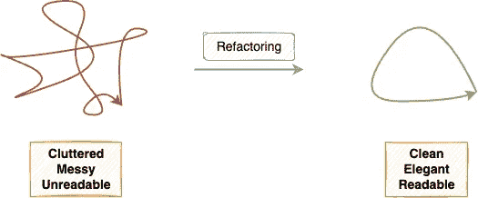
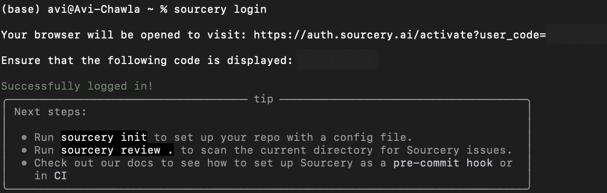
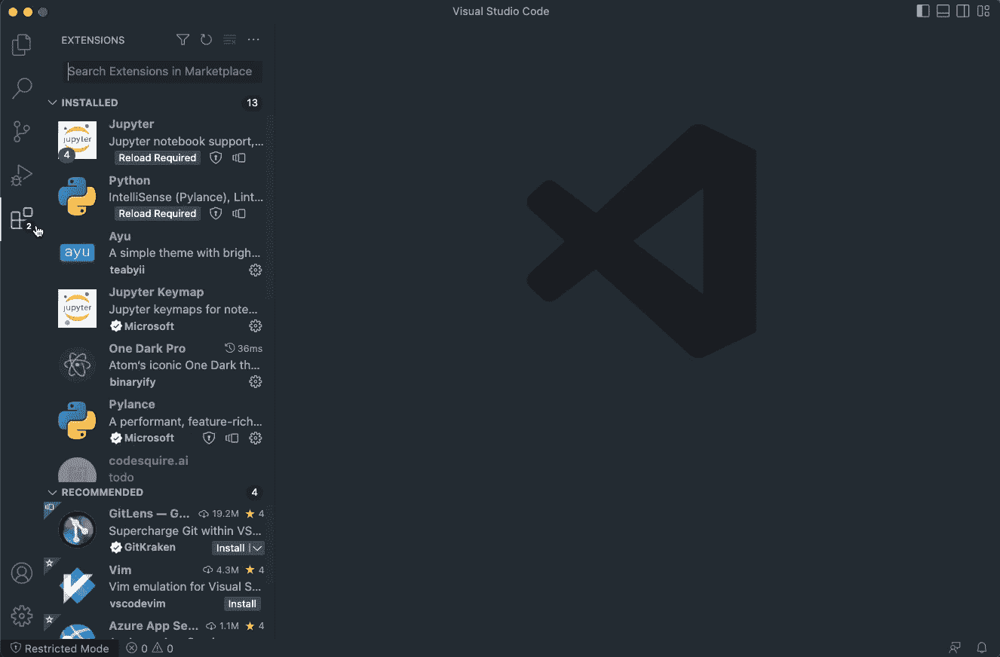
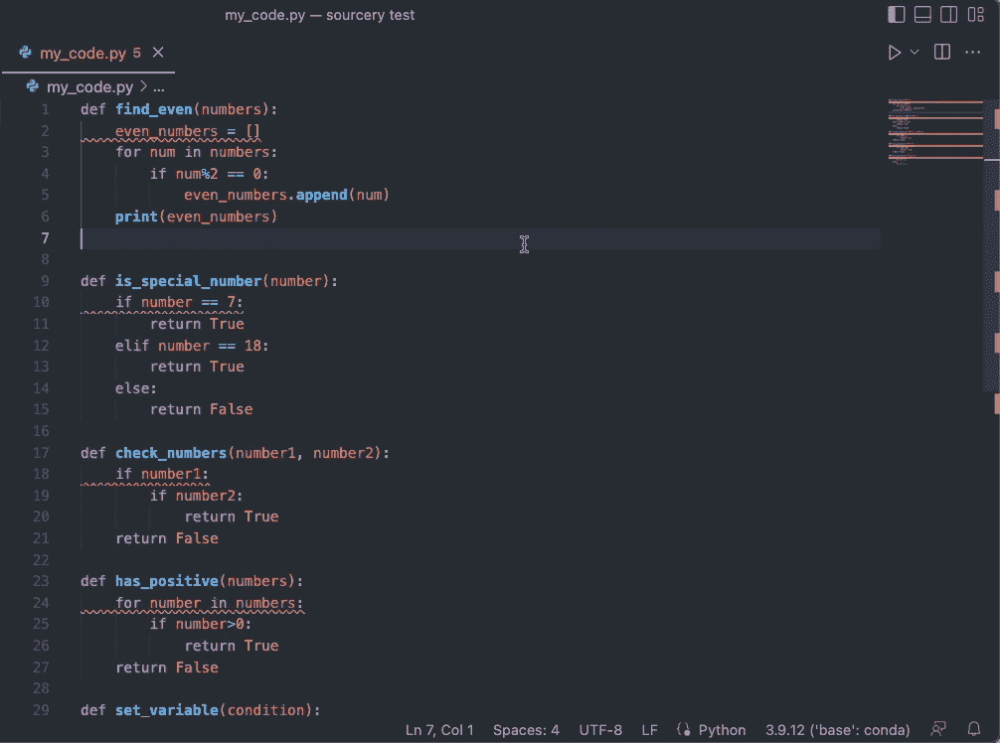
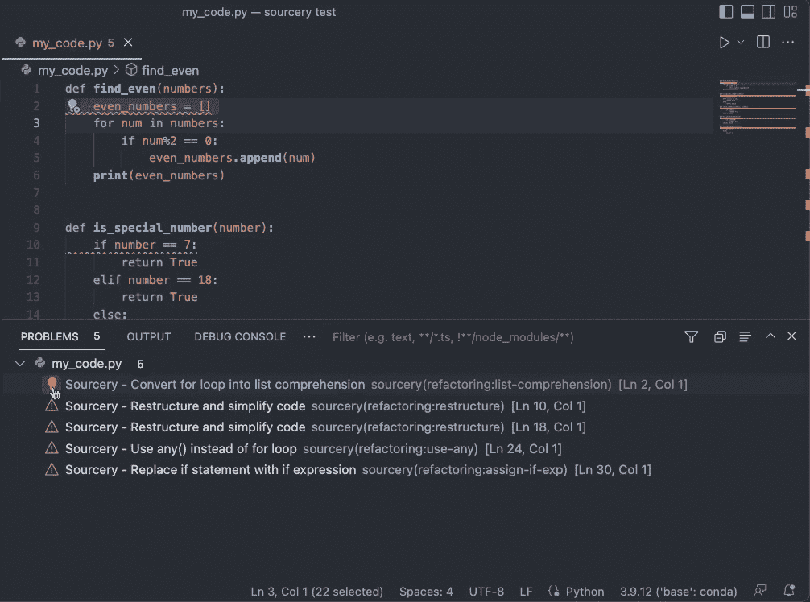
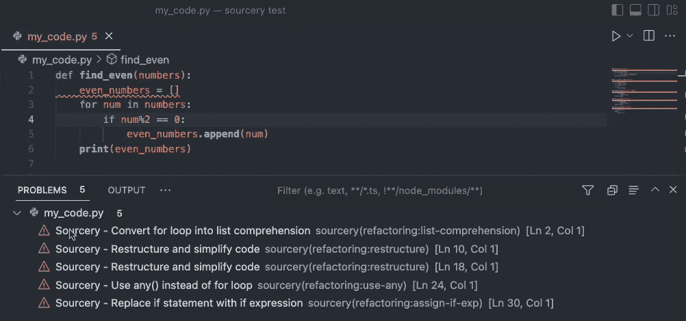

# 从混乱到清晰:用一个命令重构 Python 代码

> 原文：<https://medium.com/geekculture/from-clutter-to-clarity-refactor-your-python-code-with-a-single-command-1f43593e480a?source=collection_archive---------3----------------------->

## 代码重构变得简单


Photo by [No Revisions](https://unsplash.com/@norevisions?utm_source=medium&utm_medium=referral) on [Unsplash](https://unsplash.com?utm_source=medium&utm_medium=referral)

# 动机

编写干净优雅的代码库是一项被低估的编程技能。许多程序员，尤其是新手，只是专注于把他们的基础做好。

然而，只有少数人关注可读性和可维护性，因为他们认为只有他们会使用这些代码。

只有当他们最终过渡到协作项目时，在几个月(如果不是几年的话)的混乱和不优雅的编程习惯之后，一个人必须适应“正确的”编程方法。

代码重构是软件开发过程中必不可少的一部分，但它经常被忽视或忽略。



A diagrammatic illustration of Refactoring (Image by Author)

事实上，Python 的禅宗说:

> 如果实现很难解释，这是一个坏主意。如果实现很容易解释，这可能是一个好主意。

虽然可以理解代码重构并不是一个人们期待的活动，但是，由于各种原因，它是重要的。例如，随着时间的推移，你可以保持你的代码库整洁有序，从长远来看可以节省你的时间和精力。

为了让事情变得更简单，拥有一个工具来突出潜在的重构区域，让我们手动检查，不是很好吗？

因此，在这篇博客中，我将演示如何使用 Sourcery 重构代码——一种自动代码重构工具，它使您的代码更加清晰、简洁和 Pythonic 化。

我们开始吧🚀！

# 安装和设置

您可以在 VS Code 和 PyCharm、命令行界面(CLI)、Sublime Text、Vim、GitHub 等中利用 Sourcery 作为 IDE 插件。

在这篇博客中，我们将特别关注在 IDE 和 CLI 中使用 Sourcery。

## 命令行

您可以通过运行以下命令来安装 Sourcery 的命令行界面:

```
pip install sourcery-cli
```

安装后，您需要使用以下命令登录:

```
sourcery login
```

登录后，您将在终端中看到类似的响应:



Response after login (Image by Author)

## Visual Studio 代码 IDE

您可以通过安装 Sourcery 的扩展来利用 VS 代码中的 Sourcery。这些是步骤:



Installing Sourcery in VS Code (Gif by Author)

# CLI 中的代码重构

接下来，让我们看几个演示，看看如何在 CLI 中使用 Sourcery 重构代码。

在这里，我们将在脚本中编写一些代码片段，使用 Sourcery 重构它，并查看建议。

## 代码重构演示#1

假设我们有一个文件`my_code.py`:

```
## my_code.py

def find_even(numbers):
    even_numbers = []
    for num in numbers:
        if num%2 == 0:
            even_numbers.append(num)
    print(even_numbers)
```

若要重构，请运行以下命令:

```
 sourcery review --in-place my_code.py
```

这样，Sourcery 的 AI 重构将我们的代码转变为:

```
## my_code.py

def find_even(numbers):
    even_numbers = [num for num in numbers if num%2 == 0]
    print(even_numbers)
```

建议的更改准确、简洁、优雅。

## 代码重构演示#2

现在考虑我们的文件`my_code.py`有如下代码:

```
# my_code.py

def is_special_number(number):
    if number == 7:
        return True
    elif number == 18:
        return True
    else:
        return False
```

若要重构，请运行以下命令:

```
sourcery review --in-place my_code.py
```

这一次，我们在文件中看到了以下变化:

```
# my_code.py

def is_special_number(number):
    return number in [7, 18]
```

这又一次是正确和干净的。

## 代码重构演示#3

让我们考虑一个嵌套 if 语句的例子:

```
## my_code.py

def check_numbers(number1, number2):
    if number1:
        if number2:
            return True
    return False
```

接下来，我们运行以下命令:

```
sourcery review --in-place my_code.py
```

Sourcery 建议对文件进行以下更改:

```
## my_code.py

def check_numbers(number1, number2):
    return bool(number1 and number2)
```

这确实是正确的，比以前更优雅。

## 代码重构演示#4

接下来，我们有一个 for 循环，它判断输入的数字列表中是否有正整数。

```
## my_code.py

def has_positive(numbers):
    for number in numbers:
        if number>0:
            return True
    return False
```

最理想的方法是在 Python 中使用`any()`。让我们看看 Sourcery 是否能检测到这一点。

我们运行以下命令:

```
sourcery review --in-place my_code.py
```

Sourcery 建议对文件进行以下更改:

```
def has_positive(numbers):
    return any(number>0 for number in numbers) 
```

超级印象深刻！

## 代码重构演示#5

接下来，我们有一个 if 条件，它根据条件给变量`my_var`赋值

```
## my_code.py

def set_variable(condition):
    if condition:
        my_var = 1
    else:
        my_var = 2
    return my_var
```

实现这一点的理想方式是在 Python 中使用 if 表达式。让我们看看 Sourcery 是否建议这样做。

为了重构，我们运行以下命令:

```
sourcery review --in-place my_code.py
```

Sourcery 建议对文件进行以下更改:

```
def set_variable(condition):
    return 1 if condition else 2
```

# IDE 中的代码重构

接下来，让我们看看我们可以在 VS 代码中重构代码。

对于这个演示，我将上面的五个代码重构演示转移到一个用 VS Code 打开的脚本中。

一旦我们切换面板，我们就会看到 Sourcery 的重构建议。如下所示:



Reviewing refactoring suggestions in VS Code (Gif by Author)

当我们将鼠标悬停在面板中的建议上并单击警告⚠️标志时，我们会看到三个选项，如下所示:



Options given by Sourcery Extension in Refactoring (Gif by Author)

第一个选项重构代码。第二跳过建议。最后一个选项将不会显示任何文件的重构建议。

选择第一个选项后，Sourcery 将重构代码。如下所示:



Refactoring in VS Code (Gif by Author)

# 结论

祝贺你朝着编写更干净的代码迈出了一步，这将对你的编程生涯大有帮助。

代码重构是端到端软件开发过程的重要组成部分，可以显著提高代码库的质量和可维护性，像 Sourcery 这样的工具可以提供极大的帮助。

此外，有时，人们可能希望根据自己的指导方针重构代码。幸运的是，有了 Sourcery，您可以为个性化重构提供定制规则。

你可以在这里阅读更多关于 Sourcery [的信息。](https://docs.sourcery.ai/Welcome/)

如果你想学习更多关于数据科学和 Python 的优雅工具、技巧和诀窍，我每天都会在 LinkedIn 上发布一个信息丰富的技巧。

你可以在 [**我的 LinkedIn 帖子存档**](https://www.linkedin.com/in/avi-chawla/recent-activity/shares/) 中找到我发布的所有提示。你可以在 [LinkedIn](https://www.linkedin.com/in/avi-chawla/) 上关注我，看看以后所有的帖子。

或者，您也可以通过电子邮件订阅以下内容:

[🚀**订阅数据科学每日一剂。在这里，我分享关于数据科学的优雅技巧和诀窍，一天一个技巧。每天在你的收件箱里收到这些提示。**](https://avichawla.substack.com/)

[🧑‍💻**成为数据科学专业人士！获取包含 450 多个熊猫、NumPy 和 SQL 问题的免费数据科学掌握工具包。**](https://subscribepage.io/450q)

感谢阅读！