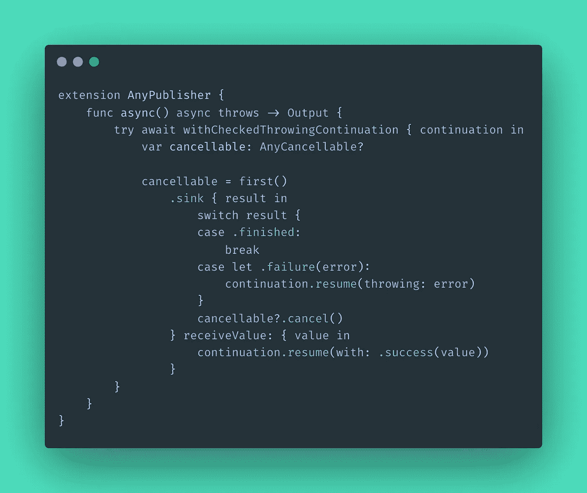

# 从组合到异步/等待

> 原文：<https://medium.com/geekculture/from-combine-to-async-await-c08bf1d15b77?source=collection_archive---------0----------------------->

## 在不破坏当前代码的情况下迁移 API

在 Async/Await 被正式引入 Swift 之前，我们中的许多人都采用 Combine 进行不一定需要值流的一次性操作，比如 API 调用。然而，这个新特性使得这样的操作更容易构造和阅读，因此考虑迁移它们是有意义的。我们将看到一个简单的扩展，它让我们可以同时使用 Combine 和 Async/Await，这使得逐步迁移我们的代码成为可能。

在继续之前，需要强调的是，Async/Await 并不是要取代 Combine。因此，操作流的代码应该使用后者。本文将关注不一定需要这种能力的代码。

# 基于组合的 API

也就是说，让我们看看在使用 Combine 时一个简单的 API 调用是什么样子的。

如您所见，上面的 API 有一个获取 Todo 对象的方法。此外，它返回一个可以被客户端订阅的 **AnyPublisher** ，如下所示:

# 基于异步/等待的 API

在理想情况下，我们可以简单地将前面的例子迁移到下面的 Async/Await 版本:

花时间检查两个版本之间的差异，特别是在客户端。如你所见，新版本可读性更强，也更容易理解。除此之外，我们不需要保存对可取消对象的引用。

然而，在现实生活中，更有可能的是，将我们的 API 更改为新版本不仅会破坏`client1`，还会破坏`client2`、`client3`等等，这使得一次性处理所有更改变得很困难。

# 解决办法

解决这个问题实际上非常简单:我们只需要提供一种方法来扩展我们的组合 API，这样我们就可以在单个客户端中实现 Async/Await，同时仍然支持遗留代码的旧 API，然后随着时间的推移迁移它们。我们可以通过实现以下扩展来实现这一点:

> 上述解决方案有一个问题，将在更新中进一步讨论。请检查**更新**部分！

现在，我们只需将`async()`添加到任何 **AnyPublisher** 中，以便将其转换为 async:

分解解决方案，有三个要点值得一提:

## 1.该函数返回 AnyPublisher 的输出。

返回输出意味着该函数将为我们提供发布者使用的相同数据类型。此外，它还会引发与发布者相同的错误。

## 2.使用**和 CheckedThrowingContinuation 函数**

这是苹果提供的一个[函数，帮助将基于完成的函数连接到 Async/Await。](https://developer.apple.com/documentation/swift/3814989-withcheckedthrowingcontinuation)

## 3.它在接收之前首先调用()

这样，我们保证在收到第一个值后终止流，这意味着调用了 *receiveCompletion* 块，并允许释放`Cancellable`对象。多次调用 continuation 将导致致命错误。

## 2004 年 7 月更新

感谢 [Davide de Rosa](/@keeshux) 指出之前解决方案中的一个问题。
有可能发布者完成时没有发出值，因此处理这种情况也很重要。一种解决方案是设置一个标志，检查它是否真的没有发出任何值就结束了。以下实现仅在对`finishedWithoutValue`标志的检查上有所不同:

# 结论

从 Combine 迁移到 Async/Await 在某些情况下可能很棘手，很难一次完成。通过将 AnyPublisher 转换为 async，我们可以保证向后兼容性，同时仍然能够使用新功能。

感谢您通读！

你喜欢我的内容吗？帮助我继续捐款！

 [## 捐赠给爱德华多·多米尼二世

### 通过捐赠或与朋友分享来帮助支持小爱德华多·多米尼。

www.paypal.com](https://www.paypal.com/donate/?hosted_button_id=B3W6GJWSPB4VU)