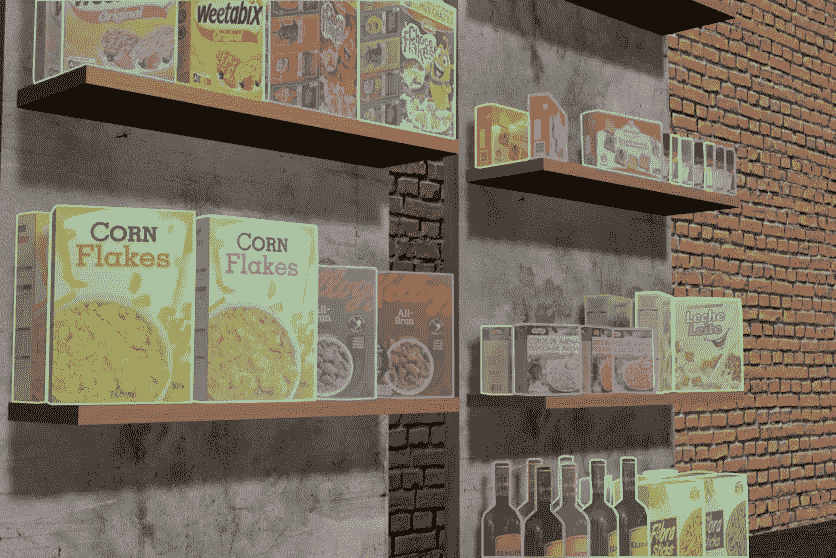
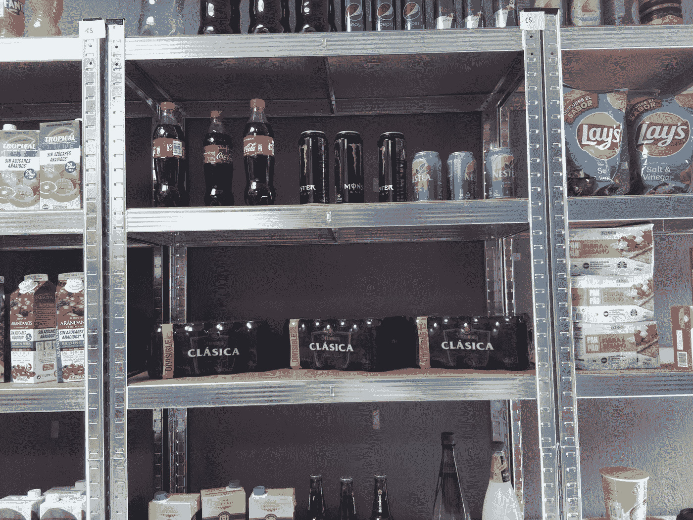
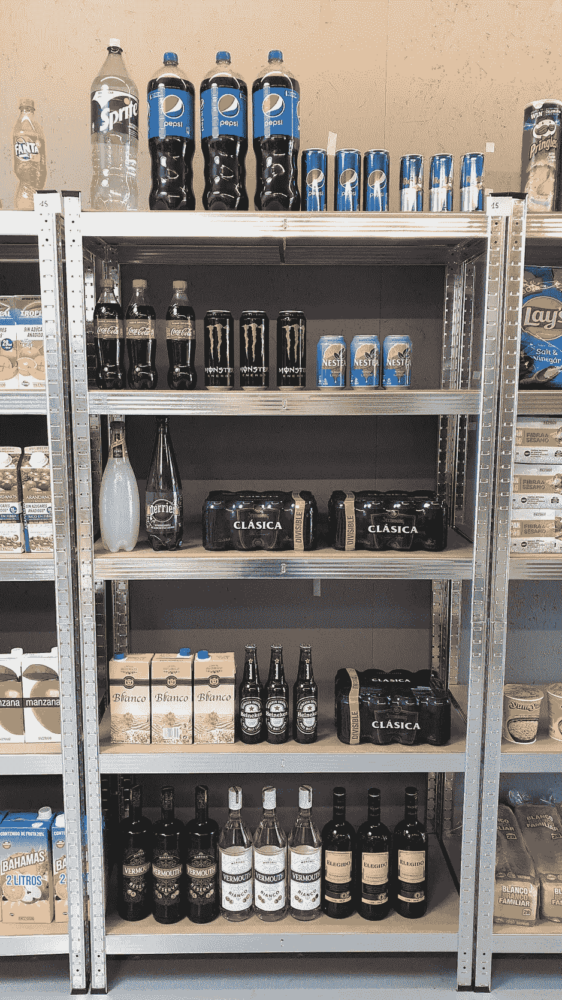
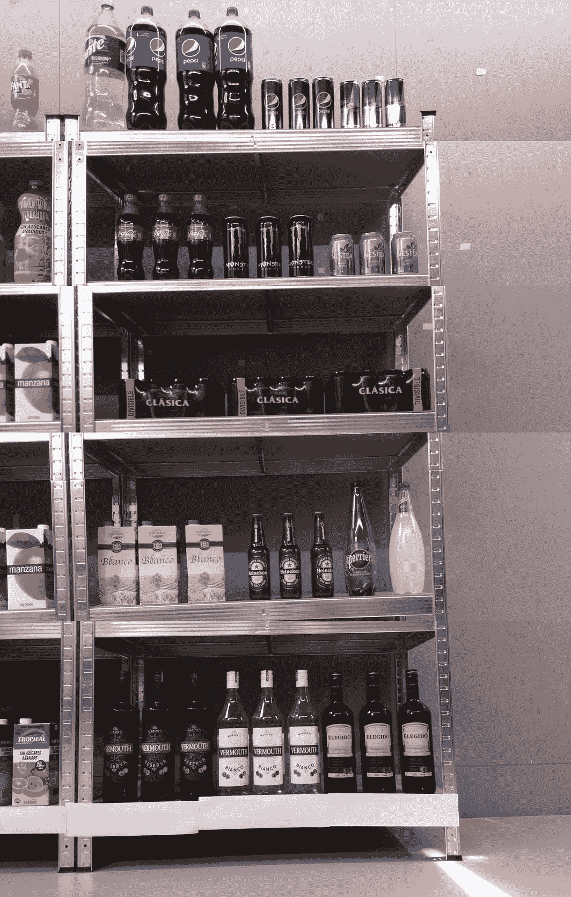
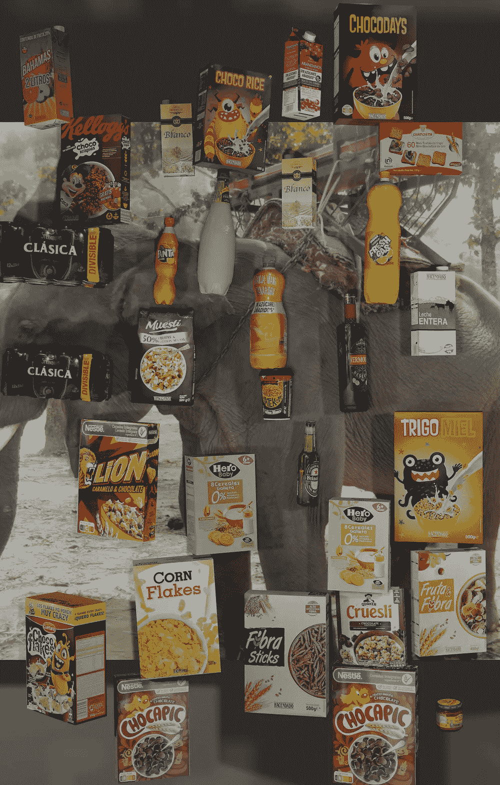
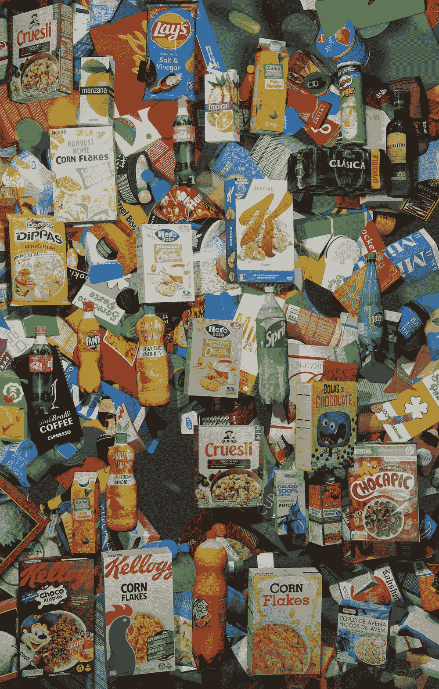
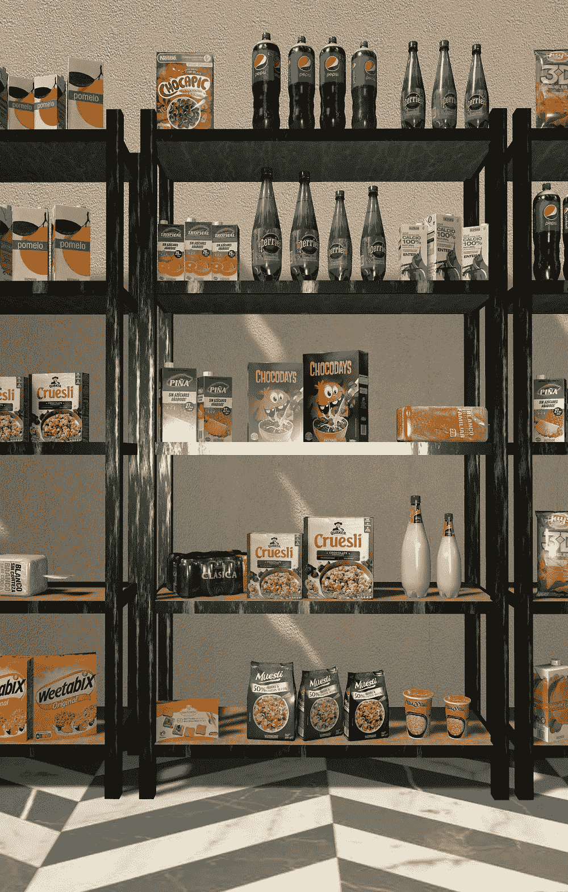

# 从领域随机化到结构感知合成数据生成

> 原文：<https://medium.com/geekculture/from-domain-randomisation-to-structurally-aware-synthetic-data-generation-c6078bf42def?source=collection_archive---------16----------------------->

## 用虚拟合成数据提高模型的通用性:零售业产品识别的案例研究

上个月在[特斯拉人工智能日](https://www.youtube.com/watch?v=j0z4FweCy4M&ab_channel=Tesla)，世界再次被埃隆·马斯克的雄心勃勃的目标震惊了，他要创造一个[人形特斯拉机器人](https://www.fastcompany.com/90673676/elon-musk-tesla-bot)，旨在帮助我们人类完成无聊和重复的任务。你们中的一些人可能已经看到，就在半小时前，特斯拉的视觉团队介绍了他们的[自动标签](https://youtu.be/j0z4FweCy4M?t=5291) & [模拟](https://youtu.be/j0z4FweCy4M?t=5715)管道，这是他们自动驾驶工作的核心，由数千名内部手动贴标机和 3D 艺术家提供支持。有了惊人的程序和自动化工具，他们仍然需要很多人参与。作为世界上最成功的公司之一，市值接近 7000 亿英镑的特斯拉是能够负担得起为视频片段添加标签和注释的人力的幸运儿之一。一旦他们获得了足够的数据，他们就可以自动标记和构建超现实世界的模拟。

然而残酷的现实是，大多数希望在业务流程中应用计算机视觉的公司往往受到数据访问的限制。此外，**注释和标记用于对象识别的数据集**是成本最高、劳动强度最大、容易出错的任务之一。麻省理工学院的一项研究最近显示，ImageNet 上标签的错误率令人震惊地达到了 6 %, ImageNet 是分类任务中最广泛用于基准测试最先进模型的数据集。

# 零售业中以数据为中心的人工智能和合成数据

在 Neurolabs，我们认为解决这些问题和开启计算机视觉下一个里程碑的关键是使用 Blender、Unity 或 Unreal 等 3D 图形引擎，用合成生成的数据训练模型。

在最近推出的以数据为中心的人工智能范例中，目标不是创造更好的 T2 模型，而是通过改变 T4 数据来提高性能。即使有大量的数据，为计算机视觉任务开发这样的控制也不能仅仅通过获取真实数据来完成。我们必须考虑控制影响计算机视觉模型的所有参数，如相机、灯光、物体姿态、分辨率、遮挡或边缘情况。

在本帖中，我们将重点关注合成数据给零售业的产品识别带来的影响。我们在这里选择的具体用例是实时货架监控，以提高超市中的货架可用性。具体来说，我们将了解:

*   比较在真实数据集上评估的各种形式的合成数据的性能，从域随机化(DR)到杂乱域随机化，最后是 ***结构感知合成场景*** 。
*   在小数据域，即少于 100 幅图像和同一域 的微小 ***变化，即不同的长宽比、相机姿态、光照条件&货架产品结构中综合合成数据的能力。***
*   为什么 ***不可扩展*** 获取和增加更多真实数据的变化，花费&时间权衡。

# 真实数据集和合成数据技术

在这种特殊情况下，创建合成数据集和训练计算机视觉模型的请求来自一家早期创业公司 [SuperRobotics](https://www.superobotics.com/) ，该公司正在为超市制造一种创新的自主智能机器人。他们想为 70 种西班牙超市产品演示产品检测机。目标是在合成数据上训练产品识别模型。

# 真实数据

SuperRobotics 能够收集近 500 幅真实图像，这些图像经过仔细注释，准备用于物体检测。对象实例的总数接近 10，000。拼接数据集的图像是使用图像拼接技术构建的，这是 SuperRobotics 的专业领域之一。

数据集***“Cropped”***包含 381 张裁剪货架的图像，平均每张图像有 10-15 件产品，分辨率(长宽比)固定为 3280x2464 (1.33)，光线和摄像机位置也各不相同。

数据集 ***“真实拼接 1”***包含 48 幅全货架图像，分辨率(纵横比)为 3280 x 5144 (0.63)

数据集 ***“真实缝合 2”***包含 55 幅全货架的图像，与 ***“真实缝合 1”***相比，这些图像在相机、照明和货架上产品的定位方面略有不同，但分辨率相同。

**Fig. 1\. Cropped Real Dataset**

**Fig. 2\. Real Stitched 1 (left) vs. Real Stitched 2 (right) | Neurolabs**

# 综合数据

从 70 个类别的 3D 数字资产开始，我们使用各种技术生成合成数据，例如普通域随机化(图 3)和杂乱域随机化(图 4)。在这个场景中，想法是通过随机化参数，如产品的姿势、背景、光线、相机以及 HSV，来引入尽可能多的变化。这些技术已经在[研究](https://ai.googleblog.com/2017/10/closing-simulation-to-reality-gap-for.html)和[实践](https://blog.unity.com/technology/boosting-computer-vision-performance-with-synthetic-data)中成功使用，但是，正如我们将看到的，当处理结构化场景和大量类别时，这些技术还存在不足。这些不同的数据集每个都包含近 250 幅图像和原始 70 个类别的 6000 个平衡实例。

第二合成数据集(在**表 1 中标记为*)****包含 200 个结构感知场景的图像(图 5)，其具有与真实数据相同的纵横比。使用货架的基本场景，通过随机化产品的属性和放置，以语义上有意义的方式放置产品，使得真实数据和合成数据之间的差异最小化。*

*第三个数据集是一个混合了 ***【合成】*** 和真实数据的一个小子集(20%)。*

*最后， ***【广义合成】*** 数据集具有 1500 个具有 5 种不同分辨率(纵横比)的图像，并用于测试对所有真实数据集的学习可移植性。*

*   *2048 x 1152 (1.77 英寸)*
*   *2256 x 1504 (1.5 英寸)*
*   *2260 x 2160 (1.04 英寸)*
*   *4096 x 5120 (0.8)*
*   *2520 x 4880 (0.51)*

*所有上述合成数据技术目前都可以作为 Neurolabs 平台的一部分，在该平台上可以轻松配置场景和生成参数。*

****

***Fig. 3\. Vanilla Domain Randomisation***

****

***Fig. 4\. (Left) Cluttered Domain Randomisation | Neurolabs & Fig. 5\. (Right) Structurally Aware Synthetic Scene | Neurolabs***

# *实验*

*对于所有实验，我们使用相同的对象检测模型、D3 EfficientDet 和 COCO 预训练主干作为起点，网络的前两层被冻结。使用 80/20 train/val 组合进行训练，并根据验证损失提前停止。自始至终都使用标准优化器，没有使用超参数调整来提高模型的性能。在 ***表 1*** 中，您可以看到作为 real2real 和 syn2real 学习实验一部分的 mAP 评估结果。*

***Table 1\. Evaluation Performance (%mAP)***

# *用合成数据进行模型概括*

*在 ***表 1*** 中，我们展示了培训和评估的组合以及绩效图。有两个主要发现强烈暗示了综合数据的概括能力。*

# *DR2real 与 Syn2real 与 Mixed2real*

*相对容易构建并且只需要访问 3D 资产(不需要场景构建)的域随机化技术(图 3、图 4)在两个真实数据集上都达到了 71%和 72% mAP 的性能。这些方法可用于启动计算机视觉模型，然后用更多真实数据对其进行微调。*

*结构感知合成数据是使用可组合的基本资产自动构建的，并且生成货架，以及在该货架上执行产品的智能放置，使得与真实数据的领域差距最小化。与灾难恢复相比，在真实域中评估的 mAP 增加了 10–15%。*

*最后，将合成数据集与来自第一真实数据集的 20%真实数据(12 幅图像)混合，将模型的性能提高到 94%。再加上一些为推断寻找最佳 IoU 阈值的后处理步骤，这是将模型部署到生产环境中所必需的。*

# *Syn2real 与 Real2real*

*当使用仅在真实数据上训练的模型进行测试时，即 ***【真实缝合 1】***，环境中非常小的变化使得测试集不同，即 ***【真实缝合 2】***，对整体性能有很大的影响。在图中有一个约 20%的缺口，这表明在真实域的微小变化上概括较差。*

*正如我们所看到的，合成数据并非如此，它在这种低数据场景中带来了许多变化，并且能够在非常相似的真实域之间移动时进行归纳，两个真实数据集上的映射比例分别为 85%和 91%。控制参数，如相机，灯光，和产品的姿态是必不可少的概括，更重要的是，可以很容易地实现与合成数据。如果我们将 12 张真实照片与合成数据混合，我们可以在两个真实数据集上获得生产就绪的结果，即 95%的地图。*

*在一般化的方向上更进一步，我们观察到，当在更多样化的、具有不同纵横比的真实数据集上测试真实数据模型时，性能急剧下降，如表 1 中的两行所示。从大约 90%到 4%的 mAP 下降是真实数据结果中的巨大变化。*

*我们通过生成具有 5 种不同纵横比的 1500 幅图像的 ***【广义合成】*** 数据集来规避这个问题。正如可以预料的那样，当提高泛化能力时，性能略有下降，但能够准确地检测大范围变化的产品，*在所有三个真实数据集上具有相似的性能*，分别为 73%、74%和 52%。*

# *成本和时间的权衡*

*收集真实数据并对其进行注释的整个过程分为 3 个步骤，用了近 **1 个月**完成。首先采集“裁剪”数据集，然后采集“真实拼接 1”和“真实拼接 2”。10，000 个包围盒的包围盒和类注释的总成本是 700 美元。*

*我们的一名计算机视觉工程师使用我们的数据生成平台，总共花了 3 个工作日来完成生成所有合成数据集和训练 CV 模型的整个过程。这是 95%的成本效益。设置合成数据配置和场景花费了 1 天时间，而实际渲染过程和所有数据集的自动标记总共花费了 3 个小时才完成。额外的一天半时间用于培训和评估模型。*

*虽然这些数字充分说明了真实数据与合成数据之间的时间和成本权衡，但最有吸引力的论点可能是通过快速迭代来控制和改变数据的能力，以便轻松适应手头的特定用例。*

# *结论*

*我们展示了一个零售案例研究，其中虚拟合成数据为货架产品识别提供了一个可扩展的解决方案，解决了数据可用性和注释问题。创造变异和控制代参数增加了模型在小范围内的通用性。*

*人工智能资深人士安德鲁·吴(Andrew NG)建议，需要转变心态，以更有意义的方式推进人工智能领域，并提出以数据为中心的人工智能心态是潜在的解决方案:“最近发表的一份*样本显示，99%的论文是以模型为中心的，只有 1%是以数据为中心的”。*考虑到这一点，**还有什么比控制数据的创建方式更以数据为中心的方法呢？***

*如果你对这篇文章中使用的任何合成数据感兴趣，请随意点击这里的。请确保您[注册提前访问](https://www.neurolabs.ai/free-trial)我们将于下个月发布的综合数据平台。*

**作者*[*Patric FULOP*](https://www.linkedin.com/in/patric-fulop/)*，CTO at*[*neuro labs*](https://medium.com/u/1888f854e2da?source=post_page-----c6078bf42def--------------------------------)*

**由于糟糕的库存管理成本，全球零售商每年损失高达 6340 亿美元，仅缺货一项就造成 5%的销售损失。🤯**

*[*neuro labs*](https://www.linkedin.com/company/neurolabs/)*使用计算机视觉和合成数据的强大组合，帮助结束缺货，改善客户体验，增加收入。🤖🛒**