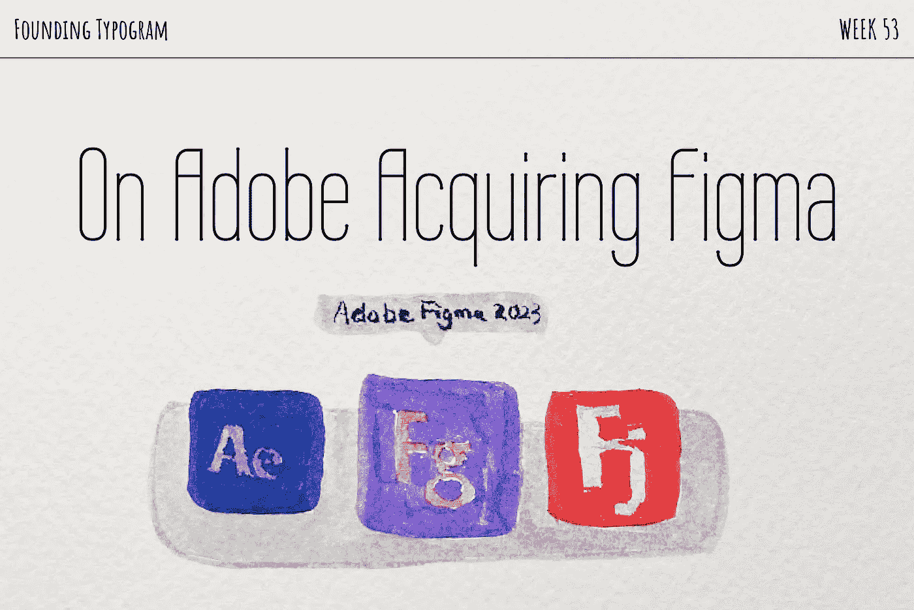
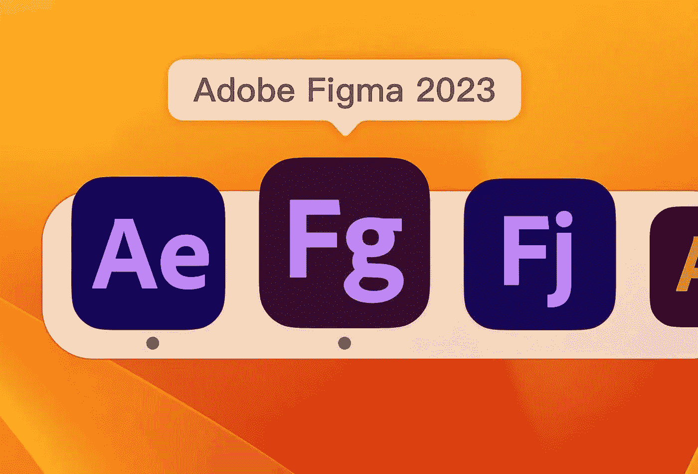
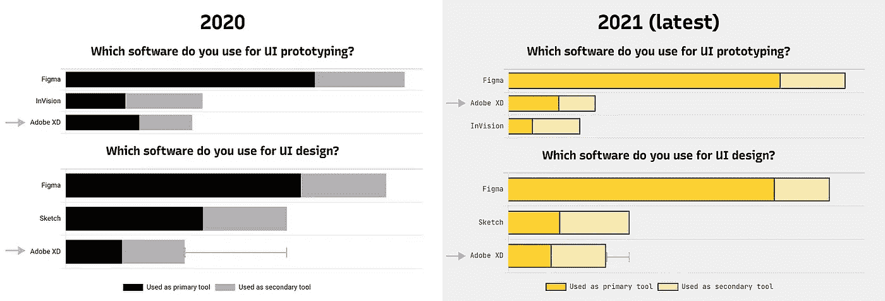
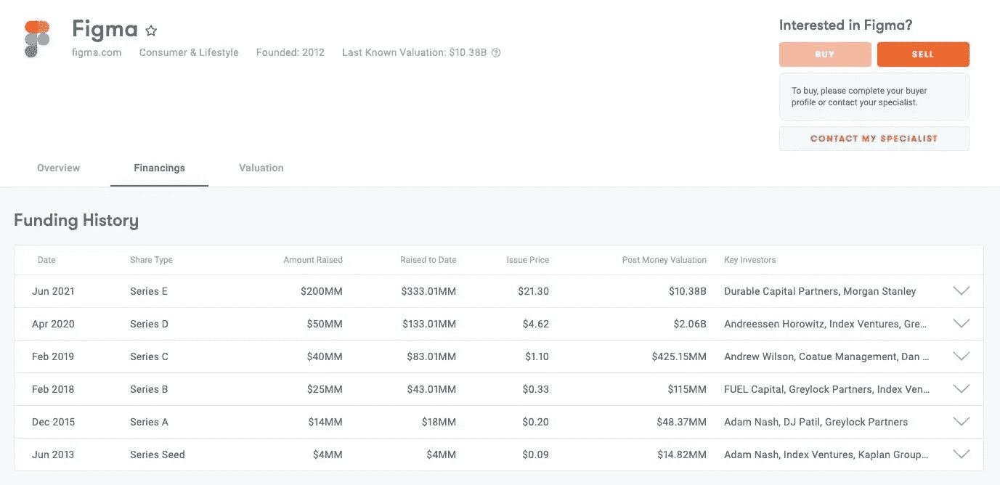

# 来自前 Adobe 员工:关于 Adobe 收购 Figma

> 原文：<https://medium.com/geekculture/from-ex-adobe-employee-on-adobe-acquiring-figma-ea76a47493ef?source=collection_archive---------0----------------------->

根据一个人的股票投资组合，上周是多事之秋，也是痛苦的一周。我在 Adobe 工作的这些年里，我通过劳动(RSU)和金钱(ESPP)购买了 ADBE 的股票。我净资产的很大一部分是 ADBE 的股票，这只股票在一天之内下跌了 20%——就在他们宣布 Adobe 将以 200 亿美元收购 Figma 的那一天。

这一时事通讯系列始于 2021 年 8 月 2 日，在我离开 Adobe 公司几天后。在创立 [Typogram](https://typogram.co/) 之前，我花了一年半的时间在 [Adobe XD](https://www.adobe.com/products/xd.html) 上，花了五年时间在另一个 Adobe 收购 Typekit(现在叫做 [Adobe 字体](https://fonts.adobe.com/))上。我在多个层面感受到了打击。一个是我曾经致力于 Adobe XD，日日夜夜试图赢得与 Figma 的战斗，但现在收购宣布 Adobe XD 的过早失败。我之前提到的一个——我钱包里的打击。

# 200 亿美元是定价的四倍

让我们从钱包爆炸开始。不是每一个 ADBE 股票的投资者都像我一样，因为他们在内部竞争对手的产品上工作而怀恨在心。为什么其他投资者讨厌收购，如股价暴跌所示？简单的答案是 200 亿美元的价格太贵了。

创业评估很复杂，但是我们可以通过一些捷径来做一个粗略的评估。我们可以尝试用两种不同的方法来估计:

*   Figma 上一次融资是在 2021 年 6 月，估值为 100 亿美元。乍一看，这可能是有道理的:Figma 表现非常好，在 2021 年至 2022 年的一年时间里，其估值翻了一番。除了 2021 年处于创业公司估值高峰期，大部分创业公司在 2022 年的估值都下调了很多，包括那些做得好的。以设计领域的另一个竞争者 Canva 为例，其估值从 2021 年的 400 亿美元下降到 2022 年的 260 亿美元，尽管他们做得很好。将相同的比率应用于 Figma，Figma 2022 的估值估计为**65 亿美元**。
*   另一种窥探初创公司估值的方法是通过收入和增长乘数。高增长的创业公司可能有 10 倍的高乘数。Figma 的目标是达到 4 亿美元的收入，假设它已经达到了目标收入，乘以 10 倍的高乘数——其估值为 40 亿美元。
*   我认为 Figma 的实际价值在 50 亿美元左右。200 亿美元会高出四倍；因此，投资者在收购消息公布后立即抛售股票。没有人喜欢糟糕的交易。要达成这样的交易，必须是 Adobe 央求收购 Figma 这不是一场公平的谈判。Adobe 为什么这么需要 Figma？

# 奇怪的组织结构图

阅读 Figma 的首席执行官[的博客文章](https://www.figma.com/blog/a-new-collaboration-with-adobe/)宣布，收购后，他将向大卫·瓦德瓦尼报告，而不是斯科特·贝尔斯基，这让我感到奇怪。斯科特·贝尔斯基(Scott Belsky)是创意云的负责人。你可能会在每个 Adobe Max keynote 上看到他谈论 Creative Cloud 产品。收购宣布后，“设计推特”开玩笑地用创意云的形式嘲笑了 Figma 的应用程序图标——对所有人来说，Figma 将成为创意云的一部分是显而易见的；那为什么 Figma 的 CEO 不向 Creative Cloud 的负责人汇报呢？

Internet meme about Figma being acquired by Adobe

我现在以局外人的身份推测，答案是大卫·瓦德瓦尼是领导和推动收购的人，而不是斯科特·贝尔斯基；因此，新的 Figma org 向他报告。

Adobe 对 Adobe XD 进行了大量投资，[于 2015 年 10 月，即 7 年前](https://blog.adobe.com/en/publish/2015/10/05/introducing-project-comet-a-new-tool-for-designing-and-prototyping-user-experiences)，首次向公众宣布了 Comet 项目。虽然它肯定没有 Figma 受欢迎，但它绝对是一个成功的产品，加强了创意云生态系统。根据 [2021 年设计工具调查](https://uxtools.co/survey-2021/)(最新的 2022 年调查尚未出来)，Adobe XD 是第三大最受欢迎的 UI 设计工具和第二大最受欢迎的 UI 原型工具。与 [2020 年设计工具调查](https://uxtools.co/survey-2020/#ui-design)相比，Adobe XD 正在上升——它在 UI 原型类别中从第 3 名跃升至第 2 名，并缩短了它与 UI 设计类别第 2 名之间的差距:

Design Tools Survey 2020 vs. 2021, source: [uxtools.co](https://uxtools.co/survey-2021/)

作为用户，我们可能会把产品看成 1 或 0——如果我不使用，它几乎不存在。但是市场是广阔而多样的；你可能会惊讶有多少公司在使用 Adobe XD 而不是 Figma。这一切都是在说:

1.  Adobe XD 是一笔可观的投资；Adobe 在这方面已经工作了七年多；
2.  Adobe XD 正在崛起，而不是失败
3.  Figma 不向 Creative Cloud 的负责人汇报，这向我发出了一个不好的信号，几乎是一个危险信号。一群商业人士是否没有认真考虑 Adobe XD 的努力就决定购买 Figma？“决策者”在得出 Adobe 必须以 200 亿美元收购 Figma 的结论之前，有没有打开过 Adobe XD？对于 Adobe 来说，要么承认 XD 的失败并让 Figma 兼并 XD，要么制定战略让两个类似的产品共同发展，这肯定需要花费 7 年多时间来建立 Adobe 的 Figma 的团队。不与他们协商并彻底分析 Adobe XD 与 Figma 相比缺少什么以及构建缺少的部分有多困难是无知的。

# 利益冲突

谁是大卫·瓦德瓦尼，菲格玛要向他汇报的人？我在 Adobe 工作时从未听说过这个名字。进一步的研究显示，他于 2021 年 6 月加入 Adobe，仅一年多一点。他之前的最后一个职位是风险投资公司 Greylock 的风险合伙人。在他的 [LinkedIn](https://www.linkedin.com/in/davidwadhwani/) 和 [Twitter](https://twitter.com/dwadhwani) 个人资料中，他仍然是 Greylock 的合伙人；我不知道它是否是由于缺乏更新而过时的信息。Greylock 在 A、B、C、D、E 轮投资了 Figma！Figma 系列的价格为每股 0.2 美元；在收购交易中翻了 200 倍。我认为大卫领导 Adobe 收购 Figma 存在利益冲突，如果大卫仍然为 Greylock 工作，或者如果他个人投资了 Figma。

Figma’s funding history

举例来说，[埃隆·马斯克在类似的情况下被股东起诉](https://www.cnbc.com/2022/04/27/elon-musk-wins-shareholder-lawsuit-over-the-companys-2point6-billion-solarcity-acquisition.html)。马斯克的公司特斯拉收购了 SolarCity，这是一家由马斯克的堂兄弟创立、马斯克支持的公司。不过，马斯克最后确实打赢了官司。考虑到这一背景，我认为提出利益冲突的问题是合理的，但需要更多的调查才能指控存在实际的不当行为。

# “前瞻性声明”

虽然我对这笔交易没有任何期待，但 Figma 首席执行官的“前瞻性声明”免责声明是一篇有趣的文章，我引用如下:

> 我们在本次沟通中所做的每一项前瞻性陈述都包含风险和不确定性，这些风险和不确定性可能会导致实际结果与这些前瞻性陈述存在重大差异。可能导致或促成此类差异的因素包括但不限于:预期收入、成本节约、协同效应和拟议交易的其他收益，例如 ***Adobe 通过增加 Figma 的协作优先产品设计能力来增强 Creative Cloud 的能力以及 Figma 技术的有效性，可能无法在预期的时间框架内实现或根本无法实现*** *以及与整合事宜相关的成本或困难，包括但不限于客户和员工保留，可能比预期的更大……*

我痛苦地嘲笑这个免责声明，因为它可能是真的。我认为对用户来说最好的结果是 Figma 基本保持不变。但是，即使 Adobe 尽可能地保持 Figma 的独立性，它的发展和增长速度也会慢得多，因为没有风险投资基金的涌入，Adobe 的资源被耗尽来支付收购成本。唯一的赢家是 Figma 投资者。这次收购对 Adobe、Figma 和设计界来说是一个双输的局面。

随着收购引发的股票归属加速，许多 Figma 员工将跳槽到他们的下一个冒险。很难责怪他们——他们现在很富有，为什么不成为天使投资者或创建自己的公司呢？这是这次收购的光明面——竞争越多越好。Figma 帮助 Adobe XD 变得更好，反之亦然:“ [Smart Animate](https://help.figma.com/hc/en-us/articles/360039818874-Create-advanced-animations-with-smart-animate) 从 Adobe XD 到 fig ma；“[现场剪辑](https://www.youtube.com/watch?v=5JaQBWSB88w&ab_channel=AdobeCreativeCloud)”从 Figma 到 Adobe XD(啊对了，Adobe XD 现在支持多人模式三年了)。我等着看 Figma 的设计工具专家们接下来会给世界带来什么。

# ❧

*张文婷致力于*[*typ gram*](https://typogram.co/)*，一款面向创始人和绝对设计初学者的下一代 logo 设计工具。如果你喜欢这篇文章，请订阅我们的* [*公开发布的*](https://build.typogram.co/) *更新，分享我们的创业之旅！*