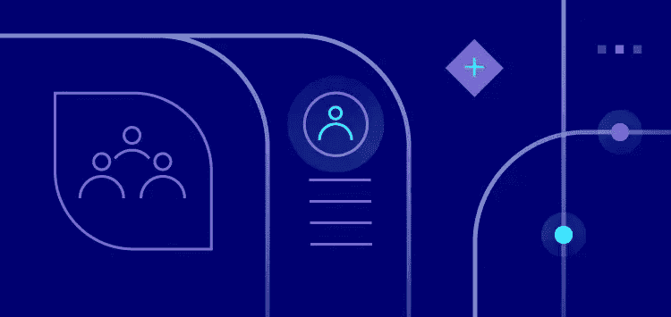
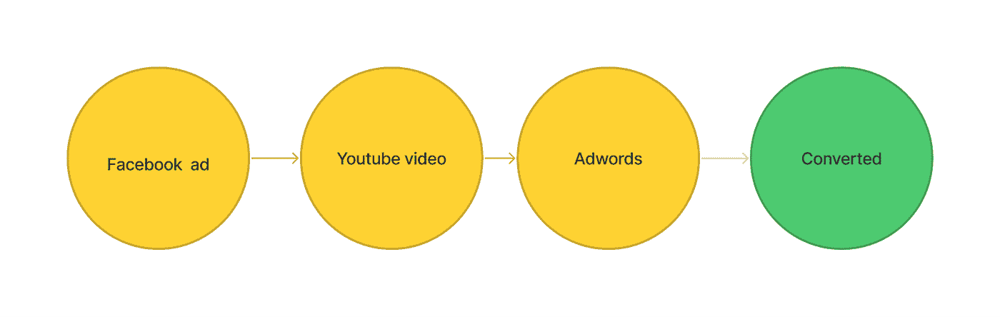
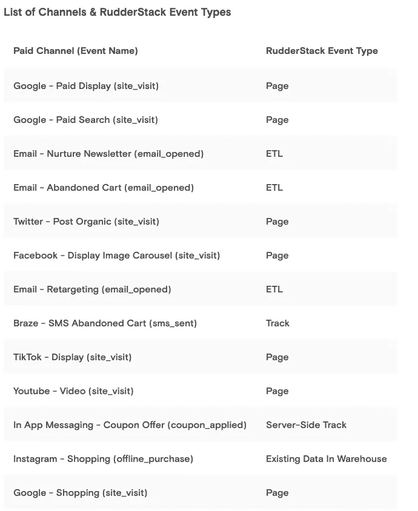
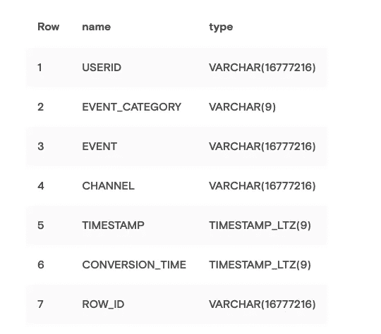
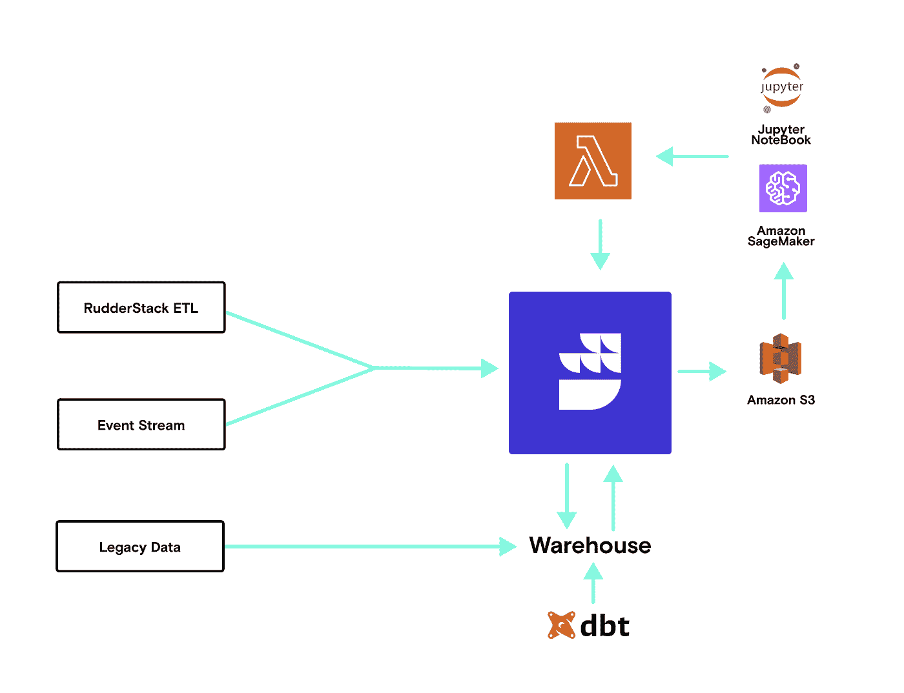
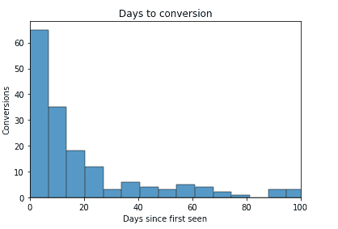
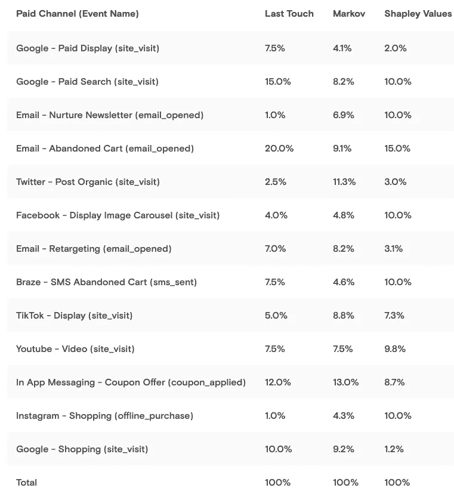

# 使用 RudderStack、Dbt 和 SageMaker 从首次触摸到多次触摸的属性

> 原文：<https://medium.com/geekculture/from-first-touch-to-multi-touch-attribution-with-rudderstack-dbt-and-sagemaker-94d2beacd4ce?source=collection_archive---------9----------------------->

# 概述评估多点接触客户旅程中转化的贡献所需的架构、数据和建模

我们应该在哪里花更多的营销预算？

这个古老的预算分配问题的答案归结为确定哪些活动有效，哪些活动无效，但是根据我们今天在客户旅程中收集的数据量，并不总是非常清楚哪些活动是哪些活动。

乍一看，在 Google ads 这样的广告平台上查看指标来检查付费广告活动的投资回报率是相当简单的，您甚至可以将转化数据发送回该平台，但您仍然只能评估导致并影响销售的一小部分用户交互(最多是转化路径的一两步)。

这些限制是由于许多广告平台是在基本的营销属性对大多数公司来说已经足够的时候建立的。然而今天，数据团队和营销人员拥有比以往更多的数据，这增加了他们对更高级的归因解决方案的需求。即便如此，高级归因仍然很难。但是为什么呢？

简而言之，超越基本的单一接触归因引入了许多复杂性。一个用户可以有许多营销接触点，而不是二元结果(这种数字营销活动把一些人带到了我们的网站，或者没有)，这引入了在购买者的旅程中产生影响的想法，这就是事情开始变得棘手的地方。

要了解哪些营销活动对成功目标(转化事件)的贡献更大，我们必须相对于所有其他活动对其进行评估，这非常复杂。首先，它涉及从许多不同的来源收集大量的数据并使之标准化，其次，它需要应用统计建模技术，而这些技术通常不在许多营销部门的技能范围之内。

营销团队不应解决这些营销衡量挑战。第一个(综合数据收集)是数据工程问题，第二个(统计建模)是数据科学问题。因为这些不是营销中的核心技能，大多数营销人员依靠最后接触点模型或将复杂的归因外包给第三方归因工具，这些工具没有完整的归因数据。问题是，这些类型的归因无法提供全面、跨渠道理解从第一个接触点到最后一次点击的整个消费者旅程中的营销绩效所必需的深刻见解。谢天谢地，现代工具可以跨团队解决这个问题。

**挑战:当用户在不同设备上的多个会话中参与多个活动时，你如何知道这些不同的接触点中哪些真正影响了销售？**

RudderStack 方法包括在您的仓库中构建一个数据集，该数据集结合了事件(用户接触)以及与之相关的元数据(比如营销活动)。除了分析活动绩效，我们还可以将这些数据用于各种机器学习模型，包括线索评分和重复购买的可能性。

在本文中，我们将介绍我们最近如何通过使用不同归因模型的组合来帮助一位电子商务客户重新调整他们的营销预算。我们将从高级架构回顾以及他们如何使用 RudderStack 收集所有数据(包括营销支出)开始。)在自己的数据仓库中创建一个完整的用户旅程故事。接下来，我们将向您展示他们如何使用 dbt 和 RudderStack 反向 ETL 来为建模准备数据。在本例中，AWS SageMaker 用于运行 Jupyter 笔记本，我们将向您介绍如何将多个模型的结果发送回它们的仓库进行报告。

# 架构:从全面的数据收集到使用多触点归因模型

下面是基本的端到端流程:

1.  从各种平台(web、移动设备等)流式传输行为事件。)进仓库
2.  ETL 附加数据集，以完成仓库中的用户旅程数据集(销售电子邮件、应用程序使用量、库存等。)
3.  通过方向舵堆栈身份拼接创建丰富的用户旅程
4.  使用 dbt 定义转换和用户特征
5.  反向 ETL 用户特性到 S3
6.  在 SageMaker 的 Jupyter 笔记本上对 S3 数据运行 python 模型，并将结果输出回 S3
7.  Lambda 函数将新的结果记录从 S3 流式传输到方向舵堆栈，并路由到仓库和下游工具

最终结果是，丰富的用户旅程数据产生了数据流和特征集，这些数据流和特征集可以提供多个不同的*属性模型作为输出，从简单到复杂。这很重要，因为下游团队经常需要不同的归因观点来回答不同的问题。在光谱的简单一端，了解人们最初是如何进入旅程的，他们的第一次接触，对于理解哪些渠道驱动最初的兴趣非常有帮助，而最后接触模型显示了哪些转化最终将访问者转化为用户或客户。*

然而，最重要的数据通常存在于第一次触摸和最后一次触摸之间的*。事实上，即使在我们自己对 RudderStack 用户旅程的研究中，我们通常在转换前看到 10+总接触点。了解第一次接触后发生的影响最后一次接触的接触点，可以为营销和产品团队提供非常强大的洞察力，特别是如果这些接触点需要花钱(以付费活动的形式)。*

让我们深入了解一下这个用例的工作流的概况。以下是我们将要介绍的内容:

*   快速解释数据工程师如何从堆栈中收集每个接触点(没有痛苦)
*   概述如何建立基本的首次接触和最后接触归因
*   解释为什么对多点触摸属性应用额外的统计模型很有价值，并概述 dbt 中的功能构建如何适应架构

# 数据工程挑战:捕捉每个接触点

对于我们和我们的客户来说，捕捉整个“用户旅程”是一个如此常见的用例，以至于我们的团队经常认为这个术语是理所当然的。当我们谈论用户旅程时，我们真正的意思是，“按照时间顺序，告诉我特定用户接触我们业务的每个接触点，无论是在我们的网站、移动应用程序、电子邮件等。并且还包括诸如 UTM 参数、引用 URL 等元数据。这也可能提供关于特定接触点的背景或见解。”

但是所有这些数据来自哪里呢？答案是它来自您的整个堆栈，这解释了为什么它是一个数据工程挑战。对于行为事件数据，我们的客户使用[ruder stack 事件流](https://www.rudderstack.com/product/event-stream/)SDK 来捕获用户如何与他们的网站和移动应用程序交互的原始数据源([我们有 16 个 SDK](https://www.rudderstack.com/docs/stream-sources/rudderstack-sdk-integration-guides/)，从 JavaScript 到移动和服务器端甚至游戏框架)。

然而，行为数据只是拼图的一部分。该客户还从其堆栈中的云应用中获取了接触点。为此，他们利用 Rudderstack ETL 源从 CRM 和营销自动化工具中获取应用程序数据。最后，他们使用 RudderStack 的 [HTTP](https://www.rudderstack.com/docs/rudderstack-api/http-api/) 和 [Webhook](https://www.rudderstack.com/docs/stream-sources/webhook-source/) 源从专有的内部系统获取数据(这些源接受来自任何将发送有效载荷的东西的数据)。

值得注意的是，RudderStack 的 SDK 处理匿名和已知用户跨设备和子域的身份解析。这使我们的客户能够使用 dbt 将来自云应用的数据、传统数据和用户事件数据结合起来，作为其身份拼接框架的一部分，以实现令人垂涎的 360°客户视图。

当涉及到属性时，解决数据工程的挑战真的是非常强大的东西，很大程度上是因为数据是良好建模的整个基础。这也是我们相信在仓库中构建客户数据堆栈的原因，无论如何，您都要在这里收集所有数据。

我们的客户告诉我们，拥有灵活堆栈的一个主要优势是，与 g a 或 Adobe Analytics 中的传统首次接触和最后接触分析不同，在仓库上构建解决方案使他们能够将优惠券和结账时应用的其他折扣(通过服务器端事件)的效果(和成本)考虑在内，并将它们视为付费营销支出的替代形式。此外，拥有来自销售和营销自动化工具的数据真正完善了他们的情况，因为他们可以评估“离线”活动(如打开的电子邮件)的贡献，即使收件人没有点击任何将他们引回到网站的链接。对于使用第三方分析工具和孤立数据的客户来说，这两种使用情形都是不可能的。

因此，在这一点上，我们的客户在他们的仓库中拥有了所有的数据，并使用 dbt 将客户资料和旅程缝合在一起。然后呢？

在使用 RudderStack 和 dbt 构建用户旅程之后，他们有了为统计分析和 ML 建模创建健壮数据模型的基础。对于他们特定的电子商务用例，我们帮助他们创建了一个模型，将接触点和与这些接触点相关的营销活动结合起来，以创建一个多用途数据集，供 SageMaker 使用。以下是使用的一些事件类型和来源的示例:

一旦我们在数据集中建立了我们需要的接触点，下一步就是定义转换——属性模型的一个关键组成部分。该客户的直接面向消费者的电子商务用例将转换定义为客户的总购买量超过某个金额阈值(许多公司会考虑这些高价值或忠诚的客户)。

值得注意的是，这可以包括用户层面上任何时间段内的多次购买，这在传统分析工具中是不可能获得的，因为它需要聚合一个或多个交易*和*以及一个或多个行为事件*和*，将它们与已知用户联系起来。但是，在数据仓库中，客户拥有所有这些数据，并且可以轻松地管理时间表，因为每个接触点都有一个时间戳。

使用 RudderStack 和 dbt，我们帮助他们构建了一个 dbt 模型，该模型输出一个用户接触相关活动的表格，并用时间戳标记每个用户是否最终转化。UTM 参数从页面调用中提取，并与适用的跟踪调用(如“已发送废弃的购物车电子邮件优惠券”)结合在一起，然后再次与来自仓库中 ETL 源的其他数据结合，如下表所示。

输出表旨在为该用例之外的各种不同的统计和 ML 模型提供服务，包括以下各列:

1.  **userId** :来自各种事件表的 RudderStack 用户标识符。在我们的例子中，我们将使用从身份拼接模型中创建的 Rudder ID。对于 B2B 应用程序，这可能是 AccountID、Org_ID 等。
2.  **event_category** :被发起的事件的类型。不用于此分析，但可能对过滤或其他 ML 建模有用。
3.  **事件**:用于产生触摸的特定事件的名称。同样，这个字段不会在我们的属性建模中使用，但是会在其他模型中使用。
4.  **渠道**:这个特殊事件的营销渠道。正如我们将在 dbt 中看到的，这可能是由页面事件上的 UTM 参数驱动的，也可能是从源本身推断出来的(例如，硬连接的 SMS 消息、从 customer.io 打开的电子邮件、服务器端事件或仓库中已经存在的发货数据)。
5.  **时间戳**:这通常是事件本身的时间戳值，但也可以是指示该特定触摸何时发生的任何时间戳
6.  **conversion_time** :表示用户第一次获得合格订单总数时的时间戳。这是在 dbt 内的不同步骤中计算的，并应用于该特定用户 Id 的所有事件。如果用户没有完成结帐过程，这将为空。需要注意的是，在用户转换之后，我们不希望特定用户发生任何事件。
7.  **row_id** :每个用户标识的序列标识符。RudderStack reverse etl 使用它来支持每天新事件的每日增量负载。

有了在仓库中创建的数据集，客户连接 RudderStack 的反向 ETL 管道将表发送到 S3，在那里属性建模在 SageMaker 和 Jupyter 笔记本中执行。然后，他们使用 Lambda 函数将结果通过 RudderStack 发送回仓库，团队可以在那里开始解释结果。(在即将发布的帖子中，请密切关注这一工作流程。)

这是该架构的可视化示意图:

# 从第一次和最后一次触摸归因开始

如上所述，该客户希望评估各种归因模型，以回答有关其营销支出和客户旅程的不同问题。

他们从简单的第一次接触和最后一次接触模型开始。如上所述，每个接触点都有时间戳，因此提取第一次/最后一次接触和第一次/最后一次活动属性相当简单。这位客户特别感兴趣的是比较第一次和最后一次接触模型的属性，这在同一个报告、SQL 查询等中很容易实现。有趣的是，他们说这非常有价值，因为类似的比较分析无法在谷歌分析中进行，也无法使用电子表格从 CRM 中导出上次接触的属性。

# 最后接触归因的问题是

最后一次接触归因是分配转化信用的最常见方式。尽管听起来很简单，但事实往往如此，因为这是最容易跟踪的一种归因，尤其是在那些从来不是为归因而设计的工具中(Salesforce 中的自定义字段，有人知道吗？).为了清楚起见，最后一次触摸归因模型将所有的“功劳”分配给最后一次触摸。因此，如果转换的价值为$x，并且用户在转换之前与四个不同的活动进行了交互，则只有最后一个活动获得了$x 的全部信用，而前三个活动获得了零信用。

当竞选目标不同时，这就成了一个大问题。例如，一些活动可能以品牌知名度为目标，这几乎总是意味着较低的转化率。当品牌活动转化时，通常需要很长一段时间，甚至在活动结束后，或者作为一种“辅助”,在转化前将用户带回来。因此，即使某些品牌活动对最终转化有极大的影响，最后接触归因模型也没有给予它们应有的信任。当营销团队试图优化品牌活动与转化活动之间的平衡时，这一点尤为重要。

我们在所有客户身上都看到了这种情况，无论他们是 B2B 还是 B2C，销售额越大，通常尾巴越平。下面的图表显示了一个典型的“转换天数”图表，并强调了“最后接触”是如何夸大“最后接触”活动的重要性的。

# 通过统计建模获得更好的选择

鉴于当今营销环境的复杂性和上次接触建模的局限性，我们必须考虑更复杂的替代方案，将适当的信用分配给适当的活动，并考虑到转化点的**完整路径**——这正是我们的客户要做的。

这种将用户转化归因于整个旅程中所有触摸的问题被称为**多点触摸归因(MTA)。**这本身也可以通过各种基于规则的方法来实现。这些规则的一些例子是:

1.  **线性归因模式**:这种方法对所有的接触都给予同等的重视。
2.  **时间衰减模型**:最近的触摸被赋予更大的权重，而触摸发生的时间越久，它获得的权重越小。
3.  **U 形属性**:类似于时间衰减，除了第一次和最后一次触摸获得更高的信用，中间触摸获得更低的信用。

这些都是基于启发式的规则，可以是任意的。在 RudderStack，我们推荐一种更加数据驱动的方法。我们通常采用这两种既定的方法:

1.  **Shapley 值**源自博弈论，它们本质上捕捉了每次接触对最终转化的边际贡献。
2.  **基于马尔可夫链的值**捕捉用户旅程的概率性质，以及每个接触点的移除效应。他们还强调了旅程中现有的关键点，即如果出现问题，转化概率会受到负面影响的点。

下面是(图 3)我们使用这三种模型得出的结果:

# 比较模型的有益见解

当我们的客户在他们的仓库中评估返回的结果时，他们发现了一些非常有趣和有用的见解:

1.  基于最后接触的归因给予被放弃的购物车电子邮件非常高的权重。有趣的是，这是有道理的，因为用户可能会被他们已经考虑购买的东西的优惠券所诱惑，而这是他们在购买之前参与的最后一项活动。另一方面，Markov 和 Shapley 值都表明，虽然这可能发生在转换之前，但其边际贡献并不像最后一次接触模型所表明的那样显著(记住，关键转换是总购买量超过某个值)。客户不再继续投资于复杂的废弃购物车跟进电子邮件流，而是专注于 A/B 测试废弃购物车电子邮件信息以及相关产品的测试建议。
2.  在最后一个接触模型中，Instagram 购买看起来不像是一个引人注目的接触点。这本身就是有价值的数据，因为 Instagram 购买数据是孤立的，跨市场连接活动是复杂的。同样，使用仓库有助于我们的客户打破这些孤岛。有趣的是，尽管最后一次接触的贡献非常低，但从 Shapely values 可以明显看出，Instagram 购买对高价值客户的旅程产生了重大影响。因此，在以前可能是一个反直觉的决定中，客户增加了营销支出以推动 Instagram 上的购买，并包括了促使客户回到其主要电子商务网站的内容。
3.  与 Shapley 值相比，Twitter(有机)帖子的 Markov 值要高得多。这向我们的客户表明，实际上没有多少人会基于 Twitter 帖子进行重大购买，但当他们这样做时，他们会有非常高的意向。客户重新分配了谷歌的支出，这在上次的触摸模式中被高估了，并投资于推广有机 Twitter 帖子和创建新的有机内容。
4.  脸书展示活动具有高的 Shapley 值但低的 Markov 值，这表明人们在看到脸书上的广告后的高脱落率。基于这种认识，客户将预算从脸书转移到了抖音和 YouTube，这两个网站的下降幅度要小得多。

# 结论

真正了解活动效果的唯一方法是全面了解用户旅程中的每个接触点。RudderStack 通过其统一的模式设计和身份拼接，消除了收集和统一所有数据源的工程难题，并减少了数据科学家的构建时间。如果您想了解更多有关 RudderStack 如何帮助解决贵公司的工程或数据科学需求的信息，请[立即免费注册](https://app.rudderstack.com/signup?type=freetrial)并[加入我们的 slack](https://www.rudderstack.com/join-rudderstack-slack-community/) 。

本博客最初发表于:[https://www . rudder stack . com/blog/from-first-touch-to-multi-touch-attribution-with-rudder stack-dbt-and-sage maker](https://www.rudderstack.com/blog/from-first-touch-to-multi-touch-attribution-with-rudderstack-dbt-and-sagemaker)