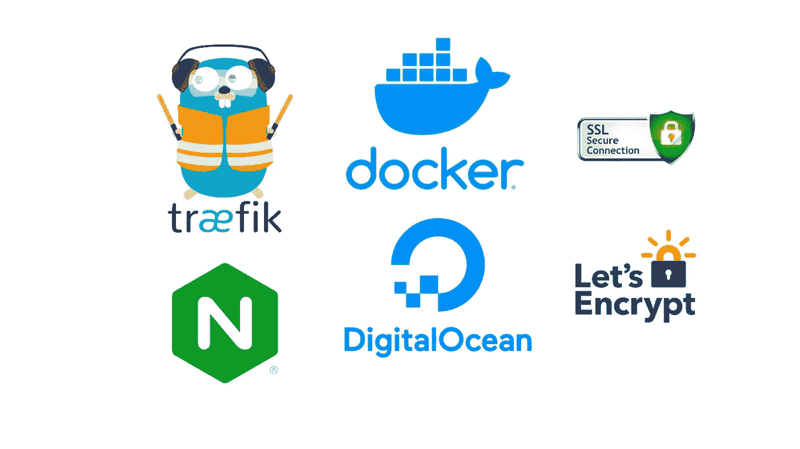

# 从 NGINX 到 Traefik(数字海洋上的 Docker)

> 原文：<https://medium.com/geekculture/from-nginx-to-traefik-with-docker-on-digitalocean-fcaeea3c6a4e?source=collection_archive---------1----------------------->

## 负载平衡微服务和通配符 SSL 证书

这篇文章将展示如何将 NGINX 配置为一个支持 SSL 的反向代理，然后我是如何(**和为什么**)迁移到 Traefik 的。

Image by author

文章分为四个部分:

*   迁移发生的项目介绍