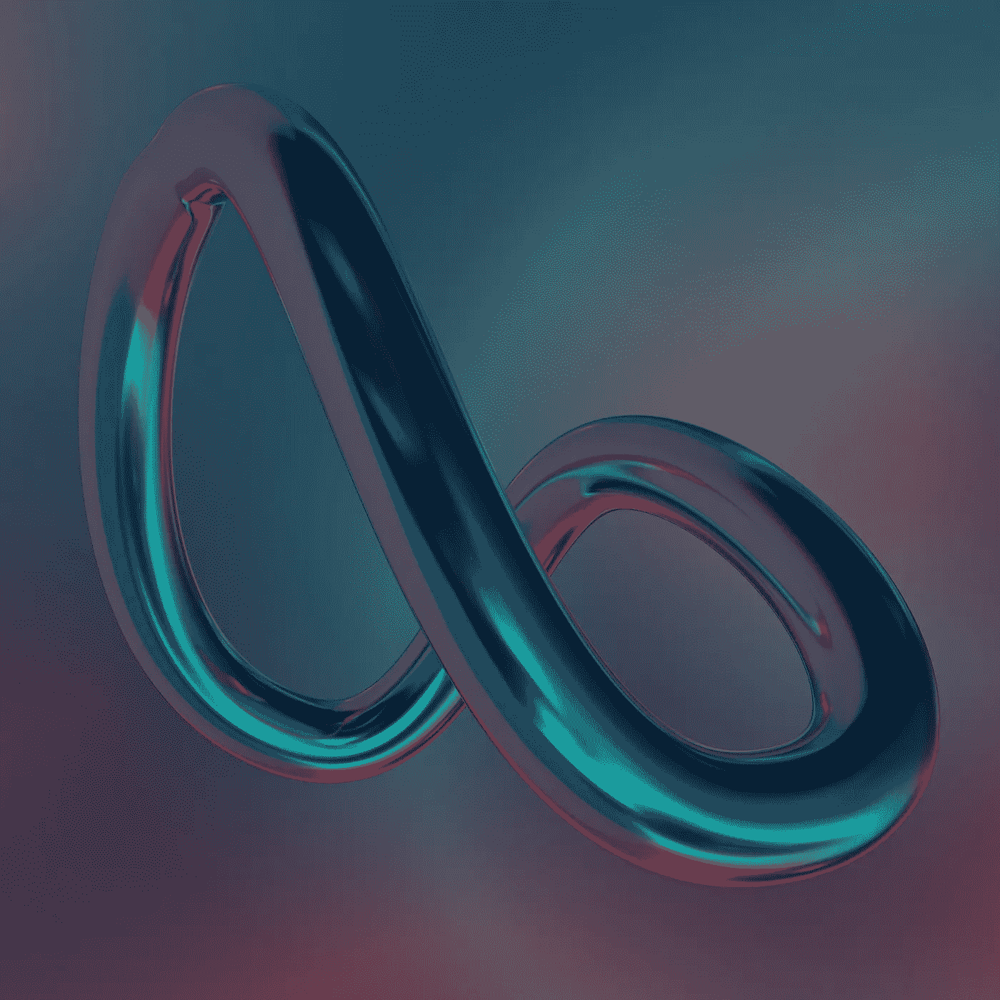

# 从现实到虚拟:沙盒

> 原文：<https://medium.com/geekculture/from-reality-to-virtuality-sandbox-81e869fbe772?source=collection_archive---------20----------------------->

创建自己的数字艺术和交易房地产从来没有这么容易过。

Photo by [Steve Johnson](https://unsplash.com/@steve_j?utm_source=unsplash&utm_medium=referral&utm_content=creditCopyText) on [Unsplash](https://unsplash.com/s/photos/metaverse?utm_source=unsplash&utm_medium=referral&utm_content=creditCopyText)

在这个博客中，我们已经讨论过这个既神秘又好奇的话题，在之前的[故事](/geekculture/you-know-weve-already-stepped-into-the-4th-industrial-revolution-68c315c567b8)中。

为了刷新我们的记忆，元宇宙被解释为一个**虚拟环境**，其中所有的用户都能够彼此见面并一起参与一些活动。