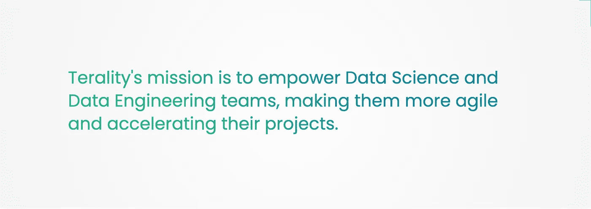

# 从 Reddit 到使用 Terality 的数据科学，使用 Python

> 原文：<https://medium.com/geekculture/from-reddit-to-data-science-using-terality-with-python-3b39d0482bc9?source=collection_archive---------5----------------------->

Photo by [Brett Jordan](https://unsplash.com/@brett_jordan?utm_source=unsplash&utm_medium=referral&utm_content=creditCopyText) on [Unsplash](https://unsplash.com/s/photos/reddit?utm_source=unsplash&utm_medium=referral&utm_content=creditCopyText)

## 以下是如何在几分钟内探索 38 GB Reddit 数据(54M+行)并获得强大见解的方法。

让我们大声明确的说: **Python 很牛逼**。
我知道你在想什么，你是对的:你可以用 Julia、R 或任何其他语言工作，仍然可以编写令人难以置信的机器学习和数据科学代码。尽管如此，**真正让 Python 变得非常有用的是大量有据可查的库，这些库允许你用几行代码完成复杂的事情**。

几天前，我想使用**社交网络的数据进行一次机器学习实验。特别是，这个想法是为了研究用户对给定文本的反应。**

Reddit****的评分系统是这个实验的完美例子。****

**尽管如此，我突然注意到有两个大问题需要解决:**

1.  **在哪里可以找到数据集？**

**但最重要的是:**

> **2.**没有昂贵的云服务或者超级**强大的机器，如何处理这么大的数据量？**

**在这个笔记本里，我解释了我是如何解决这些问题的，用的是**。****

# ****1.关于 Terality****

## ****1.1 什么是 Terality？****

****正如我告诉你的，大多数时候有一个图书馆为你做这项工作。
在这种情况下，我发现了****:********

********

****Image by author, from [here](https://www.terality.com/about)****

****Terality 是第一个比 pandas 快 100 倍的无服务器数据处理引擎，可自动扩展到 TB 级，它有两个我一直在寻找的主要特性:****

****1.它与 **AWS** 相连，拥有一些现成的数据集。 **Reddit** 数据集就是其中之一。****

****2.平均而言，它的执行速度比 Pandas 快得多，同时使用相同的语法和后台自动伸缩功能，能够在无需基础设施管理的情况下处理大型数据集。****

****我说“*更快*”，因为性能取决于我们考虑的函数。以下是一些数字:****

*   ******使用 *read_parquet* 时速度快 8 倍******
*   ******13x** 使用 *sort_values* 更快****
*   ******80x** 使用*应用*更快****

> ******注:**更多可以在这里找到****

******同样，另一件很酷的事情是，它使用相同的 pandas 语法，所以你真的不需要学习新的东西。我们继续吧！******

# ******2.图书馆******

******这是我们进行分析所需的库:******

******你需要配置你的 **Terality** 账户(完全免费)，你可以在这里[完成。
那么你将需要 **matplotlib** 、 **numpy** 和 **seaborn** 进行数据可视化。
注意，我们将 terality 作为 **pd** 导入，因此我们将编写与熊猫完全一样的代码。](https://app.terality.com/)******

> ****注意:你也可以在 **Google Colab** 上运行这段代码。在这里阅读。****

# ****3.数据集****

****让我们展示前五行:****

****让我们获取一些信息:****

****使用了大量的行、列和内存，但是您可以在几分钟内运行这段代码**。感谢 Terality:)******

# ******4.探索性数据分析******

******让我们执行一些 EDA 技术。具体来说，让我们通过分析**正文**(正文)来研究在**分数**(正反票数之和)方面发生了什么。让我们隔离这两列:******

## ****4.1 获取分数统计****

****让我们绘制一些关于分数的统计信息:****

****两方面我们都有一些**异常值**(超正或超负分数)。中位数是 1，是合理的。让我解释一下为什么我认为是这样。****

****当你使用 Reddit 时，通常是这样的:****

*   ****用户 A 问了一个非常实际的问题，比如:****

> ****“每次在我的新 MacBook Air 上导入 tensorflow 时，我的内核都会死机，我该如何解决这个问题？”(真人真事…)。****

*   ****用户 B 对问题的回答:****

> ****“您应该在 conda 上创建一个虚拟环境，并在该环境中安装 tensorflow”****

*   ******用户 A 投票支持用户 B 的评论******
*   ******所有其他用户阅读用户 B 的评论，然后继续**而不投赞成票****

****所以最终值是:**得分= 1** 。显然，这种情况发生的几率是 50%。很高兴知道！****

## ****4.2 最佳/最差文本****

****我们可以使用以下语法来可视化分数=2，3，4，5…的所有注释:****

****[https://jovian.ml/piero-paialunga/redditeda/v/1&cellId = 6](https://jovian.ml/piero-paialunga/redditeda/v/1&cellId=6)****

****例如，让我们得到最高的投票分数:****

****所以正文是这样的:****

> ****"然后你就陷入了一个晚上的僵局."****

****这看起来像是一个笑话，而且显然很好笑(虽然我不知道上下文)。:)****

****让我们印下投票最多的一张:****

****所以正文是这样的:****

> ****“很久以前 redditor 和英语专业在这里！我想/r/pics 和潜在的/r/all(因为这是一个高质量的提交)会感谢你重新提交这篇文章，并修改标题。如果它让我困惑，它可能会让其他人困惑。[…] .通过选择正确的词语，会有大量的因果报应！redditing 快乐:)”****

****同样，人们似乎不喜欢这个用户修改另一个用户的文本。没有上下文就很难说了。****

## ****4.3 忽略:(****

****想象一下，你发布了一些东西，而你通常会被完全忽略。你会在一个社交网络中知道大多数时候你不会得到一个单独的反应吗？****

****甚至有可能你最终会删除你的帐户，所以这实际上是一个值得考虑的警告信号！****

****但是这种情况会发生几次呢？****

****显然，只有 4.6%的情况下评论会被忽略，所以这种情况发生两次的概率不到 0.22%。 **Reddit 是安全的:)******

## ****4.4[已删除]****

****人们删除评论的次数是多少？而被删除的评论得分是多少？****

******我们知道超过 10%的负分评论会被删除**。****

****已删除评论的中值大于未删除评论的中值:****

****https://jovian.ml/piero-paialunga/redditeda/v/1&cellId = 11****

****而积极投票的评论只有 5%的评论实际上被删除！这是合理的。如果你的评论得分高，你就不太可能删除得分低的评论。****

****同样，被删除的评论得分较低:****

****因此，我们可以得出结论，如果评论得分为 0，则更多评论将被删除。****

## ****4.5 单词云****

****通过导入 WordCloud 库，我创建了一个工作云，用于非常正面的评论。这些是结果:****

******如果你看看这个，它看起来像一个激励性演讲的工作云:)**
我们可以理解，在某一点上，投票最多的评论是“**编辑过的**”(你不会编辑一个被忽略的评论，对吧？)而且他们有一种非常简单的语言，每个人都能理解(像**想，知道，制造，一个**这样的简单词汇)。****

****我对评价很差的评论也是这样做的:****

********

****This image is the result of the previous code…****

****我不得不谴责所有的脏话。这些文章得分很低并不奇怪。我只想说:****

******当我们在社交媒体上写作时，我们可能是最糟糕的自己……******

# ****5.结论****

****所有这些探索性分析都是以下列方式进行的:****

*   ****使用导入数据****
*   ****使用 **Terality** 从我们庞大的数据集中提取最小的信息****
*   ****使用 **numpy** 、 **matplotlib** 、 **wordcloud** 绘制它们…****

****您将无法使用 pandas 来处理这个数据集，因为您将在第一行中得到一个内存错误。尽管如此，我们还是使用了 pandas 的所有特性和语法，因为 Terality 也是基于 Pandas 的。****

****已经完成了以下分析:****

*   ******得分**的**四分位数******
*   ******提取具有特定分数的所有**体**的******
*   ****提取**最差和最佳评级文本**中的****
*   ****分析**中的**忽略了**和**删除了**和**分数****
*   ****工作云**中的**最佳**和**最差**和**排名**分数**分数****

**如果你喜欢这篇文章，你想了解更多关于机器学习和数据科学的知识，或者你只是想问我一些你可以问的问题:**

**A.在 [**Linkedin**](https://www.linkedin.com/in/pieropaialunga/) 上关注我，在那里我发布我所有的故事
B .订阅我的 [**简讯**](https://piero-paialunga.medium.com/subscribe) 。这会让你了解新的故事，并给你机会发短信给我，让我收到你所有的更正或疑问。
C .成为 [**推荐会员**](https://piero-paialunga.medium.com/membership) ，这样你就不会有任何“本月最大数量的故事”，你可以阅读我(以及成千上万其他机器学习和数据科学顶级作家)写的任何关于最新技术的文章。**

**再见:)**