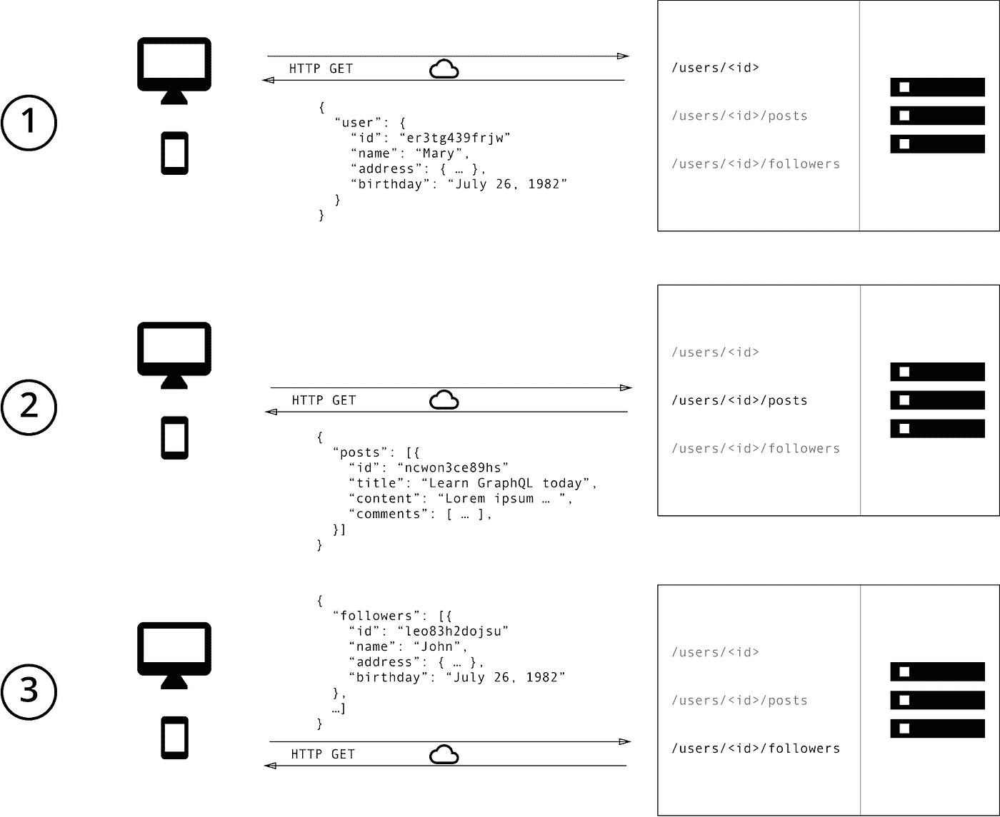
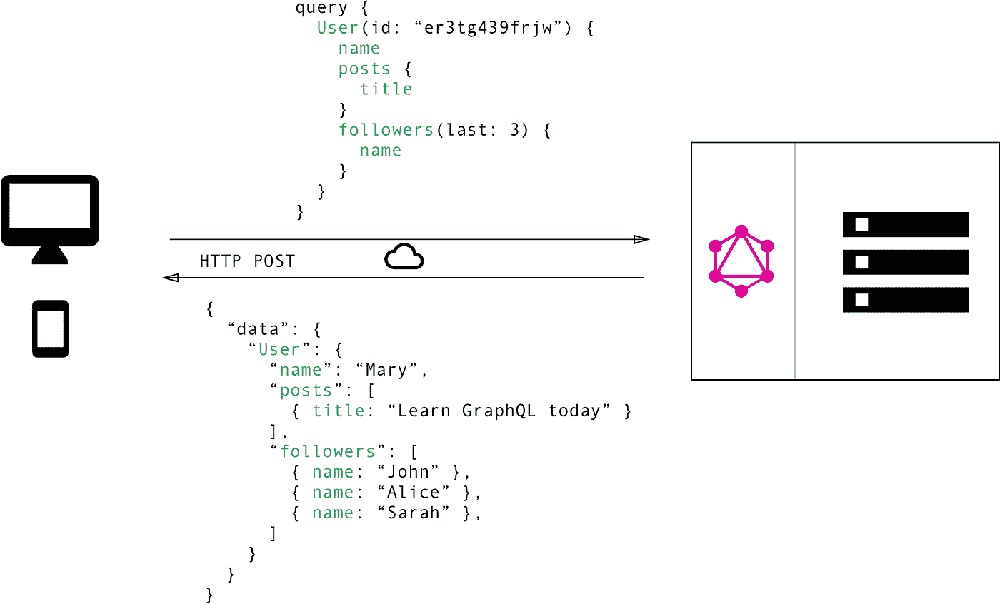
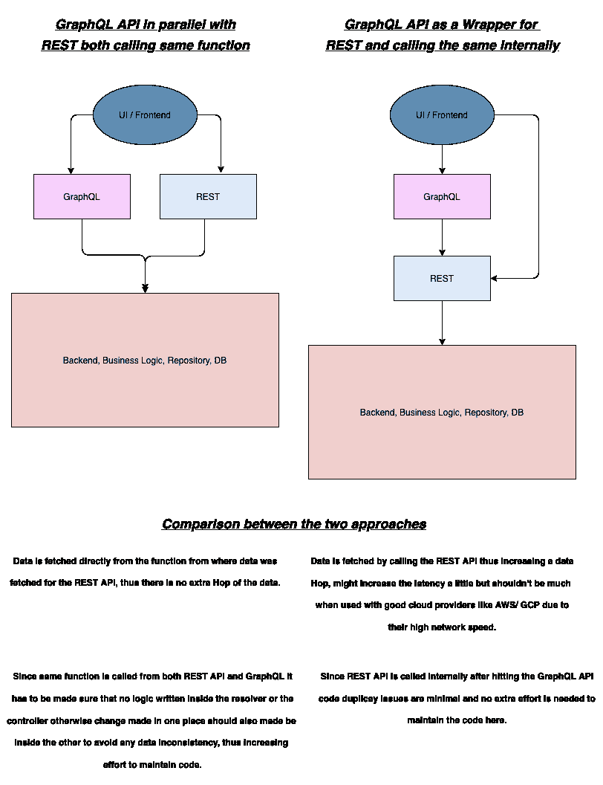

# 从 REST 到 GraphQL

> 原文：<https://medium.com/geekculture/from-rest-to-graphql-ffa97fba9f63?source=collection_archive---------14----------------------->

# 关于 GraphQL

GraphQL 是一种用于 API 的查询语言，它支持声明性数据提取，使客户端能够准确指定 API 所需的数据。随着时间的推移，API 的发展变得更加容易。

GraphQL 和数据库没有任何关系。它不是 SQL 的替代品，也不是全新的 ORM。

在我们的组织中，我们从一开始就使用 REST 来构建 API，这种做法非常有效。但作为一家金融科技公司，我们的要求发展非常迅速。

# REST 与 GraphQL 的数据获取

使用 REST API，您通常会通过访问多个端点来收集数据。在本例中，这些可以是/users/ <id>端点来获取初始用户数据。其次，可能会有一个/users/ <id>/posts 端点返回用户的所有帖子。第三个端点将是/users/ <id>/followers，它返回每个用户的关注者列表。</id></id></id>

使用 REST，您必须向不同的端点发出三个请求来获取所需的数据。由于端点会返回不需要的额外信息，所以您还会*过度获取*。

另一方面，在 GraphQL 中，您只需向 GraphQL 服务器发送一个包含具体数据需求的查询。然后，服务器用一个满足这些要求的 JSON 对象来响应。

使用 GraphQL，客户机可以在一个*查询*中准确地指定它需要的数据。注意，服务器响应的*结构*完全遵循查询中定义的嵌套结构。

我们必须向不同的外部供应商公开 API，我们正在构建我们的移动应用程序。虽然这两个都可以由 REST APIs 完成，但 GraphQL 似乎是一个更好的选择，原因如下

# 不再出现过度抓取和抓取不足

REST 最常见的一个问题是提取过量和不足。这是因为客户端下载数据的唯一方式是点击返回固定数据结构的端点。很难设计 API 来为客户提供他们确切的数据需求。

过量提取意味着返回的数据比需要的多，从而增加了网络上的数据传输，使应用程序变慢。

提取不足意味着没有返回所有需要的数据，需要发出更多的请求来获取所需的数据。因此增加了响应时间。

在慢速网络中，这些延迟变得更加明显，许多移动应用程序用户可能就是这种情况。

# 外地一级的授权

REST APIs 为所有授权用户提供固定的响应。使用 GraphQL，您可以在字段级别获得授权。对于外部供应商的 API 来说，这是很有帮助的，这样他们就不能获取任何未经授权的数据。对于 REST，我们需要构建多个 API 来限制这一点。

# 后端的深入分析

GraphQL 允许您对后端请求的数据有细粒度的了解。由于每个客户端都明确指定了自己感兴趣的信息，因此可以深入了解可用数据的使用情况。例如，这可以有助于发展 API，并减少不再被任何客户端请求的特定字段。

使用 GraphQL，您还可以对服务器处理的请求进行底层性能监控。GraphQL 使用*解析器函数*的概念来收集客户端请求的数据。检测和测量这些解析器的性能可以提供关于系统瓶颈的重要信息。

# 自我记录

每个 GraphQL API 都符合一个“模式”:图形数据模型和客户机可以进行的查询类型。这允许社区构建许多很酷的工具来探索和可视化您的 API，或者创建 IDE 插件来自动完成您的 GraphQL 查询，甚至执行“codegen”。

# 实现 GraphQL

说了这么多，如果您已经构建了基础设施，那么将所有 API 从 REST 迁移到 GraphQL 是说起来容易做起来难。我们的情况也是如此。实际上，REST 和 GraphQL 之间没有非此即彼的选择，它们可以共存，我们也是这样做的。

有两种方法可以从现有的 REST APIs 中创建 GraphQL APIs，并使它们都就位。它们都有各自的优点和缺点，如下所述。

请继续关注更多关于如何实现它的博客，以及一些高级特性，如 Oauth 和/或 JWT 的字段级授权。以及所有请求、响应和延迟的集中记录，以便在需要时用于各种类型的分析和可视化。

**希瓦姆·阿格拉瓦尔**

(shivamagrawal1129@gmail.com)

**高级软件工程师**

**Indifi 技术公司**