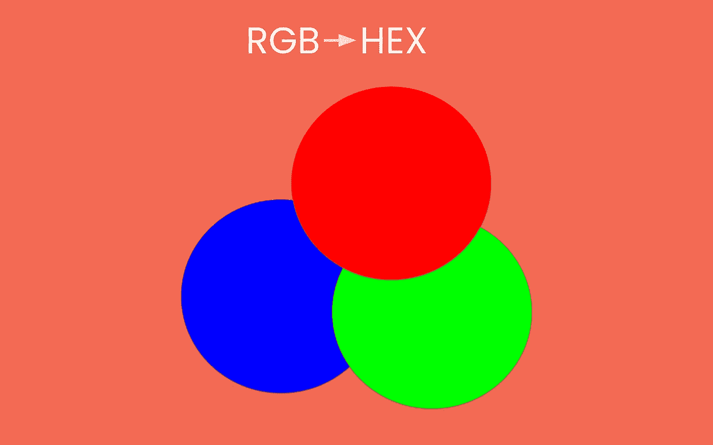
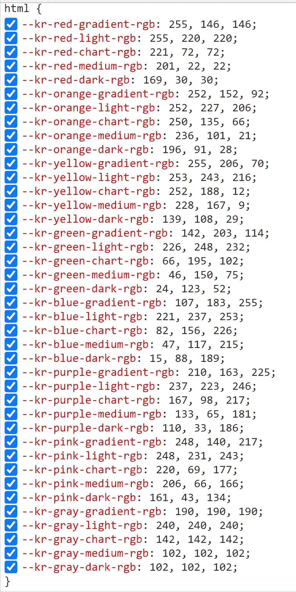
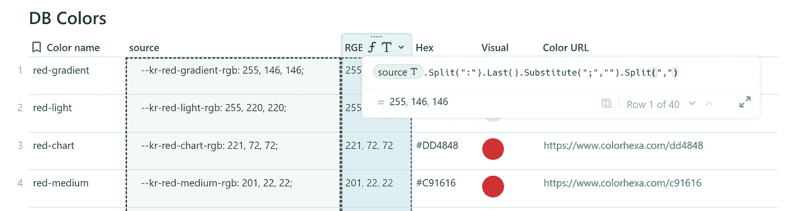
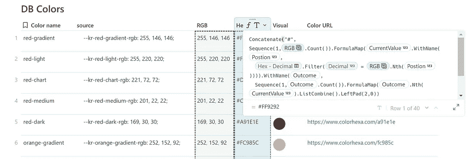

# 在 Coda 中从 RGB 到 HEX

> 原文：<https://medium.com/geekculture/from-rgb-to-hex-in-coda-ad7c2b2da86b?source=collection_archive---------37----------------------->



它开始于我寻找一个配色方案，为一个项目获得一些灵感。我看到了下面的`html()` 表，觉得有必要将这些值转换成十六进制值，以查看它们所代表的颜色。



我给自己设置的挑战是首先从剩余部分中剥离 RGB 部分，然后分离颜色概念，如*红色渐变。*

我的第一步是用原始数据创建一个表格。在尾声，这很容易，走得很快。我创建了一个表并将值粘贴到一列中。

**接下来**我写了一个简单的公式，只在一个单独的列中获取 RGB 值。起点是找到一个元素来定义拆分。这是“；”

`thisRow.source.Split(**“:”**).Last().Substitute(“;”,””).Split(“,”)`

接下来，我通过`Last()`拿到了最后一部分，因为在最后一部分的末尾，我找到了一个“；”我通过一个`Substitute()`摆脱了它。

它还没有工作，我需要使用列表中常用的逻辑来拆分数字:`Split(“,”)`

## 颜色的名称

在我们深入研究从 RGB 到 Hex 的转换之前，首先我是如何得到这个名字的。

我需要去掉第一部分和最后一部分。要在一列中实现这一点，您需要应用一个`FormulaMap()`,为什么呢？

```
thisRow.source.Substitute("--kr-","").FormulaMap(CurrentValue.Slice(1,CurrentValue.find("-rgb:")-1))
```

第一步是通过`Substitute()`去掉第一部分，我们在搜索部分中使用文本，在替换部分中仅使用“”。很简单。接下来是最后一部分，这有点复杂，因为我们看到了由名字引起的总字符串长度的变化。我们需要知道目标点来设置我们的第二个`Slice()`值。

使用`FormulaMap()`，我可以通过`CurrentValue`将公式的第二部分基于第一部分的结果

我应用了`Find()` 来获得“-rgb:”的位置，并且我加了-1 来获得开始之前的位置作为我的`Slice().`的终点，更多关于本文中`Find()`函数[的丰富性。](https://huizer.medium.com/coda-find-bbd01215e552)

现在我们已经知道了颜色的名称和 RGB 值。是时候将 RGB 转换成十六进制值了。



## 从 RGB 到十六进制

我知道 RGB 指的是红色、绿色和蓝色，但我不知道是怎么回事。所以当我遇到像(10)和(16)这样的符号时，我问一个朋友(他是学工程的)这是怎么回事。他给我写道:“十六进制数字，对我来说是很久以前的事了”。这让我开始思考，我发现不是 10 个数字的列表，而是 16 个项目的列表，不是 10 * 10，而是 16 * 16，当我们看到 255 时，这是有意义的(当添加 0 时，我们有 256 个项目)。

我需要的是一个从 0 到 255 的项目列表，将每组三个数字转换成两个数字的十六进制格式。我考虑过编写一个公式来创建一个包含这些值的表，但是我采用了一种简单的方法，将一个列表复制到一个包含十六进制和十进制数字的表中。到目前为止一切顺利。

```
Concatenate("#",Sequence(1,thisRow.RGB.Count()).FormulaMap(CurrentValue.WithName(Postion,[Hex - Decimal].Filter(Decimal = thisRow.RGB.Nth(Postion)))).WithName(Outcome,Sequence(1,Outcome.Count()).FormulaMap(Outcome.Nth(CurrentValue).ListCombine().LeftPad(2,0))))
```

我需要一个过滤器来过滤每一项，这次我们需要一个`FormulaMap()`来抓取每一项并过滤它以得到一个十六进制值。因此，首先是项目 1，然后是项目 2，最后是项目 3。结果是一个三个十六进制值的列表，我们最终通过`ListCombine()`聚集在一起，然后我以为我完成了，但还没有。一些结果没有显示为我可以转换为颜色的有效值。

我开始阅读应用逻辑，了解到符号总是两位数，因此如果结果是 1，就是 01。通过`LeftPad(2,0)`我补充说，我需要一个每十六进制两位数的结果和所有的值翻译好。

我在表格中添加了一个有助于更好地理解颜色的 URL:

```
concatenate("https://www.colorhexa.com/",Lower(Slice(thisRow.Hex,2,99))).Hyperlink()
```



table with colors

我希望你喜欢这篇文章。如果您有任何问题，请随时联系我们。虽然这篇文章是免费的，但我的工作(包括建议)不会是免费的，但总有聊天的空间，看看可以做些什么。此外，你可以在 [Coda 社区](https://community.coda.io/)和 [Twitter](https://twitter.com/CodaExpert) 上找到我的(免费)贡献

我叫 Christiaan Huizer，是 [Huizer Automation](https://huizer.be/) 的所有者。一家专门为 SME 收集数据并保持数据一致的公司。我主要依靠 [Coda](https://coda.io/?r=O8dJLrFiTDS_2ttrz-1brA) ，Mailjet，Zapier&paper form[来完成工作。](https://paperform.co/invite/bmv2e3)


Huizer Automation on using Coda to turn RGB into HEX