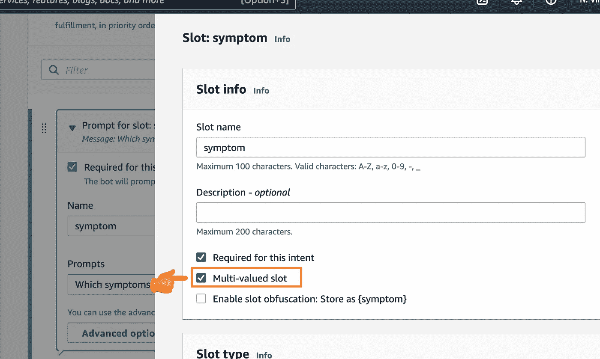
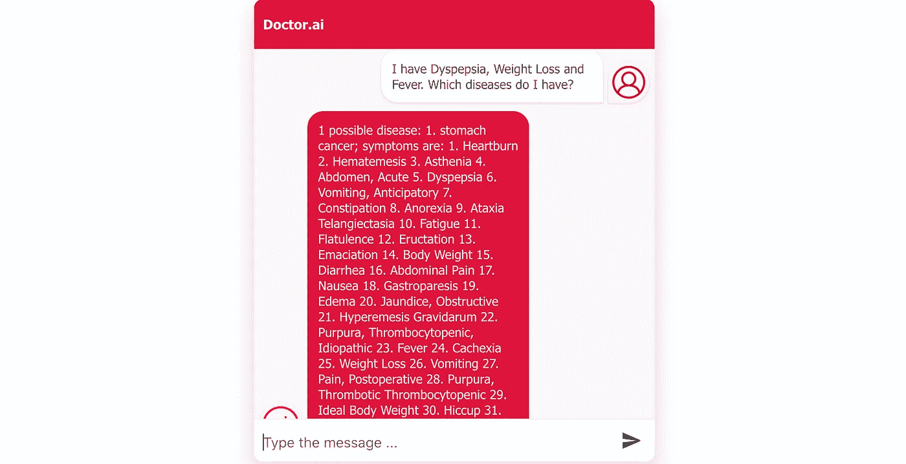
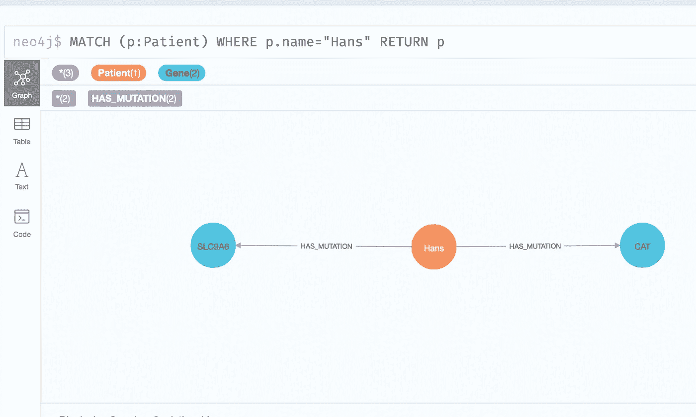
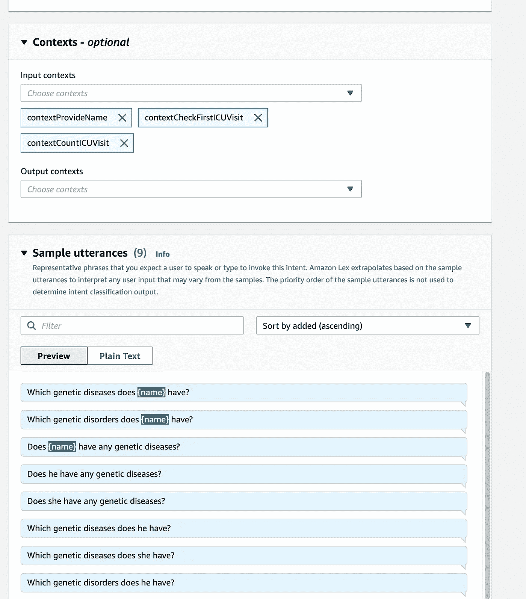
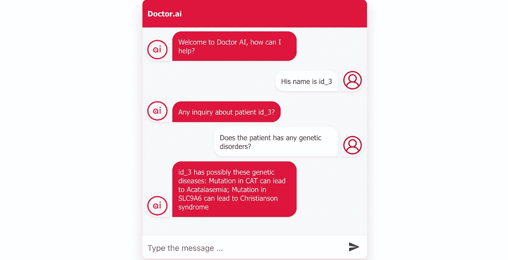
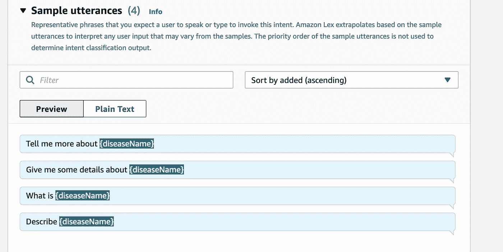

# 从症状和突变到诊断:作为诊断工具的人工智能医生

> 原文：<https://medium.com/geekculture/from-symptoms-and-mutations-to-diagnoses-doctor-ai-as-a-diagnosis-tool-5b31ac7a16c3?source=collection_archive---------11----------------------->

## 通过 AWS Lex 和 Neo4j 知识图表使用自然语言获得快速诊断

> 本文展示了如何:
> 
> 1.根据症状和突变基因开发 Doctor.ai 中的诊断功能。
> 
> 2.从 KEGG 中检索疾病描述
> 
> 3.配置 AWS Lex，这样我们就可以用自然语言和这个新的 Doctor.ai 交互了。

*免责声明:本文中的软件解决方案不能替代专业的医疗建议、诊断或治疗。它仅供参考。*

想象一下，在新冠肺炎封锁期间的某一天，一名盲人患者在家抱怨消化不良(通常在进食或饮水后出现上腹部不适或疼痛)、体重减轻和发烧。他想知道可能的医学原因，但他不能立即去医院。如果一个虚拟的医疗专家能给他一个所有可能原因的快速纲要，那不是很好吗？如果这个聊天机器人甚至能详细解释这些疾病，那该多好啊。本文试图给出一个可能的答案。


Photo by [National Cancer Institute](https://unsplash.com/@nci?utm_source=unsplash&utm_medium=referral&utm_content=creditCopyText) on [Unsplash](https://unsplash.com/s/photos/diagnosis?utm_source=unsplash&utm_medium=referral&utm_content=creditCopyText)

在我之前的文章中([这里，](/p/8c09af65aabb) [这里](https://neo4j.com/blog/doctor-ai-a-voice-chatbot-for-healthcare-powered-by-neo4j-and-aws/)和[这里](/p/cc21765fa8a6))，我描述了 doctor . ai——一个医疗保健的聊天机器人。起初，它被设计用来管理大量的病人病历。后来我插了三个知识图——[heti onet](https://het.io/)、 [STRING](https://string-db.org/) 和 [KEGG](https://www.kegg.jp/kegg/) 。因此，Doctor.ai 将患者的特定病史与 2600 多种疾病、21000 个基因、343 种病原体和 2582 种药物化合物联系在一起。因此，它不仅可以轻松地检索病人的记录，还可以为用户提供有关疾病的附加信息。多亏了 AWS Lex，我们可以使用自然语言与 Doctor.ai 进行交互。

然而，我们可以进一步利用这些知识图表来实现一个全新的目的:诊断。一方面，用户可以口述一个症状列表，并期望 Doctor.ai 用一个可能的疾病列表来回答。另一方面，随着越来越多的人有了自己的基因组测序，医生可以要求 Doctor.ai 根据患者的基因突变列出患者所有可能的遗传疾病。最后，Doctor.ai 甚至可以向用户提供关于疾病的详细描述。

这些都是可能的，因为 Hetionet 知识图将症状与疾病联系起来。Hetionet 和 KEGG 都将基因与遗传疾病联系起来。所以我们可以在 Neo4j 中使用多个`MATCH`语句来缩小候选疾病列表。此外，KEGG 包含了关于疾病的详细描述。不过有一个小缺点:这些描述相当学院派。

在本文中，我将向您展示这些诊断功能的制作过程。因为这是我上一个项目的升级，所以这个项目的代码存放在同一个 Github 存储库中:

[](https://github.com/dgg32/transfer_kg) [## GitHub - dgg32/transfer_kg

### 这个存储库包含我的文章“将知识图转移到 Doctor.ai”的代码和数据。Both template.yaml…

github.com](https://github.com/dgg32/transfer_kg) 

转储文件在这里。

[https://1drv.ms/u/s!Apl037WLngZ8hhj_0aRswHOOKm0p?e=7kuWsS](https://1drv.ms/u/s!Apl037WLngZ8hhj_0aRswHOOKm0p?e=7kuWsS)

# 1.从症状到诊断

假设一名患者抱怨**消化不良**、**打嗝**和**水肿**(肿胀)，并想知道可能的医学原因。在 Doctor.ai 的知识图中，我们可以运行下面的 Cypher 查询，得到答案:

使用三个`MATCH`语句，该查询尝试查找导致所有**三种症状的疾病。在这个假设的例子中，查询结果暗示了胃癌，根据 GLOBOCAN 2018 年的数据，胃癌是全球第三大癌症死亡原因。**

AWS Lex 是 Doctor.ai 的嘴巴和耳朵，而 AWS Lambda 是它执行数据库操作的手。为了根据症状进行诊断对话，Doctor.ai 需要升级其 Lex 和 Lambda 定义。我需要实现一个名为`AskForDiagnosesFromSymptom`的 Lex intent，它捕获症状列表并将它们传递给一个 Lambda 函数。Lambda 函数将构建一个类似上面的 Cypher 查询，针对 Neo4j 知识图运行它，并将答案返回给 Lex。

新的`AskForDiagnosesFromSymptom`看起来与其他 Doctor.ai 的意图相似，具有通常的示例话语和实现定义，除了它所需的插槽`symptom`是一个`Multi-valued slot`(图 1)。



Figure 1\. The slot symptom is a multi-valued slot. Image by author.

多值 slot 可以解析由空格、逗号或单词“and”分隔的项目列表。所以如果一个用户说:

```
I have Dyspepsia, Hiccup and Edema. So what kinds of diseases can it be?
```

Lex 将能够返回带有值`[Dyspepsia, Hiccup, Edema]`的症状列表。在 Lambda 中，我们可以用下面的代码构造并运行 Cypher 查询:

通过这次升级，Doctor.ai 可以进行如下对话(图 2)。



Figure 2\. Doctor.ai is made a diagnostic dialog based on user-submitted symptoms. Image by author.

Doctor.ai 不仅列出了可能的疾病，还列出了所有相关的症状。这可以帮助患者进行进一步的自我检查。

# 2.从突变基因到诊断

越来越多的人有了自己的基因组序列。随着[全基因组关联研究](https://www.genome.gov/about-genomics/fact-sheets/Genome-Wide-Association-Studies-Fact-Sheet) (GWAS)的推进，我们正在快速接近个性化医疗的时代。Doctor.ai 应该准备好摄取所有这些数据了。然后我们可以扫描每个个体基因组，寻找与疾病相关的变异，并将结果保存在 Doctor.ai 中。之后，Doctor.ai 可以查询知识图，寻找可能的遗传疾病。假设我们有一个叫 Hans 的病人，他有一个缺陷的 CAT 基因和一个缺陷的 SLC9A6 基因(图 3)。



Figure 3\. A fictive patient Hans has a defected CAT gene and a defected SLC9A6 gene.

与上一节中的`AskForDiagnosesFromSymptom`意图相反，我们需要在`AskForGeneticDisease`意图的单值槽中捕获患者的姓名。多亏了上下文，Lex 甚至可以通过从之前的对话中获取病人的名字来理解代词。



Figure 4\. The configuratation of the `AskForGeneticDisease` intent. Image by author.

在 Lambda 中，我像这样构造并运行 Cypher 查询:

通过这些简单的升级，dr . ai 现在也可以告诉汉斯一个坏消息:他可能患有[克里斯蒂安森综合征](https://medlineplus.gov/genetics/condition/christianson-syndrome/)和[无催化血症](https://medlineplus.gov/genetics/condition/acatalasemia/)。



Figure 5\. Doctor.ai conducts a conversation about Hans’ genetic disorders. Image by author.

值得注意的是 [Christianson 综合征具有 X 连锁隐性模式](https://medlineplus.gov/genetics/condition/christianson-syndrome/#inheritance)，而[无催化血症具有常染色体隐性模式](https://medlineplus.gov/genetics/condition/acatalasemia/#inheritance)。这意味着对于像汉斯这样只有一条 X 染色体的男性患者来说，一条突变的 SLC9A6 就足以导致克里斯蒂安森综合征。相比之下，汉斯有两个猫副本。如果只有一只猫有缺陷，他的过氧化氢酶活性会降低大约一半。但是如果两者都有缺陷，他的过氧化氢酶水平就会降低到正常水平的 10%以下。目前，Doctor.ai 无法捕捉到这些细微差别。

# 3.KEGG 疾病描述

当医生想进一步了解某种疾病时，Doctor.ai 应该可以提供帮助。一种简单的方法是将 KEGG 疾病描述返回给用户。

`AskForDiseaseDescription`的意图只是需要得到疾病的名称。



Figure 6\. The configuration of the `AskForDiseaseDescription` intent. Image by author.

在 Lambda 中，Neo4j Python 代码看起来像

之后，Doctor.ai 应该可以描述疾病。


Figure 7\. Doctor.ai conducts a conversation about pancreatic cancer. Image by author.

如您所见，KEGG 描述并不完全是 ELI5。它更适合医生或学术专家。

# 结论

在[我的上一篇文章](https://towardsdatascience.com/transfer-knowledge-graphs-to-doctor-ai-cc21765fa8a6)中，你可以看到三个知识图的加入让 Doctor.ai 在传染病、药物化合物、遗传学方面的知识更加丰富。这篇文章冒险进入了诊断领域。通过一些简单的编码，我为 Doctor.ai 添加了基于症状和基于基因的诊断能力。我相信如果我们继续挖掘和探索，我们可以找到更多新的用法。结果将是一个更加智能的 Doctor.ai，可以让很多人受益。

同时，我也看到了改进的空间。首先，医学是生死攸关的问题。因此，我们需要严格审查来自 Doctor.ai 的诊断。由于患者的症状通常会包含在他们的病历中，而 Doctor.ai 主要是病历的守护者，因此我们可以使用机器学习来提高其诊断准确性。在基因组方面，Doctor.ai 无法捕捉到等位基因的细微差别。这可能会导致过度诊断。此外，目前，遗传变异体呼叫是在 Doctor.ai 之外进行的。许多疾病相关的变异体是已知的。但更多的不为人知。不是所有的突变都会导致疾病。因此，挑战在于如何诊断有害的突变。最后，凯格病的描述相当困难。我们可以添加普通大众更容易理解的纯文本版本。

在 AWS 这边，Lex 有时会把代词“他”解释为一个名字“他”。还有一个风险是，随着意图越来越多，Lex 会变得混乱，无法正确分类用户的意图。就速度而言，目前的 AWS 设置有时似乎很慢。当越来越多的用户加入该系统时，情况会变得更糟。也许从 Neo4j 社区到企业的转换可以解决扩展问题。

正如安妮·墨菲·保罗在她的书《扩展的心智 中所写的那样，通过将我们头脑中的数据卸载到世界上更稳定、更可靠的东西上，我们可以极大地增强我们的心智能力。知识图表绝对是这种可靠的东西之一。它的模型结构与我们脑海中的非常相似。所以我们可以直观地把思维延伸成一个知识图。有了知识图表，我们会犯更少的精神错误，获得完整的图像，甚至可能获得新的灵感。更重要的是，由于 AWS Lex 的自然语言理解，用户无需编写一行代码就可以在知识的海洋中导航。因此，患者将获得更好的信息，而医生可以为患者提供更多的见面时间，更准确的诊断和治疗。也就是说，为所有人提供更好的医疗保健。

# *牌照*

[*Hetionet*](https://github.com/hetio/hetionet) *发布为*[*CC0*](https://creativecommons.org/publicdomain/zero/1.0/)*。* [*STRING 在“4.0 知识共享”许可下*](https://string-db.org/cgi/access) *免费提供，而* [*学术用户可以免费使用 KEGG 网站*](https://www.kegg.jp/kegg/legal.html) *。*

[](https://dgg32.medium.com/membership) [## 加入媒介与我的介绍链接-黄思兴

### 作为一个媒体会员，你的会员费的一部分会给你阅读的作家，你可以完全接触到每一个故事…

dgg32.medium.com](https://dgg32.medium.com/membership)