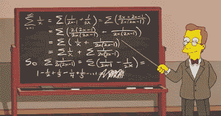
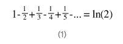
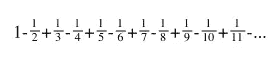
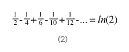
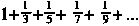
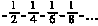
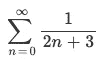
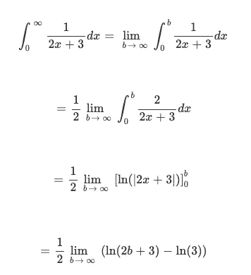
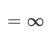
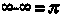

# 从辛普森一家到黎曼悖论:讨论黎曼重排定理。

> 原文：<https://medium.com/geekculture/from-the-simpsons-to-riemanns-paradox-discussing-riemann-s-rearrangement-theorem-ed2a3bfe707f?source=collection_archive---------8----------------------->

A snapshot from the Simpsons: the expansion of ln(2)

如果我告诉你，你可以从∞中减去∞得到π，即∞-∞=π，会怎么样？这难道不荒谬吗？这就是近 150 年前发现的黎曼悖论！今天我们要讲一点黎曼悖论和黎曼重排定理。但在我们开始之前，让我们先谈谈辛普森黑板中的最后一个等式，它是 2 的自然对数的扩展:

首先，我们再看几个术语，

现在我们稍微重新排列一下，加入第一和第二项，第三和第六项，第五和第十项等等，留下序号为 4 的倍数的项，

简化，我们得到，

这是令人担忧的，如果你仔细看，直接从方程(1)导出的方程(2)的项是方程(1)的一半，或者这间接说 1 = 2。嗯，数学不能被打破，所以你可能会认为我们一定是在这里犯了错误，然而我们没有！这是无穷级数的基本思想之一，它们只有在考虑给定的特定阶时才成立，对于任何其他阶，它们的预测都不再有意义。这是黎曼重排定理，也就是说，操纵给定无穷级数的顺序，我们可以得到任何想要的结果，或者换句话说，交换定理并不适用于无穷级数。

事实上，对于上面考虑的 ln 2 的收敛级数的例子，通过黎曼重排定理，可以进行操作使级数结果变成π甚至 e！很有趣，对吧？然而，现在让我们从表面上来看，如果连续求和，达到 3.14 至少需要求和 100 项。相反，让我们做点什么，把无限系列本身变成某种绝对疯狂的东西！

首先，我们分离级数的负项和正项，因此:

Positive terms

Negative terms

现在，让我们看看正项的和是收敛的还是发散的，

因为所有情况下的分母都是奇数，所以我们可以将无穷级数的正部分的和写成

我们使用积分检验来检验级数是收敛还是发散，因为 f(n)这里 1/(2n+3)既是正的又是递减的，

积分检验表明，对于 f(n)从 0 -> ∞的∑，其中 f(n)符合标准，如果 f(x)dx 从 0 到∞的∫收敛，即等于一个值，则初始求和也收敛，反之亦然

所以，计算下面的积分，我们得到

现在，当 b 趋向于∞，ln (2b+3)也趋向于∞，因此

因此，级数的正项之和是发散的，或者换句话说，当对无穷项求和时，将不会得到一个常数，而是∞。同样，也可以用同样的方法证明，负数的和也是发散的，等于-∞。记住黎曼重排定理，将它代入我们开始的方程，我们得到:

令人兴奋，不是吗？事实上，无穷多个完全没有意义的相似方程，都使用了黎曼重排定理。

所以，记住要保持你的无穷级数的各项有序，否则它们可能会变得疯狂！荷马说，“感谢你的阅读”