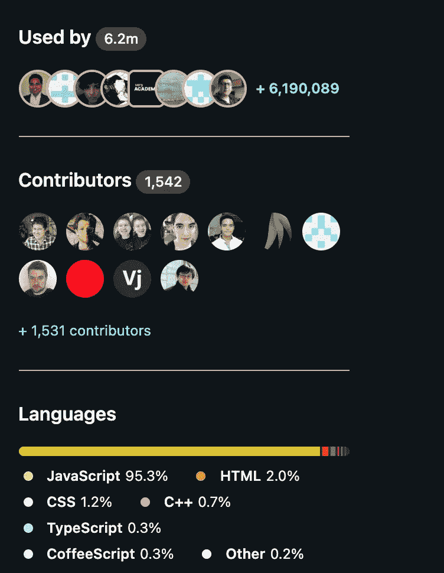
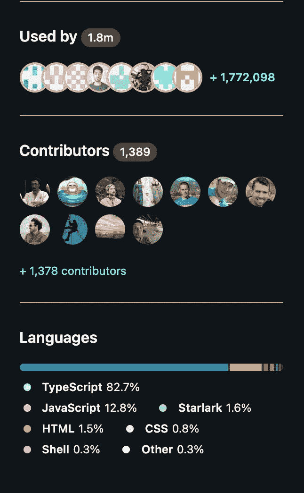
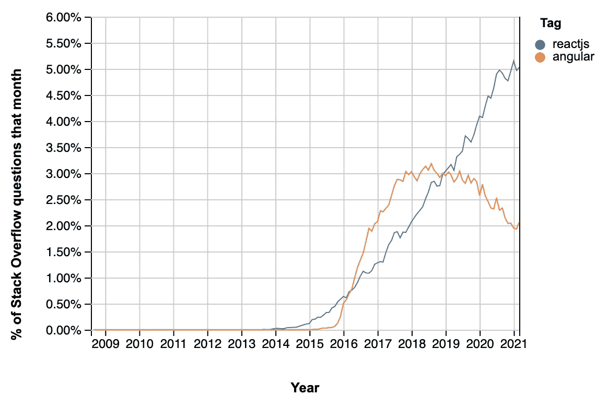

# 前端开发|技术选择 2021。

> 原文：<https://medium.com/geekculture/frontend-development-technology-to-choose-2021-49ee3ba775d9?source=collection_archive---------19----------------------->

## 在可用选项中，选择哪种技术进行前端开发。

作为一名前端软件开发人员，在开发任何项目时，您都必须面对这样的场景:决定使用哪种技术来开发应用程序的前端/客户端。在可用选项之外，选择特定的框架/库来解决您的用例变得很困难。

Photo by [Nubelson Fernandes](https://unsplash.com/@nubelsondev?utm_source=medium&utm_medium=referral) on [Unsplash](https://unsplash.com?utm_source=medium&utm_medium=referral)

在众多的框架中，排名靠前的前端框架大多是 ReactJS、Angular 和 VueJS。有趣的是，所有这些都与 Javascript 技术有关。咳咳咳！！！你能感受到 Javascript 的流行吗？如果你做一个简单的谷歌搜索，你可能会发现大多数技术极客都在为这三个主要的框架/库争论不休。作为一个初学前端开发的人，在可用的选项中选择会变得很困惑，因为即使在阅读了流行的博客之后，你也会发现一个框架/库在另一个之上。

N *ote:为什么我要提到框架/库？
原因:在列表中，Angular/Vue 是一个框架，React 是一个库，所以我想通过反复引用把这个概念放在你脑子里*

所以在这篇特别的文章中，我们将讨论一个人在为下一个大项目选择框架/库时应该考虑的所有因素。所以，我不希望任何人对要学习的技术感到困惑，因为这种困惑会导致开发人员完全离开这个领域。

产品是由你的用户界面的好坏来定义的，至少对最终用户来说是这样。最终用户并不真正关心代码是用哪种技术编写的。即使你选择了最流行的框架，但是你的用户界面并不吸引人，这也不会有任何影响。在这种情况下，如果您使用基本的 HTML 和 CSS 构建面向客户端的应用程序，但它工作得完美无缺，那么它会更受欢迎。

因此，作为开始，我们将使用统计和理论来讨论 React JS(这是一个库)和 Angular(这是一个框架)。

## 反应 JS vs Angular。

如果您计划开始前端开发，那么您很可能已经知道这些框架/库是什么，但对于其他人，让我简单解释一下。

Photo by [Sigmund](https://unsplash.com/@sigmund?utm_source=medium&utm_medium=referral) on [Unsplash](https://unsplash.com?utm_source=medium&utm_medium=referral)

## 基础

[**React JS**](https://mindroast.medium.com/) ，是一个由脸书开发和维护的库。该库于 2013 年推出，此后受到了许多开发者和组织的喜爱，如 Instagram、Twitter、网飞等。我们可以说，该图书馆自成立以来已经成长了许多。实际数据我们将在后面讨论。

另一方面， **angular** 是一个完整的 javascript 框架，它有许多现成的特性，因为它是一个框架，也是一个框架如何运行的。
只要注入依赖项，就可以使用任何特性。Angular 是由科技巨头谷歌建立和维护的。angular 的第一个版本叫做 angular JS，有很多版本。经过一段时间后，团队彻底修改了 angular，并将随后的版本命名为 angular 2、Angular 4、Angular X 等等。

## 社区支持

当您选择任何特定的技术、库或框架时，研究其社区支持是非常重要的。我们想到的第一件事是，既然我们必须编码而不是社区，为什么我们还要关心社区支持。
其背后的实际原因是，很多时候，当你开发一个新的需求时，你陷入了某些场景，而你根本不知道如何解决它。在这种情况下，你将需要良好的社区支持，通过提供解决问题的独特想法来帮助你。

## 统计的

## 反应堆

如你所见，React JS 目前有 620 万开发者在使用，这是一个巨大的数字。

*   我们还可以看到 React JS 库有大约 1542 个贡献者，他们提供有用的反馈和请求来维护库的源代码。

## 有角的

相比之下，对于 angular，我们可以说大约有 180 万开发人员使用它，这比 react years 少得多，react years 有大约 620 万开发人员使用它。

*   但是 angular JS 的贡献者是 1389，这与 react JS 相当兼容，react JS 到目前为止有 1542 个贡献者。
*   因为根据各个框架/库的官方 GitHub 库上的统计，使用 angular 的开发人员较少，但更有趣的是，与 Reactjs 相比，Angular 的贡献者几乎相等。
*   我们需要注意的另一件事是，Angular 有大约 2.4K 个开放问题和 20，000 个已关闭问题，但 react 有 526 个开放问题和 9.7 K 个已关闭问题。这清楚地表明 angular 比 react 略胜一筹。

## 堆栈流量统计

由于 React JS 和 Angular 在开发人员社区中都很受欢迎，所以绝对有必要检查堆栈溢出的统计数据，这是地球上大多数开发人员都喜欢/使用的。

从图中，我们可以看到该月与该年(从 2009 年到 2021 年)堆栈溢出问题百分比之间的分布。由于 AngularJS 首次出现是在 React JS 于 2013 年推出之前，因此我们在 2013 年之后对其进行比较是有意义的。我们可以看到，在 2019 年，我们可以看到 React 和 Angular 之间的交集。但在 2019 年之后，Angular 的问题数量有所下降，而 ReactJS 的问题数量则大幅增加。这可以推断为对 ReactJS 的需求激增，更多的开发人员正在使用 React JS。

## 反应和角度的区别

Photo by [Stillness InMotion](https://unsplash.com/@stillnes_in_motion?utm_source=medium&utm_medium=referral) on [Unsplash](https://unsplash.com?utm_source=medium&utm_medium=referral)

*   第一个也是最重要的区别是 Angular 是一个框架，而 React JS 是一个库。
*   React JS 处理虚拟 dom 的逻辑，这有助于避免无用的渲染，另一方面，Angular 处理摘要循环的逻辑。
*   在 React JS 中，由于它是一个库，我们必须引导所有的东西，所以与 Angular 相比，它可能需要更多的专业知识，Angular 是一个框架，提供几乎现成的功能。
*   在 React 中，学习曲线更短，但是如果您没有所需的技能，为您的项目实现一个基本的架构会变得棘手。但是在 Angular 中，学习曲线更多是在开始阶段，因为它是一个完整的框架，你必须理解使用它的基础。
*   在 React JS 中，我们没有 Angular 中的 CLI 工具那么先进，在 Angular 中，您可以通过使用 Angular CLI 工具来创建大多数组件、指令、模块和服务。
*   React JS 和 angular 都有很好的社区支持，所以我们不用担心那部分。

## 最后的想法

因此，由于 React JS 和 Angular 之间有巨大的差异，但主要的挑战仍然是决定选择哪一个。让我给你一个虚拟的清单，你可以在选择一个或另一个框架/库时考虑。

如果你是那些愿意从头开始构建一切的人，更重要的是，你拥有构建代码库的技能。我强烈建议你选择 ReactJS。但是如果你不想花时间构建前端应用的基础架构，那么你最好的选择是 Angular。

你应该考虑的另一件事是因为 angular 已经定义了它的核心结构，一般来说，开发者不会偏离它太多。它将帮助一个新的 angular 开发者很快开始工作，因为开发者已经知道了应用程序的基本结构。但是在 Reactjs 的情况下，如果一个新的开发人员加入你的团队，可能需要相当长的时间来理解你的代码库。

因此，如果您是一名希望在不同的可用模块中进行试验的开发人员，那么您应该选择 React JS，因为它为您提供了在众多模块中进行选择的灵活性。

Angular 还具有双向数据绑定，这有助于在组件和视图之间非常容易地更新数据。如果您的应用程序需要类似的行为，那么您知道该选择什么。

除此之外，如果你谈论优化，减少加载时间，使应用程序更具响应性，那么可以使用任何框架/库来完成，因为这将取决于试图优化代码的开发人员的专业知识。因此，基于优化因素做出决定有点不公平。

所以我的最终结论是，即使你选择任何一个库/框架，也不会有太大的区别，因为这完全取决于你如何实现代码，正如我们都知道的，最终用户甚至不关心使用了哪个框架/库。因此，不管你想用哪种语言来构建你的产品，学习如何优化代码都是最重要的。我很高兴看到您与这篇文章一起成长，并能够为他们的下一个大项目选择技术。