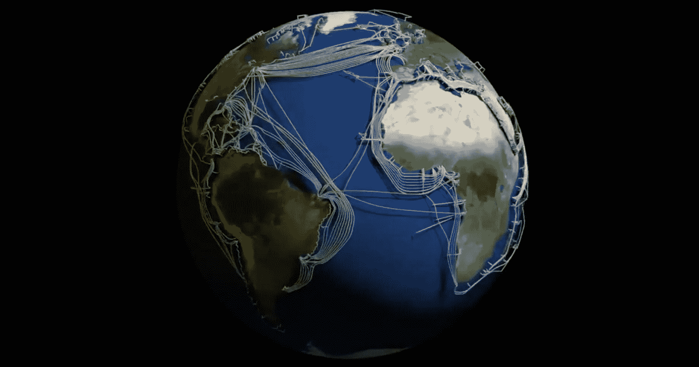

# 前端掌握——互联网是如何工作的

> 原文：<https://medium.com/geekculture/frontend-mastery-how-the-internet-works-56b184316d8d?source=collection_archive---------16----------------------->

对于一个目前对我们的日常生活如此重要的工具，令人震惊的是有多少人(甚至是软件工程师)不能用简单的语言解释互联网是什么以及它是如何工作的。很长一段时间我都不能，因为我太专注于网站的创建，以至于忘记了考虑将这些产品交付给最终用户的工作。

对互联网运作的理解给你留下了什么？除了吹嘘的权利和对奇迹的欣赏之外，了解互联网是如何工作的将使你(作为一个开发者)优化你的代码，以加快网页的交付。听起来足够有趣吗？如果是这样，让我们继续吧😁。

# 什么是互联网？

互联网是一个全球性的计算机网络，它通过互连的设备传输各种数据和媒体。它始于 20 世纪 60 年代名为 ARPANET(高级研究计划局网络)的一项实验，旨在建立一个能够经受住核攻击的通信系统(Ka-boom！！！).

***数据如何在您的设备上显示？*** 我过去认为是通过卫星，但如果是这样的话，这种延迟对于这种缺乏耐心的一代人来说是无法忍受的(是的，我在跟你说话呢😂).要了解设备如何显示页面，我们必须首先了解它们如何连接互联网。

# 我们如何连接到互联网

互联网通过铺设在几个数据中心(包含称为服务器的强大计算机的建筑物，专用于在请求时发送数据)和您的设备(客户端)位置之间的海底光缆网络(用光线传输信息)到达我们。

The earth’s submarine fiber optic cable network

当你通过 wifi 或以太网电缆连接到路由器时，我们通过我们的 ISP(互联网服务提供商，用你的钱换取浏览信用的人)连接到这个光纤电缆网络。

# 步骤 1 —请求网页

当您在浏览器中输入 URL(统一资源定位符)时，浏览器会试图获取指定域名的 IP 地址。

> 一个 **IP 地址**是分配给每一个连接到使用互联网协议的网络的设备的号码。它们的形式为 **nnn.nnn.nnn.nnn** ，其中 nnn 必须是 0-255 之间的数字。

连接到互联网的每台设备(服务器、计算机或路由器)都由一串称为 IP 地址的数字唯一标识。它就像一个运送地址，所有的信息通过它到达互联网上的目的地。

> 互联网名称与数字地址分配机构( **ICANN** )是管理 IP 地址分配和域名注册的机构。

# 步骤 2 —将域名解析为 IP 地址。

您可以通过知道网站所在服务器的 IP 地址来访问网站，但是因为它们很难记住，所以使用了与 IP 地址相对应的域名，如 google.com(目前为 216.58.223.238)。

互联网使用一种巨大的类似电话簿的服务，称为 **DNS** (域名系统)，在分布式数据库(DNS 数据库)的帮助下，跟踪互联网上的计算机名称及其相应的 IP 地址。

许多连接到互联网的称为 DNS 服务器的计算机托管 DNS 数据库的子集。通过 ISP，您的浏览器首先连接到您的主 DNS 服务器，该服务器被指定为设备上互联网连接设置的一部分。如果 DNS 服务器找不到某个域的 IP 地址，它会将发出请求的计算机重定向到另一个 DNS 服务器，直到该域被解析。

# 步骤 3 —使用 HTTP 发送请求和接收响应

获得 IP 地址后，浏览器会通过您的 ISP 将超文本传输协议(HTTP)请求转发到目标服务器。

> HTTP 是用于互联网通信的语言。HTTPS 是 HTTP 的安全版本，其中浏览器和网站之间的通信是加密的。

当服务器收到访问特定网站的请求时。数据以光脉冲的形式通过光纤电缆从服务器上以一大堆 1 和 0 的形式发送回来。在这个过程中，响应会逐渐剥离请求所经过的所有 IP 地址的洋葱层，以便找到返回发起该过程的确切机器的路径。

# 步骤 4 —重组数据包

这种介质如此高效的原因是，数据在传输之前被分解成称为数据包的微小有序片段。数据包可能不会通过相同的路径进行路由，因为它们在传输时会采用最佳的可用路由。数据包到达您的设备后，会根据互联网协议(IP)和传输控制协议(TCP)按顺序重组。

> IP 使用 IP 地址将数据包定向到特定的计算机，而 TCP 使用端口号将数据包定向到计算机上的特定应用程序。

在这些数据包被拼凑在一起之后，一个网页或资源就诞生了，并准备好供用户使用。浏览器在这方面变得如此之快，以至于大多数时候你甚至没有意识到它的发生。很神奇吧？🤯

# 结论

唷！！太多了。为了提供一个互联网的高层次抽象，并使其具有足够的消化能力，我们跳过了许多细节。现在您已经了解了数据是如何在互联网上移动的，您已经准备好掌握在浏览器上呈现网页所涉及的复杂细节以及更多内容。

> 我很高兴你花时间阅读我的博客。如果你喜欢它，给我一个**掌声**和关注我的媒体账户更多这样的内容。感谢*👋。*

# 参考

互联网是如何工作的？

[什么是互联网？](https://www.youtube.com/watch?v=Dxcc6ycZ73M&list=PLzdnOPI1iJNfMRZm5DDxco3UdsFegvuB7)

[网络如何工作——学习网络开发| MDN](https://developer.mozilla.org/en-US/docs/Learn/Getting_started_with_the_web/How_the_Web_works)

[互联网如何在 5 分钟内工作](https://www.youtube.com/watch?v=7_LPdttKXPc)

互联网是如何工作的？| ICT

[互联网是如何工作的|惠普技术公司](https://www.hp.com/us-en/shop/tech-takes/how-does-the-internet-work#:~:text=It%20works%20by%20using%20a,where%20you're%20using%20it)