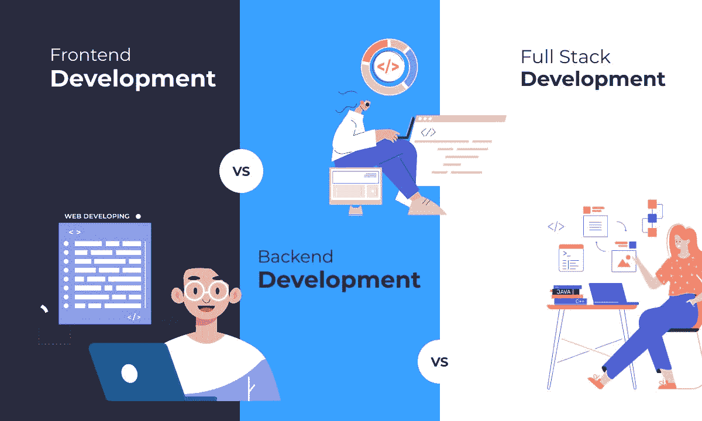
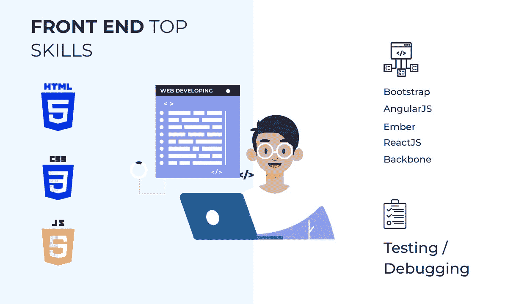
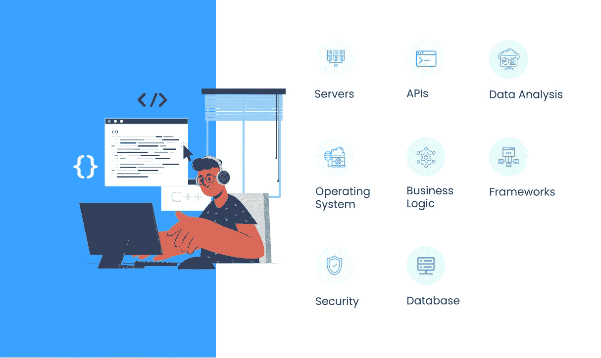
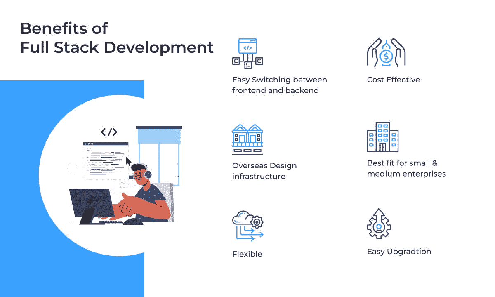
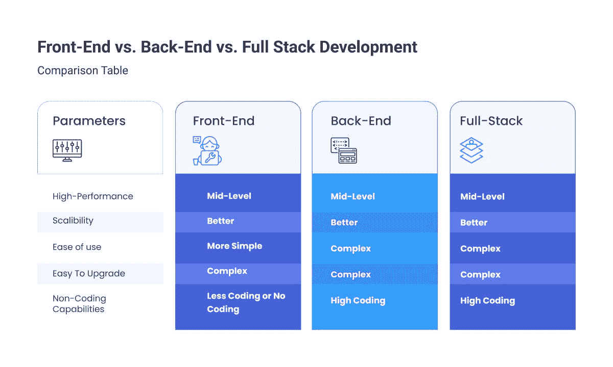

# 前端 vs .后端 vs .全栈开发:选择正确的栈

> 原文：<https://medium.com/geekculture/frontend-vs-backend-vs-full-stack-development-choose-the-right-stack-bb24799721b2?source=collection_archive---------3----------------------->

前端 vs .后端 vs .全栈开发:哪个更合适更有用？如果您对 web 应用程序开发感兴趣，您一定听说过前端、后端或全栈开发的优缺点。

但是这些术语是什么意思呢？在科技世界中，它们中的一些比另一些更有用吗？

这个博客将帮助您理解后端、前端和全栈开发之间的对比，以确定哪一个将是软件开发项目的正确栈。

*相关博客:* [*前端开发者 Vs 后端开发者:谁最适合你的企业？*](https://www.valuecoders.com/blog/technology-and-apps/frontend-developer-vs-backend-developer-who-will-be-best-for-your-business/)

# 前端开发概述

前端开发是‌building 网页的用户界面和图形元素。它包括用户在网站上看到的和与之互动的一切。

它可以是任何东西，从按钮大小和颜色到整体布局和设计。前端开发人员与后端开发人员保持联系，以确保所有网页元素无缝地协同工作。

一个好的前端开发需要对编程语言(比如 HTML、CSS、JavaScript)和图形设计原理有很强的理解。

此外，前端开发人员需要了解用户如何与网站交互，以创建一个直观和用户友好的界面。

*必读:* [*前端 vs 后端 vs 全栈开发:谁是赢家？*](/front-end-weekly/frontend-vs-backend-vs-full-stack-development-whos-the-winner-2968751b0565)

# 前端开发的优势和劣势

下面提到的要点将帮助您了解在 web 应用程序开发中使用前端的好处和缺点。

## 优势

**快速开发:**前端开发通常比全栈和后端开发要快。需要处理的文件更少，代码通常也很简单。

**更简单的代码:**前端代码通常比后端简单。如果是编码新手，可以很容易理解，从前端开发开始。

**用户驱动的结果:**前端开发是创造更加用户友好的体验的关键。通过关注人们的需求，你可以让你的网站或应用程序让他们感到愉悦，从而根据他们的需求带来更好的结果！

## 不足之处

**安全风险:**前端开发可能比后端更容易受到攻击，因为黑客更容易访问代码。

**可扩展性差:**前端 web 开发比后端或全栈的可扩展性差。当你的站点增长时，添加新的特性和功能会有更多的问题，因为前端的伸缩能力有限；但是，绕过这个问题是有办法的！

[**雇佣一个前端开发人员**](https://www.valuecoders.com/hire-developers/hire-front-end-developers?utm_source=hire_front_end&utm_medium=Guest_Blog&utm_campaign=Medium&utm_id=NKY) 因为这是确保你的网站用户体验符合现代标准的最佳方式。一个好的专家将确保所有这些漂亮的视觉效果转化为用户可以轻松交互的东西，让你有更多的时间做其他重要的工作，如营销和编码！

*你可能会觉得有趣:* [*全栈开发人员与专业开发人员:对你来说最好的选择是什么？*](/nerd-for-tech/full-stack-developers-vs-specialized-developers-whats-the-best-option-for-you-21a8ef187a9)

# 后端开发概述

后端开发是创建和管理允许网站或应用程序运行的代码和基础设施。它包括构建和维护数据库、构建业务逻辑层，以及编写处理用户输入(如提交表单)和动态显示页面的代码。

一个**后端开发人员**通常了解不同的 web 服务器(比如 Apache 或 Nginx)、编程语言(比如 PHP、Ruby on Rails、Java、Node.js)和数据库系统(比如 MySQL、MongoDB)。他们利用这些知识来创建一个既高效又可扩展的系统。

# 使用后端开发的优点和缺点

在决定前端、后端和全栈之前，先看看在 web 开发中使用后端的好处和缺点。

## 优势

**安全性:**后端代码是完成大部分工作的地方，它比前端更安全，因为黑客无法轻易访问你的数据。

**可伸缩性:**后端开发是构建你的网站或应用程序的一个很好的方式，因为当你想添加新功能时，它更容易、更灵活。

**数据管理:**后端开发过程都是关于管理数据的。这意味着您可以形成一种更有效的方式来存储和获取 web 应用程序的信息。

## 不足之处

复杂性:后端开发过程通常远比前端复杂，因为存在许多文件。

**需要更多技能:**后端开发比前端需要更多技能。如果你是新手，理解并开始后端编码是困难的，但是一旦掌握了，它为你的站点的性能提供了许多好处。

与**后端开发公司**联系，确保你的网站没有错误，用户友好。他们会为你设计一个奇妙的网站！

# 全栈开发概述

全栈开发是技术行业中使用的一个术语，用来描述在后端和前端开发方面都有经验和知识的人。

# 全栈开发的优缺点

下面的指针将向您展示如何充分利用您的全栈开发经验。

## 优势

**提高开发效率:**当你希望你的网站或应用程序的设计、编码和功能在一个包中时，全栈开发是最好的方式。

更多的代码重用:全栈开发也允许更多的代码重用。这意味着您可以在项目的前端和后端使用相同的代码，从而节省时间和金钱。

**高性能:**全栈开发的好处之一就是高性能，因为您可以优化前端和后端。

## 不足之处

**需要更多技能:**全栈开发比后端或前端开发需要更多技能。如果您是编码新手，学习和开始全栈开发可能会更具挑战性。

**更复杂:**全栈开发也可能比前端和后端开发更复杂，因为要处理更多的文件，代码通常要复杂得多。

不懂前端开发也不用担心因为有值得信赖的**全栈软件开发**公司可以帮你 [**聘请全栈开发者**](https://www.valuecoders.com/hire-developers/hire-full-stack-developers?utm_source=hire_full_stack&utm_medium=Guest_Blog&utm_campaign=Medium&utm_id=NKY) 做你的网站。这些专业人士都有后端和前端的经验，所以他们会‌get 以合理的价格所做的工作！

另请阅读:[现代企业的最佳全栈组合](https://dev.to/maryajames/the-best-full-stack-combinations-for-modern-businesses-27lk)

# 对比表:前端、后端和完整堆栈

下表可以帮助您决定哪一个最适合您:前端 vs .后端 vs .全栈战。

# 前端与后端与全堆栈，哪一个更好？

这里有一些不同的参数，可以让您知道前端、后端和全堆栈中哪一个是最好的。

## 1.高性能

全栈 web 应用程序开发最适合高性能。它允许你毫不费力地和有效地扩展，同时给你的网站提供它所需要的所有功能，没有代表开发者或设计者的麻烦！

但是，如果你想要一个功能不复杂的网站，前端或后端开发将是理想的选择。

## 2.可扩展性

对于可扩展性，全栈是一个合适的选择。您可以毫不费力地插入或删除模块，而不必担心保持所有应用程序层的一致性。但是对于较小的项目，前端或后端开发将是更好的选择。

这是因为你必须理解多种语言和框架，而不仅仅是一种语言和框架。因此，如果你打算开发一个带有偏好特性的小型 web 应用，最好是进行前端或后端开发，而不是全栈开发。

## 3.易用性

这是前端开发击败后端和全栈开发的一个因素。前端开发很容易学习和操作，因为它只需要 HTML，CSS 和 JavaScript 的知识。

但是对于后端和全栈开发，您应该了解多种语言，如 Python、PHP、Ruby on Rails 等。因此，如果您追求简单，前端是您的最佳选择。

## 4.定制开发

如果你想进行定制开发，前端是一个很好的选择。你可以在不了解后端或者全栈开发的情况下开发一个 web app。

然而，如果你需要开发一个全功能的应用程序，最好使用全栈开发，因为它包含了你的应用程序的所有层。你还应该知道后端和全栈开发的几种语言和框架，这样很难根据你的需求定制你的应用。

## 5.易于升级

通过前端开发，升级您的网站非常简单。您可以通过向 web 应用程序添加新功能来有效地升级它。

但是升级后端和全栈网站，保证任何网站层都没有 bug。

因此，如果您想要一种简单的升级方式，请选择前端开发，而不是后端或全栈开发。

因此，这些参数将帮助您在前端、后端和全栈开发中确定哪一个适合您。如果你仍然困惑，最好咨询一下网络开发公司，因为他们会建议你做出最合适的决定。

*必读:* [*一个全栈开发团队如何帮助你的创业公司成长*](https://blog.devgenius.io/how-a-full-stack-development-team-can-help-your-startup-grow-a5c6e6b6c28f)

# 最后的话

在这篇博客中，我们讨论了在决定前端还是后端还是全栈开发时要考虑的一些因素。根据你的需要，你可以选择任何‌of 这些替代品。

如果你想要一个高性能的 web 应用或网站，就去做全栈开发；如果你想要一个易于使用的网站，去前端开发，如果你想要一个自定义开发的网站/web 应用程序，去后端开发。

假设你已经为你的网站从前端、后端或全栈开发中选择了一个。在这种情况下，‌consider 从一个**后端开发者**、**前端开发者**或**全栈开发者那里获得帮助。它将帮助你在更短的时间内创建一个令人惊叹的网站。**