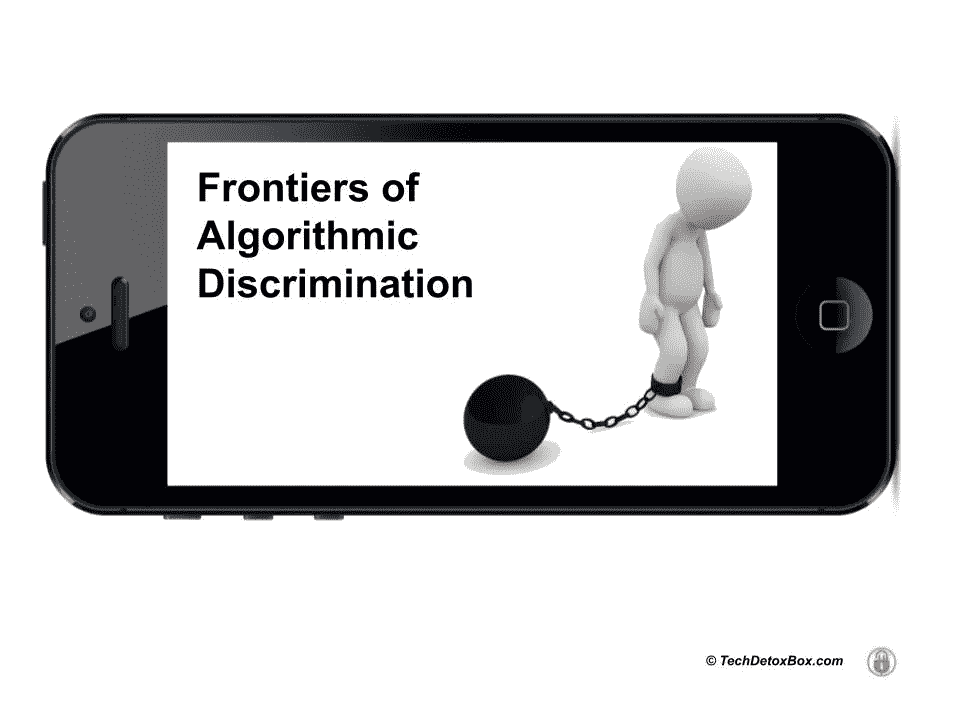

# 算法歧视的前沿

> 原文：<https://medium.com/geekculture/frontiers-of-algorithmic-discrimination-bf492c610532?source=collection_archive---------21----------------------->

# 您的数字足迹中的灰尘

在个人的数字足迹中寻找污垢正迅速成为风险管理的新标准。它正在发生。

任何行业或机构都有可能使用数字足迹。从历史上看，你的信用记录中的破产会限制你获得信贷。风险较高的客户被收取过高的利率。这是合法的:你必须支付更高的价格，以证明银行与你一起承担的风险是合理的。

保险公司可以让 T2 获得你的健康数据和驾驶模式，并据此为他们的保单定价。人力资源部门会分析社交媒体资料，任何有问题的东西都可能让你失业。十几岁时发色情短信？20 年后，你没有工作面试。每个人都可以用谷歌搜索你的名字，并根据他们看到的东西对你的性格做出最终判断——即使这不是真的。除非你住在欧洲，否则谷歌没有义务删除损害名誉的帖子。

> 我们没有[被遗忘的权利](https://gdpr.eu/right-to-be-forgotten/)，也没有被原谅的机会。

现在让我们把这个概念扩展到每一个可能的人类努力。

关于青少年网络欺凌事件的数据可以用来为他们未来的贷款和保险定价吗？为什么不呢？他们的数字足迹看起来很脏——他们应该为他们的“坏品格”付出额外的代价。这是经济规律。

*   被标记为额外的机场安检？
*   他们的恋爱选项仅限于约会应用？
*   被拒绝从事某些职业？

> 算法歧视是没有限制的。

# 算法偏差

行为特征分析已经允许广告商根据不同的人对产品进行不同的定价。算法歧视可能是有意的，也可能是无意的:广泛传播的算法偏见在市场、就业市场、教育、医疗、政治和司法系统中造成了不公平。

> 如果你是黑人，向你收取更高的贷款利率或拒绝给你工作是违法的。但是，如果一个模型因为你最喜欢的颜色是黑色，或者其他一些无法追溯到受保护的种族、性别和性身份类别的随机变量而将你标记为有风险，该怎么办？

在我们的数字足迹中可能潜伏着数百万个这样的变量，使用它们来降低风险并不违法。

我们可能认为我们过着干净正直的生活，但机器学习会发现我们隐藏的罪恶，认为我们不值得工作、大学入学、抵押贷款或约会。

> 人工智能的专有“黑匣子”不对任何人负责。

凯西·奥尼尔所著的《数学毁灭武器:大数据如何加剧不平等并威胁民主》一书讲述了许多展示大数据阴暗面的故事。影响我们生活的决定——我们去哪里上学，我们是否能找到工作或贷款，我们支付多少医疗保险——不是由人类做出的，而是由机器做出的。当算法出错时，生命就毁了——但没有办法保护自己。

没有什么是私人的了。

> 一个人羞于与治疗师分享的事实可以通过算法从我们的社交媒体历史中揭示出来。

[一项关于脸书喜欢的预测能力的研究](https://www.pnas.org/doi/10.1073/pnas.1218772110)发现,“喜欢”足以准确预测用户可能宁愿保守秘密的极其敏感的个人信息:性取向、种族、宗教和政治观点、性格特征、智力、幸福、成瘾、父母离异、年龄和性别。

研究人员警告说*,在用户不知情或未同意的情况下，使用从数百万用户那里轻易获得的如此深刻的心理洞察来影响用户的行为是非常不道德的。*

然而，这种影响力是社交媒体的商业模式。

> 与你的医生或律师不同，社交媒体公司不受道德行为准则的限制。

*   利用童年创伤和虐待的数据来销售具有危险副作用的抗抑郁药？当然可以。
*   使用隐藏性功能障碍的数据来销售伟哥并将用户引向色情网站？当然可以。
*   利用可以追溯到中学时代的深层心理不安全感来销售定价过高的品牌？为什么不呢？
*   利用身体形象问题推销昂贵的饮食和整形手术？请便。

利用自杀意念和自残的数字历史来剥削一个抑郁的青少年而不是挽救他们的生命怎么样？这要视情况而定——算法会将用户导向支付更多的解决方案——平台所有者。很有效率。它针对结果进行了优化。这是利润，而不是人类的幸福。

损害人类幸福合法吗？不幸的是，是的。这合乎道德吗？远非如此。

# 遗传歧视

数字足迹是个人至少可以部分控制的东西。你的 DNA 不是这样的。

如果你的保险公司确切知道你在一生中可能会患什么疾病，并据此给你的保单定价，或者完全拒绝，你能想象基因歧视的无限可能性吗？人寿保险拒绝那些被发现遗传上可能早逝的人？

有一些立法来防止这种情况发生——[HIPAA 隐私规则](https://www.hhs.gov/hipaa/for-professionals/privacy/index.html)保护个人的医疗记录和其他个人可识别的健康信息。

> 因为基因歧视可能是对正义和公平的高度有利可图的侵犯。

那些有着令人信服的商业利益的人可能会找到一个使用 DNA 数据的漏洞——或者强迫客户分享它，[就像我们已经在分享我们的 Fitbit 记录一样](https://www.techdetoxbox.com/digital-wellbeing/keep-your-home-dumb-the-trojan-horse-of-surveillance/)。

我个人拒绝为我自己或我的孩子获取 DNA 信息，即使它可能对我们的医疗保健有用。如果基因信息落入已经拥有我们所有数字足迹的数据经纪人手中，这可能会成为生死攸关的问题。

越来越恐怖了。人们甚至不需要医疗记录或 DNA 数据来极其精确地预测健康结果。

> 我们的 Twitter feed 是我们的健康数据。

[宾夕法尼亚大学的一项研究](https://www.authentichappiness.sas.upenn.edu/news/twitter-can-predict-rates-coronary-heart-disease)发现推特数据比所有其他风险因素(吸烟、肥胖等)更能预测心脏病和早期死亡率。)结合起来，通过简单地分析**提要中“负面情绪语言”**的频率。

据我所知，社交媒体不受医疗隐私法的保护。

这意味着你可以从你的保险公司那里收到以下信件:

> “亲爱的 X 先生，由于您的 Twitter feed 中某些 4 个字母单词的频率，我们的系统已将您确定为早期心脏病发作的高风险”。

实际上，他们不会透露任何信息。他们只会说一些含糊不清的话，比如:“根据我们政策的变化，你的保险费现在更高了”。由于缺乏算法透明度，保险公司没有义务披露其决策背后的原因。抱歉，专有信息。

自然语言处理算法可以梳理你的社交媒体，诊断身心健康问题。数据经纪人可以将这些信息与您的位置历史记录(您每天都在麦当劳吃午餐)和 Fitbit 数据(您没有移动太多)结合起来，获得您健康风险的详细信息，并出售给第三方。

> 这些数据可能会对你不利。

# 数据的人质

被你的数据挟持是一种现代形式的奴役。在古代，如果你被奴役，你可以保持内心的自由。人们可以把外在的顺从和内在的反抗结合起来。被大数据奴役就不一样了。它知道你的一举一动和每一个想法。

> 用户的数字声誉成为控制的武器。谁拥有你的数据，谁就拥有你。

著名的行为心理学家 BF Skinner 的著作《成瘾技术》在很大程度上是基于他的著作，在他 20 世纪 70 年代的争议性著作《超越自由和尊严》中，他将个人自由称为异常。超越事实。仅仅几十年前导致震惊和愤慨的可编程人类行为的概念现在已经成为现实，这是由于[机器智能和使用它进行精神控制的激励而成为可能。](https://www.techdetoxbox.com/human-brain-vs-machine-intelligence-not-a-fair-fight/)

每个社会成员的每一个结果都变得可预测和可编程。以人类个体的自由意志为代价——被社会工程的人工智能武器作为危险的异常淘汰。这是我们的现在和未来。[科技行业通过编程我们的行为来赚钱](https://www.techdetoxbox.com/weapons-of-digital-manipulation/algorithm-of-you-how-ai-programs-human-behavior/)，但是还有另一个实体对算法控制非常感兴趣——政府。

## 政府+大数据=民主的终结。

# 国家的敌人

中国的社会信用评分是 14 亿中国人的现实，也是等待我们其他人的反乌托邦未来的预演。社会信用是控制人口的算法工具:当局可以扳动开关，神奇地在数百万公民中产生想要的行为。

当然，都是打着维护治安的旗号。

它是如何工作的？简而言之，这是一种根据公民在网上和现实世界中的“不良”行为将他们列入黑名单的机制。你没有收拾你的狗，没有在错误的地方吸烟，没有把你的回收物品扔进垃圾箱，没有参加宗教集会，或者——等等— **写了一篇政治不正确的社交媒体帖子。**

你的社会信用评分下降。你的朋友注意到了，因为害怕他们的分数会因为与“国家的敌人”的联系而受到影响而抛弃了你。你的分数进一步下降，进入死亡螺旋。

> 你对自由和尊严的选择消失了。

*   *你不能买飞机或火车票*
*   *您的信用额度有限*
*   *你不能租公寓*
*   你被拒绝雇佣
*   *您无法预订酒店*
*   *你的孩子不能上私立学校，也不能上大学*
*   你被公开羞辱，你的黑名单显示在微信上，所有人都可以看到，这是一个大多数中国人使用的消息应用程序。

被政府视为“不可信”的人面临着严厉的经济和法律惩罚，他们的生活是一个活生生的地狱。

另一方面，在社交媒体上赞扬政府可以让你上白名单，获得特权和折扣。报道你的同胞的恶行，创造一种恐惧的文化也是如此。同样的社交技巧让数百万俄罗斯人葬身于斯大林时代苏联的西伯利亚古拉格集中营:邻居举报邻居，妻子举报丈夫，孩子举报父母。

政府与大企业(银行、在线市场、社交媒体平台)合作实施的大规模监控系统和人工智能使社会信用成为可能，这些大企业因担心经济制裁而有义务报告个人用户的数据。面部识别技术让任何人都无法隐藏。

奖励和惩罚。胡萝卜加大棒。非人化的人民生活在恐惧和服从政府是一个极权主义的梦想。乔治·奥威尔的反乌托邦小说《1984》成为现实，大数据为希特勒、斯大林和毛只能梦想的警察国家提供了罪证。

> 大哥一直在看。最好保持你的数字足迹干净。

[TechDetox 妈妈](https://www.techdetoxbox.com/mission-screentime-children-wellbeing/)在上瘾技术的[接收端发现了自己的孩子，决定反击。](https://www.techdetoxbox.com/screen-time-problems/)

她对技术和心理之间关系的研究试图揭示数字行为操纵是如何影响人类福祉的。

她在她的博客[TechDetoxBox.com](https://www.techdetoxbox.com/)上写道，要找到[的解决方案](https://www.techdetoxbox.com/digital-wellbeing/)来保护我们的家人，恢复我们的人性。