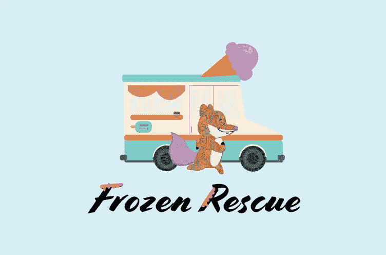
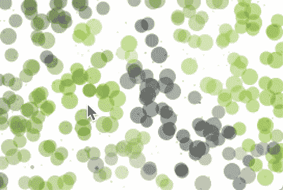
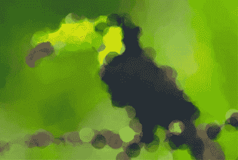
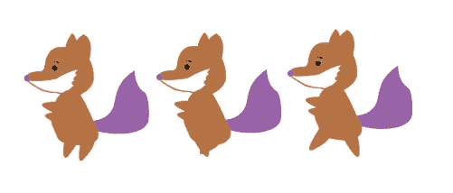
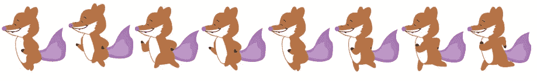
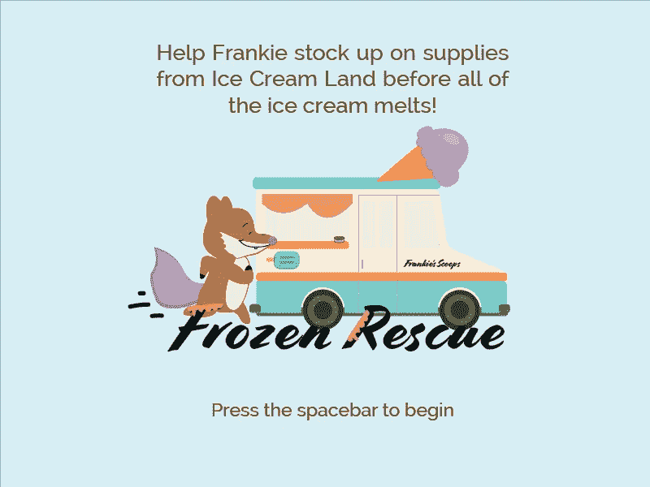
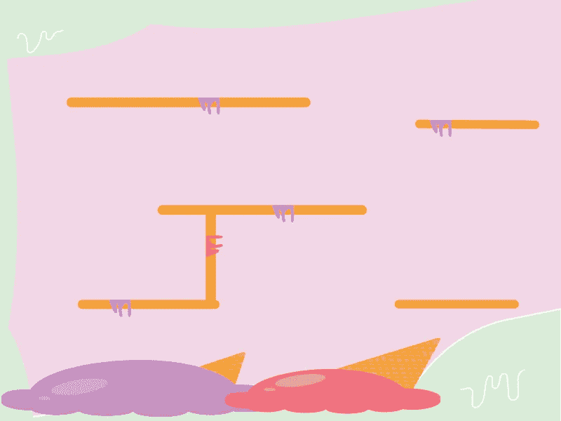
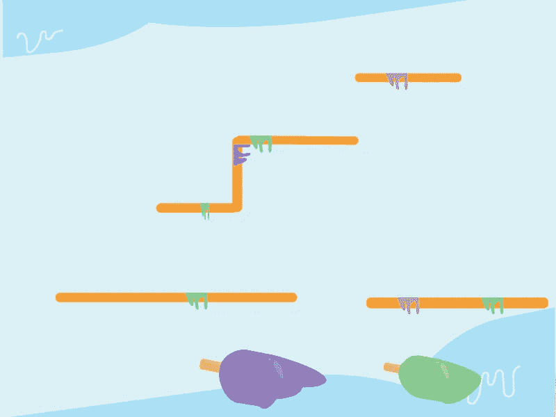
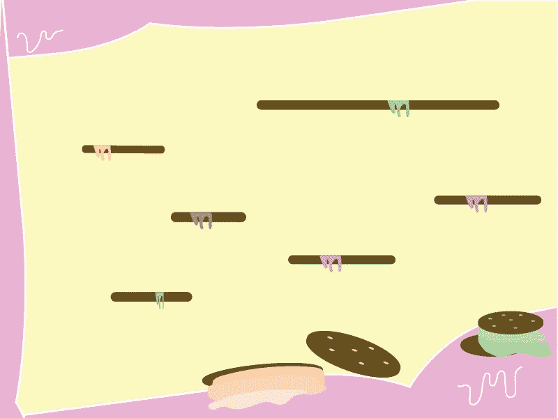
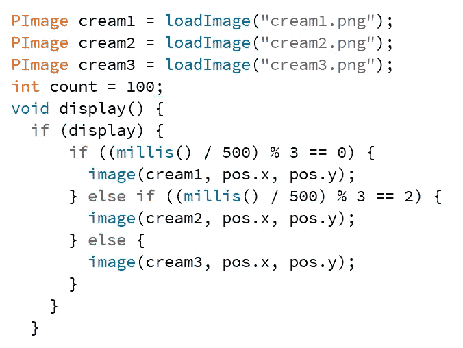

# 冰冻营救——过程中的游戏设计

> 原文：<https://medium.com/geekculture/frozen-rescue-game-design-in-processing-70dd1be83cc1?source=collection_archive---------0----------------------->

Main game screen background

# 项目概述

给定一个提供了力学和物理学的基本平台游戏框架，我通过改变游戏的视觉和听觉元素创造了一个有效和引人入胜的互动故事。我利用 Adobe Illustrator 绘制出游戏中的所有视觉效果，游戏是使用处理环境开发的。

完整的游戏可以在这里下载:https://github.com/ninalyow/frozenrescue

# 学习新技术

Processing 是一个灵活的软件速写本，也是一种学习如何在视觉艺术的背景下编码的语言。它使视觉艺术中的软件素养和技术相关领域中的视觉素养成为可能。每个处理程序称为一个草图，总体思路是让 Java 风格的编程感觉更像脚本，采用脚本的流程快速编写代码。

在开始这个项目之前，我仔细检查了所有的视觉和听觉处理能力，比如矢量线条画、曲线、形状变化和声音处理。该程序本身内置了示例、教程和库，您可以通过下载来更好地了解该程序的功能。

我在 Processing 的学习处理第二版示例系列中包含了我完成的点彩练习的快速快照。该草图接受您选择的图像，在本例中是一只巨嘴鸟的图像，当草图运行时，不同大小的椭圆将逐个像素地填充草图，直到显示整个图像。单击鼠标，椭圆的宽度将在 1px 和 20px 之间随机变化。草图运行几秒钟后，巨嘴鸟的完整图像就显示出来了。

Initial view of gathering ellipses

Final view of ellipses forming the toucan image

我在这里只介绍了一个练习，但是我建议查看更多的练习，以了解更多关于处理的知识，甚至获得一些项目想法！

# 故事发展

我被给予了完全的创作自由来为我们的游戏开发一个故事。我回想起我最喜欢的童年平台游戏，超级玛丽和索尼克是第一个进入我脑海的游戏。我记得我喜欢这两个游戏，因为主角是如此充满活力和愚蠢，我喜欢收集所有隐藏的硬币和宝石，以推进到下一个级别。我希望我的游戏也能有一个充满活力的主角，并真诚认真地去赢得每一关。

我的角色是一个友好的邻居狐狸先生，他非常喜欢吃甜食。他在执行一项任务，要把他的冰淇淋车装满来自冰淇淋王国的各种冷冻食品。他在旅途中获得的每一份冷冻食品，都为他的冰淇淋车带来了利润。

# 雪碧研究

我开始为我的角色开发行走周期，通过浏览 Youtube 教程和其他动画师的设计。我最初从狐狸先生的基本插图开始，这样我就能更好地理解精灵们在奔跑时是如何转换脚的。

Initial walking sequence

我最初的草图确实展示了一个行走动作，但是动作僵硬且起伏不定。因此，我回到绘图板，修改了我的框架，将更多的曲率融入到狐狸的肢体中，并加入了更多反映狐狸肢体运动和面部表情微小变化的框架。我还给他加了一点甜食，为他的个性增添乐趣。

Final walking sequence

# 水平发展

游戏骨架包括以下开始元素:静态线平台和墙壁，硬币对象，后续级别的门户和游戏物理，使行走和跳跃动画更真实。我修改了游戏中的静态元素，通过创建不可见的平台和墙壁元素来匹配每个关卡的背景图像，以反映冰淇淋世界。

Game Level backgrounds : Starting screen, Level 1, Level 2, Level 3

每一关都被设计得越来越难，因为坠落变得越来越危险，在平台上航行变得越来越有挑战性。对我来说，为每一关开发不同的主题很容易，因为我喜欢冰淇淋，对我来说，没有什么比给小冰淇淋甜筒、冰棍和冰淇淋三明治配插图更令人兴奋的了。我将每一关的调色板保持为柔和的色调，以反映游戏轻松愉快的本质。

# 游戏机制

我看了一下原始的游戏物理，看看我如何修改它，以更好地适应福克斯先生的角色。我尝试了一些加速度、速度和重力的组合，最终得到了下图所示的动作。狐狸先生带着一种紧迫感快速地去拿蛋卷冰淇淋。由于他是在一个冰冻的世界中航行，当他通过平台上的光滑表面收集加速度以获得动力时，他的奔跑也有一点打滑。

Close-up of Mr.Fox’s movements

游戏骨架有一个由椭圆表示的静态硬币对象。我最初将最初的硬币对象替换为静态的冰淇淋蛋筒对象，但在测试完游戏后，我觉得可以在游戏中添加更多的运动，以融入更多的刺激和乐趣。下面显示的代码描述了我是如何实现挥动冰淇淋蛋筒的效果的。

Coin object animation

我通过加载硬币的图像来表示一个硬币对象，在这个例子中是一个冰淇淋蛋卷，保存在 30、60 和 90。然后，我使用 **millis()** 返回游戏开始运行以来的时间，并将返回值同步到硬币对象的三个图像，这样每三个时间段就会显示一个不同的硬币图像

当我给游戏对象添加更多的动画时，我也发现了一些有趣的转换函数。我用 **pushMatrix()** ， **pullMatrix()** 让传送门随着每一关播放的音乐在时间上逐渐增长和收缩。[处理网站](https://processing.org/reference/)有如此多的函数库可供选择，让任何游戏或任何程序变得栩栩如生。我很想看看这些功能还能实现什么其他的动画！

# 游戏进行中

下面演示了一个接一个的播放过程。玩家必须通过典型的键盘动作(左/右移动和空格键跳跃)来导航狐狸先生通过冰淇淋世界，以拾取冷冻的食物。然后玩家可以通过一个旋转的黄色门户进入下一关。

**主要特性:**

*   旋转放置在每一层的冷冻食物
*   每一关都有独特的背景音乐
*   流畅的行走和跳跃动画
*   分数计数器标记玩家的进步
*   战略墙和平台的位置，以增加每个级别的难度
*   带有重启游戏选项的赢输屏幕

# 最后的想法

我做了这个游戏，作为乔治亚理工学院互动产品课程(ID 3510)的作业的一部分。我非常喜欢制作这个游戏，从故事和角色发展到磨练新的开发技能，让我的故事变得栩栩如生。这个项目最吸引我的是游戏设计的复杂性。我想创造更多的关卡，也许还会增加一个 boss 关卡，让游戏更加刺激。

# 感谢阅读！