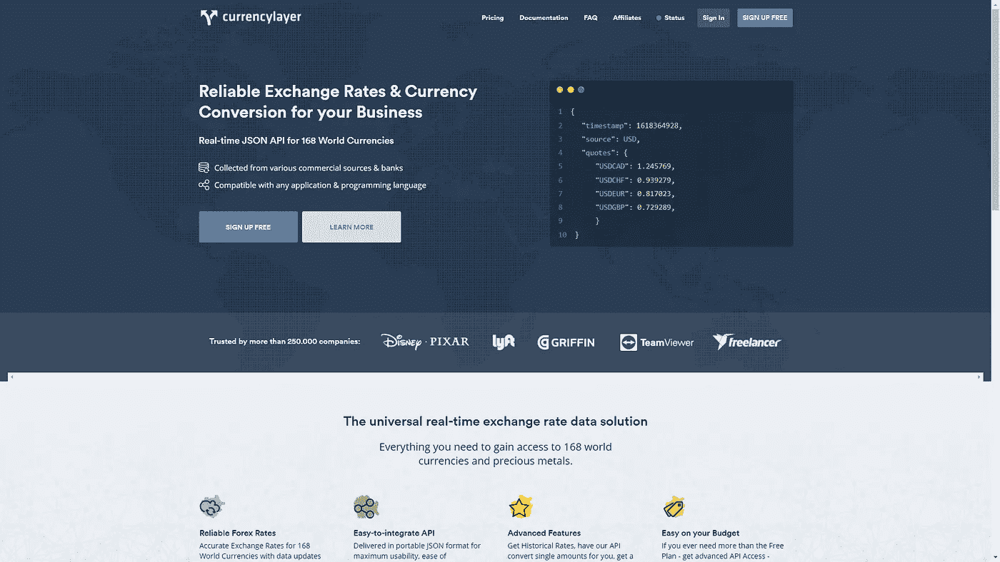
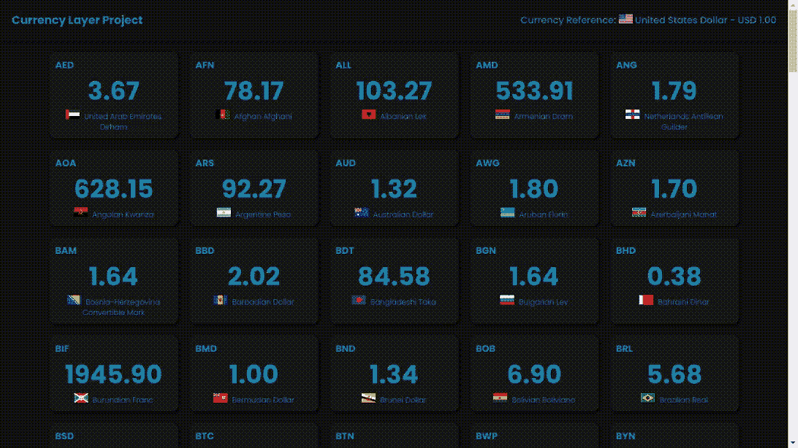

# 简介—使用 Vuejs3(组合 Api，不带 Vuex 的 Store)+Nodejs(Typescript，Express，Axios)跟踪货币的完整应用程序

> 原文：<https://medium.com/geekculture/full-app-for-tracking-currencies-with-vuejs3-composition-api-store-without-vuex-nodejs-90ce5e868ec2?source=collection_archive---------22----------------------->

你好，世界，在本教程中，我们将学习一些关于 web 编程的知识，使用现代模式和现代工具来构建我们令人敬畏的想法。

摘要

*   **1 -简介***
*   [2 -后端](/geekculture/full-app-for-tracking-currencies-with-vuejs3-composition-api-store-without-vuex-nodejs-f352e0f848f7)
*   [三前端](/geekculture/full-app-for-tracking-currencies-with-vuejs3-nodejs-typescript-frontend-150d8dbfabd1)

自从 Vuejs 3 发布以来，新的功能不断涌现。例如，组合 API，新的反应性属性，如引用、反应性、传送功能等。您可以在 [Vuejs 文档](https://v3.vuejs.org/guide/installation.html#release-notes)上阅读所有这些功能。在这里你将会看到其中的一些。

# 该项目

Photo by [Scott Graham](https://unsplash.com/@homajob?utm_source=medium&utm_medium=referral) on [Unsplash](https://unsplash.com?utm_source=medium&utm_medium=referral)

我们的应用程序将通过我们的后端 Nodejs 应用程序从许多国家获取货币值，并在我们的 Vuejs3 应用程序中显示它，很容易！

数据将由[货币层](https://currencylayer.com/)提供。

## 货币层

Currency layer 是一家提供 API 的公司，它提供了一系列关于金融世界的特性。

他们在其 API 中提供免费访问，但有一些限制，这对我们来说是完美的，即使如果你想，你可以付费获得完全访问。

有很多很棒的公司在使用他们的 API，比如:暴雪、英特尔、迪士尼皮克斯等等，所以它对你来说很有价值。

你可以查看货币层网站[这里](https://currencylayer.com/)。

## 最后的结果

看起来很神奇，你不觉得吗？

# 我们开始吧

Photo by [Dayne Topkin](https://unsplash.com/@dtopkin1?utm_source=medium&utm_medium=referral) on [Unsplash](https://unsplash.com?utm_source=medium&utm_medium=referral)

首先，我们需要在货币层网站上创建一个免费帐户。

所以，去[https://currencylayer.com/signup/free](https://currencylayer.com/signup/free)然后拿你的访问密钥。请将它保存在安全的地方，因为您很快就会用到它。

现在让我们创建我们的 API。

[下一步—后端](https://vinibr.medium.com/full-app-for-tracking-currencies-with-vuejs3-composition-api-store-without-vuex-nodejs-f352e0f848f7)

或者，如果您想查看整个项目，可以访问 git 存储库:

[https://github . com/vini salves/currency-layer/blob/main/readme . MD](https://github.com/vinisalves/currency-layer/blob/main/README.md)