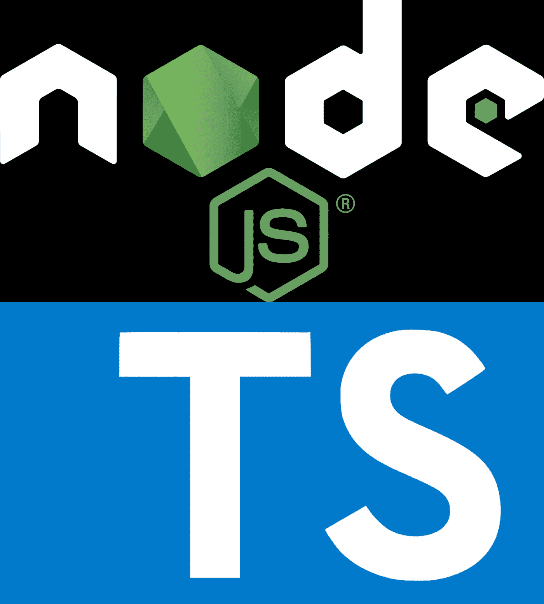
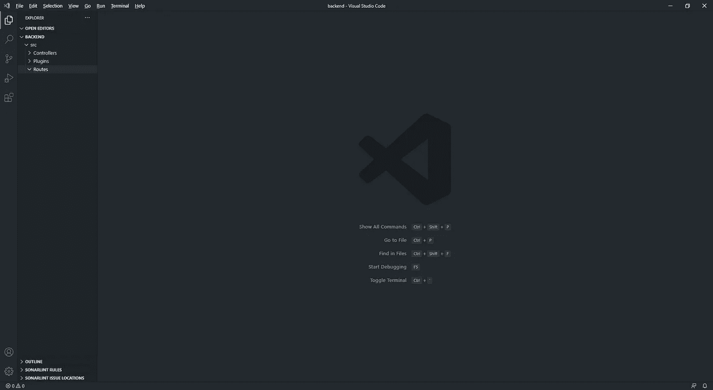

# 后端—使用 Vuejs3(组合 Api，不带 Vuex 的 Store)+Nodejs(Typescript，Express，Axios)跟踪货币的完整应用程序

> 原文：<https://medium.com/geekculture/full-app-for-tracking-currencies-with-vuejs3-composition-api-store-without-vuex-nodejs-f352e0f848f7?source=collection_archive---------13----------------------->

让我们创建 API 来为我们的前端应用程序提供所有数据。

摘要

*   [1 -简介](/geekculture/full-app-for-tracking-currencies-with-vuejs3-composition-api-store-without-vuex-nodejs-90ce5e868ec2)
*   **2 -后端***
*   [3-前端](/geekculture/full-app-for-tracking-currencies-with-vuejs3-nodejs-typescript-frontend-150d8dbfabd1)

为了构建它，我们将使用 NodeJs 和 Typescript、Express Js、Axios js 以及其他一些包。

基本上，我们的 API 将获取货币层 API，然后将其格式化，以便更容易在我们的 Vuejs 应用程序中显示。



# 我们开始吧！

首先，我建议你使用 VS 代码作为你的 IDE 来构建这个项目，尽管如此，你也可以使用你最喜欢的 IDE。

> 你可以点击[这里](https://code.visualstudio.com/download)下载 vs 代码

# 创建项目

> 你必须在你的计算机上正确地安装一个节点，不是吗？因此，点击[此处](https://nodejs.org/en/)下载并安装它。

1 -在你的电脑上创建一个名为“currency_layer”的文件夹，这是我们项目的根路径。

现在在我们的根路径中创建另一个名为“后端”的文件夹，在“后端”文件夹中创建如下结构的文件夹。



```
currency_layer/backend/src
                       -> Controller
                       -> Plugins
                       -> Routes
```

在后端文件夹中打开一个终端，运行下面的命令创建我们的 package.json。

`npm init -y`

> -y 或-yes 用于跳转所有问题并使用默认值。我们将很快更新这个文件。
> 
> 可以按 **ctrl + shift + '** 打开 VS 代码上的一个终端

## 安装依赖项

让我们添加编码所需的所有依赖项。

在同一个终端上运行以下命令:

要安装所有生产依赖项

`npm i express cors axios dotenv concurrently`

```
npm i = npm installexpress is one the most popular web frameworks for NodeJs.cors is a Nodejs package to use as a Express middleware that help us to configure which origins are allowed to load the backend resources. Have you seen the error “Cross-Origin Request Blocked: The Same Origin Policy disallows reading the remote resource at 'some host'. This can be fixed by moving the resource to the same domain or enabling CORS."? the cors package is used get rid of it. More info here: [cors docs](https://github.com/expressjs/cors#readme), [Cross-Origin Resource Sharing-MDN](https://developer.mozilla.org/en-US/docs/Web/HTTP/CORS)axios is a promise based HTTP client for the browser and node.js. More info [here](https://github.com/axios/axios/blob/master/README.md).dotenv is a awesome package to deal with importing environment files. More info [here](https://github.com/motdotla/dotenv#readme).concurrently package give us the power of run multiple commands concurrently, in our case we are going to start up our backend and frontend using this tool. More info [here](https://github.com/kimmobrunfeldt/concurrently#readme).
```

安装开发依赖项

`npm i -save-dev @types/cors @types/express ts-node-dev typescript`

```
npm i -save-dev or -D is used to define the dependency as development dependency. It means, in production environment these dependencies won't used.To use the types of our packages in typescript we need to import their respective types, because this we need to import:  @types/cors @types/express.ts-node-dev is a package to help us during the develpoment process using typescript, adding it any change in our code will restart our app automatically.
```

Typescript 需要一些配置才能正常工作，进入后端文件夹，从 src 文件夹创建 tsconfig.json 文件并放置这些配置。

```
*tsconfig.json{
  "compilerOptions": {
    "target": "es6", 
    "module": "commonjs",
    "declaration": true,
    "outDir": "dist", 
    "strict": true, 
    "allowSyntheticDefaultImports": true, 
    "esModuleInterop": true, 
    "skipLibCheck": true, 
    "forceConsistentCasingInFileNames": true, 
  },
  "include": ["./src/**/*"],
  "exclude": ["./dist"]
}
```

> 要了解 tsconfig.json 中这些参数的更多信息，您可以阅读:[https://www . typescriptlang . org/docs/handbook/ts config-JSON . html](https://www.typescriptlang.org/docs/handbook/tsconfig-json.html)

不错，一切都做好了，开始编码。

# 编码

你还记得我在上一个教程中写的货币层访问键吗？是时候用了。

> 如果你没有阅读本教程的前一部分，你可以在这里阅读

我们将使用一个. env 文件来存储我们的敏感数据，如 access_key、服务端口和货币层端点。

创建新的。env 文件放入根文件夹，并将数据如下所示:

```
PORT=4000
BASE_API=http://apilayer.net/api/
ACCESS_KEY=YOUR_ACESS_KEY
```

## 使用 Axios 的好方法

让我们开始创建我们的 Axios 插件，这种方式使我们的请求将更加容易和聪明。

因此，在 Plugins 文件夹中，创建 ApiCurrencyLayer.ts 文件，如下所示。

0

这样，我们只需要导入这个文件并调用 currencyApi.get("relative_path ")，尽管如此，使用 axios 拦截器，我们可以在所有请求中注入 access_key。

## 控制器

现在，让我们创建控制器，从货币层 api 请求数据；

在 Controllers 文件夹中创建一个名为 Currency.ts 的新文件，我们的 Currency 类将有两个方法，get Currency 和 getCountryList。

如果您检查从货币层 api 返回的数据，您会看到如下内容:

```
{
  "success":true,
  "terms":"https:\/\/currencylayer.com\/terms",
  "privacy":"https:\/\/currencylayer.com\/privacy",
  "timestamp":1618711984,
  "source":"USD",
  "quotes":{
    "USDEUR":0.834589,
    "USDGBP":0.722883,
    "USDCAD":1.25065,
    "USDPLN":3.790775
  }
}
```

“quotes”属性包含对我们很重要的数据，但是我不喜欢它返回的键和值模式。因此，在我们的代码中，我们将把它转换成这种模式:

```
[
{"code":"USDAED","value":3.673204},         {"code":"USDAFN","value":77.524944},{"code":"USDALL","value":102.75456},{"code":"USDAMD","value":521.492745}
...
]
```

在 Currency.ts 中，将此代码放在下面:

## 路线

是时候创建指向控制器的路线了。

在 Routes 文件夹中创建一个新文件 Routes.ts，并将以下代码放入:

## 最后是我们的应用和服务器

进入根文件夹 src，创建一个名为 App.ts 的新文件，这将是我们的主 App 文件。

最后，使用下面的代码在 src 文件夹中创建另一个名为 Server.js 的新文件:

## Npm 脚本

要运行我们的项目，让我们配置 package.json 来运行我们的项目。

我们将在开发过程中使用 ts-node-dev 来帮助我们，这样我们就不需要编译我们的 typescript 代码来更新我们的应用程序，并且一些代码甚至一些依赖关系的所有更改都会自动重新加载我们的应用程序。很不错，你不觉得吗？

将这些脚本添加到 package.json 中

```
"scripts": {
    "build": "tsc",
    "dev": "ts-node-dev --respawn --transpile-only --ignore-watch node_modules --no-notify src/server.ts"
  },
```

## 运转

进入项目运行的终端:

`npm run dev`

您应该会看到“Express server 侦听端口 4000”:


现在，您可以在 http://localhost:4000/API/currences 上请求它来获取货币，或者使用[http://localhost:4000/API/countries](http://localhost:4000/api/countries)来列出所有国家。

让我们在下一个教程中构建我们的前端应用程序。

[上一篇介绍](https://vinibr.medium.com/full-app-for-tracking-currencies-with-vuejs3-composition-api-store-without-vuex-nodejs-90ce5e868ec2) — [下一篇前端](https://vinibr.medium.com/full-app-for-tracking-currencies-with-vuejs3-nodejs-typescript-frontend-150d8dbfabd1)