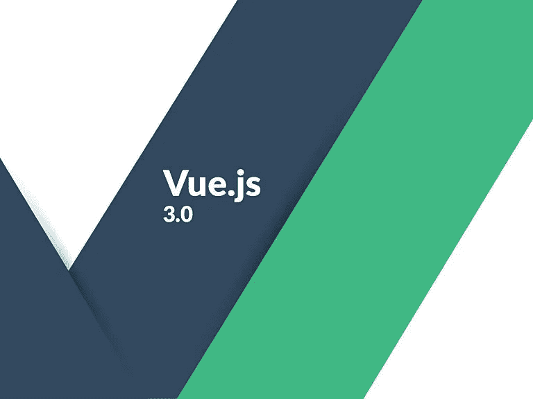
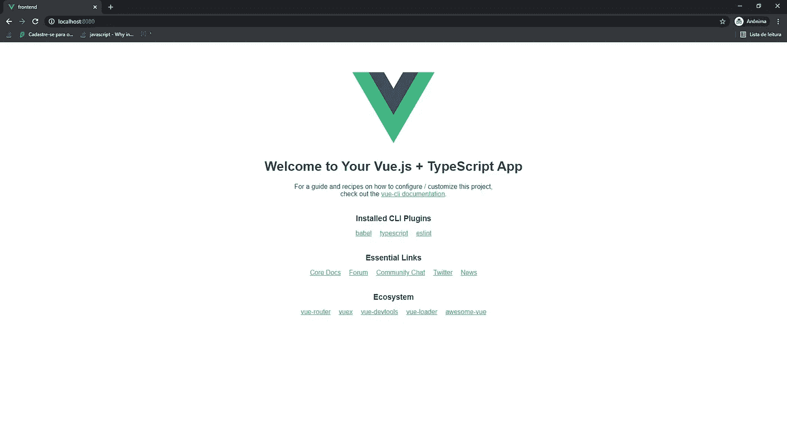
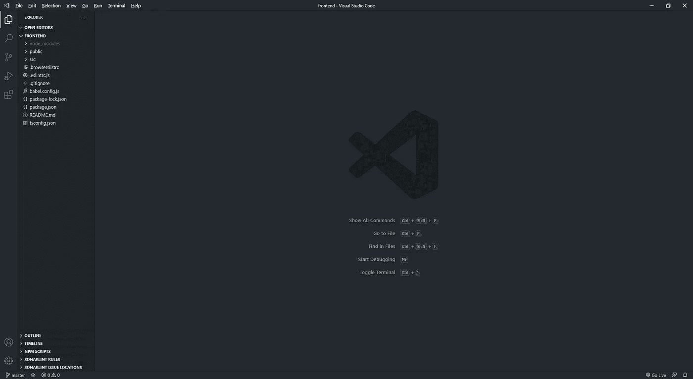
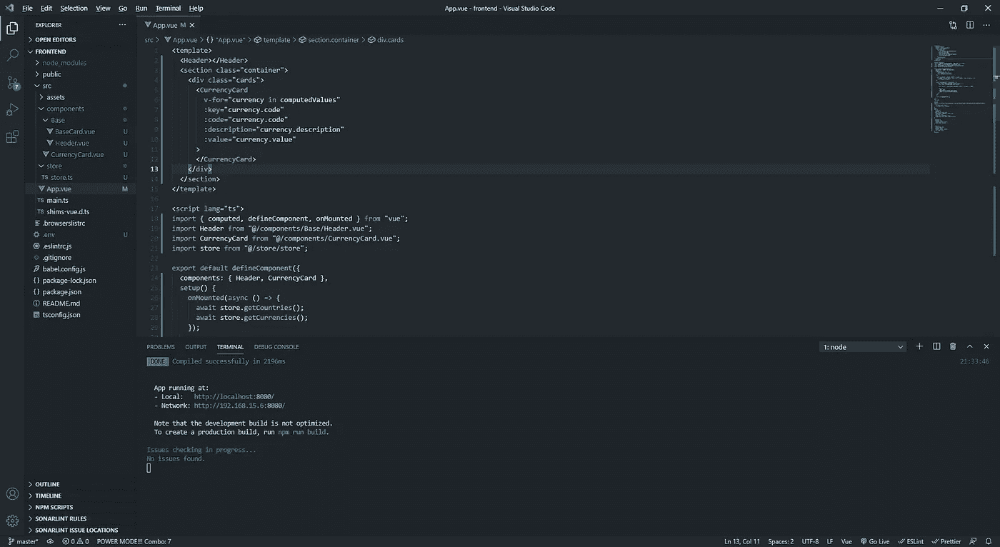

# 前端—使用 Vuejs3(组合 Api，不带 Vuex 的存储)+ Nodejs (Typescript，Express，Axios)跟踪货币的完整应用程序

> 原文：<https://medium.com/geekculture/full-app-for-tracking-currencies-with-vuejs3-nodejs-typescript-frontend-150d8dbfabd1?source=collection_archive---------16----------------------->

让我们构建我们的 Vuejs 3 应用程序。



摘要

*   [1 -简介](/geekculture/full-app-for-tracking-currencies-with-vuejs3-composition-api-store-without-vuex-nodejs-90ce5e868ec2)
*   [2 -后端](/geekculture/full-app-for-tracking-currencies-with-vuejs3-composition-api-store-without-vuex-nodejs-f352e0f848f7)
*   **3 -前端***

首先，让我们将运行此命令的 Vue CLI 安装到终端中。

```
npm install -g @vue/cli
```

要使用 vue Cli 创建 Vue 项目，请运行:

`vue create frontend`

> 在 currency-layer 文件夹中运行此命令

请遵循以下说明:

```
? Please pick a preset: **Manually select features**
? Check the features needed for your project: **Choose Vue version, Babel, TS, Linter**  
? Choose a version of Vue.js that you want to start the project with **3.x (Preview)**
? Use class-style component syntax? **No**
? Use Babel alongside TypeScript (required for modern mode, auto-detected polyfills, transpiling JSX)? **Yes**
? Pick a linter / formatter config: **Prettier**
? Pick additional lint features: **Lint on save**
? Where do you prefer placing config for Babel, ESLint, etc.? **In cd frodedicated config files** ? Save this as a preset for future projects? (y/N) **No** //if you want you can type **y** to save it for the next projects
```

回答完所有问题后，按“Enter”并等待安装过程，安装完成后，在您的终端中运行以下代码:

`cd frontend
$ npm run serve`

现在，使用您的 web 浏览器访问 http://localhost:8080/



用你的 IDE 打开前端文件夹，你会看到这个结构:



首先让我们删除 components 文件夹中的 HelloWorld.vue。

到 App.vue 文件中删除对 HelloWorld 组件的引用，你的文件应该是这样的。

```
<template>

</template><script lang="ts">
import { defineComponent } from "vue";export default defineComponent({
    name: "App",
});
</script>
<style>
#app {
  font-family: Avenir, Helvetica, Arial, sans-serif;
  -webkit-font-smoothing: antialiased;
  -moz-osx-font-smoothing: grayscale;
  text-align: center;
  color: #2c3e50;
  margin-top: 60px;
}</style>
```

在 src 文件夹中创建一个名为 store 的新文件夹，我们将在其中创建我们的共享对象，而不是使用 VUEX。

在这个项目中，我们将使用一个. env 文件来存储我们的后端 api 端点。

创建新的。env 文件放入根文件夹(在 src 文件夹之外),并将此内容:

```
VUE_APP_BASE_API=http://localhost:4000/api
```

Vuejs 自动导入以 VUE_APP 开头的变量。很好，你不觉得吗？

但是有一些重要的信息需要了解:

。env 是一种使用 VueJs 定义它的通用方法，您也可以定义. env.production 和. env.staging，但是它们在构建过程中有不同的优先级。

. env.production 的优先级高于 generic .env。

所以，在你的发展过程中，一定要小心。你可以在这里阅读关于它的一切。

让我们在 App.vue 文件中设置一些全局样式，以便在我们的组件中使用它。

使用以下代码更新 App.vue 文件中的样式部分:

```
<style>
[@import](http://twitter.com/import) url("[https://fonts.googleapis.com/css2?family=Poppins:wght@100;300;500;700&display=swap](https://fonts.googleapis.com/css2?family=Poppins:wght@100;300;500;700&display=swap)");
:root {
  --primary-color: #111;
  --secondary-color: #1289a7;
}
html,
body {
  margin: 0;
  padding: 0;
  box-sizing: border-box;
  font-family: "Poppins", sans-serif;
  font-size: 1em;
  color: var(--secondary-color);
  background-color: var(--primary-color);
}.container {
  display: flex;
  justify-content: center;
  align-items: center;
}
</style>
```

现在，在文件夹组件内部创建一个名为 Header.vue 和 BaseCard.vue 的新文件。

> Header.vue 将是我们的应用程序
> BaseCard 的头。vue 将是一个可重用的基础组件，用于创建其他组件

将以下代码放入 Header.vue 中:

在我们的 BaseCard.vue 中输入代码:

在 BaseCard 组件中，我们使用了 Vuejs 的一个强大功能，称为插槽。基本上使用插槽，我们可以定义其他组件填充它的空白空间。你可以在这里阅读更多信息:

是时候创建我们的货币卡了。


正如你所看到的，每个国家都有国旗，为了做到这一点，我们将使用一个包含这些国旗的包，名为 [currency-flags](https://github.com/transferwise/currency-flags#readme) 。

那么，让我们安装它:

```
npm i currency-flags
```

要导入它，请更改 main.ts 文件，如下所示:

```
import "currency-flags/dist/currency-flags.min.css";
```

现在，在 components 文件夹中创建一个名为 CurrencyCard.vue 的文件，并将代码放在下面:

该组件导入我们的 BaseCard，并使用简写方式为每个插槽插入内容，并接收三个参数:描述、代码和值:

使用命名槽的最简单方法是:

```
<template #title> {{ code }} </template>
```

另一种方式:

```
<template v-slot:title> {{ code }} </template>
```

要使用货币标志，我们只需使用以下模式插入一个类:

```
currency-flag currency-flag-currency_symbole.g.
currency-flag currency-flag-usd
```

由于该组件接收属性，其中一个是货币代码，我们可以这样动态地使用它:

```
<span class="currency-flag" :class="'currency-flag-' + code.toLowerCase()"></span>
```

> :class 是一个短方法，长方法是 v-bind:class

## 商店策略

Vuejs3 给了我们一些创建反应属性的方法，我们来看看其中的一些: **ref()** ， **reactive()** 。

这些方法的基本区别在于:

ref()用于基元值:

*   线
*   数字
*   BigInt
*   布尔代数学体系的
*   标志
*   空
*   不明确的

ref()只有一个名为的属性。值，我们可以访问 ref()对象的值，甚至可以更改它。

```
const myInt = ref(0)// Number;
const myStr = ref("My String")// String;
...myInt.value = 2;console.log(myStr.value)
//My String
```

然而，在我们的模板中，我们不需要使用。值，因为当 ref()对象作为属性返回到渲染上下文时，默认情况下它会打开这些属性。

```
<div> {{myStr}} </div>
```

reactive()用于对象，我们可以通过直接访问对象值来改变它。

```
const state = reactive({ isLogged: Boolean, users: User[]})
...state.isLogged = true;
console.log(state.isLogged);
//true
```

在模板中

```
<div> {{state.users}}</div>
```

在此之后，让我们创建我们的商店，它将基本上是一个具有方法的对象和一个使用反应方法的状态属性。

> 建立商店模式有很多方法，这只是一种简单的方法，在大型项目中，我们可能需要其他方法，但通过这个例子，你可以了解一点它是如何工作的，也许可以创建自己的策略。

在 store 文件夹中，创建一个名为 store.ts 的新文件，并将以下代码放入:

差不多完成了，让我们更新我们的 App.vue 来使用 store 对象和我们的组件。

制作如下所示的 App.vue:

正如您在这个文件中看到的，我们在模板的根中有两个元素(Header、Section)。自从 Vuejs3 来到我们这里就有可能。

基本上，我们在 Mounted 事件上调度 getCountries 和 getCurrencies，这样 store.state.countries 和 store . state . currency 从我们的后端应用程序返回它们的值。此外，我们有一个计算属性来处理这两个数组，并返回第三个数组，其中包含在卡组件中使用的正确参数(代码、描述和值)。当 computedValues 变量包含元素时，它将使 current card 组件中的“for”命令对每个元素进行迭代，从而创建所有的 current card。

## 终于，该跑步了

只需运行以下命令:

```
npm run serve
```

你应该这样留言:



只是不要忘记在访问 [http://localhost:8080](http://localhost:8080) 之前启动你的后端应用程序

感谢您阅读本文。它花了我生命中的几个小时。我是巴西人，对于英语语言中的任何错误感到抱歉，请考虑给我鼓掌=)

[前后台](https://vinibr.medium.com/full-app-for-tracking-currencies-with-vuejs3-composition-api-store-without-vuex-nodejs-f352e0f848f7)

要查看这个项目的 github 库，你可以点击[这里](https://github.com/vinisalves/currency-layer/blob/main/README.md)