# 分类任务的完整数据分析(监督学习)

> 原文：<https://medium.com/geekculture/full-data-analysis-for-a-classification-task-supervised-learning-e6cc4a85f7ee?source=collection_archive---------5----------------------->

感谢 **Hyosang Kim(富柏林)、Raniyaharini Rajendran(富柏林)**的团队合作！

**监督学习(SL)** 是学习一个函数的[机器学习](https://en.wikipedia.org/wiki/Machine_learning)任务，该函数[基于示例输入输出对将](https://en.wikipedia.org/wiki/Map_(mathematics))输入映射到输出。[1]大多数实用的机器学习使用监督学习。监督学习问题可以进一步分为回归和分类问题。

今天，我们将进行全面的数据分析。为了进行分析，我们将使用成人数据集([https://archive.ics.uci.edu/ml/datasets/adult](https://archive.ics.uci.edu/ml/datasets/adult))，其中包含来自美国的人口普查数据。目标是预测一个人的年收入是否超过 5 万美元。我们考虑的是积极阶层，年收入超过 5 万英镑。

**了解数据集**

为了看看我们有什么，让我们看看文件。

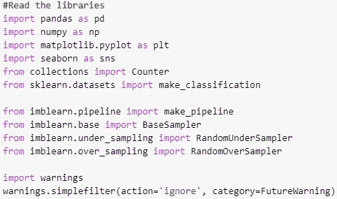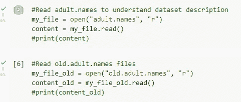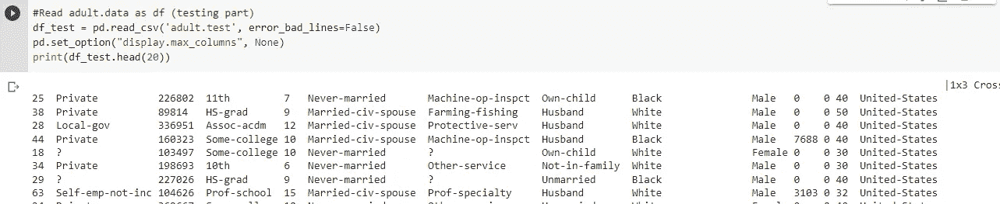

正如我们看到的，我们必须手动添加列名。

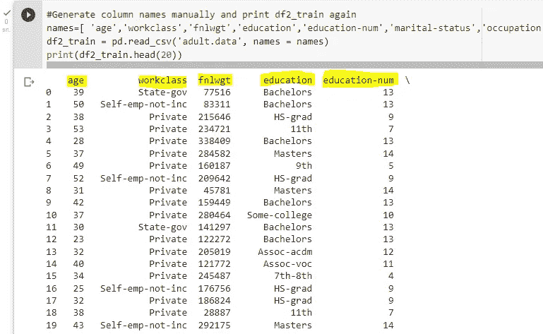

标签:> 50K，<=50K

Dataset characteristics: Multivariate

Attribute characteristics: Categorical, Integer

Number of Instances(Total): 48842

Number of Instances(Train):32561

Number of Instances(Test):16281

Number of Attributes:14

**年龄:**连续。

**工作类:**私人，自营企业，自营企业，联邦政府，地方政府，州政府，无薪，从未工作。

**fnlwgt:** 连续。

**教育:**学士、部分大学、11 年级、HS-grad、Prof-school、Assoc-acdm、Assoc-voc、9 年级、7-8 年级、12 年级、硕士、1-4 年级、10 年级、博士、5-6 年级、学前班。

**教育-编号:**连续。

**婚姻状况:**已婚-未婚-配偶，离婚，未婚，分居，丧偶，已婚-配偶不在，已婚-配偶。

职业:**技术支持、工艺修理、其他服务、销售、行政管理、专业教授、清洁工、机器操作检查、行政文员、农业渔业、运输搬运、私人住宅服务、保安服务、武装部队。**

**关系:**妻子，亲生子女，丈夫，非家庭成员，其他亲属，未婚。

种族:白人，亚洲太平洋岛民，美洲印第安爱斯基摩人，其他，黑人。

**性别:**女，男。

**资本增值:**持续。

**资金损失:**连续。

**每周工时:**连续。

**本土国家:**美国、柬埔寨、英国、波多黎各、加拿大、德国、美国外围地区(关岛-USVI 等)、印度、日本、希腊、中国、古巴、伊朗、洪都拉斯、菲律宾、意大利、波兰、牙买加、越南、墨西哥、葡萄牙、爱尔兰、法国、多米尼加共和国、老挝、厄瓜多尔、台湾、海地、哥伦比亚、匈牙利、危地马拉、尼加拉瓜、苏格兰、泰国、南斯拉夫、萨尔瓦多、特立尼达和多巴哥、秘鲁、香港、荷兰。

在相关文件夹下，有两个不同的。分别命名包含测试和训练数据的文件。我们需要一个组合数据集来执行数据预处理步骤。因此，我们将读取两个文件，并在“指示器”列的帮助下合并它们，以再次划分它们来构建模型零件

我们有一个带有指示器列的合并数据集。它已经准备好了！

在读取文件和添加列名之后，时间是在“指示器”列的帮助下结合训练和测试数据集，以了解哪一行是用于将来的训练或测试的。

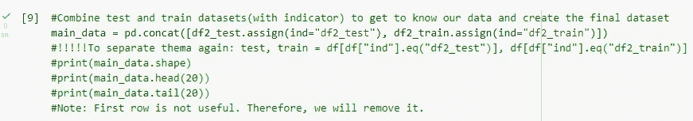

现在，我们将原始数据转换成可理解的格式。数据预处理中的典型任务，

**数据整合**

*多个数据库、数据仓库或文件的集成(实体识别、价值解析)*

**数据清理**

*填写缺失值*

当没有提供一个或多个项目或整个单位的信息时，可能会出现数据缺失。在现实生活中，丢失数据是一个非常大的问题。对于我们的数据集，首先我们使用 *isna()* 函数来查看我们是否有缺失值。由于缺少值的表示，结果为 null。

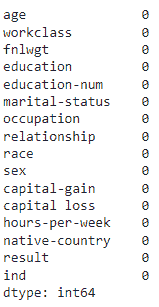

在成人数据集中，缺失值有一个字母数字值“？”。因此，改变函数来检测这些值是我们的第二种方法。使用 str.contains 函数 *(str.contains('\？')))*，缺失值直接可见。列列表有“？”作为缺失值。我们也可以通过频率表来识别它们。此表对于查找相关列的模式值很有用。举个例子，

*工作类*

*职业*

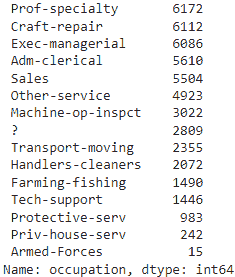

下面有四个主要步骤来处理这些值。

*   忽略观察。
*   **替换为最频繁的值(模式)。**
*   开发一个模型来预测缺失值。
*   将缺失数据视为另一个类别

我们想继续用最频繁值法(模式)进行替换。工作类别、职业和本国列的新频率表如下。

*工作类*

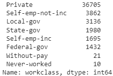

*职业*

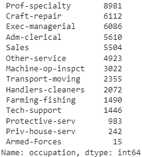

*母国(前 19)*

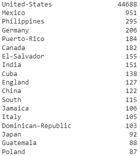

*平滑噪声数据*

*识别或移除异常值*

离群点检测用于异常检测，其中人们对检测异常或不寻常的观察感兴趣。检测异常值有四种主要方法。

**数值离群点**
这是一维特征空间中最简单的非参数离群点检测方法。在这里，异常值是通过 IQR(四分位间距)计算的。计算第一个和第三个四分位数(Q1，Q3)。异常值是位于四分位数范围之外的数据点 x_i。使用四分位数乘数值 k=1，范围限制是箱线图的典型上下须。

z 分数

基于密度的噪声应用空间聚类

隔离森林

对于我们的数据集，我们将解释箱线图和直方图，并应用第一个，**数值异常值**。我们也解释箱线图和属性直方图。

单变量分析也许是最简单的统计分析形式。像其他形式的统计一样，它可以是推断性的，也可以是描述性的。关键事实是只涉及一个变量。对于连续变量

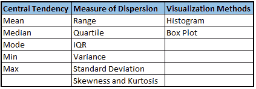

我们的数值直方图，

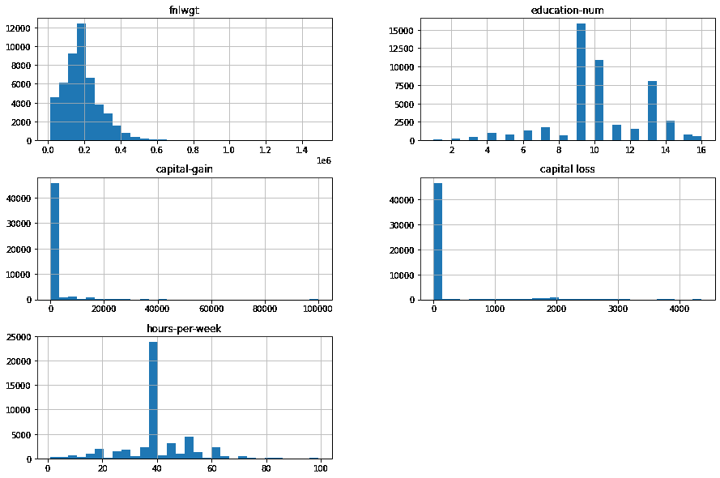

Histograms of each numerical columns before removing outliers from dataset

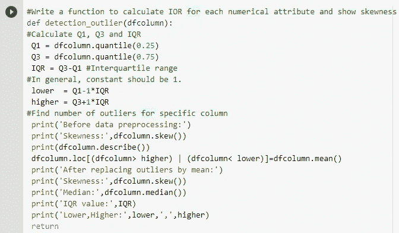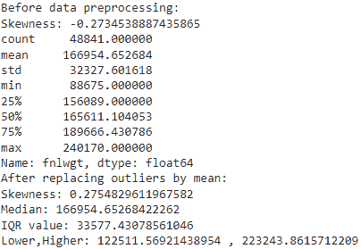

剔除异常值之前的“fnlwgt”列(其中之一)的箱线图如下。

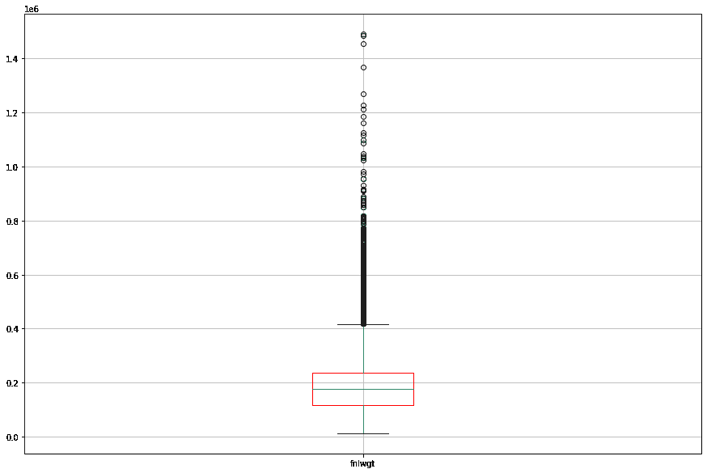

Boxplot for ‘fnlwgt’

我们的数据集有分类值和数值。对于分类列，频率表很有用。

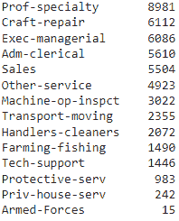

Frequency table for ‘occupation’

从箱线图和直方图中我们可以很容易地看到，数据集有许多异常值，并且数值列的分布不是均匀分布的。对于 **fnlwgt** 列，偏态分布是不对称的，因为自然限制阻止了一侧的结果，并且它具有右偏态分布。

我们编写了一个函数来计算每个数字属性的 IOR。我们借助 IOR 方法(数值，k=1)发现异常值，对每个数值列平均改变异常值。

**如何处理离群值？**

1.  在您的测试工具中设置一个过滤器。
2.  在测试后分析期间移除或更改异常值。
3.  **改变离群值。**
4.  考虑基本分布
5.  考虑轻度异常值的值。

为了去除离群值，我们将改变离群值。由于大量的异常值，删除观察值是不合理的。我们也不知道这些是自然的异常值还是人为的。

**注 1:** 如果偏度在-0.5 到 0.5 之间，则数据相当对称。如果偏斜度介于-1 和-0.5 之间或介于 0.5 和 1 之间，则数据是中度偏斜的。如果偏斜度小于-1 或大于 1，则数据高度偏斜。
**子结果 1:** 用中位数代替离群值无效(已尝试)。
**子结果 2:** 作为第二种方法，我们试图通过 IQR 方法从我们的数据框架中去除异常值。它效率不高。
**子结果 3:** 对数变换对异常值也无效。
**子结果 4:** Z-score 对异常值也无效。
**结果:**我们借助 IOR 方法(数值)发现异常值，并对每列均值改变异常值。

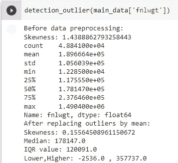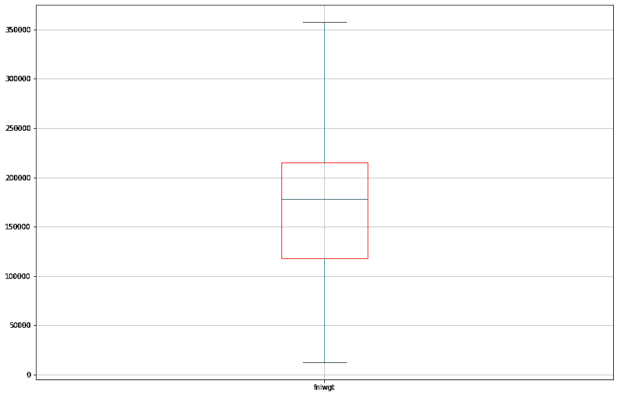

Boxplot for ‘**fnlwgt**’ after the related process

在数据预处理部分之后，我们再次检查了箱线图和直方图。我们看到异常值的数量肯定比以前少了。数字列的分布仍然不是均匀分布的。

为了检查类别不平衡，不同标签的计数的可视化就足够了。

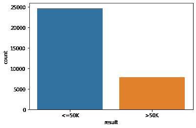

Visualization of the number of different labels

通过观察目标类在数据集中的分布，很容易识别类不平衡。正如我们很容易看到的，**我们的数据集遭遇了类不平衡问题**。

当训练数据中存在类别不平衡时，由于较大类别的先验概率增加，机器学习模型通常会对较大类别进行过度分类。结果，属于较小类的实例通常比属于较大类的实例更经常被错误分类。

其他缺点:

*   错误分类错误的不等成本
*   偏斜类别分布
*   预测建模的挑战
*   由于其增加的先验概率，过度分类多数组

**打击不平衡训练数据**

一般来说，主要选项如下:

*   收集更多数据
*   更改绩效指标
*   **随机欠采样和过采样**

随机过采样包括从少数类中随机选择样本，并替换，然后将它们添加到训练数据集中。随机欠采样包括从多数类中随机选择样本，并将其从训练数据集中删除。

一般来说**过采样更好**，因为你把所有的信息都保存在训练数据集中。

*   尝试不同的算法
*   尝试被惩罚的模型

我们将继续进行**随机过采样**。

如你所见，编码并执行这一部分后，**‘结果’**列的新分布图如下，看起来更好。

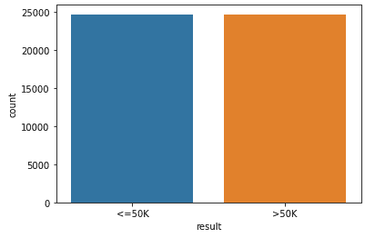

采用过采样方法后，新的分布图如上。训练数据集中实例的更新数量是 **49438。**

相关矩阵只是一个显示相关性的表格。这种方法最适用于展示彼此之间线性关系的变量。

相关性在-1 和+1 之间变化。

-1:完全负线性相关

+1:完美的正线性相关

0:无相关性

可以使用以下公式推导相关性:

相关性=协方差(X，Y) / SQRT( Var(X)* Var(Y))

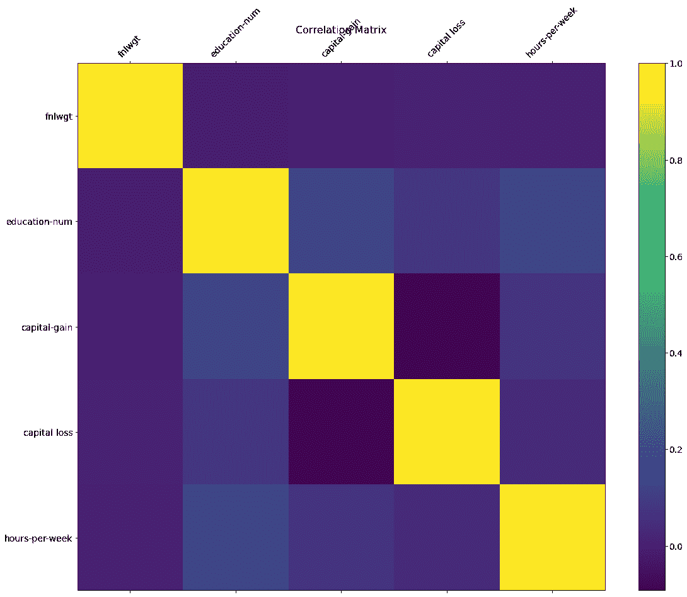

Correlation matrix with colors

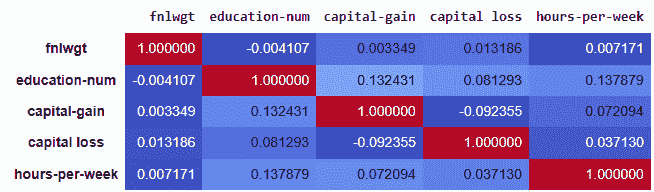

Correlation matrix with colors and numerical values

沿着表格对角线的相关系数都等于 1，因为每个变量与其自身完全相关，并且相关矩阵完全对称。一般来说，低于 0.3 的相关系数值被认为是弱的；0.3–0.7 为中度；> 0.7 为强。**我们可以看到，最大值(没有对角线)是 0.137879，最小值是-0.092355。这些相关性很弱。因此，我们不能说有相关的价值。**

**功能选择**

完成数据预处理步骤并检查相关矩阵后，我们希望继续使用相同的列和指示列。当我们想要划分数据集来测试和训练零件时，这个**索引**， **ind(测试，训练)**列将会很有帮助。由于我们应用了过采样方法，数据集的新维度总共是(65719，16)(49438:train，16281: test)。

注:特征选择部分是下一篇文章的另一个主题。我们会看到更多的细节。现在，继续前进！

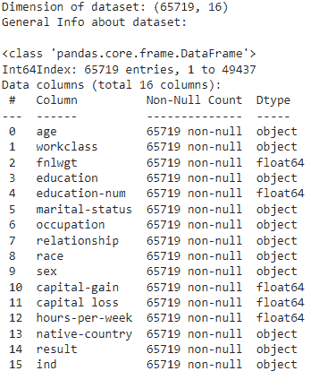

**分类模型**

在这里，我们将实验五个监督模型，即 KNN，决策树，朴素贝叶斯，SVM 和感知器。

**K-最近邻算法(k-NN)**

k-近邻算法是一种非参数分类方法。在 k-NN 分类中，输出是一个类成员。一个对象通过其邻居的多数投票来分类，其中该对象被分配到其 knearest 邻居中最常见的类别(k 是正整数，通常很小)。

**决策树:**

决策树(DTs)是一种用于分类和回归的非参数监督学习方法。目标是创建一个模型，通过学习从数据特征推断的简单决策规则来预测目标变量的值。

**朴素贝叶斯:**

朴素贝叶斯方法是一组基于应用贝叶斯定理的监督学习算法，其“朴素”假设是在给定类变量的值的情况下，每对要素之间的条件独立性。

**支持向量机:**

支持向量机是一组有监督的学习方法。给定一组训练样本，每个样本被标记为属于两个类别中的一个，SVM 训练算法建立一个模型，将新样本分配给一个类别或另一个类别，使其成为非概率二元线性分类器。

**感知器:**

感知器是单层神经网络。它们由四个主要部分组成，包括输入值、权重和偏差、净和以及激活函数。

**评估设置**

交叉验证是一种重采样过程，用于评估给定数据集的机器学习模型。10 重分层交叉验证有一个称为 k 的参数，它指的是给定数据样本可以分成的组数。

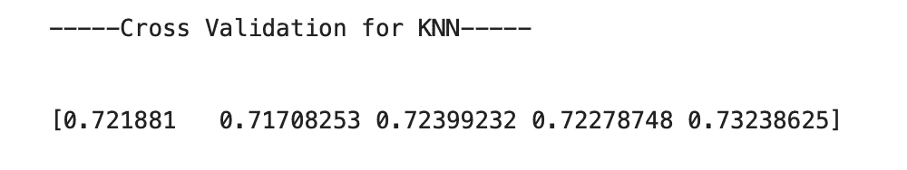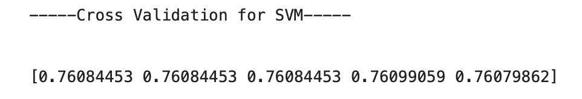

**评估措施**

**混淆矩阵:**混淆矩阵是一种将错误分类数量列表的方式

**准确度:**分类准确度就是我们通常所说的，当我们使用术语准确度时。它是正确预测数与输入样本总数的比率。

*精度= TP+TN/TP+FP+FN+TN*

**精度:**精度是正确预测的正观测值与总预测正观测值的比率。

*精度= TP/TP+FP*

**召回(灵敏度):**召回是正确预测的正面观察与实际类别中所有观察的比率

*召回= TP/TP+FN*

**F1 评分:** F1 评分是准确率和召回率的加权平均值。

F1 得分= 2*(召回率*精确度)/(召回率+精确度)

**AUC 图和 ROC 曲线:** ROC 曲线(受试者操作特征曲线)是显示分类模型在所有分类阈值的性能的图。该曲线绘制了两个参数:

*   真阳性率
*   假阳性率(FPR)

**TPR= TP/TP+FN**

**FPR = FP/FP+TN**

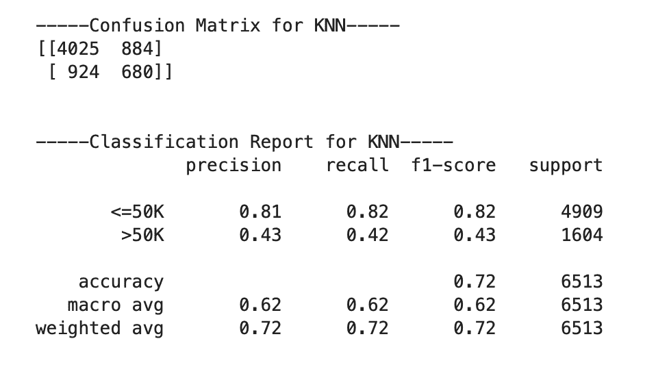

**AUC Plot and ROC Curve for KNN**

**模型参数整定**

超参数调整是为学习算法选择一组最佳[超参数](https://en.wikipedia.org/wiki/Hyperparameter_(machine_learning))的过程。

超参数调整涉及的步骤:

*   为模型选择合适的算法
*   决定参数空间(不同分类器的参数不同)
*   决定搜索参数空间的方法
*   确定交叉验证方法(我们使用了 10 层交叉验证)
*   决定评估模型的评分标准

最初有两个超参数调谐搜索。它们是:

*   GridSearchCV
*   随机搜索

这里，我们使用 GridSearchCv，因为它考虑了所有可能的超参数组合。另一方面，RandomizedsearchCV 使用随机选择的少量样本。因此 GridSearchCV 比 RandomizedSearchCV 更有效。

**KNN:** 最佳参数:{'metric': 'manhattan '，' n_neighbors': 17，' p': 1，' weights': 'uniform'}

**决策树:**最佳参数:{'criterion': 'gini '，' max_depth': 7，' min_samples_leaf': 3，' min_samples_split': 2}

**朴素贝叶斯:**最佳参数:{ ' var _ smoothing ':1.2328467394420658 e-05 }

**SVM:** 最佳参数:{C=0.1，gamma=1，kernel = rbf 总时间= 1.1 分钟}

**决定边界**

判定边界是一条线(在两个要素的情况下)，其中一个类的所有(或大多数)样本位于该线的一侧，另一个类的所有样本位于该线的另一侧。线*将*从一个类中分离出来。如果你有两个以上的特征，决策边界不是一条线，而是你的特征空间维度中的超平面。

在我们的数据集中，绘制决策边界的类包含两个以上的要素。大多数课程包括五个特点。决策边界支持提供给具有两个特征的类。因此，在我们的问题中，我们包括了填充特征值，它包含了被忽略的其他特征。举个例子，

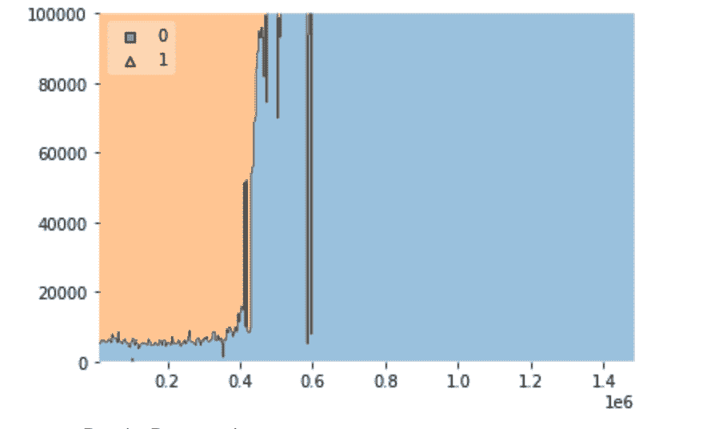

**Decision Boundary for KNN**

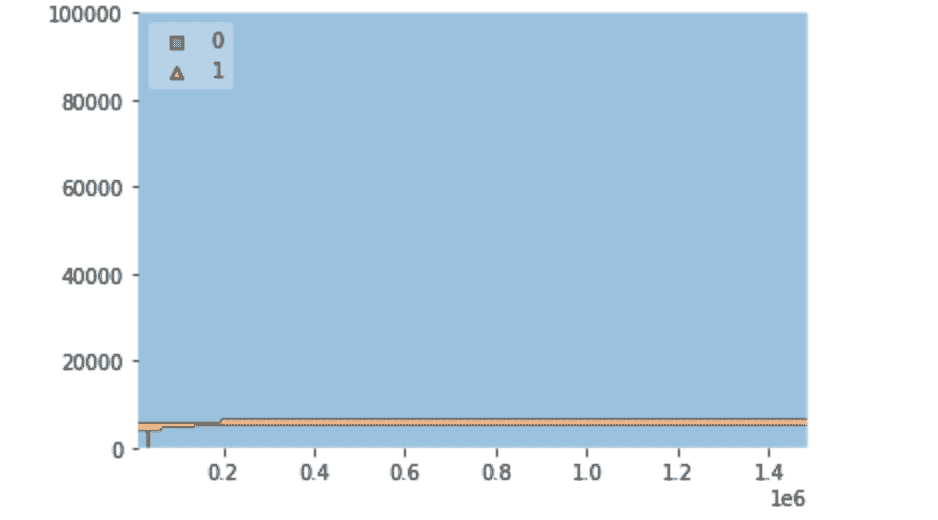

**Decision Boundary for Decision Tree**

**模型参数的影响**

每个分类器都有自己的一组参数，其中许多参数在提高模型性能方面起着重要作用。这里，让我们检查影响不同分类器性能的参数。

**KNN 的参数**

n_neighbors': [3，5，7，9，11，13，15，17，19，21，23]，

p': (1，2)，

权重':['统一'，'距离']，

公制':['欧几里德'，'曼哈顿'，'闵可夫斯基']

最佳参数:{'metric': 'manhattan '，' n_neighbors': 17，' p': 1，' weights': 'uniform'}

超参数调整后，模型精度从 0.72 提高到 0.80。

**决策树的参数**

“标准”:[“基尼”、“熵”]，

" max_depth ":范围(1，15)，

“min_samples_split”:范围(1，10)，

" min_samples_leaf ":范围(1，5)

最佳参数:{'criterion': 'gini '，' max_depth': 7，' min_samples_leaf': 3，' min_samples_split': 2}

超参数调整后，模型精度从 0.77 提高到 0.83。

**朴素贝叶斯的参数**

' var_smoothing': np.logspace(0，-9，num=100)

朴素贝叶斯通常没有任何参数。唯一使用的参数是 var_smoothing。然而，这对分类器的性能没有任何影响。

最佳参数:{ ' var _ smoothing ':1.2328467394420658 e-05 }

超参数调整后，模型的精度没有变化，保持在 0.79 不变

**SVM**的参数

C': [0.1，1，10，100]，

伽马':[1，0.1，0.01，0.001]，

内核':['rbf '，' poly '，' sigmoid']

最佳参数:{C=0.1，gamma=1，kernel = rbf 总时间= 1.1 分钟}

即使在超参数调整之后，我们也可以观察到模型的精度保持不变。

**公平意识评估**

机器学习中训练模型的偏见可能源于反映现有偏见的数据本身。这种历史性的不公平是我们试图从我们的训练模型中衡量的。当错误类似地分布在保护组中时，模型是公平的。在我们的任务中，受保护的属性是‘性别’，指的是男性和女性不同的生理特征。

我们可以将数据视为 x，并使用机器学习模型来计算分数 f(x)，该分数将用于预测，我们可以产生二进制结果 y_hat = {0，1}。在我们的数据集中，y_hat 值 0 表示收入超过 50K，1 表示收入低于 50K。此外，受保护的属性可以表示为 s = {0，1}。在我们的数据集中，s 的二进制值显示为{' Female '，' Male'}。“女性”是受保护的群体，“男性”是不受保护的群体。此外，在我们的训练模型中，我们知道真实的类值 y = {0，1}。数据 x 将与受保护的属性 s 相关联，这将通过随后的公平感知测量来验证。

数据集:X _ 测试 _ 数值，X _ 测试['性别']，y _ 测试，y _ 预测

Data = x { X_test_numerical，X_test['sex] }

受保护的属性= s { '女性'，'男性' }

预测结果= y_hat {0，1}

真实类值= y {0，1}

**公平的衡量标准**

*统计奇偶差异*

*平等机会(EOD)*

*完全不同的虐待*

**数据集**

使 X 数据集将 X_test_numerical 与列 X_test['sex']合并。

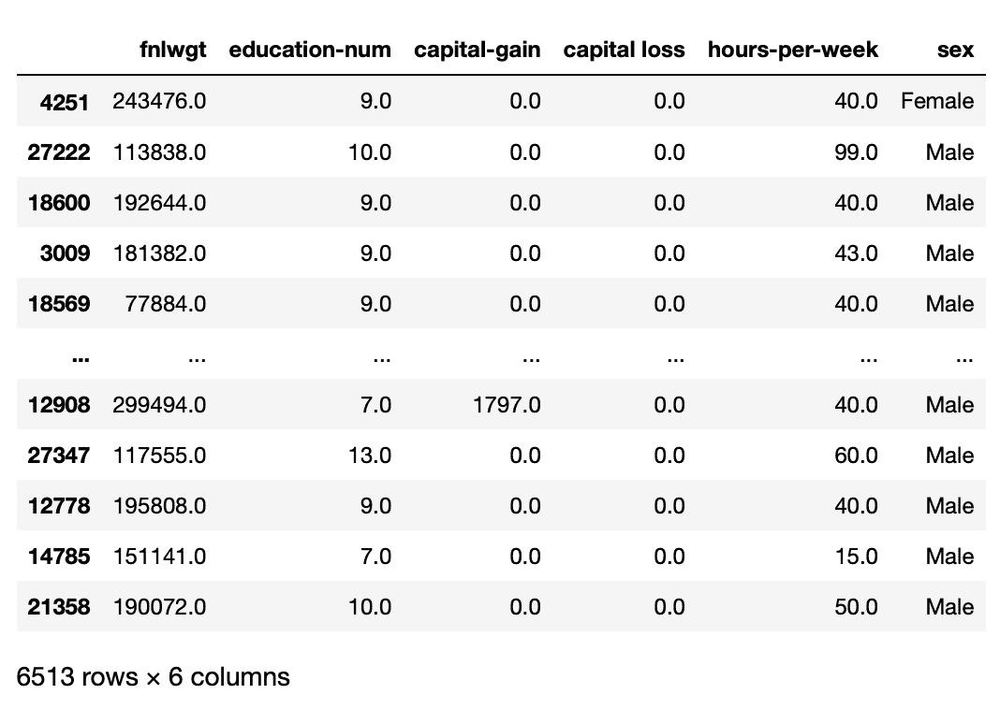

**Table for each classifier combined with its prediction and real value y**

KNN

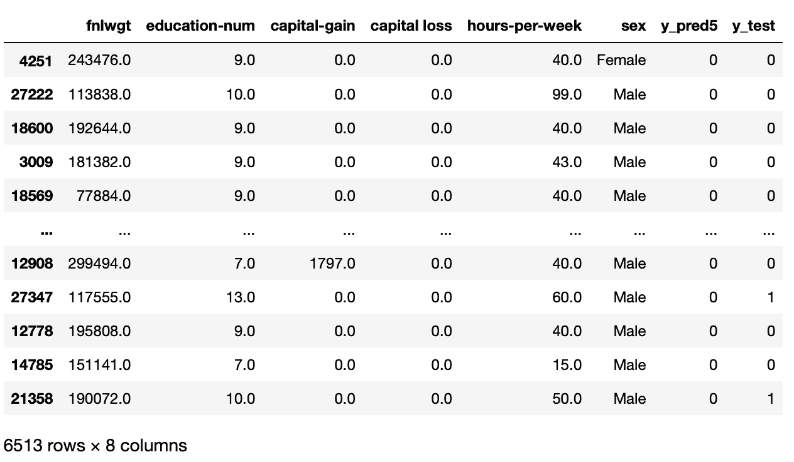

Perceptron

我们将对每个分类器和结果表应用 3 个度量的函数。

def statParityDif

def 等于 OppDif

定义不同对待

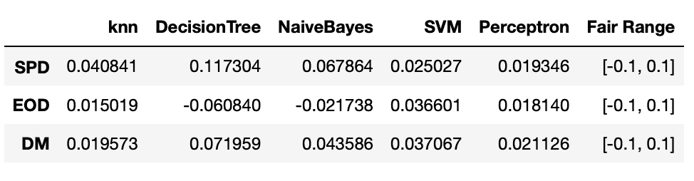

**公平范围和直方图**

为了评估每个分类器的公平性，我们参考以下关于公平范围的论文([https://arxiv.org/pdf/2110.13029.pdf](https://arxiv.org/pdf/2110.13029.pdf))。

如果测量值落在-0.1 到 0.1 之间的范围内，我们可以说分类器不包含对数据集中受保护属性 S 的偏向。换句话说，如果测量值低于-0.1 或高于 0.1，我们可以说分类器对属性 s 有偏差。

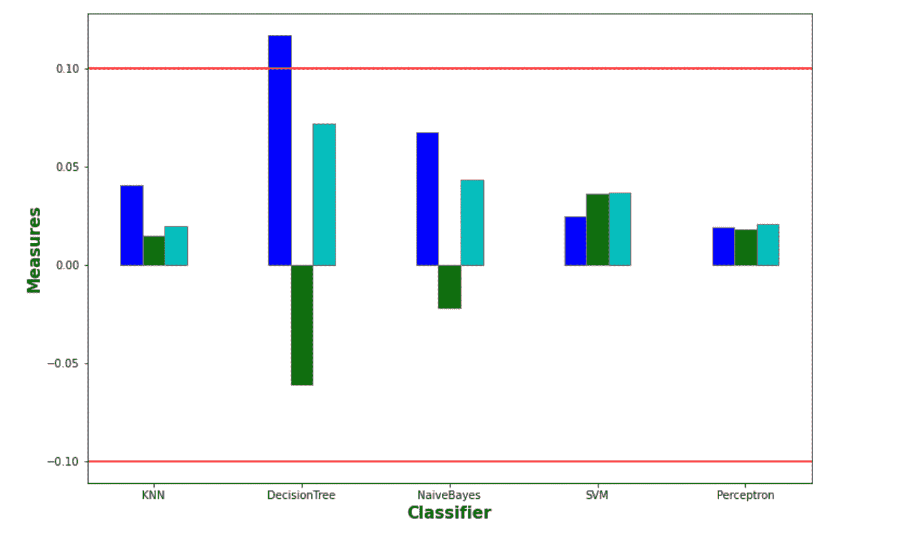

除了分类器决策树的统计奇偶性差异之外，度量值都落入公平范围[-0.1，0.1]。与其他分类器相比，分类器决策树显示了稍微极端的测量值。总之，我们的培训模型中没有明显的歧视行为。

**减轻分类器歧视**

一旦分类器已经被训练，即使是简单的情况也很难消除偏见。然而，有一些方法可以减轻它，这在页面[https://www . borealisai . com/en/blog/tutorial 1-bias-and-failure-ai](https://www.borealisai.com/en/blog/tutorial1-bias-and-fairness-ai)中有所提及。

首先，我们可以在预处理阶段接近它，这是关于通过计算潜在偏见来移除受保护的属性。

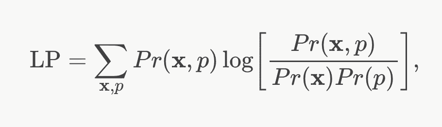

这种测量显示了数据 x 和受保护属性 p 之间的依赖程度，在上面的描述中是 s。如果这个度量值增加，受保护的属性就变得更容易从数据中预测，这就给分类器的潜在辨别能力加上了数学界限。

但是，它有一个缺点，即即使您消除了一个受保护的属性，剩下的其他要素也可能与受保护的属性密切相关，并可能被用于辨别。例如，种族与人的地址高度相关，因此仅移除种族特征不能移除分类器的偏见。

接下来，有一种操作数据集的方法。它是关于数据对{x，y}的重新加权，其中 x 是数据集，y 是类标签。这使得受保护属性 p 的弱势群体更有可能通过权重获得积极的结果。然后他们训练一个分类器，在它的成本函数中使用这些权重。或者，他们建议根据这些权重对训练数据进行重新采样，并使用标准分类器。

此外，处理中的算法可以通过测量间接偏见来减少分类器包含的偏见。

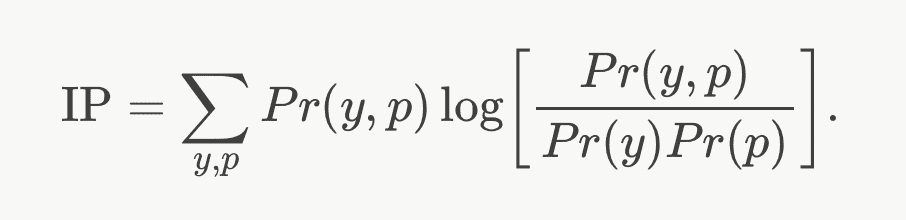

这度量了标签 y 和受保护属性 p 之间的依赖关系。如果度量可以忽略，则意味着很难从受保护属性预测标签，并且不存在偏差。

**KNN 实施**

在实现 K 近邻算法时，我们参考了本页。[https://machine learning mastery . com/tutorial-to-implement-k-nearest-neighbors-in-python-from scratch/](https://machinelearningmastery.com/tutorial-to-implement-k-nearest-neighbors-in-python-from-scratch/)

**功能定义**

**两行之间的欧几里德距离**

因为 KNN 是基于两个实例有多近的标准，所以需要得到它们之间的距离的函数。

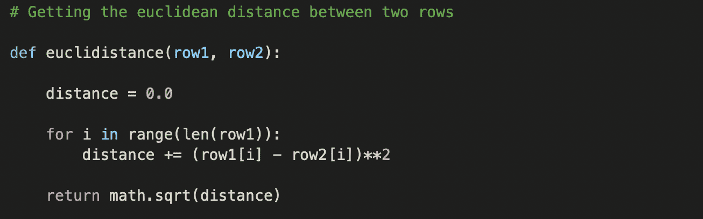

**基于距离的 K 个最近邻居**

基于实例之间的计算距离，我们将得到历史数据和新实例之间的 k 最小距离，这是得到结果的函数。

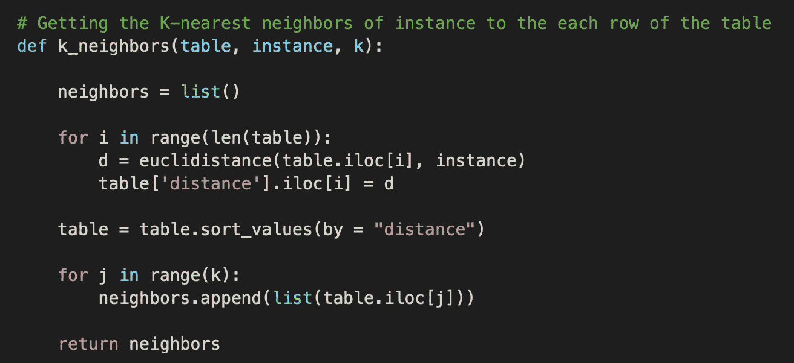

**KNN 实施结果**

由于运行时间太长，实现的 KNN 不可能处理测试集中的所有实例。然而，当我们尝试使用实例 20 的较小测试集时，我们观察到预测精度为 0.75。因此，将实现的 KNN 与函数库进行比较是没有意义的，这仍然可以启发我们在方便的库中使用哪些方法或步骤，然后更好地理解算法。

**KNN 的慢跑时间**

与其他训练模式相比，它的速度很慢。这是因为该模型不能提前概括，而是必须查找所有历史数据，如果数据量很大，将会减慢计算过程。

**改进**

如果使用余弦相似度而不是欧氏距离，时间复杂度可以得到改善。因为欧几里得包含的运算比余弦相似多。

余弦相似度:n 维空间中两个 n 维向量之间夹角的余弦值。它是两个向量的点积除以两个向量的长度(或幅度)的乘积。

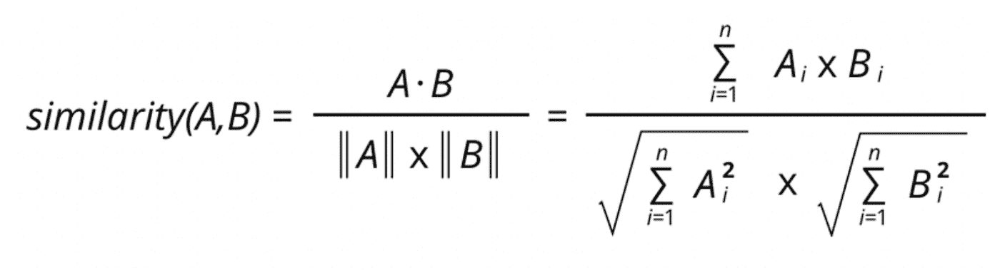

**完整代码:**[**https://colab . research . Google . com/drive/132 a4 iwdrvve 0 lso DCT _ n0UzS _ QHDnvKR？usp =分享**](https://colab.research.google.com/drive/132A4iWdRVVE0LsOdCt_n0UzS_QHDnvKR?usp=sharing)

**参考**

[https://medium . com/analytics-vid hya/under sampling-and-over sampling-a-old-and-a-new-approach-4f 984 A0 e 8392](/analytics-vidhya/undersampling-and-oversampling-an-old-and-a-new-approach-4f984a0e8392)

[https://towards data science . com/training-models-on-unbalanced-data-561 fa 3f 842 b5](https://towardsdatascience.com/training-models-on-imbalanced-data-561fa3f842b5)

[https://corporatefinanceinstitute . com/resources/excel/study/correlation-matrix/#:~:text = A % 20 correlation % 20 matrix % 20 is % 20 简单地、直观地% 20 表示% 20in % 20a %散点图。text = A % 20 correlation % 20 matrix % 20 由% 20 行% 20 列% 20 组成，显示% 20 变量。](https://corporatefinanceinstitute.com/resources/excel/study/correlation-matrix/#:~:text=A%20correlation%20matrix%20is%20simply,visually%20represented%20in%20a%20scatterplot.&text=A%20correlation%20matrix%20consists%20of%20rows%20and%20columns%20that%20show%20the%20variables)

[https://www . borealisai . com/en/blog/tutorial 1-bias-and-failure-ai](https://www.borealisai.com/en/blog/tutorial1-bias-and-fairness-ai)。

[https://arxiv.org/pdf/2110.13029.pdf](https://arxiv.org/pdf/2110.13029.pdf)

[https://machine learning mastery . com/tutorial-to-implement-k-nearest-neighbors-in-python-from scratch/](https://machinelearningmastery.com/tutorial-to-implement-k-nearest-neighbors-in-python-from-scratch/)

https://en.wikipedia.org/wiki/Supervised_learning