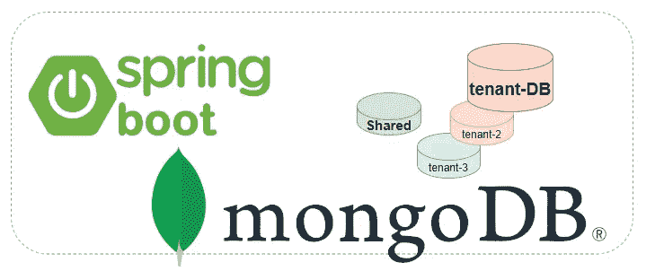
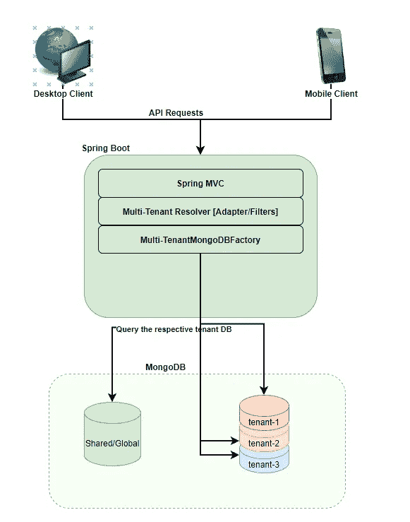
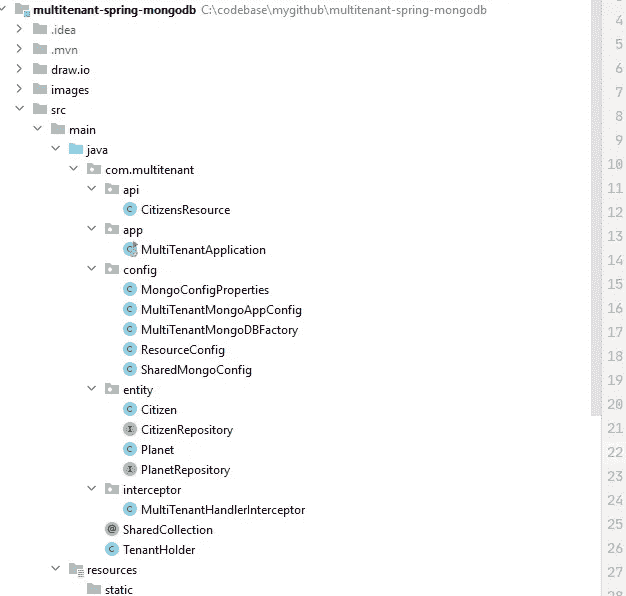
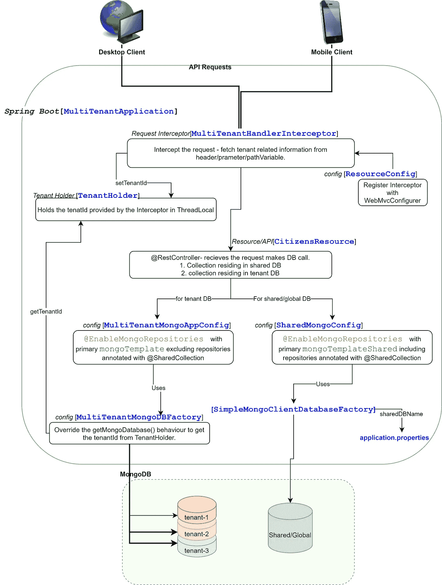

# 使用 Spring Boot Spring MVC 实现的 MongoDB 多租户/租用。

> 原文：<https://medium.com/geekculture/full-featured-multi-tenant-tenancy-with-spring-boot-mongodb-spring-mvc-f00c98a9df70?source=collection_archive---------0----------------------->

## MongoDB 多租户。

## MongoDB 和 Spring Boot，Spring MVC 多租户数据库和在 www.github.com 的实现。

> [https://github.com/arun2pratap/multitenant-spring-mongodb](https://github.com/arun2pratap/multitenant-spring-mongodb)

## 为什么是多租户数据库？

我们对多租户数据库进行的推理很少。

*   嘈杂的邻居—如果数据的性质存在明显的分离(在这种情况下，您不会将两种数据聚合/操作在一起),例如火星(公民)、地球(公民),那么即使是公民数据收集也会将其保存在自己的数据库中。

> 是的，使用**分片**的水平扩展是一个选项，但这也带来了自身的复杂性/查询/维护/迁移/备份/事务…开销。如果可能的话，避免使用，尽管在某些时候你可能不得不分片，但是范围会缩小。

*   维护—备份/恢复/查询/调试/分析将使用更小的数据集。
*   迁移—我们可以轻松地分离出一个客户端数据库，并拥有自己的部署。
*   灵活性—我们可以根据每个数据库的性质来决定它们的行为，例如，客户端-地球[db-100 TB]，客户端-火星[db-1mb]将只共享数据库“地球”而不是“火星”。

## 应用设计:

对于所有执行的 API 请求/操作，我们需要拦截“执行线程”,在该线程上执行操作之前设置租户数据库。

## [实现](https://github.com/arun2pratap/spring-cloud-training-config):

同一集群上的多租户数据库。

试图模拟一个 API 请求是如何处理的。[单线程执行]
显示流/类/配置/bean 的图表，带有必要的描述。参考 github 上的签入代码。

> [**https://github.com/arun2pratap/spring-cloud-training-config**](https://github.com/arun2pratap/multitenant-spring-mongodb)

示例:-(创建名为“shared”的 db 和 db . planet . insert({ _ id:“mars”})；)
帖子:[http://localhost:8080/API/mars/save](http://localhost:8080/api/earth/save)
请求正文:{ "name":"NEO"}

将在各自的租户数据库上执行操作。

注意:这个例子由单个集群上的多租户组成，如果多租户使用不同的集群，那么我们还需要在运行时更改 mongoClient()。

希望这对希望实现多租户数据库的人有所帮助，如果您发现缺少什么或希望我添加什么，请发表评论。

编码愉快，谢谢:)