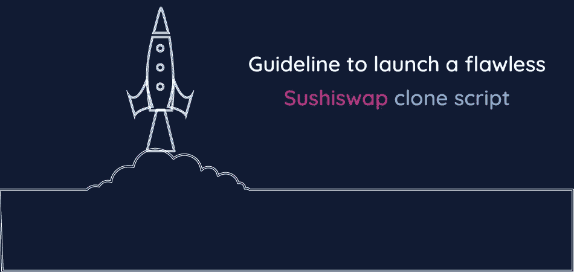
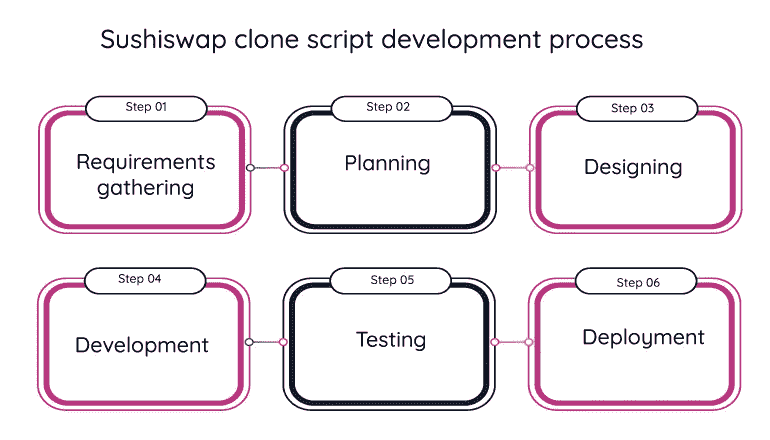
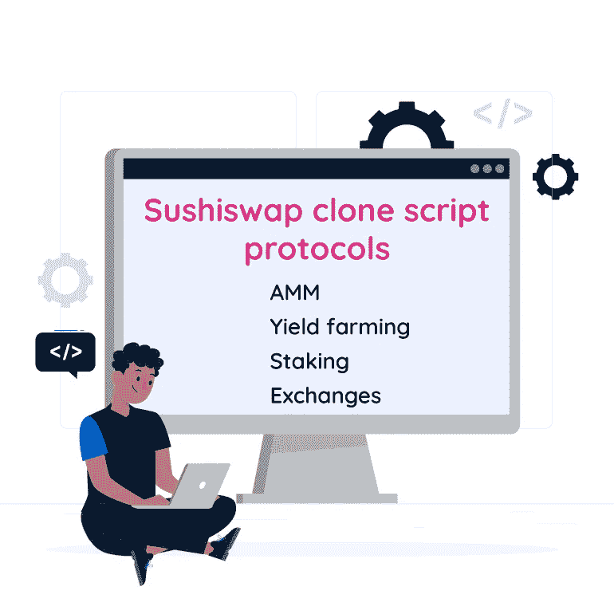
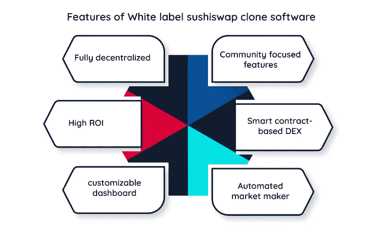

# 启动完美 Sushiswap 克隆脚本的完整指南

> 原文：<https://medium.com/geekculture/full-guide-to-launching-a-flawless-sushiswap-clone-script-356d67bd501e?source=collection_archive---------18----------------------->

Sushiswap 是一个分散的 Defi 脚本，被称为“uniswap 的演变”。它的目标是解决在最活跃的操作系统中分散的密码交换中出现的问题。sushiswap 克隆脚本是 sushiswap 的精确副本，它通过部署高度安全的原则和出色的功能特性来提供交易空间。像 sushiswap 克隆这样的分散式交换机是为 ERC-20 令牌标准交换而开发的。

在 sushiswap 克隆软件中，用户可以依靠其他用户进行交易，这可以减少在进行交易时分散交易中可能出现的问题。用户通过自动做市商功能交换和交易加密令牌，这提高了平台的流动性。

# **推出类似 sushiswap 的基于以太坊的 DEX**

推出类似 [**的 dex 克隆脚本 sushiswap 克隆脚本**](https://radindev.com/sushiswap-clone-script/) 带来代币流动性和收益回报。如今，加密用户已经转向 DEX 平台。这是因为在不断变化的加密潮流之间波动，对集中式加密交换进行了棘手的投资。分散式交易所以一种全新的方式为参与者提供各种功能活动，如交换、借贷和投资加密货币资产。Sushiswap 允许您在不需要中央授权的情况下进行交易。

在 sushiswap 克隆软件、 **pancakeswap 克隆脚本**和 **uniswap 克隆**等分散式加密交易所中，交易者不需要受到任何订单或账簿的约束，这与币安克隆等集中式加密货币交易所不同。换句话说，在 dex 克隆脚本中，不需要第三方来监督事务。

Sushiswap 克隆脚本执行不同的分散交易，因此交易者可以更好地控制他们的资产，同时避免任何第三方的干扰。sushiswap 平台中的用户可以完全控制他们购买的密码，并且通过操作系统的出色安全性，他们可以在高度安全的环境中进行各种活动。

Sushiswap 实现了它的愿景:通过互联网连接，让每个人在任何时间、任何地点都能进行分散的金融交易。

# **如何像 sushiswap 一样启动 Defi 交换？**

从头开始开发:使用 scratch 开发和部署 dex 克隆脚本可能非常耗时，而且成本效率低下。这就是为什么许多投资者计划使用 sushiswap 的预设计副本作为克隆脚本。创建一个 sushiswap 克隆脚本执行一个完美的具有 sushiswap 核心特性的 dex。

创建像 sushiswap 这样的 Defi 交易所是一项明智的投资，会带来高额的回报。在完全启动 sushiswap 克隆之前，您必须采取一些步骤。下面是在创建克隆 sushiswap 之前您需要做的事情。

有一个完美的商业策略

做市场调查和分析

验证您的交换质量

拥有独立的客户渠道

选择区块链网络

# **为什么要开一个像 sushiswap 克隆软件这样的 Defi 交易所？**

Sushiswap 克隆脚本是一个定制的、完全分散的精英加密交换，与 Sushiswap 的功能特性和选项百分百相似。sushiswap 的高级复制品反映了 sushiswap 的确切特征和操作系统。Sushiswap 是最流行的加密交易所之一，它是为交换 ERC-20 令牌而开发和设计的。

Sushiswap 克隆软件由区块链联邦理工学院授权，它提供了一个安全的交易空间，允许参与者产生无限的收入。sushiswap 克隆脚本是完全可定制的，您可以根据自己的需要和业务需求对其进行专门化。下面提到的项目是设置一个新的 DEX 克隆脚本(如 sushiswap)的更多好处。

可定制的仪表板

可排序的表格

每周菜单栏

集成分级

优先的错误修复

迁移的流动性门户

有限中继机器人

杠杆报酬系统

Chrome 兼容插件

改进的投资组合

**Sushiswap 克隆脚本开发流程**

需求收集:为开发团队确定业务的确切需求。

规划:通过创建一个 dex 克隆脚本，为您期望实现的目标设定一个逻辑清晰的计划流程。

设计:确保在设计时非常小心。用户通过他们的界面浏览你的网络或移动应用。所以，设计一个易于访问的界面。

开发:使用白标克隆脚本为开发和专业化提供了充足的空间，我们的开发团队可以为您执行。

测试:测试是为了确保平台在安装后可以供公众使用。

部署:一旦您的 sushiswap 克隆脚本成功通过测试过程，就该部署到公共平台上了。

# **sushiswap 克隆脚本的精英特征**

已识别的飞行物(identified flying object)

分散的

多重加密钱包支持

令牌分析

流动性迁移

重新平衡集体口粮

即时令牌交换功能

放款与借款

管理仪表板

立桩标界

管理仪表板

用户仪表板

流动性池

即时令牌交换功能

# **sushiswap 克隆平台的安全特性**

本地移动安全

没有 KYC

没有第三方指令

双因素认证

多层安全指令

安全钱包集成

端到端加密

数字钱包加密

没有 SSL 协议

启用智能合同的令牌

防 DDoS 保护

加载项验证

# **sushiswap 克隆软件的附件**

多语言支持

价格先知

公差设置

与交易员实时聊天

最优定价

API 文档

分析学

指纹解锁

增强流动性准备金

通往可持续发展的道路

**Sushiswap 克隆脚本协议**

自动做市商(AMM)

流动性池分为三个不同的域，每个域都基于即将到来的网站流量。

高产农业

产量农业可通过三个平台，而赌注可通过两个门户网站。

交换

sushiswap clone 脚本为交换过程增加了一些特性，它们可以通过三个不同的平台以三种不同的扩展获得。

立桩标界

产量耕作，打桩，交换和其他功能分为正常。

# **克隆 sushiswap 的好处**

创建像 sushiswap 这样的分散式 exchange 克隆脚本有很多独特的品质。sushiswap 克隆脚本是创建基于以太坊的 DEX 克隆脚本的理想选择。

Sushiswap 业务概念

汇率 0.25 利润转入流动性池，0.05%转回平台。

社区收入共享模式

sushi 克隆中的收入分成模式被 sushiswap 社区网络中的所有用户使用。

流动性奖励

为流动性池提供流动性的加密交易员获得奖励，寿司令牌用于提供流动性。

没有 KYC 政策

它为交易所提供了不需要许可，这将允许任何加密交易者参与 sushiswap 克隆脚本的流动性池。

# **Sushiswap 克隆软件**

sushiswap 克隆应用程序是完全分散的金融(Defi ),运行在以太坊区块链网络上，智能合约使交易过程安全。Sushiswap 克隆软件是一个随时可以上市的平台，能够在一个分散的平台上进行交易，并反过来提供流动性和收入。

# **白标 sushiswap 克隆软件**

Sushiswap 是 uniswap 的高级协议。在 sushiswap 中，令牌由智能合约执行。白色标签 sushiswap clone 提供了 sushiswap 所有高级特性和功能的复制品。设置一个白色标签分散克隆软件，以吸引您的密码爱好者社区达到无限的收入作为回报。

# **Sushiswap 克隆应用开发**

随着对移动应用程序的需求不断增加，推出 dex 克隆应用程序完善了您的分散式金融交易所的愿景。一款高度独家的 sushiswap 克隆软件，具有 sushiswap dex 的最佳功能，可提高您的整体投资回报率。

Sushiswap 克隆应用程序开发为平台带来了一个新的 web 应用程序，用于进行交易和交换加密令牌。sushiswap 克隆脚本是完全可配置的，可以在手机上完美运行。您可以通过自定义 sushiswap 克隆软件来满足您的业务需求。您可以选择推出一个克隆的 sushiswap 来满足实现您扩展业务的想法的最佳解决方案。

Sushiswap 克隆应用程序开发可以为市场带来一个类似于 [**sushiswap**](https://www.sushi.com/) 的新的加密业务视角。克隆软件 sushiswap 是 sushiswap 的复制品，它是完全去中心化的，没有第三方中介，透明、安全的交易空间。

# **sushiswap 克隆软件的亮点**

构建并运行最可靠的区块链网络以太坊

它是由最新的技术栈开发的

多重加密钱包支持

%100 可定制的源代码

以低成本和短时间创造惊人的分散融资

# 为什么选择 radindev 作为 sushiswap 克隆脚本？

我们 radindev 可以提供一个理想的 sushiswap 克隆软件，具有高质量的操作特性。许多投资者正计划开始分散融资，以参与加密领域的高收入制造商流。因此，开发一个像 sushiswap 这样的分散式加密交易所是加入加密市场或扩展业务的良好开端。

我们的高级白色标签 sushiswap 克隆脚本是一个预先设计好的上市克隆平台，是启动 DEX 克隆的经济高效的解决方案。我们提供的 sushiswap 克隆平台可以根据 sushiswap 的最新更新进行优化和定制，以满足您的业务需求。您也可以使用我们的 24/7 小时客户服务。

# **遗言**

推出 dex 克隆脚本是一种趋势商业模式，吸引了大量投资者和初创公司来创建他们的 sushiswap 克隆脚本。克隆 sushiswap 是预先设计好的、随时可以部署的 sushiswap 的 100%副本，可以镜像原始平台的核心功能和能力。

Radindev 为您提供了一个 100%可定制的 sushiswap 克隆，它由以太坊区块链授权。因此，如果你想出了一个在加密领域推出一个新的 sushiswap 克隆软件的主意，请联系我们并获得我们的免费演示。