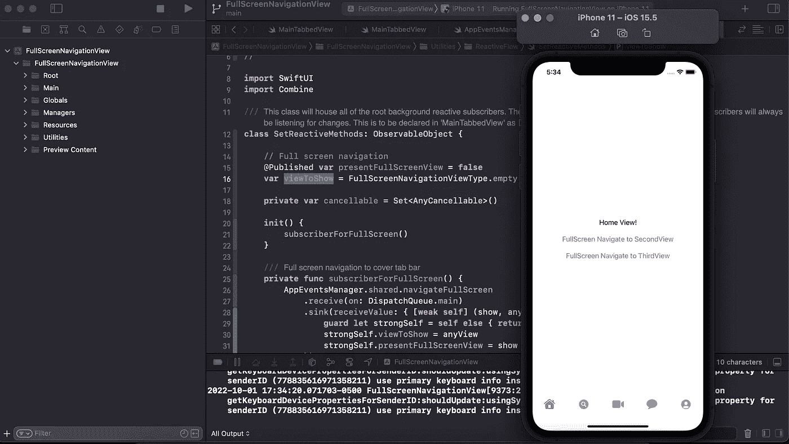

# SwiftUI 中 Tabbar 上的全屏导航视图

> 原文：<https://medium.com/geekculture/full-screen-navigation-view-over-tabbar-in-swiftui-991ca2ccfefc?source=collection_archive---------1----------------------->

在这篇博客中，你可以看到如何在 IOS 中使用 **Swift** 使用名为 **Combine** 的反应式编程框架，在 **SwiftUI** 中的 **Tabbar** 视图上**导航**视图。

> 在 **XCode** 中创建全新的 **SwiftUI** 项目，和我一起开始吧。不要担心，在博客底部，你可以从 GitHub 获得该项目的完整源代码。

## Tabbar

首先创建单独的 swift 文件，并将其命名为**maintable dview**。在这个视图中，使用下面的代码创建 tabbar。

创建 tabbar，并创建五个简单的视图，如**主页视图**、**搜索视图**、**会话视图**、**聊天视图**、&、**个人资料视图**，它们将与 tabbar 栏连接在一起，如上面的代码所示。

## 全屏导航视图

现在创建一个全屏导航视图，它将接受三个参数。

1.  **显示将处理视图外观的**绑定属性
2.  **内容**将某个视图呈现在那个视图中
3.  **边缘过渡**为了处理过渡，现在我们从左向右过渡视图，这就是为什么使用**。尾随**如果你想让视图从底部出现，那么使用**。底部**。

**FullScreenNavigationView**用于显示通过 **ZStack** 进入该视图的**内容**视图。 **ZStack** 用于显示 **z 轴**中的视图。

## FullScreenNavigationViewType

之后，从**maintable dview**中为任何需要全屏显示的视图创建**FullScreenNavigationViewType，** enum。

你只需要创建简单的**第二个视图**和**第三个视图**就可以了。**第二个视图**不接受参数，但**第三个视图**接受参数。我添加了**第三个视图**来告诉你我们如何通过使用枚举将参数添加到视图中。

我们将使用**。过一会儿清空**箱，以便向后导航。

## **AppEventManager**

创建 **AppEventManager** 来处理应用事件。AppEventManager 将是 **singleton** 类，这就是为什么我在那个类中创建了它的共享实例。

现在我们创建了一个名为**导航全屏**的事件。我使用的是**传递主题**，它是**组合**框架属性。 **PassthroughSubject** 接受两个类型为 **Bool** 和**FullScreenNavigationViewType**的参数。在一个地方，我们将通过使用它的**来调用该事件。发送**方法，第二，我们将授权一个订阅者监听事件并触发一些逻辑。过一会儿你就会明白了。

## **设置反应方法**

创建一个 **SetReactiveMethods** 类，该类将被 **ObservableObject** 继承。我们使用 **ObservableObject** 将值发布到 **SwiftUI** 视图中。

现在创建三个属性

1.  **presentFullScreenView** :在 tabbar 上呈现视图
2.  **viewToShow** :将在 tabbar 上呈现的视图
3.  **可取消**:用于取消用户

创建一个**订阅者**函数来**监听**事件**导航全屏**事件，当它被调用时。使用**。接收**和**。sink** 结合框架的函数订阅 **navigationFullScreen** 事件。 **receive** 函数用于告诉我们需要在哪个队列中获取该事件，当 **navigationFullScreen** 事件触发时 **sink** 函数将接收这些值，之后我们将获取这些值并使用。

创建订阅者函数后，将其调用到 **init** 中，当我们拥有 **SetRactiveMethods** 对象时，我们将使用该订阅者。现在在**maintable dview**中创建 **SetReactiveMethods** 实例，并通过使用 **ZStack** 将**FullScreenNavigationView**使用到**maintable dview**中，如下所示。

当我们创建 **SetReactiveMethods** 实例时， **subscriberForFullScreen** 将会启动，当我们触发 **navigateFullScreen** 事件时，subscriber 将会接收这些值并更新 **presentFullScreenView** 和 **viewToShow** 值，这些值将被发布并使用到**FullScreenNavigationView**中，然后在 tabbar 上呈现视图，正如您可以在上面的代码中看到的那样。

## 最后一步:

现在，触发事件的最后一步。如果您已经创建了 HomeView 结构，请将下面的代码直接放入 HomeView 结构中。

这里我们通过使用**来触发导航全屏事件。发送**方法并传递两个参数，一个是**布尔**，它告诉用户是否导航。如果我们需要导航，那么我们将传递**真值**，如果我们想要返回导航，那么我们将在这里传递**假值**。另一个参数是**FullScreenNavigateViewType**，我们也将传递那个类型。这样，我们的事件将调用和订阅者接收这些值，并通过使用**FullScreenNavigationView**在 tabbar 上呈现各自的视图。

如果你想从**全屏导航视图**返回导航，那么调用**导航全屏**事件并传递**假**值并给出类型**。清空**。然后**全屏导航视图**将导航回来。

> 记住，只要给**假**值**FullScreenNavigationView**就会返回导航。我们正在使用。通过给**视图显示**一个空视图来清空

如果您需要从 FullScreenNavigationView 导航到下一步，请使用导航链接向前导航。

就是这样…..

希望你明白这一点，如果没有，那么你也可以看到源代码。

感谢你阅读这篇文章。

**👨‍💻👨‍💻👨‍💻👨‍💻👨‍💻👨‍💻源代码👨‍💻👨‍💻👨‍💻👨‍💻👨‍💻👨‍💻**

 [## GitHub-Muhammad Abbas 001/FullScreenNavigationView:如果您需要在…

### 如果您需要在 SwiftUI 中的 tabbar 上导航视图，那么您可以使用此代码库来了解如何导航…

github.com](https://github.com/muhammadabbas001/FullScreenNavigationView) 

## 订阅模式

 [## 米（meter 的缩写））阿巴斯正在创建 IOS 开发者| Patreon

### 立即成为 M.Abbas 的赞助人:获得世界上最大会员的独家内容和体验…

www.patreon.com](https://www.patreon.com/abbasgujjar)