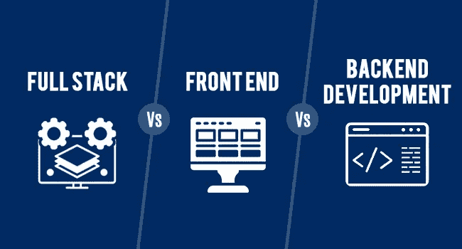

# 全栈:劳动分工的深化

> 原文：<https://medium.com/geekculture/full-stack-the-deepening-division-of-labor-labor-5ff8b716c636?source=collection_archive---------15----------------------->

在这个故事中，我将概述 web 开发的历史，为什么全栈开发越来越受欢迎，为什么我认为它失败了。

引用亚当·斯密的话:

> 劳动生产力的最大提高，以及这种提高所涉及或应用的技能、技巧和判断力的最大部分，似乎都是劳动分工的结果。

第一章，第 7 页——国富论(1776)——第一册

## 另请参见:

[ORM:分工的深化](/geekculture/orm-the-deepening-division-of-labor-ebe39dfc167b)

第一个 web 应用程序是静态的，基本上是带有一些 CSS 的 HTML，仅此而已。我将推进动态应用程序，比如我们用 AJAX 开发的网站。他们中的大多数都没有合适的三层架构，你可以在 JSP\ASP 中看到一些业务逻辑。虽然从表示层调用 DB 被认为是一种不好的做法，但有时也可以看到这种情况。

我想从鸟瞰的角度来看待这个问题。**我们能有一个既能做前端又能做后端的人吗？**

当 web 应用程序变得复杂，工具甚至编程语言在前端和后端变得不一样时，许多企业更喜欢雇佣两个不同的人，一个专门负责前端，另一个专门负责后端。这是**“分工”原则**在起作用。

它提出了两个新问题:

1.  我们有新的*整合*阶段，这本身就很耗时；
2.  我们需要能同时管理双方的经理。

解决问题的简单方法是把管理的重担放在现有的管理者身上。然而，经理们不想做额外的工作，所以“团队”被发明出来，基本上是将管理工作推给开发人员本身。这完全没问题，但是整个哲学是围绕着“团队”发展的，为了隐藏这个简单的事实。而且没有解决第一个问题。这甚至变得更加困难，因为我们在循环中多了一个人，我们还需要在开始时进行一些规划，而不仅仅是在结束时进行整合。

因此，出现了另一种解决方案——全栈开发。我们希望为工作使用正确的工具，所以我们希望在编程栈中保留 heterogonies 技术，例如，我们希望在前端使用一些基于 JavaScript 的框架，在后端使用基于 Python 的框架。所以，我们想雇佣一些能够使用所有这些工具的人。这些人存在吗？

很明显，他们有。我们看到很多全栈开发人员的工作描述都是由某个人担任的。但是他们真的能掌握他们需要的所有工具吗？还是他们一直呆在舒适区？

> 就我个人而言，我不知道有哪个后端开发者是优秀的全栈开发者。

不要误解我。我知道后端开发者想转向前端，全栈开发只是他们前端开发旅程中的一站。我也知道前端开发人员想开发后端。但这只是边缘案例。我的观点是:

> 全栈开发者首先是前端开发者。

和

> 我知道太多的全栈开发者是糟糕的后端开发者。

这不是他们的错。

在我展开之前的一个主题之前，让我们再来看看全栈开发的**优势。**

如果您的 web 应用程序主要是关于 UI 的，业务逻辑不是很复杂，并且您只有一种客户端(例如，基于 Web 的，下面会详细介绍)，那么您肯定会从与 full stack developer 的合作中受益。开销会减少，你几乎不会受到不利影响。

你将结束的一个缺点是，你将在数据库中存储用户界面状态。几乎可以说，你的数据库模式将是用户界面状态的简单反映。这有它自己的利弊。主要优点:对 web 应用程序进行推理更容易，您的 web 应用程序状态只是 UI 状态，您存储的是您在网页上看到的内容。主要缺点是:你存储的是你在网页上看到的东西，所以如果你想让 REST API 直接调用你的应用程序，你会发现你应该传递许多不相关的数据部分。它们在 Web 应用程序的上下文中有意义，但是在 REST API 中没有用(您的 REST API 是一个“服务器”)。

此外，如果您设计的网站同时支持移动设备和传统网页，那么最好在后端有一些独立于 UI 的状态表示。

此外，存储你在网页上看到的东西可能会降低你的维护速度。**这一点实际上取决于你的团队的技能。**如果每个人都觉得在后端使用 UI-state 很舒服，这实际上可能会加快开发人员的速度，但如果有些开发人员觉得在后端使用 UI-state 是错误的，当他们得到做出一些改变的许可时，他们可能很难理解需要做什么。

我想再重复一遍:**主要利润是降低开发新功能的摩擦。**正如我上面所说，它可能在维护方面存在一些问题(取决于您团队的技能组合)。并且**你可以完全跳过整合阶段。**

如果您的 web 应用程序的复杂性是中等或较高的，那么最好将前端和后端的状态分开。

我喜欢这样描述它:

> 正如 UI 设计是前端的语言，DB schema 是后端的语言。

在典型的 web 应用程序中，基于 SQL 的数据库应该足够了。因此，正如通常对 UI 设计的关注一样，应该对适当的 DB 模式定义投入同样的关注——什么是表、规范化它们、在需要时取消规范化、索引、外键等。

NoSQL 也非常适合使用。即使它是 MongoDB 或其他基于文档的数据库，你也不应该不加思索地将你的 UI 状态存储为 JSON。你应该有独立的后端状态表示并存储它。当然，在这种情况下，UI 状态和后端状态之间的一一对应很有吸引力，除非您有另一种客户端类型，否则您通常会以此结束。

因此，长期以来，我们有不同的后端和前端技术。

然后，有趣的事情发生了。人们尝试在前端和后端使用相同的技术。

> 如果在前端和后端使用相同技术的尝试成功了，那么全栈开发人员是正确的选择。但是他们失败了。

如果我们回到亚当·斯密，我们可以说这是分工的逆转过程。 我们想用同样的工具做一些不是为它设计的事情。难怪，这已经失败了。

无论如何，我想列举其中的两种尝试。**例如，Vaadin** 是基于 Java 的前端框架。Node.js 是一个相反的例子，这是后端的 JavaScript 框架。

科特林是 ***深化的例子，新知识*** ，这是另一种方法的例子。我将首先用一般术语来描述它，然后再回到科尔廷的例子。

我们如何解决我们的问题？

> 如果我们有一些高级语言，就像 Java 或 JavaScript，既可以在前端也可以在后端使用，并且它将**转换**为后端“本机”和前端“本机”代码，那会怎么样？

一、什么是*trans file*。它是 *transcompile 的缩短。*最后一条是“编译(源代码)通过将一种源编程语言翻译成另一种语言或同一语言的旧版本，产生另一种语言或版本的翻译源代码。”

因此，我们一方面可以拥有相同的*【抽象】*，相同的高级语言，它将被“翻译”成后端特定的低级语言和前端特定的低级语言。

[科特林](https://kotlinlang.org/docs/basic-syntax.html)是这样做的，[简化](https://kotlinlang.org/docs/multiplatform.html)。您在后端模块中使用了 [Kotlin](https://kotlinlang.org/docs/basic-syntax.html) 语言，在前端模块中使用了 [Kotlin](https://kotlinlang.org/docs/basic-syntax.html) 语言。我们假设你的前端在 Android 或者 Web。

因此，对于 Web，你可以使用 [Kotlin Native](https://kotlinlang.org/docs/native-overview.html) 作为前端，你将获得可以直接在 Android 上运行的原生二进制文件。

对于 JavaScript，你可以使用 [Kotlin/JS](https://kotlinlang.org/docs/js-overview.html) ，它将被传给 JavaScript。

对于后端，你使用普通的[基于 JVM 的 Kotlin](https://kotlinlang.org/docs/server-overview.html) 。

> **注:**截至 2022 年 2 月 16 日，多平台项目处于 [Alpha](https://kotlinlang.org/docs/components-stability.html) 阶段。参见[https://kotlinlang.org/docs/multiplatform.html](https://kotlinlang.org/docs/multiplatform.html)

# 摘要

我不知道有任何真正成功的生产就绪的工作是使用某种高级语言，然后将它转换成后端“本机”和前端“本机”代码。Kotin 看起来很有前途，但他还在阿尔法。所以同时就我个人而言。我更喜欢用一些工具做后端，另一个工具做前端。

就个人而言，我更喜欢专注于后端，我更喜欢团队中有其他人来做前端。这对我很有用。