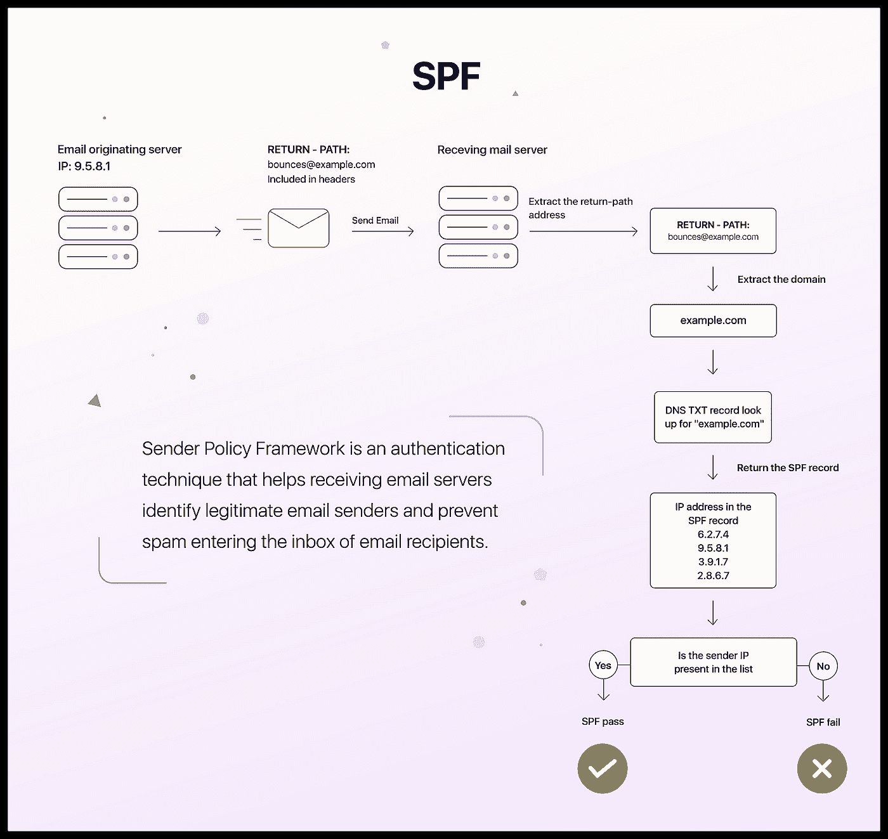
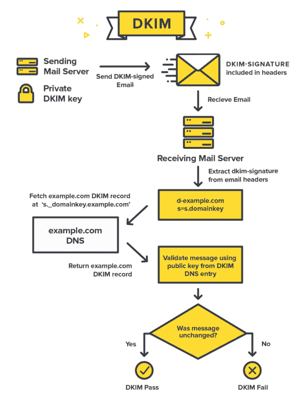

# 一口气完全理解电子邮件认证协议(SPF、DKIM、DMARC)

> 原文：<https://medium.com/geekculture/fully-understand-email-authentication-protocols-spf-dkim-dmarc-in-one-go-f7a8508fc5f3?source=collection_archive---------3----------------------->


当我学习电子邮件认证协议时，我是从不同的博客或网站上分别学习的。我认为，对于新来者来说，在一篇文章中理解所有这些内容并获得更清晰的全貌会更有效、更有帮助，这也是我这篇文章的目的。

# 发件人策略框架

一句话， **SPF 记录说明了可以从您的域名发送电子邮件的所有授权来源。**

用更专业的术语来说，SPF 记录是一个 DNS TXT 记录，拥有/引用可以代表您的域发送电子邮件的授权 IP 地址列表。以下面的 SPF 记录为例:

```
v=spf1 include:zoho.com ~all
```

`include:zoho.com`语句指示接收服务器也包含来自 zoho.com 的 SPF 记录，它最终应该由一个授权 IP 地址列表组成。

v 语句表示正在使用的 SPF 版本。最后的`~all`意味着所有其他与`include:zoho.com`不匹配的电子邮件都应该被标记为“软故障”。

如果您没有为您的发送域设置 SPF，其他假装从您的域名发送邮件的人可能会以您的身份发送电子邮件，并对您的业务和声誉造成负面损害。

这是我在 Zoho 上找到的一张非常有用的图片，它解释了涉及 SPF 角色的整个电子邮件发送过程:



source: [https://help.zoho.com/portal/en/kb/campaigns/deliverability-guide/domain-authentication/domain-authentication-techniques/articles/what-is-sender-policy-framework-spf#How_SPF_works](https://help.zoho.com/portal/en/kb/campaigns/deliverability-guide/domain-authentication/domain-authentication-techniques/articles/what-is-sender-policy-framework-spf#How_SPF_works)

关于 SPF 语法的更详细的解释，请参见本文:[https://dmarcian.com/spf-syntax-table/](https://dmarcian.com/spf-syntax-table/)。

# DKIM(域名密钥识别邮件)

简言之，DKIM 是一种电子邮件安全标准，旨在确保邮件在发送时不会被更改。

用更专业的术语来说，DKIM 是一个包含公开密钥的 DNS TXT 记录。发送邮件服务器从邮件消息的内容和标题中创建散列，然后使用私钥对邮件进行签名。DKIM 签名作为发送邮件的标题包含在内。接收服务器从查询的 DKIM 记录中获取公钥，并使用它来解密 DKIM 签名。如果解密的内容和邮件头与邮件的内容和邮件头匹配，则邮件会通过 DKIM，被认为是可信的。

我发现一个流程图很好地解释了 DKIM:



source: [https://postmarkapp.com/guides/dkim](https://postmarkapp.com/guides/dkim)

# 基于域的消息认证报告和一致性

一句话，DMARC 确保你发送的电子邮件的认证，并指示收件人如何处理声称从你的域发送的垃圾邮件。

用更专业的术语来说，DMARC 是基于 SPF 和/或 DKIM 的结果，因此至少要为电子邮件域设置其中一个。要部署 DMARC，您需要在 DNS 中发布一个 [DMARC 记录](https://dmarcian.com/dmarc-record/) (TXT 记录)。如果 SPF、DKIM 或两者都通过，DMARC 将进行身份验证。您可以将 DMARC 策略设置为以下 3 个选项之一:

## p =无

监控您的电子邮件流量。不采取进一步的行动。

## p =隔离

将未经授权的电子邮件发送到垃圾邮件文件夹。

## p =拒绝

实施 DMARC 的最终政策和最终目标。该策略确保未经授权的电子邮件根本不会被发送。

DMARC 记录还指示接收电子邮件服务器将 XML 报告发送回 DMARC 记录中列出的报告电子邮件地址。这些报告提供了关于您的电子邮件如何在生态系统中移动的见解，并允许您识别正在使用您的电子邮件域的所有内容。

更多信息，请访问 https://dmarc.org/overview/的[。](https://dmarc.org/overview/)