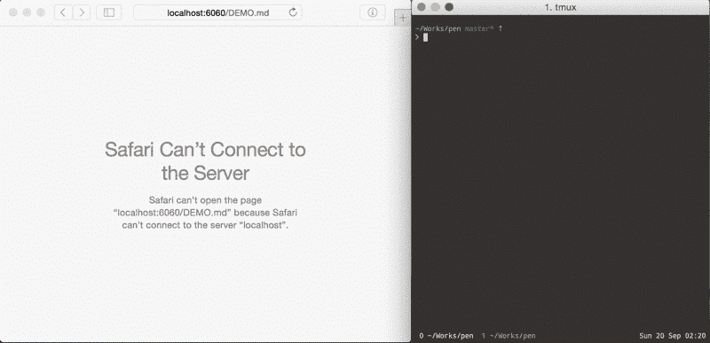
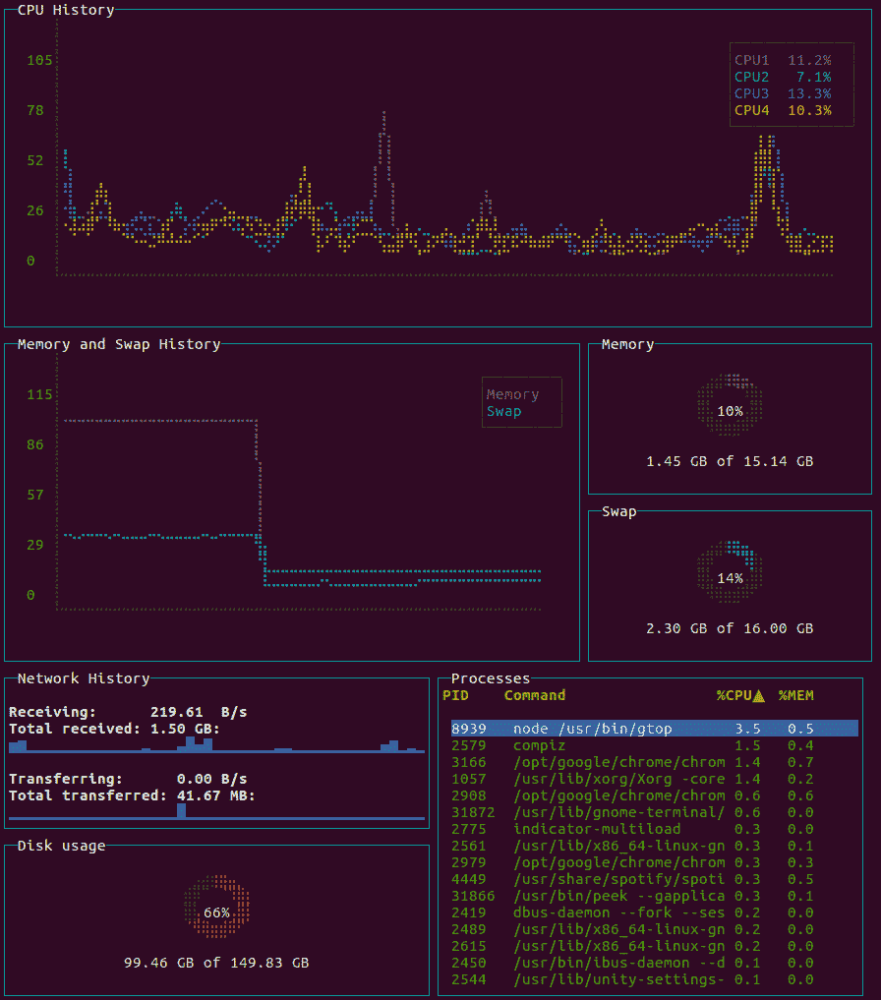
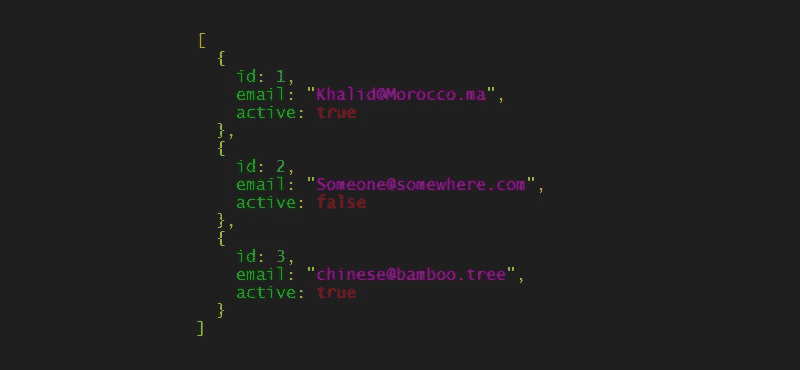

# 面向软件开发人员的有趣且有用的 CLI 工具

> 原文：<https://medium.com/geekculture/fun-and-useful-cli-tools-for-software-developers-aa6716531956?source=collection_archive---------7----------------------->

## 使用一些有趣且有用的 CLI 工具，让您的生活变得更美好。

作为一名软件开发人员，经常会描述从网上找到一些有趣或有用的命令行工具所带来的快乐。我一直在从互联网上收集我最喜欢的工具，并认为是时候传授我的大量有用(和无用)的 CLI 工具知识，让我的生活变得更好。


Photo by [Florian Olivo](https://unsplash.com/@florianolv?utm_source=medium&utm_medium=referral) on [Unsplash](https://unsplash.com?utm_source=medium&utm_medium=referral)

# emoj

曾经寻找完美的表情符号却想不起它的名字吗？作为一个在我建立的网站中使用大量表情符号的人，这是我经常遇到的一个难题，它导致了一个奇怪的搜索历史，因为我很难找到正确的表情符号。

进入，[表情符号](https://github.com/sindresorhus/emoj)，一个 CLI 工具，从命令行查找相关表情符号。现在，我再也不用离开终端为我的登陆页面寻找合适的可爱表情了！


emoj in action

准备好寻找一些很棒的表情符号了吗？首先，通过 NPM 安装它:

```
npm install --global emoj
```

然后使用它:

```
emoj
```

现在，当你输入的时候，表情符号会出现在你的屏幕下方！想改变肤色？使用你的箭头键。

# 速度测试

作为一个经常需要检查我的网速的人，无论是弯曲我的 10gb/s 家庭网速还是在咖啡店哭泣低于 5 mb/s 的速度，我喜欢[速度测试](https://github.com/sindresorhus/speed-test)，因为我可以从命令行进行我最喜欢的消遣！


speed-test in action

想去看看吗？首先安装它:

```
npm install --global speed-test
```

然后使用它:

```
speed-test
```

你应该看到工具加载了一会儿，然后它会在屏幕上弹出你的网速！

# [笔](https://github.com/noraesae/pen)

`pen`是一个降价预览工具，设计简单且始终有效。



pen in action

如果你不知道，markdown 是一个轻量级的纯文本格式语法，可以很容易地对文本进行样式化。用笔，你可以非常快速地编辑 markdown 文件，并在你的浏览器中看到输出！

# [gtop](https://github.com/aksakalli/gtop)

有时候我喜欢看着我的 CPU 使用率随着我打开新的 chrome 实例而飙升。通常，这需要我打开任务管理器(它有可怕的用户界面)，这分散了我对主要是终端桌面环境的注意力。进入`gtop`，这是一个从命令行可视化系统统计数据的伟大工具。



gtop

它不仅包含大量有用的信息，还会让你看起来像个黑客，这总是一个意外收获。

首先，安装它:

```
npm i -g gtop
```

然后，运行它:

```
gtop
```

您应该会看到一个漂亮的仪表板弹出您的系统统计数据！

# jsome

jsome 是一个工具，用于查看那些大而难读的 json 文件，这些文件有漂亮的颜色和漂亮的格式。

您可以在终端中使用`jsome`,也可以将它作为一个模块导入到您的 Javascript 文件中。



jsome output

要在命令行上使用它，请运行

```
npm i -g jsome
```

然后运行:

```
jsome /path/to/your/json/file.json
```

现在您应该在终端中打印出一些漂亮的 json。

# 结论

我希望这些有趣而有用的 CLI 工具能让您的生活变得更美好。

# 保持联络

有很多内容，我很感谢你读我的。我是加州大学柏克莱分校 [MET 项目](https://met.berkeley.edu/)的本科生，是[游乐场](http://tryplayground.com/)的软件开发者，也是一名年轻的企业家。我写软件开发、创业和失败(这是我非常擅长的)。

请随时联系我，在 Linkedin[或 Twitter](https://www.linkedin.com/in/caelinsutch)[上联系我，我喜欢听到阅读我文章的人的声音:)](https://twitter.com/caelin_sutch)