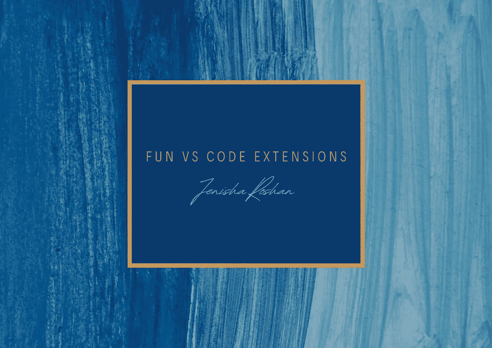
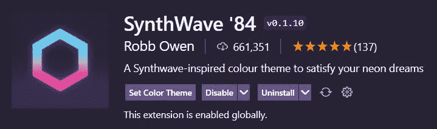
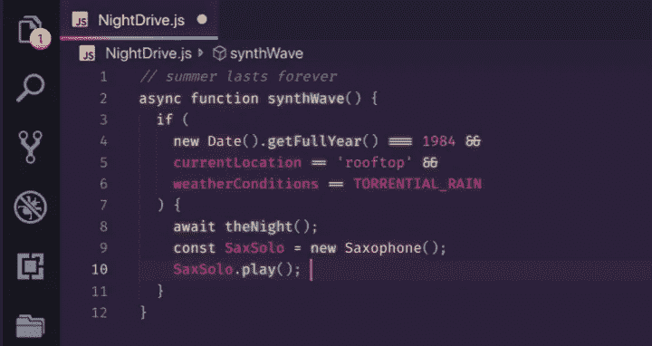
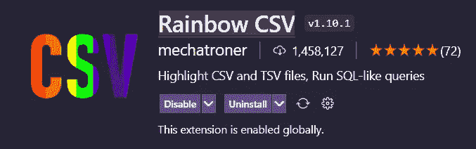
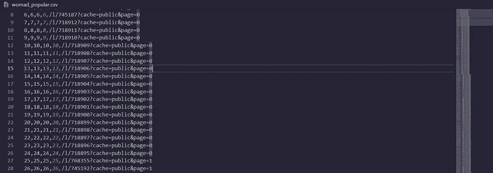
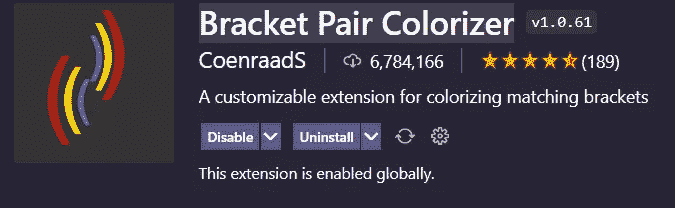
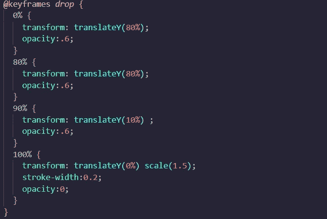
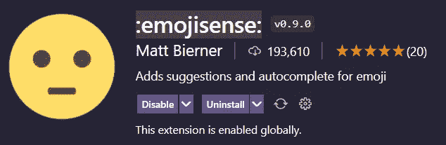
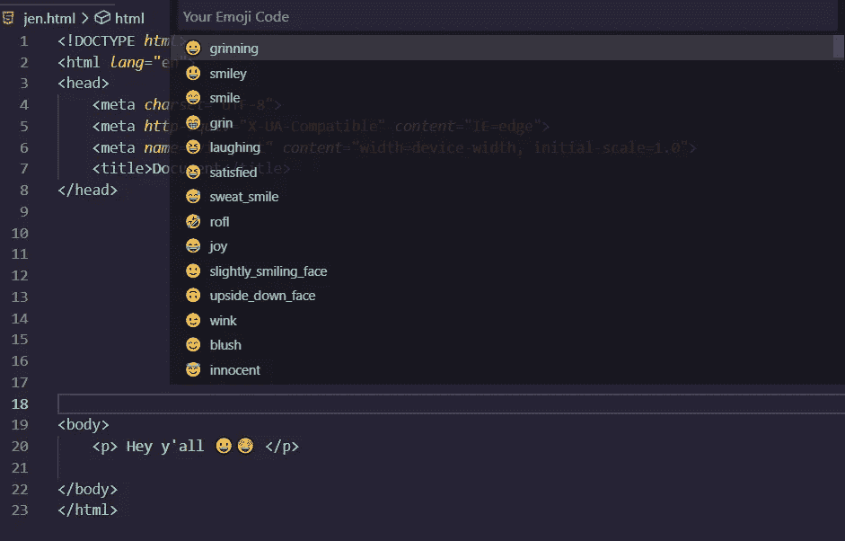

# VS 代码的有趣扩展

> 原文：<https://medium.com/geekculture/fun-extensions-for-vs-code-7784adec6dad?source=collection_archive---------6----------------------->



实话实说吧！编码很好玩！但是如果它可以有趣和丰富多彩呢？！下面列出了几个我最喜欢的扩展，它们让 VS 代码的开发更加生动和酷。这些扩展将使你的代码看起来更美观。

**1) SynthWave '84**

你喜欢霓虹主题的东西吗？！那么你一定要试试这个扩展。我相信你会喜欢的！谁说编码必须平淡无奇。这个扩展增加了一点趣味！您的代码会发光！多酷啊！



**2)彩虹 CSV**

如果没有合适的工具，CSV 文件很难查看，而且非常痛苦。彩虹 CSV 是一个有趣的扩展，颜色坐标你的 CSV 文件，所以它很容易看，也很漂亮。



**3)支架对上色器**

你是否曾经花费几个小时试图检测你的代码哪里出错了，为什么你没有得到想要的输出，最终发现这都是因为一个没有关闭的括号？啊，真倒霉！使用这个扩展，你永远不会出错！您的支架颜色协调，便于找到支架的开合位置。你的代码看起来更容易。



4)表情符号

在我意识到这个扩展之前，如果我想在我的代码中使用表情符号，我必须复制粘贴它们，这非常耗时。这个扩展使得这个过程变得更加容易。如果你在 windows 中，你只需按“Ctrl + i ”,就会显示一个表情列表，你可以从中选择你想要的表情，也可以搜索你想要的表情。

*   Mac: cmd + i
*   Linux: ctrl + alt + i
*   Windows: ctrl + i



**5)美化**

谁喜欢使用没有正确缩进的代码？！即使你这样做了…下一个使用你的代码的人也不会被打动。这个扩展使得缩进代码变得非常容易。

```
Go to View -> Command Palette ( Ctrl + Shift + p) -> “Beautify file”
```


我希望你们都喜欢这篇文章，并发现它很有用！试试这些扩展，祝你们玩得开心！编码快乐！

