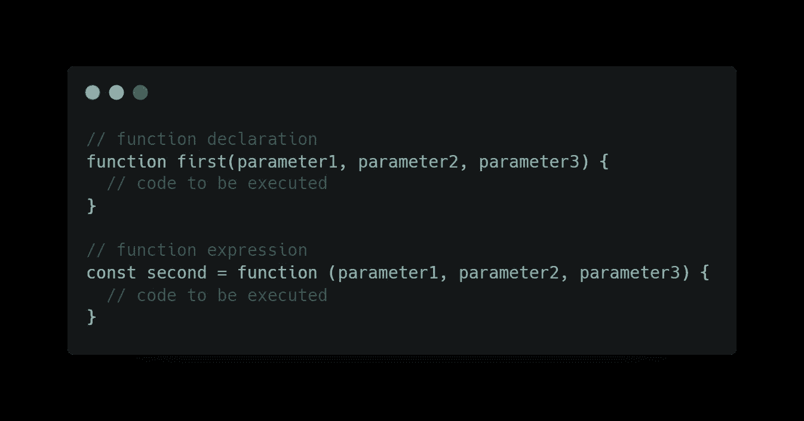
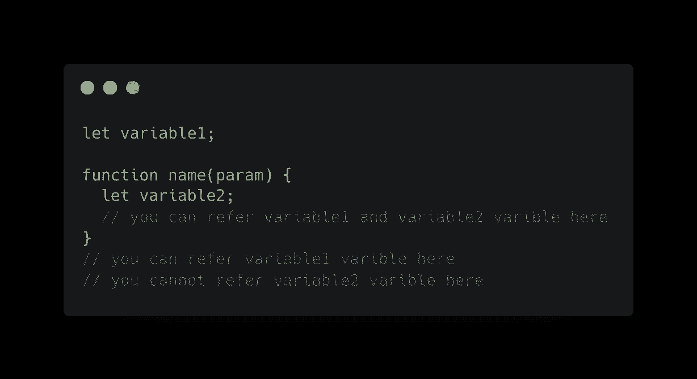
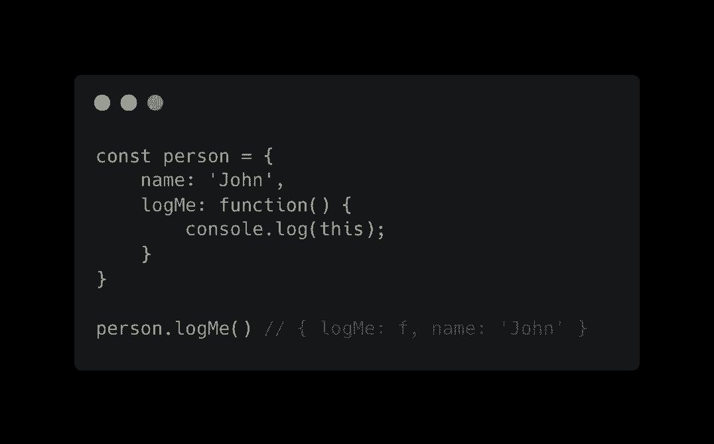
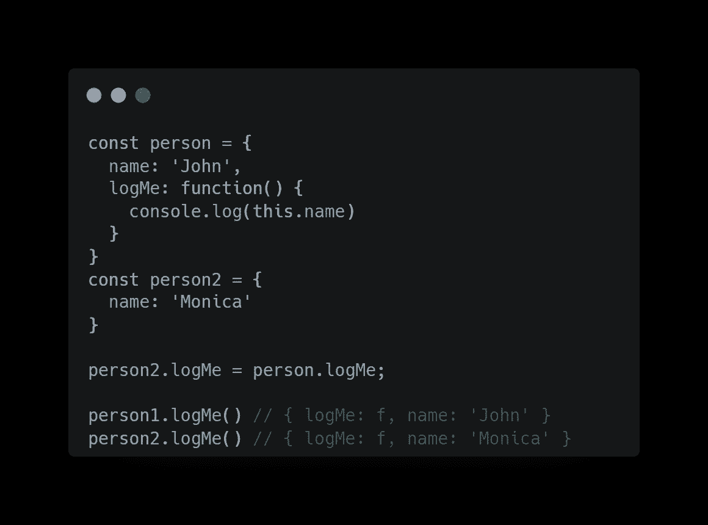
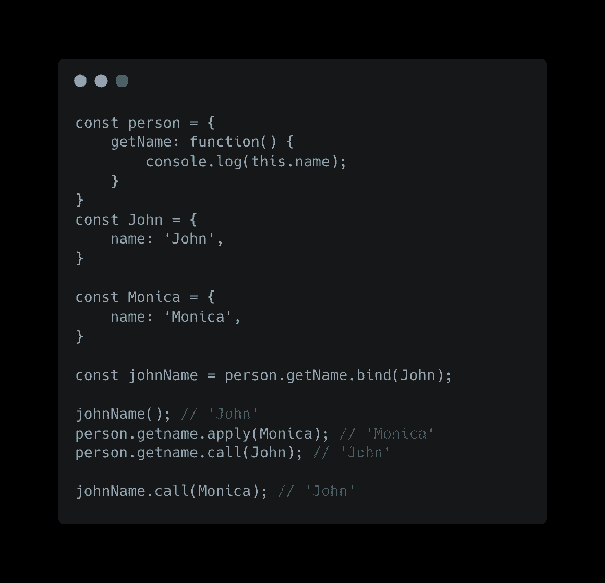
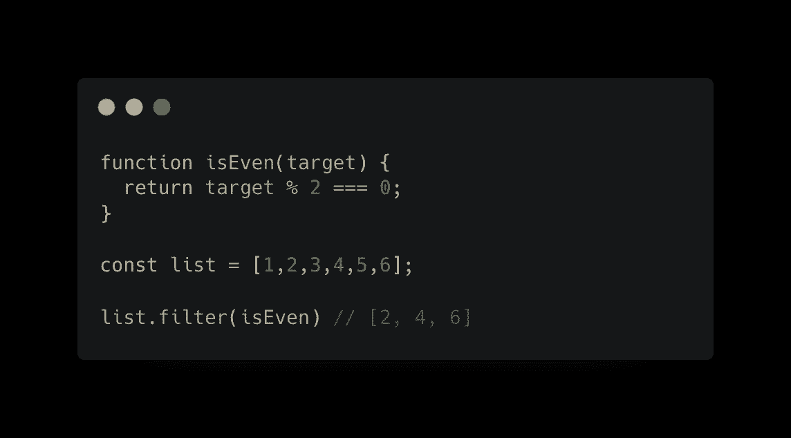
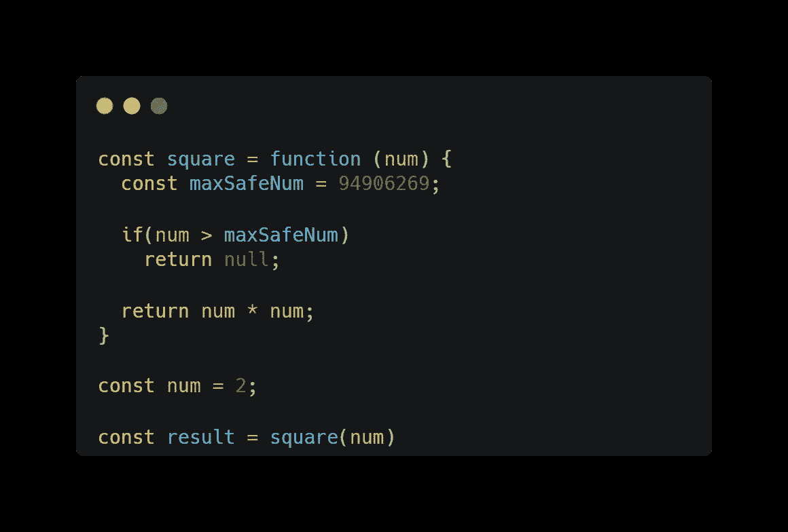

# JavaScript 函数的乐趣

> 原文：<https://medium.com/geekculture/fun-with-javascript-functions-47f20fed1c07?source=collection_archive---------4----------------------->


在本文中，我们将学习如何定义和调用 JavaScript 函数，并且我们将深入了解使用函数时的情况。

# **什么是函数？**

函数是用于执行任务的有组织的代码块，它帮助您编写干净且可重用的代码。

# JavaScript 函数看起来像什么？

JavaScript 函数是用关键字`function`定义的，后跟一个**名称**和括号 **()** 。

函数名可以包含字母、数字、下划线和美元符号(与变量的规则相同)。

括号中可以包括用逗号分隔的参数名:
**( *参数 1，参数 2，…* )**

函数要执行的代码放在花括号中: **{}**

JavaScript 函数可以定义为声明或表达式。



我们需要给这个函数起一个名字，当我们想调用这个函数的时候，我们会用到这个名字。在括号内，我们定义了该函数可以接收的参数，在括号内，我们编写了调用该函数时需要执行的代码。

**这两个例子**的** **区别**是关于**吊装**的**；JavaScript 程序运行时会将以下值添加到内存中:

```
first : - f -
second: <uninitialized>
```

`first`的函数定义已经被添加到内存中，这意味着你可以在当前文件的任何地方调用函数`first`，甚至是在第一行。功能`second`只能在分配给它的行之后被调用/使用。这一行代码将在存储“秒”的地址更新程序的内存。即使 const“second”被挂起，第二个函数也只有在变量的值被求值后才会进入内存。

```
first : - f -
second: - f -
```

# **什么是功能范围？**

函数作用域是指变量的访问，任何在函数内部定义的变量都有函数/局部作用域，这意味着只能在函数内部访问。



# **什么是函数上下文？**

上下文是指关键字`this`的值。理解上下文的最好方法是试验并记录`this`关键字，看看里面有什么。



在本例中，`this`值等于“person”对象。`this` 的值将是调用函数的对象。



`this`的值可以使用以下三个函数进行控制:

*   `bind` -创建函数的副本并设置`this`的值，并可选地设置参数
*   `call` -设置`this`的值，并可选地设置参数，然后立即调用该函数
*   `apply` —设置`this`的值，可选设置参数，然后立即调用该功能

调用和应用之间的区别:

*   `apply`让您调用带有作为数组的`arguments`的函数
*   `call`要求明确列出参数

一个很有帮助的助记符:****A****为****A****rray 和* ***C*** *为****C****omma**

*如果使用`bind`设置上下文，您将无法使用`call`或`apply`再次更改上下文值。*

**

# ***功能可以传递给其他功能***

*函数可以作为参数传递给另一个函数。例如，如果需要过滤一个数组，可以创建一个过滤函数，并将该函数作为参数传递给内置的数组过滤函数。*

**

> *我强烈推荐阅读和使用数组函数[https://developer . Mozilla . org/en-US/docs/Web/JavaScript/Reference/Global _ Objects/Array](https://developer.mozilla.org/en-US/docs/Web/JavaScript/Reference/Global_Objects/Array)*

# ***调用函数时会发生什么？***

*您可以在 JavaScript 中调用一个函数，方法是使用函数名后跟括号以及该函数可以接收的任何参数。*

*当您**在 JavaScript 中调用函数**时，一个新的**执行上下文被创建**并被推送到**执行堆栈**。执行上下文有两个阶段:创建和执行阶段。*

## *创建阶段*

*在创建阶段，JavaScript 引擎执行以下任务:*

*   *设定`this`的值*
*   *设置一个本地存储区，用于存储本地数据和闭包*

## *执行阶段*

*JavaScript 引擎在执行阶段逐行执行代码。处理完所有代码后，执行堆栈将从执行堆栈中弹出，垃圾收集器将从内存中删除程序不需要的任何内容。*

*我将使用下面的代码示例来解释函数被调用时的情况。我们有一个简单的带验证的平方函数，它根据输入返回一个数字或 null。*

**

*当上面的程序运行时，它将首先创建程序的主执行上下文，这将触发前面讨论的创建和执行阶段。*

*在创建阶段，程序存储器将包含`square`、`num`和`result`地址。*

```
*square: <uninitialized>
num: <uninitialized>
result: <uninitialized>*
```

*当执行阶段开始时，每一行代码都被顺序处理。
第一行将更新内存中的 square 变量:*

```
*square: - f -
num: <uninitialized>
result: <uninitialized>*
```

*第二行将更新内存中的`num`变量:*

```
*square: - f -
num: 2*
```

*第三行执行包含一个函数调用的赋值。JavaScript 引擎将使用新的执行上下文来处理功能代码，并使用从上下文返回的值来更新内存。*

*新的执行上下文将在内存中有一个特定的区域来存储函数中定义的任何内容。*

```
*square: - f -
num: 2
result: <uninitialized>square memory environment: { num: 2
    maxSafeNum: <uninitialized>}*
```

> *`this`的值将是全局/窗口对象*

*第一个函数行是一个将导致存储器更新的赋值，`maxSafeNum`将把值从`undefined`变为`94906269`。*

```
*square: - f -
num: 2
result: <uninitialized>square memory environment: { num: 2
    maxSafeNum: 94906269}*
```

*然后将通过验证步骤；在我们的例子中，输入小于 maxSafeNum，将跳过代码的`return null;`行。`square`函数的最后一行将返回值`num * num`，这意味着执行阶段即将完成，JavaScript 引擎将从堆栈中弹出`square` 执行上下文。它会将返回值赋给内存中的结果地址。垃圾收集器将从`square memory environment`中移除任何东西。*

```
*square: - f -
num: 2
result: 4*
```

*我用 Remotion 和 React JS 创建了一个演示视频，来解释当你调用一个函数时，在 JavaScript 中发生了什么。*

# *参考资料和进一步阅读*

*[](https://developer.mozilla.org/en-US/docs/Web/JavaScript/Guide/Functions) [## 函数- JavaScript | MDN

### 函数是 JavaScript 的基本构件之一。JavaScript 中的函数类似于…

developer.mozilla.org](https://developer.mozilla.org/en-US/docs/Web/JavaScript/Guide/Functions)*