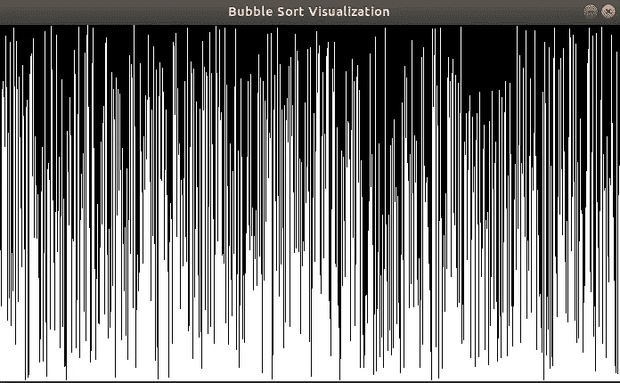
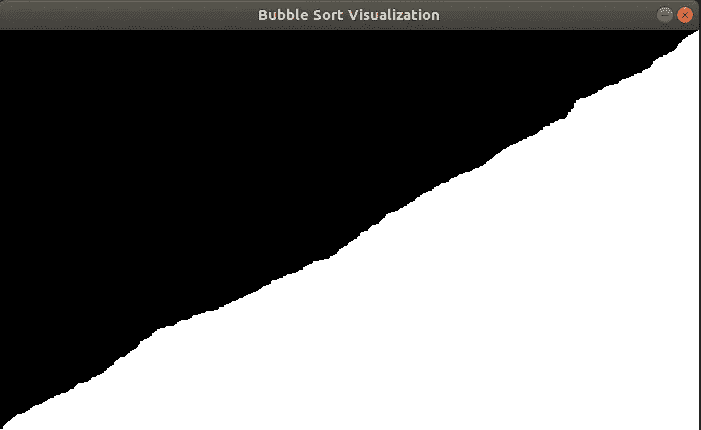

# Python #5 的乐趣:冒泡排序可视化

> 原文：<https://medium.com/geekculture/fun-with-python-5-bubble-sort-visualization-dedd74c86e25?source=collection_archive---------22----------------------->


欢迎阅读“Python 的乐趣”，第 5 部分。在这一部分，我们将利用`pygame` 模块来可视化冒泡排序，并获得关于它如何工作的更多见解。

# 理论和基础

每个 CS 学生或开发人员都花时间研究排序技术和算法，第一个也是最简单的排序算法是冒泡排序。

[冒泡排序](https://en.wikipedia.org/wiki/Bubble_sort)是一种排序算法，它比较相邻的数字，并在需要时交换它们。这一直持续到所有元素都被排序。举个例子会让事情更清楚:

我们从这个数字序列开始，我们希望按照升序对它们进行排序:

5, 3, 2, 6, 1, 4

首先我们比较 5 和 3，5 大于 3，所以我们交换:

**3** ， **5** ，2，6，1，4

接下来我们比较 5 和 2。同样，5 大于 2，所以我们交换:

3、 **2** 、 **5** 、6、1、4

我们的下一个比较是在 5 到 6 之间。这一次，6 大于 5，所以我们不交换这两个数字。因此，我们继续将 6 与下一个数字 1 进行比较，结果是交换:

3，2，5， **1** ， **6** ，4

最后，我们将 6 与 4 进行比较，并将结果交换到以下序列:

3、2、5、1、 **4** 、 **6**

如你所见，最大的数字现在在最后一个位置。如果我们再做一次这个过程，我们将交换数字，5 将被放到正确的位置。如果我们继续做这个过程，我们将排序。

从您所看到的，您可能已经猜到了性能方面，这不是一个最佳的算法。事实上，它的复杂度是 O(n ),其中 n 是需要排序的元素的数量。这使得该算法不适合实际使用情况，在实际使用情况下，使用其他更有效的算法。

凭直觉，人们可以看到在每次迭代中，最大的数字被放在序列的末尾。让我们通过可视化算法来确认一下。在这里，`pygame`模块将有很大的帮助。

据 [pygame 官方页面](https://www.pygame.org/wiki/about):

> **Pygame** 是一套为编写视频游戏而设计的 Python 模块。Pygame 在优秀的 SDL 库的基础上增加了功能。这允许你用 python 语言创建全功能的游戏和多媒体程序。

换句话说，`pygame`是 Python 中使用的一个模块，为了创建视频游戏，但是我们要使用一些基本功能。让我们开始吧。

# 履行

我们要做的第一件事是创建一个空窗口。我们将定义宽度和高度。我们还将为窗口指定一个名称:

```
import random
import pygamewin_width = 700
win_height = 400
values = [int(random.random()*win_height) for _ in range(win_width)]

pygame.init()
win = pygame.display.set_mode((win_width, win_height))
pygame.display.set_caption('Bubble Sort Visualization')
```

此外，我们将创建一个随机数列表。我们希望为窗口中的每个像素创建一个数字，我们将归一化返回的值`random.random()`,以便填充窗口的整个高度。

让我们在现有的空窗口中绘制我们的值:

```
run = True

while run:
    pygame.time.delay(100)

    for i in range(0, win_width):
        pygame.draw.line(win, (255, 255, 255), (i, win_height),
                         (i, values[i]))

    pygame.display.update()

    for event in pygame.event.get():
        if event.type == pygame.QUIT:
            run = False
```

我们创建了一个无限循环，对于列表中的每个值，我们从窗口底部开始画一条线。每条线的高度代表正在绘制的数字的值。此外，我们检查用户是否决定关闭窗口，这样我们就可以退出程序。这是我们得到的结果:



Initial list

接下来，我们将实现冒泡排序。实现非常简单:

```
for i in range(0, len(values) - 1):
    for j in range(0, len(values) - i - 1):
        if (values[j] < values[j + 1]):
            tmp = values[j]
            values[j] = values[j + 1]
            values[j + 1] = tmp
```

最后，我们将在上面创建的循环中插入这段代码。每次迭代后，我们将使用更新后的列表更新我们的窗口:

```
run = True
done = False

while run:
    pygame.time.delay(100)

    if (done == False):
        for i in range(0, len(values) - 1):
            for j in range(0, len(values) - i - 1):
                if (values[j] < values[j + 1]):
                    tmp = values[j]
                    values[j] = values[j + 1]
                    values[j + 1] = tmp

            win.fill((0, 0, 0))
            for i in range(0, win_width):
                pygame.draw.line(
                    win, (255, 255, 255),
                    (i, win_height),
                    (i, values[i])
                )

            pygame.display.update()

        done = True

    for event in pygame.event.get():
        if event.type == pygame.QUIT:
            run = False
```

# 结论

第一次迭代后，您将看到以下窗口:


Greatest numbers are moved to the right of the window

如你所见，最大的数字开始向窗口的右边移动。这正是冒泡排序的工作方式。在每一遍中，你都试图把最大的数字放到正确的位置上(或者如果你是升序排序，把最小的数字放到正确的位置上)。排序完成后，窗口将如下所示:



Sorted list

每一个数字都在正确的位置，我们得到了这个“山”。

现在，您对冒泡排序的工作原理有了一个直观的了解。当然，你可以实现其他的排序算法，看看它们是如何工作的，并通过可视化来更好地理解它们。你可以在这里找到完整的功能代码[。](https://github.com/OrWestSide/python/blob/master/BubbleSortViz.py)

我希望你喜欢读它，并尝试自己。让我知道你的想法和你的想法！同时，你可以在这里找到“Python 的乐趣”系列的其余部分[。](https://ozekai9.medium.com/fun-with-python-series-5ab2ab4da515)