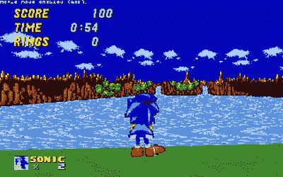
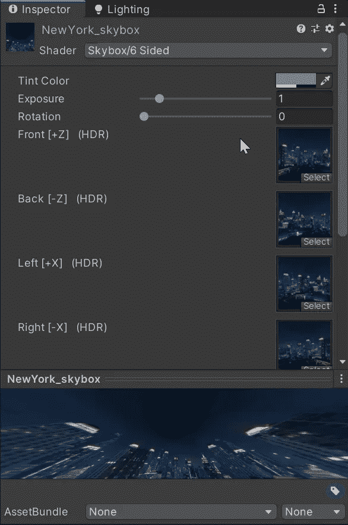

# 在 Unity 中享受 Skybox 的乐趣

> 原文：<https://medium.com/geekculture/fun-with-skyboxs-in-unity-fe51eb78aca9?source=collection_archive---------52----------------------->

世界不是平的，我们的游戏世界也不应该是平的！虽然大多数项目的范围通常被限制在一个足够小的平面上，但在 3D 世界中，我们仍然希望天空看起来是球形的。

天空盒允许我们创建一个球形图像来包含我们的游戏世界，因此看起来很真实，并且当我们四处移动时，视图也可以改变。大型游戏倾向于在天气或时间周期的意义上动态改变这些**天空盒的**。

我们目前的游戏设定在一座建筑物内，但我们仍然可以使用**天空盒**来描绘外部世界，并允许从不同角度观看窗外的不同景色。幸运的是， **Unity** 允许我们通过多种不同的方式轻松创建一个**天空盒**。最常见的一种是使用拼接在一起的 6 面图像。如果我们创建一个**材质**并设置它的**着色器**为**天空盒/6 面**材质，我们可以放入一组图像。

为了在我们的游戏中实现这一点，我们可以在**灯光设置中设置**天空盒材质**。至此，我们已经为我们的游戏创建了一个快速、简单但看起来很漂亮的背景！**

